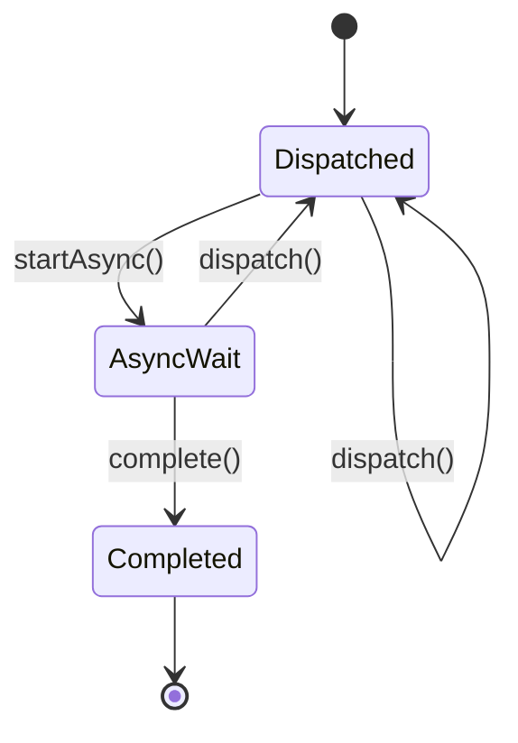

# Java™ Servlet 规范

本文档是 Java™ Servlet 规范，版本 4.0。其中描述了 Java Servlet API 的标准。
Servlet Specification
**viii Java Servlet 规范 • 2017 年 7 月**

## 第 1 章 概述

### 1.1 什么是 Servlet？

Servlet 是基于 Java™ 技术的 Web 组件，由容器管理，用于生成动态内容。与其他基于 Java 技术的组件一样，Servlet 是平台无关的 Java 类，编译为平台中立的字节码，可以动态加载到支持 Java 技术的 Web 服务器中并运行。容器（有时称为 Servlet 引擎）是提供 Servlet 功能的 Web 服务器扩展。Servlet 通过 Servlet 容器实现的请求/响应范式与 Web 客户端进行交互。

### 1.2 什么是 Servlet 容器？

Servlet 容器是 Web 服务器或应用程序服务器的一部分，它提供发送请求和响应的网络服务，解码基于 MIME 的请求，并格式化基于 MIME 的响应。Servlet 容器还通过其生命周期包含和管理 Servlet。

Servlet 容器可以内置于主机 Web 服务器中，或者通过该服务器的本机扩展 API 作为附加组件安装到 Web 服务器中。Servlet 容器也可以内置于或可能安装到支持 Web 的应用程序服务器中。

所有 Servlet 容器都必须支持 HTTP 作为请求和响应的协议，但可能支持其他基于请求/响应的协议，例如 HTTPS（基于 SSL 的 HTTP）。容器必须实现的 HTTP 规范所需版本是 HTTP/1.1 和 HTTP/2。当支持 HTTP/2 时，Servlet 容器必须支持"h2"和"h2c"协议标识符（如 HTTP/2 RFC 的 3.1 节中所指定）。这意味着所有 Servlet 容器都必须支持 ALPN。因为容器可能具有 RFC 7234 (HTTP/1.1 缓存) 中描述的缓存机制，所以在将请求传递给 Servlet 之前，它可能会修改来自客户端的请求，或者在将 Servlet 生成的响应发送给客户端之前修改响应，或者在符合 RFC 7234 的情况下直接响应请求而不传递给 Servlet。

Servlet 容器可以对 Servlet 执行的环境施加安全限制。在 Java 平台标准版 (J2SE, v.1.3 或更高版本) 或 Java 平台企业版 (Java EE, v.1.3 或更高版本) 环境中，应使用 Java 平台定义的权限体系结构来施加这些限制。例如，某些应用程序服务器可能会限制 Thread 对象的创建，以确保容器的其他组件不会受到负面影响。

Java SE 8 是构建 Servlet 容器必须依赖的底层 Java 平台的最低版本。

### 1.3 一个示例

以下是典型的事件序列：

1.  客户端（例如，Web 浏览器）访问 Web 服务器并发出 HTTP 请求。
2.  请求由 Web 服务器接收并交给 Servlet 容器。Servlet 容器可以与主机 Web 服务器在同一进程中运行，在同一主机的不同进程中运行，也可以在与处理请求的 Web 服务器不同的主机上运行。
3.  Servlet 容器根据其 Servlet 的配置确定调用哪个 Servlet，并使用表示请求和响应的对象调用它。
4.  Servlet 使用请求对象来找出远程用户是谁，此请求可能发送了哪些 HTTP POST 参数，以及其他相关数据。Servlet 执行其编程的逻辑，并生成要发送回客户端的数据。它通过响应对象将这些数据发送回客户端。
5.  一旦 Servlet 处理完请求，Servlet 容器会确保正确刷新响应，并将控制权返回给主机 Web 服务器。

---

**1-2 Java Servlet 规范 • 2017 年 7 月**

### 1.4 Servlet 与其他技术的比较

在功能上，Servlet 提供了比公共网关接口 (CGI) 程序更高层次的抽象，但比 JavaScript Faces 等 Web 框架提供的抽象层次更低。

Servlet 相对于其他服务器扩展机制具有以下优势：
*   它们通常比 CGI 脚本快得多，因为使用了不同的进程模型。
*   它们使用受许多 Web 服务器支持的标准 API。
*   它们具有 Java 编程语言的所有优点，包括易于开发和平台独立性。
*   它们可以访问 Java 平台可用的大量 API。

### 1.5 与 Java 平台，企业版的关系

Java Servlet API v.4.0 是 Java 平台企业版 8¹ 的必需 API。部署到其中的 Servlet 容器和 Servlet 必须满足 Java EE 规范中描述的、在 Java EE 环境中执行的额外要求。

¹. 请参见 http://www.oracle.com/technetwork/java/javaee/tech/index.html 上提供的 Java™ 平台企业版规范。

---

**第 1 章 概述 1-3**

### 1.6 与 Java Servlet 规范 2.5 版本的兼容性

#### 1.6.1 处理注解

在 Servlet 2.5 中，`metadata-complete` 仅影响部署时对注解的扫描。Servlet 2.5 中不存在 web-fragments 的概念。然而在 Servlet 3.0 及更高版本中，`metadata-complete` 会影响部署时对所有指定部署信息的注解和 web-fragments 的扫描。描述符的版本 **必须不** 影响容器在 Web 应用程序中扫描哪些注解。特定版本规范的实现 **必须** 扫描该配置中支持的所有注解，除非指定了 `metadata-complete`。

---

**1-4 Java Servlet 规范 • 2017 年 7 月**

---

## 第 2 章 Servlet 接口

Servlet 接口是 Java Servlet API 的核心抽象。所有 Servlet 都直接或更常见地通过扩展实现该接口的类来实现此接口。Java Servlet API 中实现 Servlet 接口的两个类是 `GenericServlet` 和 `HttpServlet`。在大多数情况下，开发人员将扩展 `HttpServlet` 来实现他们的 Servlet。

### 2.1 请求处理方法

基本的 `Servlet` 接口定义了一个用于处理客户端请求的 `service` 方法。Servlet 容器路由到 Servlet 实例的每个请求都会调用此方法。

对 Web 应用程序的并发请求的处理通常要求 Web 开发人员设计能够处理特定时刻在 `service` 方法中执行多个线程的 Servlet。

通常，Web 容器通过对不同线程并发执行 `service` 方法来处理对同一 Servlet 的并发请求。

#### 2.1.1 HTTP 特定的请求处理方法

`HttpServlet` 抽象子类在基本 Servlet 接口之外添加了额外的方法，这些方法由 `HttpServlet` 类中的 `service` 方法自动调用，以帮助处理基于 HTTP 的请求。这些方法是：
*   `doGet` 用于处理 HTTP GET 请求
*   `doPost` 用于处理 HTTP POST 请求
*   `doPut` 用于处理 HTTP PUT 请求
*   `doDelete` 用于处理 HTTP DELETE 请求
*   `doHead` 用于处理 HTTP HEAD 请求
*   `doOptions` 用于处理 HTTP OPTIONS 请求
*   `doTrace` 用于处理 HTTP TRACE 请求

通常，在开发基于 HTTP 的 Servlet 时，Servlet 开发人员只会关心 `doGet` 和 `doPost` 方法。其他方法被认为是供非常熟悉 HTTP 编程的程序员使用的方法。

#### 2.1.2 附加方法

`doPut` 和 `doDelete` 方法允许 Servlet 开发人员支持使用这些功能的 HTTP/1.1 客户端。`HttpServlet` 中的 `doHead` 方法是 `doGet` 方法的专门形式，它只返回 `doGet` 方法产生的头部。`doOptions` 方法以该 Servlet 支持的 HTTP 方法进行响应。`doTrace` 方法生成一个包含 `TRACE` 请求中发送的所有头部实例的响应。

不支持 `CONNECT` 方法，因为它适用于代理，而 Servlet API 是针对端点的。

#### 2.1.3 条件 GET 支持

`HttpServlet` 接口定义了 `getLastModified` 方法以支持条件 `GET` 操作。条件 `GET` 操作请求仅在资源自指定时间以来已被修改的情况下才发送资源。在适当的情况下，实现此方法可能有助于有效利用网络资源。

### 2.2 实例数量

Servlet 声明（无论是通过第 8 章"注解和可插入性"中描述的注解，还是作为包含 Servlet 的 Web 应用程序部署描述符的一部分，如第 14 章"部署描述符"所述）控制着 Servlet 容器如何提供 Servlet 的实例。

对于未托管在分布式环境中的 Servlet（默认情况），每个 Servlet 声明，Servlet 容器**必须**仅使用一个实例。但是，对于实现 `SingleThreadModel` 接口的 Servlet，Servlet 容器可以实例化多个实例来处理大量请求负载，并将请求序列化到特定实例。

---

**2-6 Java Servlet 规范 • 2017 年 7 月**

在 Servlet 作为部署描述符中标记为可分发的应用程序的一部分部署的情况下，容器每个 Java 虚拟机 (JVM™) 每个 Servlet 声明**可以**只有一个实例。但是，如果可分发的应用程序中的 Servlet 实现了 `SingleThreadModel` 接口，容器**可以**在容器的每个 JVM 中实例化该 Servlet 的多个实例。

#### 2.2.1 关于 SingleThreadModel 的说明

使用 `SingleThreadModel` 接口可保证在给定 Servlet 实例的 `service` 方法中一次只有一个线程执行。需要注意的是，此保证仅适用于每个 Servlet 实例，因为容器可以选择池化此类对象。一次可供多个 Servlet 实例访问的对象，例如 `HttpSession` 的实例，在任何特定时间都可能对多个 Servlet（包括那些实现 `SingleThreadModel` 的 Servlet）可用。

建议开发人员采取其他方式来解决这些问题，而不是实现此接口，例如避免使用实例变量或同步访问这些资源的代码块。本版本的规范中已弃用 `SingleThreadModel` 接口。

### 2.3 Servlet 生命周期

Servlet 通过明确定义的生命周期进行管理，该生命周期定义了如何加载和实例化、初始化、处理来自客户端的请求以及停止服务。这个生命周期在 API 中通过 `javax.servlet.Servlet` 接口的 `init`、`service` 和 `destroy` 方法表示，所有 Servlet 都必须直接或间接地通过 `GenericServlet` 或 `HttpServlet` 抽象类实现这些方法。

#### 2.3.1 加载和实例化

Servlet 容器负责加载和实例化 Servlet。加载和实例化可以在容器启动时发生，也可以延迟到容器确定需要 Servlet 来服务请求时发生。

¹. 术语"Java 虚拟机"和"JVM"是指 Java™ 平台的虚拟机。

---

**第 2 章 Servlet 接口 2-7**

当 Servlet 引擎启动时，所需的 Servlet 类必须由 Servlet 容器定位。Servlet 容器使用正常的 Java 类加载机制加载 Servlet 类。加载可能来自本地文件系统、远程文件系统或其他网络服务。

加载 Servlet 类后，容器将其实例化以供使用。

#### 2.3.2 初始化

实例化 Servlet 对象后，容器**必须**在它可以处理来自客户端的请求之前初始化该 Servlet。提供初始化是为了让 Servlet 可以读取持久化配置数据、初始化昂贵的资源（例如基于 JDBC™ API 的连接）以及执行其他一次性活动。容器通过使用一个唯一的（每个 Servlet 声明）实现 `ServletConfig` 接口的对象调用 `Servlet` 接口的 `init` 方法来初始化 Servlet 实例。此配置对象允许 Servlet 从 Web 应用程序的配置信息访问名称-值初始化参数。该配置对象还使 Servlet 能够访问一个描述其运行时环境的对象（实现 `ServletContext` 接口）。有关 `ServletContext` 接口的更多信息，请参见第 4 章"Servlet 上下文"。

##### 2.3.2.1 初始化时的错误条件

在初始化期间，Servlet 实例可以抛出 `UnavailableException` 或 `ServletException`。在这种情况下，**必须不**将 Servlet 投入活动服务，并且**必须**由 Servlet 容器释放。**不会**调用 `destroy` 方法，因为它被认为是初始化失败。

初始化失败后，容器**可以**实例化和初始化一个新实例。此规则的例外情况是，当 `UnavailableException` 指示最短不可用时间时，容器**必须**等待该时间段过去，然后才能创建和初始化新的 Servlet 实例。

##### 2.3.2.2 工具注意事项

工具加载和内省 Web 应用程序时触发静态初始化方法，这与调用 `init` 方法是有区别的。开发人员**不应**假设 Servlet 处于活动容器运行时中，直到调用 `Servlet` 接口的 `init` 方法。例如，当仅调用了静态（类）初始化方法时，Servlet **不应**尝试建立与数据库或 Enterprise JavaBeans™ 容器的连接。

---

**2-8 Java Servlet 规范 • 2017 年 7 月**

#### 2.3.3 请求处理

Servlet 被正确初始化后，Servlet 容器**可以**使用它来处理客户端请求。请求由 `ServletRequest` 类型的请求对象表示。Servlet 通过调用所提供的 `ServletResponse` 类型对象的方法来填写对请求的响应。这些对象作为参数传递给 `Servlet` 接口的 `service` 方法。

在 HTTP 请求的情况下，容器提供的对象是 `HttpServletRequest` 和 `HttpServletResponse` 类型。

请注意，由 Servlet 容器投入服务的 Servlet 实例在其生命周期内可能不处理任何请求。

##### 2.3.3.1 多线程问题

Servlet 容器**可以**通过 Servlet 的 `service` 方法发送并发请求。为了处理请求，Servlet 开发人员**必须**在 `service` 方法中为并发处理多线程做好充分准备。

虽然不推荐，但开发人员的另一种选择是实现 `SingleThreadModel` 接口，该接口要求容器保证在 `service` 方法中一次只有一个请求线程。Servlet 容器可以通过在 Servlet 上序列化请求，或者通过维护一个 Servlet 实例池来满足此要求。如果 Servlet 是标记为可分发的 Web 应用程序的一部分，则容器**可以**在应用程序分布到的每个 JVM 中维护一个 Servlet 实例池。

对于不实现 `SingleThreadModel` 接口的 Servlet，如果 `service` 方法（或 `HttpServlet` 抽象类的 `service` 方法分派到的方法，例如 `doGet` 或 `doPost`）是用 `synchronized` 关键字定义的，则 Servlet 容器**不能**使用实例池方法，而是**必须**通过它序列化请求。强烈建议开发人员在这些情况下**不要**同步 `service` 方法（或分派到它的方法），因为这会对性能产生不利影响。

##### 2.3.3.2 请求处理期间的异常

Servlet 在服务请求期间**可以**抛出 `ServletException` 或 `UnavailableException`。`ServletException` 表示在处理请求期间发生了一些错误，容器应采取适当的措施来清理请求。

`UnavailableException` 表示 Servlet 暂时或永久无法处理请求。

---

**第 2 章 Servlet 接口 2-9**

如果 `UnavailableException` 指示永久不可用，则 Servlet 容器**必须**将 Servlet 从服务中移除，调用其 `destroy` 方法，并释放 Servlet 实例。因此被容器拒绝的任何请求**必须**以 `SC_NOT_FOUND` (404) 响应返回。

如果 `UnavailableException` 指示暂时不可用，则容器**可以**选择在暂时不可用期间不通过该 Servlet 路由任何请求。在此期间被容器拒绝的任何请求**必须**以 `SC_SERVICE_UNAVAILABLE` (503) 响应状态和指示不可用何时终止的 `Retry-After` 头部返回。

容器**可以**选择忽略永久和暂时不可用的区别，并将所有 `UnavailableException` 视为永久性的，从而将抛出任何 `UnavailableException` 的 Servlet 从服务中移除。

#### 2.3.3.3 异步处理

有时，过滤器和/或 Servlet 在生成响应之前，如果没有等待资源或事件，就无法完成请求的处理。例如，Servlet 在继续生成响应之前可能需要等待可用的 JDBC 连接、远程 Web 服务的响应、JMS 消息或应用程序事件。在 Servlet 中等待是一种低效操作，因为它是一种阻塞操作，会消耗线程和其他有限资源。通常，像数据库这样的慢速资源可能有许多线程阻塞等待访问，并可能导致整个 Web 容器的线程饥饿和服务质量差。

引入请求的异步处理是为了允许线程返回容器并执行其他任务。当请求开始异步处理时，另一个线程或回调**可以**生成响应并调用 `complete`，或者分派请求，以便它可以使用 `AsyncContext.dispatch` 方法在容器的上下文中运行。异步处理的典型事件序列是：

1.  接收请求并通过正常的过滤器（用于身份验证等）传递给 Servlet。
2.  Servlet 处理请求参数和/或内容以确定请求的性质。
3.  Servlet 发出对资源或数据的请求，例如，发送远程 Web 服务请求或加入等待 JDBC 连接的队列。
4.  Servlet 返回而不生成响应。
5.  一段时间后，请求的资源变为可用，处理该事件的线程在同一个线程中继续处理，或者通过使用 `AsyncContext` 分派到容器中的资源来继续处理。

---

**2-10 Java Servlet 规范 • 2017 年 7 月**

Java 企业版功能，例如第 15.2.2 节"Web 应用程序环境"和第 15.3.1 节"EJB™ 调用中的安全身份传播"，仅对执行初始请求的线程或当请求通过 `AsyncContext.dispatch` 方法分派到容器时可用。Java 企业版功能**可以**对通过 `AsyncContext.start(Runnable)` 方法直接在响应对象上操作的其他线程可用。

第 8 章中描述的 `@WebServlet` 和 `@WebFilter` 注解有一个属性 - `asyncSupported`，它是一个布尔值，默认值为 `false`。当 `asyncSupported` 设置为 `true` 时，应用程序可以通过调用 `startAsync`（见下文）在单独的线程中启动异步处理，向其传递请求和响应对象的引用，然后在原始线程上从容器退出。这意味着响应将（以相反顺序）遍历进入时遍历过的相同过滤器（或过滤器链）。在 `AsyncContext` 上调用 `complete`（见下文）之前，响应不会提交。如果异步任务在调用 `startAsync` 的容器启动的分派返回到容器之前执行，应用程序负责处理对请求和响应对象的并发访问。

允许从 `asyncSupported=true` 的 Servlet 分派到 `asyncSupported` 设置为 `false` 的 Servlet。在这种情况下，当不支持异步的 Servlet 的 `service` 方法退出时，响应将被提交，并且容器有责任在 `AsyncContext` 上调用 `complete`，以便任何相关的 `AsyncListener` 实例将得到通知。过滤器也应将 `AsyncListener.onComplete` 通知用作一种机制，以清除其一直持有的用于异步任务完成的资源。

从同步 Servlet 分派到异步 Servlet 是非法的。然而，是否抛出 `IllegalStateException` 的决定推迟到应用程序调用 `startAsync` 时。这将允许 Servlet 既可作为同步也可作为异步 Servlet 运行。

应用程序正在等待的异步任务可以在与用于初始请求的线程不同的线程上直接写入响应。这个线程对任何过滤器一无所知。如果过滤器想要在新线程中操作响应，它必须在处理初始请求"进入时"包装响应，并将包装后的响应传递给链中的下一个过滤器，并最终传递给 Servlet。因此，如果响应被包装了（可能多次，每个过滤器一次），并且应用程序处理请求并直接写入响应，它实际上是在写入响应包装器，即，添加到响应中的任何输出仍将被响应包装器处理。当应用程序在单独的线程中从请求读取数据并向响应添加输出时，它实际上是从请求包装器读取数据，并写入响应包装器，因此包装器预期的任何输入和/或输出操作将继续发生。

---

**第 2 章 Servlet 接口 2-11**

或者，如果应用程序选择这样做，它可以使用 `AsyncContext` 将请求从新线程分派到容器中的资源。这将允许在容器范围内使用像 JSP 这样的内容生成技术。

除了注解属性外，我们还添加了以下方法/类：

**ServletRequest**
*   `public AsyncContext startAsync(ServletRequest req, ServiceResponse res)`
    此方法将请求置于异步模式，并使用给定的请求和响应对象以及 `getAsyncTimeout` 返回的超时时间初始化其 `AsyncContext`。`ServletRequest` 和 `ServletResponse` 参数**必须**是传递给调用 Servlet 的 `service` 或过滤器的 `doFilter` 方法的相同对象，或者是包装它们的 `ServletRequestWrapper` 或 `ServletResponseWrapper` 的子类。调用此方法可确保当应用程序退出 `service` 方法时响应不会提交。当在返回的 `AsyncContext` 上调用 `AsyncContext.complete`，或者 `AsyncContext` 超时且没有关联的监听器来处理超时时，响应将被提交。异步超时的计时器在请求及其关联的响应从容器返回之前**不会**启动。`AsyncContext` 可用于从异步线程写入响应。它也可用于仅通知响应未关闭和提交。

如果在不支持异步操作的 Servlet 或过滤器的范围内调用 `startAsync`，或者响应已提交并关闭，或在同一分派期间再次调用，这是非法的。然后，可以从调用 `startAsync` 返回的 `AsyncContext` 用于进一步的异步处理。在返回的 `AsyncContext` 上调用 `AsyncContext.hasOriginalRequestAndResponse()` 将返回 `false`，除非传递的 `ServletRequest` 和 `ServletResponse` 参数是原始对象或不带有应用程序提供的包装器。在请求被置于异步模式之后调用的*出站*方向上的任何过滤器**可以**使用这一点作为指示，即它们在*入站*调用期间添加的某些请求和/或响应包装器**可能**需要在异步操作期间保留，并且它们关联的资源**可能**不会被释放。在过滤器的*入站*调用期间应用的 `ServletRequestWrapper` **可以**由过滤器的*出站*调用释放，仅当用于初始化 `AsyncContext` 的给定 `ServletRequest`（并且将通过调用 `AsyncContext.getRequest()` 返回）不包含所述 `ServletRequestWrapper` 时。这同样适用于 `ServletResponseWrapper` 实例。

---

**2-12 Java Servlet 规范 • 2017 年 7 月**

*   `public AsyncContext startAsync()`
    作为便捷方法提供，使用原始请求和响应对象进行异步处理。请注意，此方法的用户如果愿意，**应该**在调用此方法之前刷新包装的响应，以确保写入包装响应的任何数据不会丢失。

*   `public AsyncContext getAsyncContext()`
    返回由调用 `startAsync` 创建或重新初始化的 `AsyncContext`。如果请求尚未处于异步模式，调用 `getAsyncContext` 是非法的。

*   `public boolean isAsyncSupported()`
    如果请求支持异步处理，则返回 `true`，否则返回 `false`。一旦请求通过了不支持异步处理的过滤器或 Servlet（通过指定的注解或声明式指定），异步支持将被禁用。

*   `public boolean isAsyncStarted()`
    如果此请求上已开始异步处理，则返回 `true`，否则返回 `false`。如果自进入异步模式以来，此请求已使用 `AsyncContext.dispatch` 方法之一进行分派，或者已调用 `AsyncContext.complete`，则此方法返回 `false`。

*   `public DispatcherType getDispatcherType()`
    返回请求的分派器类型。请求的分派器类型由容器用于选择需要应用于该请求的过滤器。只有具有匹配的分派器类型和 URL 模式的过滤器才会被应用。允许为多种分派器类型配置的过滤器查询请求的分派器类型，允许过滤器根据其分派器类型不同地处理请求。请求的初始分派器类型定义为 `DispatcherType.REQUEST`。通过 `RequestDispatcher.forward(ServletRequest, ServletResponse)` 或 `RequestDispatcher.include(ServletRequest, ServiceResponse)` 分派的请求的分派器类型分别给出为 `DispatcherType.FORWARD` 或 `DispatcherType.INCLUDE`，而通过 `AsyncContext.dispatch` 方法之一分派的异步请求的分派器类型给出为 `DispatcherType.ASYNC`。最后，由容器的错误处理机制分派到错误页面的请求的分派器类型给出为 `DispatcherType.ERROR`。

**AsyncContext**
此类表示在 `ServletRequest` 上启动的异步操作的执行上下文。`AsyncContext` 由调用 `ServletRequest.startAsync` 创建并初始化，如上所述。`AsyncContext` 中的方法如下：

*   `public ServletRequest getRequest()`
    返回通过调用 `startAsync` 方法之一用于初始化 `AsyncContext` 的请求。如果在异步周期中先前已调用 `complete` 或任何 `dispatch` 方法，则调用 `getRequest` 将导致 `IllegalStateException`。

---

**第 2 章 Servlet 接口 2-13**

*   `public ServletResponse getResponse()`
    返回通过调用 `startAsync` 方法之一用于初始化 `AsyncContext` 的响应。如果在异步周期中先前已调用 `complete` 或任何 `dispatch` 方法，则调用 `getResponse` 将导致 `IllegalStateException`。

*   `public void setTimeout(long timeoutMilliseconds)`
    设置异步处理发生的超时时间（以毫秒为单位）。调用此方法会覆盖容器设置的超时时间。如果未通过调用 `setTimeout` 指定超时时间，则使用 30000 作为默认值。值为 0 或更小表示异步操作永不过时。超时时间适用于 `AsyncContext`，一旦调用了 `ServletRequest.startAsync` 方法之一的容器启动的分派返回到容器。如果此方法在启动异步周期的容器启动的分派返回到容器之后调用，则设置超时时间是非法的，并将导致 `IllegalStateException`。

*   `public long getTimeout()`
    获取与 `AsyncContext` 关联的超时时间（以毫秒为单位）。此方法返回容器的默认超时时间，或通过最近一次调用 `setTimeout` 方法设置的超时值。

*   `public void addListener(AsyncListener listener, ServletRequest req, ServletResponse res)`
    为给定的监听器注册 `onTimeout`、`onError`、`onComplete` 或 `onStartAsync` 的通知。前三个与通过调用 `ServletRequest.startAsync` 方法之一启动的最新异步周期相关联。`onStartAsync` 与通过 `ServletRequest.startAsync` 方法之一启动的新异步周期相关联。异步监听器将按照它们添加到请求的顺序得到通知。传递给该方法的请求和响应对象与 `AsyncListener` 得到通知时 `AsyncEvent.getSuppliedRequest()` 和 `AsyncEvent.getSuppliedResponse()` 可用的对象完全相同。这些对象**不应**从中读取或写入数据，因为在给定的 `AsyncListener` 注册后可能发生了额外的包装，但可用于释放与它们关联的任何资源。如果此方法在启动异步周期的容器启动的分派返回到容器之后、新的异步周期启动之前调用，这是非法的，并将导致 `IllegalStateException`。

*   `public <T extends AsyncListener> createListener(Class<T> clazz)`
    实例化给定的 `AsyncListener` 类。返回的 `AsyncListener` 实例可以通过调用下面指定的 `addListener` 方法之一在注册到 `AsyncContext` 之前进行进一步自定义。给定的 `AsyncListener` 类**必须**定义一个零参数构造函数，用于实例化它。此方法支持适用于 `AsyncListener` 的任何注解。

*   `public void addListener(AsyncListener)`
    为给定的监听器注册 `onTimeout`、`onError`、`onComplete` 或 `onStartAsync` 的通知。前三个与通过调用 `ServletRequest.startAsync` 方法之一启动的最新异步周期相关联。`onStartAsync` 与通过 `ServletRequest.startAsync` 方法之一启动的新异步周期相关联。如果调用 `startAsync(req, res)` 或 `startAsync()` 请求，则 `AsyncListener` 得到通知时，`AsyncEvent` 中可用完全相同的请求和响应对象。请求和响应可能被包装，也可能没有被包装。异步监听器将按照它们添加到请求的顺序得到通知。如果此方法在启动异步周期的容器启动的分派返回到容器之后、新的异步周期启动之前调用，这是非法的，并将导致 `IllegalStateException`。

---

**2-14 Java Servlet 规范 • 2017 年 7 月**

*   `public void dispatch(String path)`
    将用于初始化 `AsyncContext` 的请求和响应分派到具有给定路径的资源。给定的路径被解释为相对于初始化 `AsyncContext` 的 `ServletContext`。请求的所有与路径相关的查询方法**必须**反映分派目标，而原始请求 URI、上下文路径、路径信息和查询字符串可以从第 9.7.2 节"分派的请求参数"中定义的请求属性中获取。这些属性**必须**始终反映原始路径元素，即使经过多次分派。

*   `public void dispatch()`
    作为便捷方法提供，用于分派用于初始化 `AsyncContext` 的请求和响应，具体如下。如果 `AsyncContext` 是通过 `startAsync(ServletRequest, ServiceResponse)` 初始化的，并且传递的请求是 `HttpServletRequest` 的实例，则分派到 `HttpServletRequest.getRequestURI()` 返回的 URI。否则，分派到请求上次由容器分派时的 URI。下面显示的代码示例 2-1、代码示例 2-2 和代码示例 2-3 演示了在不同情况下分派的目标 URI 是什么。

**代码示例 2-1**
```java
// 对 /url/A 的请求
AsyncContext ac = request.startAsync();
...
ac.dispatch(); // 异步分派到 /url/A
```

**代码示例 2-2**
```java
// 对 /url/A 的请求
// 转发到 /url/B
request.getRequestDispatcher("/url/B").forward(request, response);
// 从 FORWARD 的目标内部启动异步操作
AsyncContext ac = request.startAsync();
ac.dispatch(); // 异步分派到 /url/A
```

**代码示例 2-3**
```java
// 对 /url/A 的请求
// 转发到 /url/B
request.getRequestDispatcher("/url/B").forward(request, response);
// 从 FORWARD 的目标内部启动异步操作
AsyncContext ac = request.startAsync(request, response);
ac.dispatch(); // 异步分派到 /url/B
```

*   `public void dispatch(ServletContext context, String path)`
    将用于初始化 `AsyncContext` 的请求和响应分派到指定 `ServletContext` 中具有给定路径的资源。

对于上述定义的 3 种 `dispatch` 方法变体，调用方法在将请求和响应对象传递给容器管理的线程后立即返回，分派操作将在该线程上执行。请求的分派器类型设置为 `ASYNC`。与 `RequestDispatcher.forward(ServletRequest, ServiceResponse)` 分派不同，响应缓冲区和头部将不会被重置，并且即使响应已经提交，进行分派也是合法的。对请求和响应的控制委托给分派目标，并且响应将在分派目标完成执行时关闭，除非调用了 `ServletRequest.startAsync()` 或 `ServletRequest.startAsync(ServletRequest, ServiceResponse)`。如果在调用 `startAsync` 的容器启动的分派返回到容器之前调用任何 `dispatch` 方法，则在分派调用和控件返回到容器之间的这段时间内，必须满足以下条件：

    i.  在此期间调用的任何分派调用在容器启动的分派返回到容器之后才会生效。
    ii. 任何 `AsyncListener.onComplete(AsyncEvent)`、`AsyncListener.onTimeout(AsyncEvent)` 和 `AsyncListener.onError(AsyncEvent)` 调用也将延迟到容器启动的分派返回到容器之后。
    iii. 任何对 `request.isAsyncStarted()` 的调用在容器启动的分派返回到容器之前**必须**返回 `true`。

每个异步周期最多只能有一个异步分派操作，该周期由调用 `ServletRequest.startAsync` 方法之一启动。在同一异步周期内尝试执行额外的异步分派操作是非法的，并将导致 `IllegalStateException`。如果随后在分派的请求上调用 `startAsync`，则可以调用任何 `dispatch` 方法，但具有与上述相同的限制。

---

**2-16 Java Servlet 规范 • 2017 年 7 月**

在执行 `dispatch` 方法期间可能发生的任何错误或异常**必须**被容器捕获并按如下方式处理：

    i.  为所有向创建 `AsyncContext` 的 `ServletRequest` 注册的 `AsyncListener` 实例调用 `AsyncListener.onError(AsyncEvent)` 方法，并通过 `AsyncEvent.getThrowable()` 使 `Throwable` 可用。
    ii. 如果没有监听器调用 `AsyncContext.complete` 或任何 `AsyncContext.dispatch` 方法，则执行状态码等于 `HttpServletResponse.SC_INTERNAL_SERVER_ERROR` 的错误分派，并使 `Throwable` 作为 `RequestDispatcher.ERROR_EXCEPTION` 请求属性的值可用。
    iii. 如果未找到匹配的错误页面，或者错误页面未调用 `AsyncContext.complete()` 或任何 `AsyncContext.dispatch` 方法，则容器**必须**调用 `AsyncContext.complete`。

*   `public boolean hasOriginalRequestAndResponse()`
    此方法检查 `AsyncContext` 是否是通过调用 `ServletRequest.startAsync()` 用原始请求和响应对象初始化的，或者是否是通过调用 `ServletRequest.startAsync(ServletRequest, ServiceResponse)` 初始化的，并且 `ServletRequest` 或 `ServletResponse` 参数未携带任何应用程序提供的包装器，在这种情况下返回 `true`。如果 `AsyncContext` 是使用包装的请求和/或响应对象通过 `ServletRequest.startAsync(ServletRequest, ServiceResponse)` 初始化的，则返回 `false`。在请求被置于异步模式之后调用的*出bound*方向上的过滤器可以使用此信息来确定它们在*入bound*调用期间添加的任何请求和/或响应包装器是否需要为异步操作的持续时间保留，或者是否可以释放。

*   `public void start(Runnable r)`
    此方法使容器分派一个线程（可能来自托管的线程池）来运行指定的 `Runnable`。容器**可以**向 `Runnable` 传播适当的上下文信息。

*   `public void complete()`
    如果调用了 `request.startAsync`，则**必须**调用此方法以完成异步处理并提交和关闭响应。如果请求被分派到不支持异步处理的 Servlet，或者由 `AsyncContext.dispatch` 调用的目标 Servlet 未随后调用 `startAsync`，则容器可以调用 `complete` 方法。在这种情况下，容器有责任在该 Servlet 的 `service` 方法退出后尽快调用 `complete()`。如果未调用 `startAsync`，则**必须**抛出 `IllegalStateException`。在调用 `ServletRequest.startAsync()` 或 `ServletRequest.startAsync(ServletRequest, ServiceResponse)` 之后、调用任何 `dispatch` 方法之前的任何时候调用此方法都是合法的。如果在调用 `startAsync` 的容器启动的分派返回到容器之前调用此方法，则在 `complete` 调用和控件返回到容器之间的这段时间内，必须满足以下条件：

        i.  `complete` 指定的行为在容器启动的分派返回到容器之后才会生效。
        ii. 任何 `AsyncListener.onComplete(AsyncEvent)` 调用也将延迟到容器启动的分派返回到容器之后。
        iii. 任何对 `request.isAsyncStarted()` 的调用在容器启动的分派返回到容器之前**必须**返回 `true`。

---

**第 2 章 Servlet 接口 2-17**

**ServletRequestWrapper**
*   `public boolean isWrapperFor(ServletRequest req)`
    递归检查此包装器是否包装了给定的 `ServletRequest`，如果是则返回 `true`，否则返回 `false`。

**ServletResponseWrapper**
*   `public boolean isWrapperFor(ServletResponse res)`
    递归检查此包装器是否包装了给定的 `ServletResponse`，如果是则返回 `true`，否则返回 `false`。

**AsyncListener**
*   `public void onComplete(AsyncEvent event)`
    用于通知监听器在 `ServletRequest` 上启动的异步操作已完成。
*   `public void onTimeout(AsyncEvent event)`
    用于通知监听器在 `ServletRequest` 上启动的异步操作已超时。
*   `public void onError(AsyncEvent event)`
    用于通知监听器异步操作未能完成。
*   `public void onStartAsync(AsyncEvent event)`
    用于通知监听器正在通过调用 `ServletRequest.startAsync` 方法之一启动新的异步周期。可以通过在给定事件上调用 `AsyncEvent.getAsyncContext` 来获取正在重新初始化的异步操作对应的 `AsyncContext`。

如果异步操作超时，容器**必须**运行以下步骤：
*   在启动异步操作的 `ServletRequest` 上注册的所有 `AsyncListener` 实例上调用 `AsyncListener.onTimeout` 方法。
*   如果没有监听器调用 `AsyncContext.complete()` 或任何 `AsyncContext.dispatch` 方法，则执行状态码等于 `HttpServletResponse.SC_INTERNAL_SERVER_ERROR` 的错误分派。
*   如果未找到匹配的错误页面，或者错误页面未调用 `AsyncContext.complete()` 或任何 `AsyncContext.dispatch` 方法，则容器**必须**调用 `AsyncContext.complete()`。
*   如果在调用 `AsyncListener` 中的方法时抛出异常，则会记录日志，并且不会影响调用任何其他 `AsyncListener`。
*   JSP 中的异步处理默认不受支持，因为它用于内容生成，异步处理必须在内容生成之前完成。如何处理这种情况取决于容器。一旦所有异步活动完成，可以使用 `AsyncContext.dispatch` 分派到 JSP 页面以生成内容。
*   下图 2-1 是描述各种异步操作状态转换的图表。

---

**第 2 章 Servlet 接口 2-19**

**图 2-1 异步操作的状态转换图**



---

**2-20 Java Servlet 规范 • 2017 年 7 月**

#### 2.3.3.4 线程安全性

除了 `startAsync` 和 `complete` 方法外，请求和响应对象的实现不保证是线程安全的。这意味着它们应仅在请求处理线程的范围内使用，或者应用程序必须确保对请求和响应对象的访问是线程安全的。

如果由应用程序创建的线程使用容器管理的对象，例如请求或响应对象，则这些对象必须仅在对象的生命周期内（如第 3.13 节"请求对象的生命周期"和第 5.8 节"响应对象的生命周期"分别定义的那样）被访问。请注意，除了 `startAsync` 和 `complete` 方法外，请求和响应对象不是线程安全的。如果这些对象在多个线程中被访问，访问应同步或通过包装器添加线程安全性，例如，同步调用访问请求属性的方法，或者在线程内为响应对象使用本地输出流。

#### 2.3.3.5 升级处理

在 HTTP/1.1 中，`Upgrade` 通用头部允许客户端指定它支持并希望使用的附加通信协议。如果服务器认为切换协议是合适的，那么后续通信将使用新协议。

Servlet 容器提供 HTTP 升级机制。然而，Servlet 容器本身不了解升级后的协议。协议处理封装在 `HttpUpgradeHandler` 中。Servlet 容器和 `HttpUpgradeHandler` 之间的数据读写是以字节流的形式进行的。

当接收到升级请求时，Servlet 可以调用 `HttpServletRequest.upgrade` 方法，该方法启动升级过程。此方法实例化给定的 `HttpUpgradeHandler` 类。返回的 `HttpUpgradeHandler` 实例可以进一步自定义。应用程序准备并向客户端发送适当的响应。退出 Servlet 的 `service` 方法后，Servlet 容器完成所有过滤器的处理，并将连接标记为由 `HttpUpgradeHandler` 处理。然后它调用 `HttpUpgradeHandler` 的 `init` 方法，传递一个 `WebConnection` 以允许协议处理程序访问数据流。

Servlet 过滤器仅处理初始的 HTTP 请求和响应。它们不参与后续通信。换句话说，一旦请求被升级，它们就不会被调用。

---

**第 2 章 Servlet 接口 2-21**

`HttpUpgradeHandler` 可以使用非阻塞 IO 来消费和生成消息。

开发人员有责任在对 HTTP 升级进行处理时，线程安全地访问 `ServletInputStream` 和 `ServletOutputStream`。

当升级处理完成后，将调用 `HttpUpgradeHandler.destroy`。

#### 2.3.4 服务结束

Servlet 容器不要求将 Servlet 加载任何特定的时间段。Servlet 实例可以在 Servlet 容器中保持活动状态一段时间，可能为毫秒级，也可能为 Servlet 容器的生命周期（可能为数天、数月或数年），或者介于两者之间的任何时间。

当 Servlet 容器确定应从服务中移除 Servlet 时，它会调用 `Servlet` 接口的 `destroy` 方法，以允许 Servlet 释放它正在使用的任何资源并保存任何持久状态。例如，当容器想要节省内存资源或正在关闭时，它可能会这样做。

在 Servlet 容器调用 `destroy` 方法之前，它必须允许当前在 Servlet 的 `service` 方法中运行的任何线程完成执行，或者超过服务器定义的时间限制。

一旦在 Servlet 实例上调用 `destroy` 方法，容器就不能将其他请求路由到该 Servlet 实例。如果容器需要再次启用该 Servlet，则必须使用 Servlet 类的新实例来执行此操作。

`destroy` 方法完成后，Servlet 容器必须释放 Servlet 实例，以便它有资格进行垃圾回收。

---

**2-22 Java Servlet 规范 • 2017 年 7 月**

---

## 第 3 章 请求

请求对象封装了来自客户端请求的所有信息。在 HTTP 协议中，此信息通过 HTTP 头部和请求的消息体从客户端传输到服务器。

### 3.1 HTTP 协议参数

Servlet 的请求参数是客户端作为其请求的一部分发送给 Servlet 容器的字符串。当请求是 `HttpServletRequest` 对象且满足第 24 页"参数何时可用"中设定的条件时，容器会从 URI 查询字符串和 POST 数据中填充参数。

参数存储为一组名称-值对。任何给定参数名称可以存在多个参数值。`ServletRequest` 接口的以下方法可用于访问参数：
*   `getParameter`
*   `getParameterNames`
*   `getParameterValues`
*   `getParameterMap`

`getParameterValues` 方法返回一个 `String` 对象数组，其中包含与参数名称关联的所有参数值。从 `getParameter` 方法返回的值**必须**是 `getParameterValues` 返回的 `String` 对象数组中的第一个值。`getParameterMap` 方法返回请求参数的 `java.util.Map`，其中包含名称作为键和参数值作为映射值。

查询字符串和 POST 正文中的数据被聚合到请求参数集中。查询字符串数据先于 POST 正文数据呈现。例如，如果使用查询字符串 `a=hello` 和 POST 正文 `a=goodbye&a=world` 发出请求，则生成的参数集将排序为 `a=(hello, goodbye, world)`。

---

**3-23 Java Servlet 规范 • 2017 年 7 月**

作为 GET 请求一部分的路径参数（由 HTTP 1.1 定义）不会通过这些 API 暴露。它们必须从 `getRequestURI` 方法或 `getPathInfo` 方法返回的字符串值中解析出来。

#### 3.1.1 参数何时可用

在 POST 表单数据被填充到参数集之前，必须满足以下条件：
1.  请求是 HTTP 或 HTTPS 请求。
2.  HTTP 方法是 POST。
3.  内容类型是 `application/x-www-form-urlencoded`。
4.  Servlet 已在请求对象上对 `getParameter` 系列方法进行了首次调用。

如果条件不满足且 POST 表单数据未包含在参数集中，POST 数据仍然必须通过请求对象的输入流对 Servlet 可用。如果条件满足，POST 表单数据将不再可以直接从请求对象的输入流中读取。

### 3.2 文件上传

当数据以 `multipart/form-data` 形式发送时，Servlet 容器允许文件上传。

如果满足以下任一条件，Servlet 容器提供 `multipart/form-data` 处理：
*   处理请求的 Servlet 使用第 8.1.5 节"@MultipartConfig"中定义的 `@MultipartConfig` 进行注解。
*   部署描述符包含处理请求的 Servlet 的 `<multipart-config>` 元素。

`multipart/form-data` 类型的请求中的数据如何可用，取决于 Servlet 容器是否提供 `multipart/form-data` 处理：
*   如果 Servlet 容器提供 `multipart/form-data` 处理，则通过 `HttpServletRequest` 中的以下方法提供数据：
    *   `public Collection<Part> getParts()`
    *   `public Part getPart(String name)`

    每个部分提供对与其关联的头部、内容类型和内容的访问，通过 `Part.getInputStream` 方法。

    对于 `Content-Disposition` 为 `form-data` 但没有文件名的部分，该部分的字符串值也可以通过 `HttpServletRequest` 上的 `getParameter` 和 `getParameterValues` 方法使用部分的名称来获取。

*   如果 Servlet 容器不提供 `multipart/form-data` 处理，则数据将通过 `HttpServletRequest.getInputStream` 可用。

---

**3-24 Java Servlet 规范 • 2017 年 7 月**

### 3.3 属性

属性是与请求关联的对象。容器可以设置属性以表达否则无法通过 API 表达的信息，或者 Servlet 可以设置属性以向另一个 Servlet 传递信息（通过 `RequestDispatcher`）。通过 `ServletRequest` 接口的以下方法访问属性：
*   `getAttribute`
*   `getAttributeNames`
*   `setAttribute`

一个属性名称只能关联一个属性值。

以 `java.` 和 `javax.` 为前缀的属性名称保留给本规范定义。同样，以 `sun.`、`com.sun.`、`oracle` 和 `com.oracle` 为前缀的属性名称保留给 Oracle Corporation 定义。建议放在属性集中的所有属性都按照 Java 编程语言规范¹建议的反向域名命名约定命名。

¹. Java 编程语言规范可在 http://docs.oracle.com/javase/specs/ 获取。

---

**第 3 章 请求 3-25**

### 3.4 头部

Servlet 可以通过 `HttpServletRequest` 接口的以下方法访问 HTTP 请求的头部：
*   `getHeader`
*   `getHeaders`
*   `getHeaderNames`

`getHeader` 方法在给定头部名称的情况下返回一个头部。在 HTTP 请求中，可以有多个具有相同名称的头部，例如 `Cache-Control` 头部。如果有多个具有相同名称的头部，`getHeader` 方法返回请求中的第一个头部。`getHeaders` 方法允许访问与特定头部名称关联的所有头部值，返回 `String` 对象的 `Enumeration`。

头部可能包含 `int` 或 `Date` 数据的字符串表示形式。`HttpServletRequest` 接口的以下便捷方法提供对这些格式之一的头部数据的访问：
*   `getIntHeader`
*   `getDateHeader`

如果 `getIntHeader` 方法无法将头部值转换为 `int`，则抛出 `NumberFormatException`。如果 `getDateHeader` 方法无法将头部转换为 `Date` 对象，则抛出 `IllegalArgumentException`。

### 3.5 请求路径元素

导致 Servlet 服务请求的请求路径由许多重要部分组成。以下元素从请求 URI 路径中获取，并通过请求对象暴露：
*   **上下文路径：** 与此 Servlet 所属的 `ServletContext` 关联的路径前缀。如果此上下文是根植于 Web 服务器 URL 命名空间基础的"默认"上下文，则此路径将为空字符串。否则，如果上下文未根植于服务器命名空间的根目录，则路径以 `/` 字符开头但不以 `/` 字符结尾。
*   **Servlet 路径：** 直接对应于激活此请求的映射的路径部分。此路径以 `/` 字符开头，除非请求与 `/*` 或 `""` 模式匹配，在这种情况下它是空字符串。
*   **路径信息：** 请求路径中不属于上下文路径或 Servlet 路径的部分。如果没有额外路径，则为 `null`，或者是一个以 `/` 开头的字符串。

`HttpServletRequest` 接口中存在以下方法来访问此信息：
*   `getContextPath`
*   `getServletPath`
*   `getPathInfo`

重要的是要注意，除了请求 URI 和路径部分之间的 URL 编码差异外，以下等式始终成立：

---

**3-26 Java Servlet 规范 • 2017 年 7 月**

```
requestURI = contextPath + servletPath + pathInfo
```

为了通过几个例子澄清上述几点，请考虑以下内容：

**表 3-1 示例上下文设置**
| 上下文路径 | `/catalog` |
| Servlet 映射 | 模式：`/lawn/*`，Servlet：`LawnServlet` |
| Servlet 映射 | 模式：`/garden/*`，Servlet：`GardenServlet` |
| Servlet 映射 | 模式：`*.jsp`，Servlet：`JSPServlet` |

观察到以下行为：

**表 3-2 观察到的路径元素行为**
| 请求路径 | 路径元素 |
| --- | --- |
| `/catalog/lawn/index.html` | 上下文路径：`/catalog`<br>Servlet 路径：`/lawn`<br>路径信息：`/index.html` |
| `/catalog/garden/implements/` | 上下文路径：`/catalog`<br>Servlet 路径：`/garden`<br>路径信息：`/implements/` |
| `/catalog/help/feedback.jsp` | 上下文路径：`/catalog`<br>Servlet 路径：`/help/feedback.jsp`<br>路径信息：`null` |

### 3.6 路径转换方法

API 中有两个便捷方法允许开发人员获取与特定路径等效的文件系统路径。这些方法是：
*   `ServletContext.getRealPath`
*   `HttpServletRequest.getPathTranslated`

`getRealPath` 方法接受一个 `String` 参数，并返回一个对应于路径的本地文件系统上文件的 `String` 表示形式。`getPathTranslated` 方法计算请求的 `pathInfo` 的实际路径。

---

**第 3 章 请求 3-27**

在 Servlet 容器无法为这些方法确定有效文件路径的情况下，例如当 Web 应用程序从存档、无法本地访问的远程文件系统或数据库中执行时，这些方法**必须**返回 `null`。只有当容器从包含的 JAR 文件中解压出它们时，JAR 文件的 `META-INF/resources` 目录中的资源才必须被考虑，在这种情况下**必须**返回解压位置。

### 3.7 非阻塞 IO

Web 容器中的非阻塞请求处理有助于提高对 Web 容器可伸缩性日益增长的需求，增加 Web 容器可以同时处理的连接数。Servlet 容器中的非阻塞 IO 允许开发人员在数据变得可用时读取数据，或者在可能时写入数据。非阻塞 IO 仅适用于 Servlet 和过滤器中的异步请求处理（如第 2.3.3.3 节"异步处理"中所定义）以及升级处理（如第 2.3.3.5 节"升级处理"中所定义）。否则，当调用 `ServletInputStream.setReadListener` 或 `ServletOutputStream.setWriteListener` 时，**必须**抛出 `IllegalStateException`。

`ReadListener` 为非阻塞 IO 提供以下回调方法：
*   `ReadListener`
    *   `onDataAvailable()`：当可以从未传入请求流中读取数据时，在 `ReadListener` 上调用 `onDataAvailable` 方法。容器将在数据可读时首次调用此方法。随后，当且仅当 `ServletInputStream` 上的 `isReady` 方法（见下文描述）已被调用并返回 `false` 值，并且数据随后变得可读时，容器将调用 `onDataAvailable` 方法。
    *   `onAllDataRead()`：当您已完成读取注册此监听器的 `ServletRequest` 的所有数据时，调用 `onAllDataRead` 方法。
    *   `onError(Throwable t)`：如果在处理请求时发生任何错误或异常，则调用 `onError` 方法。

Servlet 容器**必须**以线程安全的方式访问 `ReadListener` 中的方法。

除了上面定义的 `ReadListener` 之外，以下方法已添加到 `ServletInputStream` 类中：
*   `ServletInputStream`
    *   `boolean isFinished()`：当与 `ServletInputStream` 关联的请求的所有数据都已读取时，`isFinished` 方法返回 `true`。否则返回 `false`。
    *   `boolean isReady()`：如果可以在不阻塞的情况下读取数据，`isReady` 方法返回 `true`。如果无法在不阻塞的情况下读取数据，则返回 `false`。如果 `isReady` 返回 `false`，则调用 `read` 方法是非法行为，并且**必须**抛出 `IllegalStateException`。
    *   `void setReadListener(ReadListener listener)`：设置上面定义的 `ReadListener`，以便以非阻塞方式调用以读取数据。一旦监听器与给定的 `ServletInputStream` 关联，当数据可读、所有数据已读取或处理请求时出错，容器将调用 `ReadListener` 上的方法。注册 `ReadListener` 将启动非阻塞 IO。此时切换到传统的阻塞 IO 是非法的，**必须**抛出 `IllegalStateException`。在当前请求范围内随后调用 `setReadListener` 是非法的，**必须**抛出 `IllegalStateException`。

---

**3-28 Java Servlet 规范 • 2017 年 7 月**

### 3.8 HTTP/2 服务器推送

服务器推送是 Servlet API 中出现的 HTTP/2 改进中最明显的一个。HTTP/2 的所有新功能，包括服务器推送，都旨在提高网页浏览体验的感知性能。服务器推送对改进浏览器感知性能的贡献源于一个简单事实：服务器比客户端更了解与初始请求一起使用的其他资源（如图像、样式表和脚本）。例如，服务器可能知道每当浏览器请求 `index.html` 时，它随后很快就会请求 `header.gif`、`footer.gif` 和 `style.css`。由于服务器知道这一点，它们可以抢先开始发送这些资源的字节，与 `index.html` 的字节一起发送。

要使用服务器推送，可以从 `HttpServletRequest` 获取 `PushBuilder` 的引用，根据需要修改构建器，然后调用 `push()`。有关规范定义，请参阅方法 `javax.servlet.http.HttpServletRequest.newPushBuilder()` 和类 `javax.servlet.http.PushBuilder` 的 javadoc。本节的其余部分针对"其他重要参考"中引用的 HTTP/2 规范版本中标题为"服务器推送"的部分，调用相关的实现要求。

除非明确排除，否则 Servlet 4.0 容器**必须**支持 HTTP/2 规范中"服务器推送"部分规定的服务器推送。如果客户端能够使用 HTTP/2 通信，则容器**必须**启用服务器推送，除非客户端已通过为当前连接发送 `SETTINGS_ENABLE_PUSH` 设置值 `0`（零）明确禁用了服务器推送。在这种情况下，仅对于该连接，**必须不**启用服务器推送。

除了允许客户端使用 `SETTINGS_ENABLE_PUSH` 设置禁用服务器推送外，Servlet 容器还**必须**通过遵从引用被推送流的流标识符的 `CANCEL` 或 `REFUSED_STREAM` 代码，来满足客户端不在更细粒度上接收推送响应的请求。这种交互的一个常见用途是当浏览器已经在其缓存中拥有该资源时。

---

**第 3 章 请求 3-29**

### 3.9 Cookie

`HttpServletRequest` 接口提供 `getCookies` 方法以获取请求中存在的 Cookie 数组。这些 Cookie 是客户端在每次发出请求时从客户端发送到服务器的数据。通常，客户端作为 Cookie 一部分发回的唯一信息是 Cookie 名称和 Cookie 值。发送到浏览器时可以设置的其他 Cookie 属性（例如注释）通常不会返回。规范还允许 Cookie 是 `HttpOnly` Cookie。`HttpOnly` Cookie 向客户端指示它们不应暴露给客户端脚本代码（除非客户端知道查找此属性，否则不会被过滤掉）。使用 `HttpOnly` Cookie 有助于减轻某些类型的跨站点脚本攻击。

### 3.10 SSL 属性

如果请求已通过安全协议（如 HTTPS）传输，则此信息必须通过 `ServletRequest` 接口的 `isSecure` 方法暴露。Web 容器必须向 Servlet 程序员暴露以下属性：

**表 3-3 协议属性**
| 属性 | 属性名称 | Java 类型 |
| --- | --- | --- |
| 密码套件 | `javax.servlet.request.cipher_suite` | `String` |
| 算法的位大小 | `javax.servlet.request.key_size` | `Integer` |
| SSL 会话 ID | `javax.servlet.request.ssl_session_id` | `String` |

如果有与请求关联的 SSL 证书，则 Servlet 容器必须将其作为 `java.security.cert.X509Certificate` 类型的对象数组暴露给 Servlet 程序员，并可通过 `ServletRequest` 属性 `javax.servlet.request.X509Certificate` 访问。

此数组的顺序定义为信任度升序。链中的第一个证书是客户端设置的，下一个证书用于验证第一个证书，依此类推。

---

**3-30 Java Servlet 规范 • 2017 年 7 月**

### 3.11 国际化

客户端可以选择性地向 Web 服务器指示它们希望以何种语言接收响应。此信息可以使用 `Accept-Language` 头部以及 HTTP/1.1 规范中描述的其他机制从客户端传递。`ServletRequest` 接口中提供了以下方法来确定发送方的首选语言环境：
*   `getLocale`
*   `getLocales`

`getLocale` 方法将返回客户端希望接受内容的首选语言环境。有关如何解释 `Accept-Language` 头部以确定客户端的首选语言的更多信息，请参阅 RFC 7231 (HTTP/1.1) 的第 14.4 节。

`getLocales` 方法将返回一个 `Locale` 对象的 `Enumeration`，指示客户端可接受的语言环境，从首选语言环境开始按降序排列。

如果客户端未指定首选语言环境，则 `getLocale` 方法返回的语言环境必须是 Servlet 容器的默认语言环境，而 `getLocales` 方法必须包含一个包含默认语言环境的单个 `Locale` 元素的枚举。

### 3.12 请求数据编码

目前，许多浏览器发送 `Content-Type` 头部时不带字符编码限定符，这使得确定读取 HTTP 请求的字符编码成为开放性问题。在没有字符编码限定符的情况下，如果 `Content-Type` 是 `application/x-www-form-urlencoded`，则容器用于创建请求阅读器和解析 POST 数据的默认编码必须是 US-ASCII。任何 `%nn` 编码的值必须解码为 ISO-8859-1。对于任何其他 `Content-Type`，如果客户端请求、Web 应用程序或容器特定配置（针对容器中的所有 Web 应用程序）未指定，则容器用于创建请求阅读器和解析 POST 数据的请求默认编码必须是 ISO-8859-1。然而，为了向开发人员表明缺少字符编码限定符，容器必须从 `getCharacterEncoding()` 方法返回 `null`。

如果客户端未设置字符编码，并且请求数据的编码与上述默认编码不同，则可能发生损坏。为了解决这种情况，`ServletContext` 上提供了 `setRequestCharacterEncoding(String enc)`，`web.xml` 中提供了 `<request-character-encoding>` 元素，`ServletRequest` 接口上提供了 `setCharacterEncoding(String enc)`。开发人员可以通过调用此方法覆盖容器提供的字符编码。必须在解析任何 POST 数据或从请求中读取任何输入之前调用它。在读取数据后调用此方法将不会影响编码。

---

**第 3 章 请求 3-31**

### 3.13 请求对象的生命周期

每个请求对象仅在 Servlet 的 `service` 方法范围内，或在过滤器的 `doFilter` 方法范围内有效，除非为该组件启用了异步处理并在请求对象上调用了 `startAsync` 方法。在发生异步处理的情况下，请求对象保持有效，直到在 `AsyncContext` 上调用 `complete`。容器通常会回收请求对象以避免请求对象创建的性能开销。开发人员必须注意，在上述范围之外维护对未调用 `startAsync` 的请求对象的引用是不推荐的，因为它可能导致不确定的结果。

在升级的情况下，上述情况仍然成立。

---

**3-32 Java Servlet 规范 • 2017 年 7 月**

---

## 第 4 章 Servlet 上下文

### 4.1 ServletContext 接口简介

`ServletContext` 接口定义了在其内运行的 Web 应用程序中 Servlet 的视图。容器供应商负责在 Servlet 容器中提供 `ServletContext` 接口的实现。使用 `ServletContext` 对象，Servlet 可以记录事件、获取对资源的 URL 引用，以及设置和存储同一上下文中其他 Servlet 可以访问的属性。

`ServletContext` 根植于 Web 服务器内的已知路径。例如，Servlet 上下文可以位于 `http://example.com/catalog`。所有以 `/catalog` 请求路径（称为上下文路径）开头的请求都被路由到与 `ServletContext` 关联的 Web 应用程序。

### 4.2 ServletContext 接口的范围

部署到容器中的每个 Web 应用程序都有一个 `ServletContext` 接口的实例对象与之关联。在容器分布在许多虚拟机上的情况下，每个 JVM 将有一个 Web 应用程序的 `ServletContext` 实例。

容器中未作为 Web 应用程序一部分部署的 Servlet 隐式是"默认" Web 应用程序的一部分，并具有默认的 `ServletContext`。在分布式容器中，默认的 `ServletContext` 是不可分发的，并且必须仅存在于一个 JVM 中。

---

**4-33 Java Servlet 规范 • 2017 年 7 月**

### 4.3 初始化参数

`ServletContext` 接口的以下方法允许 Servlet 访问与 Web 应用程序关联的上下文初始化参数，这些参数由应用程序开发人员在部署描述符中指定：
*   `getInitParameter`
*   `getInitParameterNames`

初始化参数由应用程序开发人员用来传递设置信息。典型的例子是 Web 管理员的电子邮件地址，或者保存关键数据的系统名称。

### 4.4 配置方法

自 Servlet 3.0 以来，以下方法被添加到 `ServletContext` 中，以支持以编程方式定义 Servlet、过滤器以及它们映射到的 URL 模式。这些方法只能在应用程序初始化期间调用，从 `ServletContextListener` 实现的 `contextInitialized` 方法或从 `ServletContainerInitializer` 实现的 `onStartup` 方法中调用。除了添加 Servlet 和过滤器外，还可以查找与 Servlet 或过滤器对应的 `Registration` 对象实例，或所有 Servlet 或过滤器的 `Registration` 对象映射。如果传递给 `ServletContextListener` 的 `contextInitialized` 方法的 `ServletContext` 中，该 `ServletContextListener` 既未在 web.xml 或 web-fragment.xml 中声明，也未使用 `@WebListener` 注解，则**必须**为 `ServletContext` 中用于以编程方式配置 Servlet、过滤器和监听器的所有方法抛出 `UnsupportedOperationException`。

---

**4-34 Java Servlet 规范 • 2017 年 7 月**

#### 4.4.1 以编程方式添加和配置 Servlet

以编程方式向上下文添加 Servlet 的能力对框架开发人员很有用。例如，框架可以使用此方法声明控制器 Servlet。此方法的返回值是一个 `ServletRegistration` 或 `ServletRegistration.Dynamic` 对象，它允许您进一步设置 Servlet 的其他参数，如 `init_params`、`url_mappings` 等。该方法有 3 个重载版本，如下所述。

##### 4.4.1.1 addServlet(String servletName, String className)

此方法允许应用程序以编程方式声明一个 Servlet。它将具有给定名称和类名的 Servlet 添加到 Servlet 上下文。

##### 4.4.1.2 addServlet(String servletName, Servlet servlet)

此方法允许应用程序以编程方式声明一个 Servlet。它将具有给定名称和 Servlet 实例的 Servlet 添加到 Servlet 上下文。

##### 4.4.1.3 addServlet(String servletName, Class <? extends Servlet> servletClass)

此方法允许应用程序以编程方式声明一个 Servlet。它将具有给定名称和 Servlet 类实例的 Servlet 添加到 Servlet 上下文。

##### 4.4.1.4 addJspFile(String servletName, String jspfile)

此方法允许应用程序以编程方式声明一个 JSP。它将具有给定名称和与 JSP 文件对应的 Servlet 类实例的 JSP 添加到 Servlet 上下文。

##### 4.4.1.5 <T extends Servlet> T createServlet(Class<T> clazz)

此方法实例化给定的 Servlet 类。该方法必须支持除 `@WebServlet` 之外适用于 Servlet 的所有注解。返回的 Servlet 实例可以在通过调用上面定义的 `addServlet(String, Servlet)` 注册到 `ServletContext` 之前进一步自定义。

---

**第 4 章 Servlet 上下文 4-35**

##### 4.4.1.6 ServletRegistration getServletRegistration(String servletName)

此方法返回与具有给定名称的 Servlet 对应的 `ServletRegistration`，如果该名称下不存在 `ServletRegistration`，则返回 `null`。如果传递给 `ServletContextListener` 的 `contextInitialized` 方法的 `ServletContext` 中，该 `ServletContextListener` 既未在 web.xml 或 web-fragment.xml 中声明，也未使用 `javax.servlet.annotation.WebListener` 注解，则抛出 `UnsupportedOperationException`。

##### 4.4.1.7 Map<String, ? extends ServletRegistration> getServletRegistrations()

此方法返回一个 `ServletRegistration` 对象的映射，以名称作为键，对应于所有向 `ServletContext` 注册的 Servlet。如果没有向 `ServletContext` 注册的 Servlet，则返回一个空映射。返回的 `Map` 包括对应于所有声明和注解的 Servlet 的 `ServletRegistration` 对象，以及对应于所有通过 `addServlet` 和 `addJspFile` 方法之一添加的 Servlet 的 `ServletRegistration` 对象。对返回的 `Map` 的任何更改**必须不**影响 `ServletContext`。如果传递给 `ServletContextListener` 的 `contextInitialized` 方法的 `ServletContext` 中，该 `ServletContextListener` 既未在 web.xml 或 web-fragment.xml 中声明，也未使用 `javax.servlet.annotation.WebListener` 注解，则抛出 `UnsupportedOperationException`。

#### 4.4.2 以编程方式添加和配置过滤器

##### 4.4.2.1 addFilter(String filterName, String className)

此方法允许应用程序以编程方式声明一个过滤器。它将具有给定名称和类名的过滤器添加到 Web 应用程序。

##### 4.4.2.2 addFilter(String filterName, Filter filter)

此方法允许应用程序以编程方式声明一个过滤器。它将具有给定名称和过滤器实例的过滤器添加到 Web 应用程序。

---

**4-36 Java Servlet 规范 • 2017 年 7 月**

##### 4.4.2.3 addFilter(String filterName, Class <? extends Filter> filterClass)

此方法允许应用程序以编程方式声明一个过滤器。它将具有给定名称和过滤器类实例的过滤器添加到 Web 应用程序。

##### 4.4.2.4 <T extends Filter> T createFilter(Class<T> clazz)

此方法实例化给定的过滤器类。该方法必须支持适用于过滤器的所有注解。返回的过滤器实例可以在通过调用上面定义的 `addFilter(String, Filter)` 注册到 `ServletContext` 之前进一步自定义。给定的过滤器类必须定义零参数构造函数，用于实例化它。

##### 4.4.2.5 FilterRegistration getFilterRegistration(String filterName)

此方法返回与具有给定名称的过滤器对应的 `FilterRegistration`，如果该名称下不存在 `FilterRegistration`，则返回 `null`。如果传递给 `ServletContextListener` 的 `contextInitialized` 方法的 `ServletContext` 中，该 `ServletContextListener` 既未在 web.xml 或 web-fragment.xml 中声明，也未使用 `javax.servlet.annotation.WebListener` 注解，则抛出 `UnsupportedOperationException`。

##### 4.4.2.6 Map<String, ? extends FilterRegistration> getFilterRegistrations()

此方法返回一个 `FilterRegistration` 对象的映射，以名称作为键，对应于所有向 `ServletContext` 注册的过滤器。如果没有向 `ServletContext` 注册的过滤器，则返回一个空 `Map`。返回的 `Map` 包括对应于所有声明和注解的过滤器的 `FilterRegistration` 对象，以及对应于所有通过 `addFilter` 方法之一添加的过滤器的 `FilterRegistration` 对象。对返回的 `Map` 的任何更改**必须不**影响 `ServletContext`。如果传递给 `ServletContextListener` 的 `contextInitialized` 方法的 `ServletContext` 中，该 `ServletContextListener` 既未在 web.xml 或 web-fragment.xml 中声明，也未使用 `javax.servlet.annotation.WebListener` 注解，则抛出 `UnsupportedOperationException`。

---

**第 4 章 Servlet 上下文 4-37**

#### 4.4.3 以编程方式添加和配置监听器

##### 4.4.3.1 void addListener(String className)

将具有给定类名的监听器添加到 `ServletContext`。具有给定名称的类将使用与 `ServletContext` 表示的应用程序关联的类加载器加载，并且**必须**实现以下一个或多个接口：
*   `javax.servlet.ServletContextAttributeListener`
*   `javax.servlet.ServletRequestListener`
*   `javax.servlet.ServletRequestAttributeListener`
*   `javax.servlet.http.HttpSessionListener`
*   `javax.servlet.http.HttpSessionAttributeListener`
*   `javax.servlet.http.HttpSessionIdListener`

如果 `ServletContext` 被传递给 `ServletContainerInitializer` 的 `onStartup` 方法，则具有给定名称的类**可以**除了上述接口外，还实现 `javax.servlet.ServletContextListener`。作为此方法调用的一部分，容器**必须**加载具有指定类名的类，以确保它实现了所需的接口之一。如果具有给定名称的类实现了一个调用顺序对应于声明顺序的监听器接口，即，如果它实现 `javax.servlet.ServletRequestListener`、`javax.servlet.ServletContextListener` 或 `javax.servlet.http.HttpSessionListener`，那么新的监听器将被添加到该接口的监听器有序列表的末尾。

##### 4.4.3.2 <T extends EventListener> void addListener(T t)

将给定的监听器添加到 `ServletContext`。给定的监听器**必须**是以下一个或多个接口的实例：
*   `javax.servlet.ServletContextAttributeListener`
*   `javax.servlet.ServletRequestListener`
*   `javax.servlet.ServletRequestAttributeListener`
*   `javax.servlet.http.HttpSessionListener`
*   `javax.servlet.http.HttpSessionAttributeListener`
*   `javax.servlet.http.HttpSessionIdListener`

如果 `ServletContext` 被传递给 `ServletContainerInitializer` 的 `onStartup` 方法，则给定的监听器**可以**除了上述接口外，还是 `javax.servlet.ServletContextListener` 的实例。如果给定的监听器是调用顺序对应于声明顺序的监听器接口的实例，即，如果它实现 `javax.servlet.ServletRequestListener`、`javax.servlet.ServletContextListener` 或 `javax.servlet.http.HttpSessionListener`，那么新的监听器将被添加到该接口的监听器有序列表的末尾。

---

**4-38 Java Servlet 规范 • 2017 年 7 月**

##### 4.4.3.3 void addListener(Class <? extends EventListener> listenerClass)

将给定类类型的监听器添加到 `ServletContext`。给定的监听器类**必须**实现以下一个或多个接口：
*   `javax.servlet.ServletContextAttributeListener`
*   `javax.servlet.ServletRequestListener`
*   `javax.servlet.ServletRequestAttributeListener`
*   `javax.servlet.http.HttpSessionListener`
*   `javax.servlet.http.HttpSessionAttributeListener`
*   `javax.servlet.http.HttpSessionIdListener`

如果 `ServletContext` 被传递给 `ServletContainerInitializer` 的 `onStartup` 方法，则给定的监听器类**可以**除了上述接口外，还实现 `javax.servlet.ServletContextListener`。如果给定的监听器类实现了一个调用顺序对应于声明顺序的监听器接口，即，如果它实现 `javax.servlet.ServletRequestListener`、`javax.servlet.ServletContextListener` 或 `javax.servlet.http.HttpSessionListener`，那么新的监听器将被添加到该接口的监听器有序列表的末尾。

##### 4.4.3.4 <T extends EventListener> void createListener(Class<T> clazz)

此方法实例化给定的 `EventListener` 类。指定的 `EventListener` 类**必须**至少实现以下接口之一：
*   `javax.servlet.ServletContextAttributeListener`
*   `javax.servlet.ServletRequestListener`
*   `javax.servlet.ServletRequestAttributeListener`
*   `javax.servlet.http.HttpSessionListener`
*   `javax.servlet.http.HttpSessionAttributeListener`
*   `javax.servlet.http.HttpSessionIdListener`

此方法**必须**支持本规范定义的适用于上述监听器接口的所有注解。返回的 `EventListener` 实例可以在通过调用 `addListener(T t)` 注册到 `ServletContext` 之前进一步自定义。给定的 `EventListener` 类**必须**定义一个零参数构造函数，用于实例化它。

---

**第 4 章 Servlet 上下文 4-39**

##### 4.4.3.5 以编程方式添加的 Servlet、过滤器和监听器的注解处理要求

当使用编程式 API 添加 Servlet 或创建 Servlet 时，除了接收实例的 `addServlet` 方法外，必须在相关类中内省以下注解，并且其中定义的元数据**必须**被使用，除非被 `ServletRegistration.Dynamic` / `ServletRegistration` 中的 API 调用覆盖：
`@ServletSecurity`、`@RunAs`、`@DeclareRoles`、`@MultipartConfig`。

对于过滤器和监听器，不需要内省任何注解。

对于以编程方式添加或创建的组件（Servlet、过滤器和监听器），除了通过接收实例的方法添加的组件外，资源注入仅在该组件是 CDI 托管 Bean 时才受支持。有关详细信息，请参阅第 15.5.16 节"Java EE 的上下文和依赖注入要求"。

#### 4.4.4 以编程方式配置会话超时

`ServletContext` 接口的以下方法允许 Web 应用程序访问和配置在给定 Web 应用程序中创建的所有会话的默认会话超时间隔。`setSessionTimeout` 中指定的超时时间以分钟为单位。如果超时为 0 或更小，容器将确保会话的默认行为是永不过时。
*   `getSessionTimeout()`
*   `setSessionTimeout(int timeout)`

#### 4.4.5 以编程方式配置字符编码

`ServletContext` 接口的以下方法允许 Web 应用程序访问和配置请求和响应字符编码。
*   `getRequestCharacterEncoding()`
*   `setRequestCharacterEncoding(String encoding)`
*   `getResponseCharacterEncoding()`
*   `setResponseCharacterEncoding(String encoding)`

如果在部署描述符或容器特定配置（针对容器中的所有 Web 应用程序）中未指定请求字符编码，则 `getRequestCharacterEncoding()` 返回 `null`。如果在部署描述符或容器特定配置（针对容器中的所有 Web 应用程序）中未指定响应字符编码，则 `getResponseCharacterEncoding()` 返回 `null`。

---

**4-40 Java Servlet 规范 • 2017 年 7 月**

### 4.5 上下文属性

Servlet 可以通过名称将对象属性绑定到上下文中。绑定到上下文中的任何属性对属于同一 Web 应用程序的任何其他 Servlet 都是可用的。`ServletContext` 接口的以下方法允许访问此功能：
*   `setAttribute`
*   `getAttribute`
*   `getAttributeNames`
*   `removeAttribute`

#### 4.5.1 分布式容器中的上下文属性

上下文属性是创建它们的 JVM 本地的。这阻止了 `ServletContext` 属性成为分布式容器中的共享内存存储。当需要在分布式环境中运行的 Servlet 之间共享信息时，应将信息放入会话（参见第 7 章"会话"）、存储在数据库中或设置在 Enterprise JavaBeans™ 组件中。

### 4.6 资源

`ServletContext` 接口通过 `ServletContext` 接口的以下方法，仅提供对作为 Web 应用程序一部分的静态内容文档层次结构（包括 HTML、GIF 和 JPEG 文件）的直接访问：
*   `getResource`
*   `getResourceAsStream`

`getResource` 和 `getResourceAsStream` 方法接受一个以 `/` 开头的 `String` 作为参数，该参数给出相对于上下文根或相对于 Web 应用程序 `WEB-INF/lib` 目录内的 JAR 文件的 `META-INF/resources` 目录的资源路径。如果 `WEB-INF/lib` 中的 JAR 文件的 `META-INF/resources` 条目内有 `WEB-INF` 条目，则该条目及其所有子条目仅作为静态资源可用。此类 `WEB-INF` 条目不会在上下文类路径上放置任何类或 jar，也不会处理任何 Servlet 特定的描述符。这些方法将在查看 `WEB-INF/lib` 目录中的任何 JAR 文件之前，首先搜索 Web 应用程序上下文的根以查找请求的资源。扫描 `WEB-INF/lib` 目录中 JAR 文件的顺序是未定义的。此文档层次结构可能存在于服务器的文件系统、Web 应用程序存档文件、远程服务器或其他位置。

这些方法不用于获取动态内容。例如，在支持 JavaScript Pages™ 规范¹ 的容器中，形式为 `getResource("/index.jsp")` 的方法调用将返回 JSP 源代码而不是处理后的输出。有关访问动态内容的更多信息，请参见第 9 章"分派请求"。

可以使用 `getResourcePaths(String path)` 方法访问 Web 应用程序中资源的完整列表。有关此方法语义的完整详细信息，请参见本规范中的 API 文档。

¹. JavaScript Pages™ 规范可在 https://jcp.org/en/jsr/detail?id=245 找到。

---

**4-42 Java Servlet 规范 • 2017 年 7 月**

### 4.7 多个主机和 Servlet 上下文

Web 服务器可能支持在服务器上共享一个 IP 地址的多个逻辑主机。此功能有时称为"虚拟主机"。在这种情况下，每个逻辑主机必须有自己的 Servlet 上下文或一组 Servlet 上下文。Servlet 上下文不能跨虚拟主机共享。

`ServletContext` 接口的 `getVirtualServerName` 方法允许访问部署 `ServletContext` 的逻辑主机的配置名称。Servlet 容器可能支持多个逻辑主机。此方法必须为部署在逻辑主机上的所有 Servlet 上下文返回相同的名称，并且此方法返回的名称必须对于每个逻辑主机是唯一的、稳定的，并且适合用于将服务器配置信息与逻辑主机关联。

### 4.8 重新加载注意事项

虽然不要求容器供应商实现类重新加载方案以方便开发，但任何此类实现都必须确保所有 Servlet 以及它们可能使用的类² 都加载在单个类加载器的范围内。需要此要求来保证应用程序将按开发人员的预期行为。作为开发辅助，容器应支持会话绑定监听器的通知的完整语义，以便在类重新加载时监控会话终止。

旧版本的容器创建新的类加载器来加载 Servlet，与用于加载 Servlet 上下文中的其他 Servlet 或类的类加载器不同。这可能导致 Servlet 上下文内的对象引用指向意外的类或对象，并导致意外行为。此要求旨在防止由需求生成新类加载器引起的问题。

#### 4.8.1 临时工作目录

需要为每个 Servlet 上下文提供一个临时存储目录。Servlet 容器必须为每个 Servlet 上下文提供一个私有的临时目录，并通过 `javax.servlet.context.tempdir` 上下文属性使其可用。与该属性关联的对象必须是 `java.io.File` 类型。

此要求认可了许多 Servlet 引擎实现中提供的常见便利。容器不要求在 Servlet 容器重新启动时维护临时目录的内容，但必须确保一个 Servlet 上下文的临时目录内容对运行在同一 Servlet 容器上的其他 Web 应用程序的 Servlet 上下文不可见。

². 例外情况是 Servlet 可能在不同类加载器中使用的系统类。

---

**第 4 章 Servlet 上下文 4-43**

---

**4-44 Java Servlet 规范 • 2017 年 7 月**

---

## 第 5 章 响应

响应对象封装了所有要从服务器返回到客户端的信息。在 HTTP 协议中，此信息通过 HTTP 头部或请求的消息体从服务器传输到客户端。

### 5.1 缓冲

为了提高效率，Servlet 容器被允许但不要求对输出到客户端的内容进行缓冲。通常，进行缓冲的服务器使其成为默认设置，但允许 Servlet 指定缓冲参数。

`ServletResponse` 接口中的以下方法允许 Servlet 访问和设置缓冲信息：
*   `getBufferSize`
*   `setBufferSize`
*   `isCommitted`
*   `reset`
*   `resetBuffer`
*   `flushBuffer`

无论 Servlet 是使用 `ServletOutputStream` 还是 `Writer`，这些方法都提供在 `ServletResponse` 接口上以执行缓冲操作。

`getBufferSize` 方法返回正在使用的基础缓冲区的大小。如果未使用缓冲，则此方法必须返回 `int` 值 `0`（零）。

Servlet 可以通过使用 `setBufferSize` 方法请求首选的缓冲区大小。分配的缓冲区不要求是 Servlet 请求的大小，但必须至少与请求的大小一样大。这允许容器重用一组固定大小的缓冲区，并在适当的情况下提供比请求更大的缓冲区。该方法必须在使用 `ServletOutputStream` 或 `Writer` 写入任何内容之前调用。如果已写入任何内容或响应对象已提交，则此方法必须抛出 `IllegalStateException`。

`isCommitted` 方法返回一个布尔值，指示是否有任何响应字节已返回到客户端。`flushBuffer` 方法强制缓冲区中的内容写入客户端。

当响应未提交时，`reset` 方法清除缓冲区中的数据。在重置调用之前由 Servlet 设置的头部、状态码以及调用 `getWriter` 或 `getOutputStream` 的状态也必须被清除。`resetBuffer` 方法在响应未提交时清除缓冲区中的内容，而不清除头部和状态码。

如果响应已提交并且调用了 `reset` 或 `resetBuffer` 方法，则必须抛出 `IllegalStateException`。响应及其关联的缓冲区将保持不变。

使用缓冲区时，容器必须立即将已满缓冲区的内容刷新到客户端。如果这是发送到客户端的第一个数据，则认为响应已提交。

---

**5-45 Java Servlet 规范 • 2017 年 7 月**

### 5.2 头部

Servlet 可以通过 `HttpServletResponse` 接口的以下方法设置 HTTP 响应的头部：
*   `setHeader`
*   `addHeader`

`setHeader` 方法设置具有给定名称和值的头部。先前的头部被新头部替换。当名称存在一组头部值时，值被清除并替换为新值。

`addHeader` 方法将头部值添加到具有给定名称的集合中。如果尚未有与名称关联的头部，则创建一个新集合。

头部可能包含表示 `int` 或 `Date` 对象的数据。`HttpServletResponse` 接口的以下便捷方法允许 Servlet 使用适当数据类型的正确格式设置头部：
*   `setIntHeader`
*   `setDateHeader`
*   `addIntHeader`
*   `addDateHeader`

为了成功传输回客户端，头部（不包括尾部）必须在响应提交之前设置。响应提交后设置的头部（不包括尾部）将被 Servlet 容器忽略。如果要按照 RFC 7230 的规定在响应中发送 HTTP 尾部，则必须使用 `HttpServletResponse` 上的 `setTrailerFields()` 方法提供它们。此方法必须在写入块响应中的最后一块之前调用。

Servlet 程序员负责确保为 Servlet 生成的内容在响应对象中适当地设置 `Content-Type` 头部。HTTP 1.1 规范不要求在 HTTP 响应中设置此头部。当 Servlet 程序员未设置类型时，Servlet 容器不得设置默认内容类型。

建议容器使用 `X-Powered-By` HTTP 头部发布其实现信息。字段值应包含一个或多个实现类型，例如"Servlet/4.0"。可选地，容器和底层 Java 平台的补充信息可以在实现类型后的括号内添加。容器应该是可配置的，以抑制此头部。

以下是此头部的示例：
```
X-Powered-By: Servlet/4.0
X-Powered-By: Servlet/4.0 JSP/2.3 (GlassFish Server Open Source Edition 5.0 Java/Oracle Corporation/1.8)
```

---

**5-46 Java Servlet 规范 • 2017 年 7 月**

### 5.3 HTTP 尾部

HTTP 尾部是一种特殊的 HTTP 头部集合，位于响应正文之后。RFC 7230 中规定了尾部。它们在块传输编码的上下文中以及实现额外通信协议时很有用。Servlet 容器提供对尾部的支持。

如果尾部头部已准备好读取，`isTrailerFieldsReady()` 将返回 `true`。然后，Servlet 可以通过 `HttpServletRequest` 接口的 `getTrailerFields()` 方法读取 HTTP 请求的尾部头部。

Servlet 可以通过向 `HttpServletResponse` 接口的 `setTrailerFields` 方法提供 `Supplier` 来将尾部头部写入响应。可以通过访问 `HttpServletResponse` 接口的 `getTrailerFields()` 方法来获取尾部头部的 `Supplier`。

有关规范性说明，请参阅这两个方法的 javadoc。

---

**第 5 章 响应 5-47**

### 5.4 非阻塞 IO

非阻塞 IO 仅适用于 Servlet 和过滤器中的异步请求处理（如第 2.3.3.3 节"异步处理"中所定义），以及升级处理（如第 2.3.3.5 节"升级处理"中所定义）。否则，当调用 `ServletInputStream.setReadListener` 或 `ServletOutputStream.setWriteListener` 时，必须抛出 `IllegalStateException`。为了支持 Web 容器中的非阻塞写入，除了第 3.7 节"非阻塞 IO"中描述的针对 `ServletRequest` 所做的更改外，还对处理响应相关的类/接口进行了以下更改。

`WriteListener` 提供以下回调方法，容器会适当调用它们：
*   `WriteListener`
    *   `void onWritePossible()`：当 `WriteListener` 注册到 `ServletOutputStream` 时，容器将在第一次可以写入数据时调用此方法。随后，当且仅当 `ServletOutputStream` 上的 `isReady` 方法（见下文描述）返回 `false` 值，并且写操作随后变得可能时，容器将调用 `onWritePossible` 方法。
    *   `onError(Throwable t)`：在处理响应时发生错误时调用。

除了 `WriteListener` 外，以下方法已添加到 `ServletOutputStream` 类中，允许开发人员检查运行时是否可以将要发送到客户端的数据写入。
*   `ServletOutputStream`
    *   `boolean isReady()`：此方法返回 `true` 如果写入 `ServletOutputStream` 将成功，否则返回 `false`。如果此方法返回 `true`，则可以在 `ServletOutputStream` 上执行写操作。如果没有更多数据可以写入 `ServletOutputStream`，则此方法将返回 `false`，直到基础数据被刷新，此时容器将调用 `WriteListener` 的 `onWritePossible` 方法。随后调用此方法将返回 `true`。
    *   `void setWriteListener(WriteListener listener)`：将 `WriteListener` 与此 `ServletOutputStream` 关联，以便在可以写入数据时，容器调用 `WriteListener` 上的回调方法。注册 `WriteListener` 将启动非阻塞 IO。此时切换到传统的阻塞 IO 是非法的。在此非法切换到传统阻塞 IO 后使用 IO 相关的方法调用会产生未指定的行为。

Servlet 容器必须以线程安全的方式访问 `WriteListener` 中的方法。

---

**5-48 Java Servlet 规范 • 2017 年 7 月**

### 5.5 便捷方法

`HttpServletResponse` 接口中存在以下便捷方法：
*   `sendRedirect`
*   `sendError`

`sendRedirect` 方法将设置适当的头部和内容正文以将客户端重定向到不同的 URL。使用相对 URL 路径调用此方法是合法的，但是基础容器必须将相对路径转换为完全限定的 URL 以传输回客户端。如果提供部分 URL，并且无论出于何种原因无法将其转换为有效的 URL，则此方法必须抛出 `IllegalArgumentException`。

`sendError` 方法将为返回给客户端的错误消息设置适当的头部和内容正文。可以向 `sendError` 方法提供一个可选的 `String` 参数，该参数可用于错误的内容正文中。

这些方法会产生提交响应的副作用（如果尚未提交），并终止响应。调用这些方法后，Servlet 不应再向客户端进行任何输出。如果在调用这些方法后向响应写入数据，则数据将被忽略。

如果数据已写入响应缓冲区但未返回到客户端（即响应未提交），则必须清除响应缓冲区中的数据并替换为这些方法设置的数据。如果响应已提交，则这些方法必须抛出 `IllegalStateException`。

### 5.6 国际化

Servlet 应设置响应的语言环境和字符编码。使用 `ServletResponse.setLocale` 方法设置语言环境。可以重复调用该方法；但在响应提交后进行的调用无效。如果 Servlet 在页面提交之前未设置语言环境，则使用容器的默认语言环境来确定响应的语言环境，但对于与客户端的通信（例如 HTTP 情况下的 `Content-Language` 头部）没有规定。

```xml
<locale-encoding-mapping-list>
    <locale-encoding-mapping>
        <locale>ja</locale>
        <encoding>Shift_JIS</encoding>
    </locale-encoding-mapping>
</locale-encoding-mapping-list>
```

`<response-character-encoding>` 元素可用于显式设置给定 Web 应用程序中所有响应的默认编码。

```xml
<response-character-encoding>UTF-8</response-character-encoding>
```

如果不存在任何元素或未提供映射，则 `setLocale` 使用容器相关的映射。`setCharacterEncoding`、`setContentType` 和 `setLocale` 方法可以重复调用以更改字符编码。在调用 Servlet 响应的 `getWriter` 方法之后或在响应提交后进行的调用对字符编码没有影响。只有在给定的内容类型字符串为 `charset` 属性提供值时，对 `setContentType` 的调用才会设置字符编码。只有在 `setCharacterEncoding` 或 `setContentType` 之前尚未设置字符编码时，对 `setLocale` 的调用才会设置字符编码。

如果 Servlet 在调用 `ServletResponse` 接口的 `getWriter` 方法之前或响应提交之前未指定字符编码，则使用默认的 ISO-8859-1。

容器必须将在用的协议提供的方式将用于 Servlet 响应写入器的语言环境和字符编码传达给客户端。在 HTTP 的情况下，语言环境通过 `Content-Language` 头部传达，字符编码作为文本媒体类型的 `Content-Type` 头部的一部分传达。请注意，如果 Servlet 未指定内容类型，则无法通过 HTTP 头部传达字符编码；但是，它仍用于编码通过 Servlet 响应写入器写入的文本。

---

**第 5 章 响应 5-49**

### 5.7 响应对象的关闭

当响应关闭时，容器必须立即将响应缓冲区中所有剩余内容刷新到客户端。以下事件表明 Servlet 已满足请求，并且响应对象即将关闭：
*   Servlet 的 `service` 方法终止。
*   响应中指定的内容长度（通过响应的 `setContentLength` 或 `setContentLengthLong` 方法设置）大于零并且已写入响应。
*   调用 `sendError` 方法。
*   调用 `sendRedirect` 方法。
*   在 `AsyncContext` 上调用 `complete` 方法。

### 5.8 响应对象的生命周期

每个响应对象仅在 Servlet 的 `service` 方法范围内，或在过滤器的 `doFilter` 方法范围内有效，除非关联的请求对象已为该组件启用异步处理。如果关联请求上开始异步处理，则响应对象保持有效，直到在 `AsyncContext` 上调用 `complete` 方法。容器通常会回收响应对象以避免响应对象创建的性能开销。开发人员必须注意，在上述范围之外维护对响应对象的引用（对应请求未调用 `startAsync`）可能导致不确定的行为。

---

**第 5 章 响应 5-51**

---

**5-52 Java Servlet 规范 • 2017 年 7 月**

---

## 第 6 章 过滤

过滤器是 Java 组件，允许对进入资源的请求以及来自资源的响应中的有效载荷和头部信息进行动态转换。Java Servlet API 类和组件提供了一个用于过滤活动内容和静态内容的轻量级框架。它描述了过滤器如何在 Web 应用程序中配置，以及其实施的约定和语义。

Servlet 过滤器的 API 文档在线提供。过滤器的配置语法由第 14 章"部署描述符"中的部署描述符模式给出。阅读本章时，读者应将此来源作为参考。

### 6.1 什么是过滤器？

过滤器是一种可重用的代码，可以转换 HTTP 请求、响应和头部信息的内容。过滤器通常不像 Servlet 那样创建响应或响应请求，而是修改或调整资源的请求，以及修改或调整来自资源的响应。

过滤器可以对动态或静态内容起作用。出于本章的目的，动态和静态内容被称为 Web 资源。

可供需要过滤器的开发人员使用的功能类型包括：
*   在调用资源的请求之前访问资源。
*   在调用资源的请求之前处理该请求。
*   通过使用请求对象的自定义版本包装请求来修改请求头部和数据。
*   通过提供响应对象的自定义版本修改响应头部和响应数据。
*   在调用资源后拦截该调用。
*   通过零个、一个或多个过滤器按指定顺序对一个 Servlet、一组 Servlet 或静态内容进行操作。

#### 6.1.1 过滤组件示例
*   身份验证过滤器
*   日志记录和审计过滤器
*   图像转换过滤器
*   数据压缩过滤器
*   加密过滤器
*   令牌化过滤器
*   触发资源访问事件的过滤器
*   转换 XML 内容的 XSL/T 过滤器
*   MIME 类型链过滤器
*   缓存过滤器

### 6.2 主要概念

本节描述了此过滤模型的主要概念。

应用程序开发人员通过实现 `javax.servlet.Filter` 接口并提供无参数的公共构造函数来创建过滤器。该类与构成 Web 应用程序的静态内容和 Servlet 一起打包在 Web 存档中。过滤器使用部署描述符中的 `<filter>` 元素声明。通过定义部署描述符中的 `<filter-mapping>` 元素来配置要调用的过滤器或过滤器集合。这是通过将过滤器映射到特定 Servlet（通过 Servlet 的逻辑名称），或通过将过滤器映射到 URL 模式来映射到一组 Servlet 和静态内容资源来实现的。

#### 6.2.1 过滤器生命周期

部署 Web 应用程序后，在请求导致容器访问 Web 资源之前，容器必须找到必须应用于 Web 资源的过滤器列表，如下所述。容器必须确保已为列表中的每个过滤器实例化适当类的过滤器，并调用其 `init(FilterConfig config)` 方法。过滤器可能会抛出异常以指示它无法正常工作。如果异常类型为 `UnavailableException`，容器可以检查异常的 `isPermanent` 属性，并可以选择在稍后的时间重试过滤器。

每个 `<filter>` 声明在容器的每个 JVM 中仅实例化一个实例。容器提供过滤器配置（如在过滤器部署描述符中声明的）、对 Web 应用程序的 `ServletContext` 的引用以及初始化参数集。

当容器接收到传入请求时，它获取列表中的第一个过滤器实例并调用其 `doFilter` 方法，传入 `ServletRequest` 和 `ServletResponse` 以及它将使用的 `FilterChain` 对象的引用。

过滤器的 `doFilter` 方法通常将按以下或以下某些子模式实现：
1.  方法检查请求的头部。
2.  方法可能会使用 `ServletRequest` 或 `HttpServletRequest` 的自定义实现包装请求对象，以修改请求头部或数据。
3.  方法可能会使用 `ServletResponse` 或 `HttpServletResponse` 的自定义实现包装传递给其 `doFilter` 方法的响应对象，以修改响应头部或数据。
4.  过滤器可以调用过滤器链中的下一个实体。下一个实体可能是另一个过滤器，或者如果发出调用的过滤器是为此链配置的最后一个过滤器，则下一个实体是目标 Web 资源。通过调用 `FilterChain` 对象上的 `doFilter` 方法，并传入它被调用时的请求和响应或传入它可能已创建的包装版本，来实现对下一个实体的调用。

容器提供的过滤器链的 `doFilter` 方法的实现必须找到过滤器链中的下一个实体并调用其 `doFilter` 方法，传入适当的请求和响应对象。

或者，过滤器链可以通过不进行调用来调用下一个实体来阻止请求，使过滤器负责填充响应对象。

`service` 方法必须与适用于 Servlet 的所有过滤器在同一线程中运行。

5.  在调用链中的下一个过滤器后，过滤器可以检查响应头部。
6.  或者，过滤器可能已抛出异常以指示处理错误。如果过滤器在其 `doFilter` 处理期间抛出 `UnavailableException`，则容器不得尝试继续沿过滤器链向下处理。如果异常未标记为永久性的，它可能会选择稍后重试整个链。
7.  当链中的最后一个过滤器被调用后，访问的下一个实体是链末端的目标 Servlet 或资源。
8.  在容器从服务中移除过滤器实例之前，容器必须先调用过滤器上的 `destroy` 方法，以使过滤器能够释放任何资源并执行其他清理操作。

---

**第 6 章 过滤 6-55**

#### 6.2.2 包装请求和响应

过滤概念的核心是包装请求或响应以便可以覆盖行为以执行过滤任务。在此模型中，开发人员不仅能够覆盖请求和响应对象上的现有方法，还可以提供适用于特定过滤任务的新 API，供过滤器或链下游的目标 Web 资源使用。例如，开发人员可能希望使用比输出流或写入器更高级别的输出对象来扩展响应对象，例如允许将 DOM 对象写回客户端的 API。

为了支持这种类型的过滤器，容器必须满足以下要求。当过滤器在容器的过滤器链实现上调用 `doFilter` 方法时，容器必须确保它传递给过滤器链中下一个实体（或者如果过滤器是链中的最后一个，则传递给目标 Web 资源）的请求和响应对象与调用过滤器传递给 `doFilter` 方法的对象相同。

当 Servlet 或过滤器调用 `RequestDispatcher.forward` 或 `RequestDispatcher.include` 时，如果调用者包装了请求或响应对象，则包装对象身份的相同要求也适用于这些调用。在这种情况下，被调用的 Servlet 看到的请求和响应对象必须与调用 Servlet 或过滤器传递的包装对象相同。

#### 6.2.3 过滤器环境

可以使用部署描述符中的 `<init-param>` 元素将与过滤器关联的一组初始化参数。这些参数的名称和值在运行时通过过滤器 `FilterConfig` 对象上的 `getInitParameter` 和 `getInitParameterNames` 方法可用。此外，`FilterConfig` 提供了对 Web 应用程序的 `ServletContext` 的访问，用于加载资源、记录功能以及在 `ServletContext` 的属性列表中存储状态。过滤器和过滤器链末端的目标 Servlet 或资源必须在相同的调用线程中执行。

---

**6-56 Java Servlet 规范 • 2017 年 7 月**

#### 6.2.4 Web 应用程序中过滤器的配置

过滤器要么通过规范第 8.1.2 节"@WebFilter"中定义的 `@WebFilter` 注解定义，要么使用部署描述符中的 `<filter>` 元素定义。在此元素中，程序员声明以下内容：
*   `filter-name`：用于将过滤器映射到 Servlet 或 URL
*   `filter-class`：由容器用于标识过滤器类型
*   `init-param`：过滤器的初始化参数

可选地，程序员可以指定图标、文本描述和显示名称以供工具操作。容器必须为部署描述符中的每个过滤器声明实例化恰好一个定义过滤器的 Java 类实例。因此，如果开发人员为同一个过滤器类进行两个过滤器声明，则容器将实例化该过滤器类的两个实例。

以下是过滤器声明的示例：
```xml
<filter>
    <filter-name>Image Filter</filter-name>
    <filter-class>com.example.imageServlet</filter-class>
</filter>
```

一旦在部署描述符中声明了过滤器，组装器就使用 `<filter-mapping>` 元素来定义要应用过滤器的 Web 应用程序中的 Servlet 和静态资源。可以使用 `<servlet-name>` 元素将过滤器与 Servlet 关联。例如，以下代码示例将 Image Filter 过滤器映射到 ImageServlet Servlet：
```xml
<filter-mapping>
    <filter-name>Image Filter</filter-name>
    <servlet-name>ImageServlet</servlet-name>
</filter-mapping>
```

可以使用 `<url-pattern>` 样式的过滤器映射将过滤器与一组 Servlet 和静态内容关联：
```xml
<filter-mapping>
    <filter-name>Logging Filter</filter-name>
    <url-pattern>/*</url-pattern>
</filter-mapping>
```

这里 Logging Filter 应用于 Web 应用程序中的所有 Servlet 和静态内容页面，因为每个请求 URI 都匹配 `/*` URL 模式。

---

**第 6 章 过滤 6-57**

当处理使用 `<url-pattern>` 样式的 `<filter-mapping>` 元素时，容器必须使用第 12 章"将请求映射到 Servlet"中定义的路径映射规则来确定 `<url-pattern>` 是否匹配请求 URI。

容器用于构建要应用于特定请求 URI 的过滤器链的顺序如下：
1.  首先，按照部署描述符中出现的相同顺序，是 `<url-pattern>` 匹配的过滤器映射。
2.  其次，按照部署描述符中出现的相同顺序，是 `<servlet-name>` 匹配的过滤器映射。

如果一个过滤器映射同时包含 `<servlet-name>` 和 `<url-pattern>`，则容器必须将该过滤器映射扩展为多个过滤器映射（每个 `<servlet-name>` 和 `<url-pattern>` 一个），保留 `<servlet-name>` 和 `<url-pattern>` 元素的顺序。例如，以下过滤器映射：
```xml
<filter-mapping>
    <filter-name>Multiple Mappings Filter</filter-name>
    <url-pattern>/foo/*</url-pattern>
    <servlet-name>Servlet1</servlet-name>
    <servlet-name>Servlet2</servlet-name>
    <url-pattern>/bar/*</url-pattern>
</filter-mapping>
```
等价于：
```xml
<filter-mapping>
    <filter-name>Multiple Mappings Filter</filter-name>
    <url-pattern>/foo/*</url-pattern>
</filter-mapping>
<filter-mapping>
    <filter-name>Multiple Mappings Filter</filter-name>
    <servlet-name>Servlet1</servlet-name>
</filter-mapping>
<filter-mapping>
    <filter-name>Multiple Mappings Filter</filter-name>
    <servlet-name>Servlet2</servlet-name>
</filter-mapping>
<filter-mapping>
    <filter-name>Multiple Mappings Filter</filter-name>
    <url-pattern>/bar/*</url-pattern>
</filter-mapping>
```

关于过滤器链顺序的要求意味着容器在接收传入请求时按如下方式处理请求：
*   根据第 12 章"映射规范"的规则标识目标 Web 资源。
*   如果有通过 Servlet 名称匹配的过滤器，并且 Web 资源具有 `<servlet-name>`，则容器按照部署描述符中声明的顺序构建匹配的过滤器链。此链中的最后一个过滤器对应于最后一个 `<servlet-name>` 匹配过滤器，并且是调用目标 Web 资源的过滤器。
*   如果有使用 `<url-pattern>` 匹配的过滤器，并且 `<url-pattern>` 根据第 12.2 节"映射规范"的规则匹配请求 URI，则容器按照部署描述符中声明的相同顺序构建 `<url-pattern>` 匹配的过滤器链。此链中的最后一个过滤器是部署描述符中针对此请求 URI 的最后一个 `<url-pattern>` 匹配过滤器。此链中的最后一个过滤器是调用 `<servlet-name>` 匹配链中的第一个过滤器的过滤器，或者如果没有此类过滤器，则调用目标 Web 资源。

预计高性能 Web 容器将缓存过滤器链，以便它们不需要基于每个请求计算它们。

---

**第 6 章 过滤 6-59**

#### 6.2.5 过滤器和 RequestDispatcher

自 Java Servlet 规范 2.4 版以来新增的功能是配置过滤器以在请求分发器 `forward()` 和 `include()` 调用下被调用的能力。

通过使用部署描述符中的新 `<dispatcher>` 元素，开发人员可以指示过滤器映射是否希望过滤器应用于以下情况下的请求：
1.  请求直接来自客户端。这由值为 `REQUEST` 的 `<dispatcher>` 元素指示，或者由没有任何 `<dispatcher>` 元素指示。
2.  请求正在代表匹配 `<url-pattern>` 或 `<servlet-name>` 的 Web 组件使用 `forward()` 调用的请求分发器下处理。这由值为 `FORWARD` 的 `<dispatcher>` 元素指示。
3.  请求正在代表匹配 `<url-pattern>` 或 `<servlet-name>` 的 Web 组件使用 `include()` 调用的请求分发器下处理。这由值为 `INCLUDE` 的 `<dispatcher>` 元素指示。
4.  请求正在使用第 10.9 节"错误处理"中指定的错误页面机制处理到匹配 `<url-pattern>` 的错误资源。这由值为 `ERROR` 的 `<dispatcher>` 元素指示。
5.  请求正在使用第 2.3.3.3 节"异步处理"中指定的异步上下文分发机制使用分发调用处理到 Web 组件。这由值为 `ASYNC` 的 `<dispatcher>` 元素指示。
6.  或者上述 1、2、3、4 或 5 的任何组合。

例如：
```xml
<filter-mapping>
    <filter-name>Logging Filter</filter-name>
    <url-pattern>/products/*</url-pattern>
</filter-mapping>
```
将导致 Logging Filter 被以 `/products/...` 开头的客户端请求调用，但不在路径以 `/products/...` 开头的请求分发器调用下被调用。LoggingFilter 将在请求的初始分派和恢复的请求上都被调用。

以下代码：
```xml
<filter-mapping>
    <filter-name>Logging Filter</filter-name>
    <servlet-name>ProductServlet</servlet-name>
    <dispatcher>INCLUDE</dispatcher>
</filter-mapping>
```
将导致 Logging Filter 不被对 ProductServlet 的客户端请求调用，也不在指向 ProductServlet 的请求分发器 `forward()` 调用下被调用，但会在名称以 ProductServlet 开头的请求分发器的 `include()` 调用下被调用。

以下代码：
```xml
<filter-mapping>
    <filter-name>Logging Filter</filter-name>
    <url-pattern>/products/*</url-pattern>
    <dispatcher>FORWARD</dispatcher>
    <dispatcher>REQUEST</dispatcher>
</filter-mapping>
```
将导致 Logging Filter 被以 `/products/...` 开头的客户端请求调用，并且在路径以 `/products/...` 开头的请求分发器 `forward()` 调用下被调用。

最后，以下代码使用特殊的 Servlet 名称 `'*'`：
```xml
<filter-mapping>
    <filter-name>All Dispatch Filter</filter-name>
    <servlet-name>*</servlet-name>
    <dispatcher>FORWARD</dispatcher>
</filter-mapping>
```
此代码将导致 All Dispatch Filter 在所有通过名称或路径获取的请求分发器的 `forward()` 调用上被调用。

---

**第 6 章 过滤 6-61**

---

**6-62 Java Servlet 规范 • 2017 年 7 月**

---

## 第 7 章 会话

超文本传输协议 (HTTP) 在设计上是无状态协议。为了构建有效的 Web 应用程序，必须将来自特定客户端的请求彼此关联。随着时间的推移，已经发展出许多会话跟踪策略，但对于程序员来说，所有策略都难以或麻烦直接使用。

本规范定义了一个简单的 `HttpSession` 接口，允许 Servlet 容器使用多种方法中的任何一种来跟踪用户的会话，而无需应用程序开发人员参与任何一种方法的细微差别。

### 7.1 会话跟踪机制

以下各节描述了跟踪用户会话的方法。

#### 7.1.1 Cookie

通过 HTTP Cookie 进行会话跟踪是最常用的会话跟踪机制，并且要求所有 Servlet 容器都支持。

容器向客户端发送一个 Cookie。然后客户端将在每个后续请求中向服务器返回该 Cookie，明确地将请求与会话关联。会话跟踪 Cookie 的标准名称必须是 `JSESSIONID`。容器可以通过容器特定配置允许自定义会话跟踪 Cookie 的名称。

所有 Servlet 容器都必须提供一种配置能力，以决定容器是否将会话跟踪 Cookie 标记为 `HttpOnly`。建立的配置必须应用于所有尚未建立上下文特定配置的上下文（有关详细信息，请参阅 `SessionCookieConfig` javadoc）。

如果 Web 应用程序为其会话跟踪 Cookie 配置了自定义名称，那么如果会话 ID 编码在 URL 中（前提是已启用 URL 重写），则相同的自定义名称也将用作 URI 参数的名称。

---

**7-63 Java Servlet 规范 • 2017 年 7 月**

#### 7.1.2 SSL 会话

安全套接字层 (SSL)，即 HTTPS 协议中使用的加密技术，具有内置机制，允许明确地将来自客户端的多个请求识别为属于一个会话。Servlet 容器可以轻松使用此数据定义会话。

#### 7.1.3 URL 重写

URL 重写是会话跟踪的最低共同标准。当客户端不接受 Cookie 时，服务器可以将 URL 重写作为会话跟踪的基础。URL 重写涉及向 URL 路径添加数据（会话 ID），由容器解释以将请求与会话关联。

会话 ID 必须编码为 URL 字符串中的路径参数。参数名称必须是 `jsessionid`。以下是包含编码路径信息的 URL 示例：
`http://www.example.com/catalog/index.html;jsessionid=1234`

URL 重写在日志、书签、引用头部、缓存的 HTML 和 URL 栏中暴露会话标识符。在支持 Cookie 或 SSL 会话且适用的情况下，不应将 URL 重写用作会话跟踪机制。

#### 7.1.4 会话完整性

Web 容器必须能够在为不支持使用 Cookie 的客户端的 HTTP 请求提供服务时支持 HTTP 会话。为了满足此要求，Web 容器通常支持 URL 重写机制。

### 7.2 创建会话

当会话仅是预期的会话且尚未建立时，会话被认为是"新"的。由于 HTTP 是基于请求-响应的协议，因此在客户端"加入"之前，HTTP 会话被认为是新的。当会话跟踪信息已返回到服务器指示会话已建立时，客户端加入会话。在客户端加入会话之前，不能假设来自客户端的下一个请求将被识别为会话的一部分。

如果满足以下任一条件，则会话被认为是"新"的：
*   客户端尚不知道会话。
*   客户端选择不加入会话。

这些条件定义了 Servlet 容器无法将请求与先前请求关联的情况。

Servlet 开发人员必须将其应用程序设计为能够处理客户端尚未、无法或不会加入会话的情况。

与每个会话关联的是一个包含唯一标识符的字符串，称为会话 ID。会话 ID 的值可以通过调用 `javax.servlet.http.HttpSession.getId()` 获得，并可以在创建后通过调用 `javax.servlet.http.HttpServletRequest.changeSessionId()` 更改。

---

**7-64 Java Servlet 规范 • 2017 年 7 月**

### 7.3 会话范围

`HttpSession` 对象必须在应用程序（或 Servlet 上下文）级别进行范围界定。底层机制（例如用于建立会话的 Cookie）对于不同的上下文可以是相同的，但容器绝不能跨上下文共享被引用的对象，包括该对象中的属性。

为了用一个例子说明此要求：如果 Servlet 使用 `RequestDispatcher` 调用另一个 Web 应用程序中的 Servlet，则为被调用的 Servlet 创建且对其可见的任何会话必须与调用 Servlet 可见的会话不同。

此外，无论会话创建时是直接访问其关联的上下文，还是作为请求分派的目标，该上下文的会话都必须可由进入该上下文的请求恢复。

### 7.4 将属性绑定到会话中

Servlet 可以通过名称将对象属性绑定到 `HttpSession` 实现中。绑定到会话的任何对象都可用于属于同一 `ServletContext` 并处理被识别为同一会话一部分的请求的任何其他 Servlet。

有些对象在放入会话或从会话中移除时可能需要通知。此信息可以通过让对象实现 `HttpSessionBindingListener` 接口来获取。此接口定义以下方法，这些方法将发出对象绑定到会话或从会话中解除绑定的信号：
*   `valueBound`
*   `valueUnbound`

`valueBound` 方法必须在对象通过 `HttpSession` 接口的 `getAttribute` 方法可用之前调用。`valueUnbound` 方法必须在对象不再通过 `HttpSession` 接口的 `getAttribute` 方法可用之后调用。

### 7.5 会话超时

在 HTTP 协议中，当客户端不再活动时，没有明确的终止信号。这意味着可以用来指示客户端不再活动的唯一机制是超时期限。

会话的默认超时期限由 Servlet 容器定义，并可以通过 `ServletContext` 接口的 `getSessionTimeout` 方法或 `HttpSession` 接口的 `getMaxInactiveInterval` 方法获取。开发人员可以使用 `ServletContext` 接口的 `setSessionTimeout` 方法或 `HttpSession` 接口的 `setMaxInactiveInterval` 方法更改此超时。会话超时方法使用的超时期限以分钟定义。最大不活动间隔方法使用的超时期限以秒定义。有关其他规范性要求，请参阅 `setSessionTimeout` 的 javadoc。根据定义，如果会话的超时期限设置为 0 或更小值，会话将永不过期。直到使用该会话的所有 Servlet 都已退出 `service` 方法后，会话失效才会生效。一旦会话失效开始，新的请求必须无法看到该会话。

---

**第 7 章 会话 7-66**

### 7.6 最后访问时间

`HttpSession` 接口的 `getLastAccessedTime` 方法允许 Servlet 确定会话在当前请求之前最后一次被访问的时间。当作为会话一部分的请求首次由 Servlet 容器处理时，认为会话被访问。

### 7.7 重要会话语义

#### 7.7.1 线程问题

多个执行请求线程的 Servlet 可能同时具有对同一会话对象的活动访问权限。容器必须确保以线程安全的方式执行表示会话属性的内部数据结构的操作。开发人员负责对属性对象本身进行线程安全访问。这将保护 `HttpSession` 对象内的属性集合免受并发访问，消除应用程序导致该集合损坏的机会。除非规范中其他地方明确说明（例如第 7.7.1 节"会话对象的线程问题"），否则从请求或响应提供的对象应假定为非线程安全的。这包括但不限于从 `ServletResponse.getWriter()` 返回的 `PrintWriter` 和从 `ServletResponse.getOutputStream()` 返回的 `OutputStream`。

#### 7.7.2 分布式环境

在标记为可分发的应用程序中，作为会话一部分的所有请求必须一次由一个 JVM 处理。容器必须能够适当地处理使用 `setAttribute` 或 `putValue` 方法放入 `HttpSession` 类实例中的所有对象。为了满足这些条件，施加了以下限制：
*   容器必须接受实现 `Serializable` 接口的对象。
*   容器可以选择支持在 `HttpSession` 中存储其他指定对象，例如对 Enterprise JavaBeans 组件和事务的引用。
*   会话迁移将由容器特定的工具处理。

对于容器无法支持存储它们的会话迁移机制的对象，分布式 Servlet 容器必须抛出 `IllegalArgumentException`。

分布式 Servlet 容器必须支持迁移实现 `Serializable` 的对象的必要机制。

这些限制意味着确保开发人员除了在非分布式容器中遇到的那些并发问题之外，没有额外的并发问题。

容器提供者可以通过将会话对象及其内容从分布式系统的任何活动节点移动到系统的不同节点的能力来确保可伸缩性和服务质量功能，如负载平衡和故障转移。

如果分布式容器为了提供服务质量功能而持久化或迁移会话，则它们不限于使用原生 JVM 序列化机制来序列化 `HttpSession` 及其属性。不保证容器会在会话属性上调用 `readObject` 和 `writeObject` 方法（如果它们实现了这些方法），但保证其属性的 `Serializable` 闭包将被保留。

容器必须在会话迁移期间通知实现 `HttpSessionActivationListener` 的任何会话属性。它们必须在序列化会话之前通知监听器有关钝化的信息，并在反序列化会话之后通知有关激活的信息。

编写分布式应用程序的应用程序开发人员应该意识到，由于容器可能在多个 Java 虚拟机中运行，因此开发人员不能依赖静态变量来存储应用程序状态。他们应该使用企业 Bean 或数据库来存储此类状态。

#### 7.7.3 客户端语义

由于 Cookie 或 SSL 证书通常由 Web 浏览器进程控制，并且不与浏览器的任何特定窗口关联，因此来自客户端应用程序所有窗口到 Servlet 容器的请求可能是同一会话的一部分。为了获得最大的可移植性，开发人员应始终假设客户端的所有窗口都参与同一会话。

---

**7-68 Java Servlet 规范 • 2017 年 7 月**

---

## 第 8 章 注解和可插入性

本章描述了注解的使用以及其他增强功能，以实现框架和库在 Web 应用程序中的可插入性。

### 8.1 注解和可插入性

在 Web 应用程序中，使用注解的类只有在它们位于 `WEB-INF/classes` 目录中，或者打包在应用程序内 `WEB-INF/lib` 中的 JAR 文件中时，才会处理其注解。

Web 应用程序部署描述符在 `web-app` 元素上包含一个 `metadata-complete` 属性。此属性定义此部署描述符以及任何 web 片段（如果有）是否完整，或者是否应检查此模块可用的类文件以及与此应用程序打包在一起的类文件中是否存在指定部署信息的注解。在此意义上，部署信息指的是任何本可以由部署描述符或片段指定，但改为在类上作为注解指定的信息。

如果 `metadata-complete` 属性的值指定为 `true`，则部署工具必须忽略打包在 Web 应用程序的类文件中指定此类部署信息的任何注解。有关处理 `metadata-complete` 的更多详细信息，请参见第 8.2.3 节"从 web.xml、web-fragment.xml 和注解组装描述符"、第 8.4 节"处理注解和片段"以及第 15.5.1 节"对 metadata-complete 的处理"。

如果 `metadata-complete` 属性未指定或其值为 `false`，则部署工具必须检查应用程序的类文件中是否存在此类注解。请注意，`metadata-complete` 的 `true` 值不会抢占所有注解的处理，只会抢占下面列出的那些。

---

**8-69 Java Servlet 规范 • 2017 年 7 月**

在部署 XSD 中没有等效项的注解包括 `javax.servlet.annotation.HandlesTypes` 和所有与 CDI 相关的注解。无论 `metadata-complete` 的值如何，都必须在进行注解扫描时处理这些注解。

当 EJB 打包在 `.war` 文件中，并且 `.war` 文件包含 `ejb-jar.xml` 文件时，`ejb-jar.xml` 文件的 `metadata-complete` 属性确定对企业 Bean 的注解的处理。如果没有 `ejb-jar.xml` 文件，并且 `web.xml` 将 `metadata-complete` 属性指定为 `"true"`，则这些注解将按存在一个 `metadata-complete` 属性指定为 `"true"` 的 `ejb-jar.xml` 文件的情况进行处理。有关 EJB 注解的要求，请参阅 Enterprise JavaBeans™ 规范。

以下是 `javax.servlet.annotation` 中的注解。所有这些都有 Web XSD 涵盖的相应部署描述符元数据。

来自 `javax.servlet.annotation`：
*   `HttpConstraint`
*   `HttpMethodConstraint`
*   `MultipartConfig`
*   `ServletSecurity`
*   `WebFilter`
*   `WebInitParam`
*   `WebListener`
*   `WebServlet`

以下来自相关包的注解也由 `web.xml` 和相关片段涵盖。

来自 `javax.annotation`：
*   `PostConstruct`
*   `PreDestroy`
*   `Resource`
*   `Resources`

来自 `javax.annotation.security`：
*   `DeclareRoles`
*   `RunAs`

来自 `javax.annotation.sql`：
*   `DataSourceDefinition`
*   `DataSourceDefinitions`

来自 `javax.ejb`：
*   `EJB`
*   `EJBs`

来自 `javax.jms`：
*   `JMSConnectionFactoryDefinition`
*   `JMSConnectionFactoryDefinitions`
*   `JMSDestinationDefinition`
*   `JMSDestinationDefinitions`

来自 `javax.mail`：
*   `MailSessionDefinition`
*   `MailSessionDefinitions`

来自 `javax.persistence`：
*   `PersistenceContext`
*   `PersistenceContexts`
*   `PersistenceUnit`
*   `PersistenceUnits`

来自 `javax.resource`：
*   `AdministeredObjectDefinition`
*   `AdministeredObjectDefinitions`
*   `ConnectionFactoryDefinition`
*   `ConnectionFactoryDefinitions`

以下包中的所有注解：
*   `javax.jws`
*   `javax.jws.soap`
*   `javax.xml.ws`
*   `javax.xml.ws.soap`
*   `javax.xml.ws.spi`

以下是符合 Servlet 的 Web 容器必须支持的注解。

---

**8-70 Java Servlet 规范 • 2017 年 7 月**

#### 8.1.1 @WebServlet

此注解用于在 Web 应用程序中定义 Servlet 组件。此注解在类上指定，并包含有关被声明的 Servlet 的元数据。注解上的 `urlPatterns` 或 `value` 属性**必须**存在。所有其他属性都是可选的，具有默认设置（更多详细信息请参见 javadoc）。建议当注解上唯一的属性是 URL 模式时使用 `value`，当也使用其他属性时使用 `urlPatterns` 属性。在同一注解上同时使用 `value` 和 `urlPatterns` 属性是非法的。如果未指定，Servlet 的默认名称是完全限定的类名。被注解的 Servlet**必须**指定至少一个要部署的 URL 模式。如果在部署描述符中声明了相同 Servlet 类的不同名称，则**必须**实例化该 Servlet 的新实例。如果通过第 4.4.1 节"以编程方式添加和配置 Servlet"中定义的编程式 API 将具有不同名称的相同 Servlet 类添加到 `ServletContext`，则必须忽略通过 `@WebServlet` 注解声明的属性值，并且**必须**创建具有指定名称的 Servlet 的新实例。

用 `@WebServlet` 注解的类**必须**扩展 `javax.servlet.http.HttpServlet` 类。

以下是此注解的使用示例。

**代码示例 8-1 @WebServlet 注解示例**
```java
@WebServlet("/foo")
public class CalculatorServlet extends HttpServlet {
    //...
}
```

以下是使用此注解并指定更多属性的示例。

**代码示例 8-2 使用其他注解属性的 @WebServlet 注解示例**
```java
@WebServlet(name="MyServlet", urlPatterns={"/foo", "/bar"))
public class SampleUsingAnnotationAttributes extends HttpServlet {
    public void doGet(HttpServletRequest req, HttpServletResponse res) {
    }
}
```

---

**第 8 章 注解和可插入性 8-71**

#### 8.1.2 @WebFilter

此注解用于在 Web 应用程序中定义过滤器。此注解在类上指定，并包含有关被声明的过滤器的元数据。如果未指定，过滤器的默认名称是完全限定的类名。注解的 `urlPatterns` 属性、`servletNames` 属性或 `value` 属性**必须**指定。所有其他属性都是可选的，具有默认设置（更多详细信息请参见 javadoc）。建议当注解上唯一的属性是 URL 模式时使用 `value`，当也使用其他属性时使用 `urlPatterns` 属性。在同一注解上同时使用 `value` 和 `urlPatterns` 属性是非法的。

用 `@WebFilter` 注解的类**必须**实现 `javax.servlet.Filter`。

以下是此注解的使用示例。

**代码示例 8-3 @WebFilter 注解示例**
```java
@WebFilter("/foo")
public class MyFilter implements Filter {
    public void doFilter(HttpServletRequest req, HttpServletResponse res) {
        ...
    }
}
```

#### 8.1.3 @WebInitParam

此注解用于指定必须传递给 Servlet 或过滤器的任何初始化参数。它是 `WebServlet` 和 `WebFilter` 注解的属性。

#### 8.1.4 @WebListener

`WebListener` 注解用于注解监听器，以获取对特定 Web 应用程序上下文的各种操作的事件。用 `@WebListener` 注解的类**必须**实现以下接口之一：
*   `javax.servlet.ServletContextListener`
*   `javax.servlet.ServletContextAttributeListener`
*   `javax.servlet.ServletRequestListener`
*   `javax.servlet.ServletRequestAttributeListener`
*   `javax.servlet.http.HttpSessionListener`
*   `javax.servlet.http.HttpSessionAttributeListener`
*   `javax.servlet.http.HttpSessionIdListener`

示例：
```java
@WebListener
public class MyListener implements ServletContextListener {
    public void contextInitialized(ServletContextEvent sce) {
        ServletContext sc = sce.getServletContext();
        sc.addServlet("myServlet", "Sample servlet",
            "foo.bar.MyServlet", null, -1);
        sc.addServletMapping("myServlet", new String[] { "/urlpattern/*" });
    }
}
```

---

**8-72 Java Servlet 规范 • 2017 年 7 月**

#### 8.1.5 @MultipartConfig

此注解在 `Servlet` 上指定时，表示它期望的请求类型为 `multipart/form-data`。相应 Servlet 的 `HttpServletRequest` 对象**必须**通过 `getParts` 和 `getPart` 方法提供对各个 `mime` 附件的访问，以便遍历它们。`javax.servlet.annotation.MultipartConfig` 的 `location` 属性和 `<multipart-config>` 的 `<location>` 元素被解释为绝对路径，默认值为 `javax.servlet.context.tempdir` 的值。如果指定了相对路径，它将相对于 `tempdir` 位置。绝对路径与相对路径的测试必须通过 `java.io.File.isAbsolute` 完成。

#### 8.1.6 其他注解/约定

除了这些注解，第 15.5 节"注解和资源注入"中定义的所有注解将继续在这些新注解的上下文中工作。

默认情况下，所有应用程序的 `welcome-file-list` 中将包含 `index.htm(l)` 和 `index.jsp`。可以使用描述符来覆盖这些默认设置。

使用注解时，从 `WEB-INF/classes` 或 `WEB-INF/lib` 中的各种框架 jar/类加载监听器、Servlet 的顺序是未指定的。如果顺序很重要，请查看下面关于 web.xml 的模块化以及 web.xml 和 web-fragment.xml 排序的部分。只能在部署描述符中指定顺序。

---

**8-74 Java Servlet 规范 • 2017 年 7 月**

### 8.2 可插入性

#### 8.2.1 web.xml 的模块化

使用上述定义的注解使得 web.xml 的使用成为可选。但是，为了覆盖默认值或通过注解设置的值，需要使用部署描述符。和以前一样，如果在 web.xml 描述符中将 `metadata-complete` 元素设置为 `true`，则将不处理打包在 jar 中的类文件和 web-fragments 中指定部署信息的注解。这意味着应用程序的所有元数据都是通过 web.xml 描述符指定的。

为了更好的可插入性和对开发人员更少的配置，我们引入了 Web 模块部署描述符片段（web fragment）的概念。Web 片段是 web.xml 的一部分或全部，可以在库或框架 jar 的 META-INF 目录中指定和包含。`WEB-INF/lib` 目录中没有 web-fragment.xml 的普通旧 jar 文件也被视为一个片段。其中指定的任何注解将根据第 8.2.3 节中定义的规则进行处理。容器将根据下面定义的规则拾取并使用配置。

Web 片段是 Web 应用程序的逻辑分区，使得 Web 应用程序内使用的框架可以定义所有工件，而无需开发人员编辑或添加 web.xml 中的信息。它可以包含 web.xml 描述符使用的几乎相同的元素。但是，描述符的顶级元素**必须**是 `web-fragment`，相应的描述符文件**必须**称为 `web-fragment.xml`。排序相关的元素在 `web-fragment.xml` 和 `web.xml` 之间也有所不同。有关 web-fragments 的相应模式，请参阅第 14 章的部署描述符部分。

如果框架打包为 jar 文件并具有部署描述符形式的元数据信息，则 `web-fragment.xml` 描述符必须位于 jar 文件的 META-INF/ 目录中。

如果框架希望其 META-INF/web-fragment.xml 以增强 Web 应用程序 web.xml 的方式得到尊重，则必须将该框架捆绑在 Web 应用程序的 `WEB-INF/lib` 目录内。为了使框架的任何其他类型的资源（例如类文件）对 Web 应用程序可用，将框架放置在 Web 应用程序类加载器委托链中的任何位置就足够了。换句话说，只有捆绑在 Web 应用程序 `WEB-INF/lib` 目录中的 JAR 文件，而不是类加载委托链中更高位置的 JAR 文件，才需要被扫描以查找 `web-fragment.xml`。

---

**第 8 章 注解和可插入性 8-75**

在部署期间，容器负责扫描上面指定的位置并发现 `web-fragment.xml` 并处理它们。当前针对单个 web.xml 存在的关于名称唯一性的要求也适用于 web.xml 和所有适用的 web-fragment.xml 文件的并集。

下面显示了库或框架可以包含的内容的示例：
```xml
<web-fragment>
    <servlet>
        <servlet-name>welcome</servlet-name>
        <servlet-class>WelcomeServlet</servlet-class>
    </servlet>
    <listener>
        <listener-class>RequestListener</listener-class>
    </listener>
</web-fragment>
```

上述 `web-fragment.xml` 将包含在框架 jar 文件的 META-INF/ 目录中。应用来自 `web-fragment.xml` 和注解的配置的顺序是未定义的。如果顺序对特定应用程序很重要，请参阅下面定义的规则以了解如何实现所需的顺序。

#### 8.2.2 web.xml 和 web-fragment.xml 的排序

由于规范允许应用程序配置资源由多个配置文件（web.xml 和 web-fragment.xml）组成，从应用程序的几个不同位置发现和加载，因此必须解决排序问题。本节指定配置资源作者如何声明其工件的排序要求。

`web-fragment.xml` 可能有一个类型为 `javaee:java-identifierType` 的顶级 `<name>` 元素。一个 `web-fragment.xml` 中只能有一个 `<name>` 元素。如果存在 `<name>` 元素，则必须考虑它来进行工件的排序（除非适用重复名称异常，如下所述）。

必须考虑两种情况，以允许应用程序配置资源表达其排序偏好。
1.  **绝对排序：** web.xml 中的 `<absolute-ordering>` 元素。一个 web.xml 中只能有一个 `<absolute-ordering>` 元素。
    a. 在这种情况下，原本由下面的情况 2 处理的排序偏好必须被忽略。
    b. web.xml 和 WEB-INF/classes 必须在任何列在 absolute-ordering 元素中的 web-fragments 之前被处理。
    c. `<absolute-ordering>` 的任何直接子元素 `<name>` 必须被解释为指示那些可能不存在也可能存在的命名 web-fragments 的绝对处理顺序。
    d. `<absolute-ordering>` 元素可以包含零个或一个 `<others/>` 元素。此元素的所需操作如下所述。如果 `<absolute-ordering>` 元素不包含 `<others/>` 元素，则任何未在 `<name/>` 元素中明确提到的 web-fragment 必须被忽略。被排除的 jar 不会被扫描以查找带注解的 Servlet、过滤器或监听器。但是，如果来自被排除 jar 的 Servlet、过滤器或监听器列在 web.xml 或非排除的 web-fragment.xml 中，那么它的注解将适用，除非被 metadata-complete 排除。在被排除的 jar 的 TLD 文件中发现的 `ServletContextListeners` 无法使用编程式 API 配置过滤器和 Servlet。任何尝试这样做的行为都将导致 `IllegalStateException`。如果从被排除的 jar 中发现 `ServletContainerInitializer`，它将被忽略。无论 `metadata-complete` 的设置如何，被 `<absolute-ordering>` 元素排除的 jar 都不会被扫描以查找要由任何 `ServletContainerInitializer` 处理的类。
    e. **重复名称异常：** 如果遍历 `<absolute-ordering>` 的子元素时遇到多个具有相同 `<name>` 元素的子元素，则只考虑第一个这样的出现。

2.  **相对排序：** web-fragment.xml 内的 `<ordering>` 元素。一个 web-fragment.xml 中只能有一个 `<ordering>` 元素。
    a. 一个 web-fragment.xml 可能有一个 `<ordering>` 元素。如果是这样，此元素必须包含零个或一个 `<before>` 元素和零个或一个 `<after>` 元素。这些元素的含义如下所述。
    b. web.xml 和 WEB-INF/classes 必须在任何列在 ordering 元素中的 web-fragments 之前被处理。
    c. **重复名称异常：** 如果遍历 web-fragments 时遇到多个具有相同 `<name>` 元素的成员，则应用程序必须记录包含帮助解决问题的信息的错误消息，并且必须无法部署。例如，解决此问题的一种方法是让用户使用绝对排序，在这种情况下相对排序被忽略。
    d. 考虑这个简化的但说明性的示例。3 个 web-fragments - MyFragment1、MyFragment2 和 MyFragment3 是应用程序的一部分，该应用程序还包括一个 web.xml。

        web-fragment.xml
        ```xml
        <web-fragment>
            <name>MyFragment1</name>
            <ordering><after><name>MyFragment2</name></after></ordering>
            ...
        </web-fragment>
        ```

        web-fragment.xml
        ```xml
        <web-fragment>
            <name>MyFragment2</name>
            ...
        </web-fragment>
        ```

        web-fragment.xml
        ```xml
        <web-fragment>
            <name>MyFragment3</name>
            <ordering><before><others/></before></ordering>
            ...
        </web-fragment>
        ```

        web.xml
        ```xml
        <web-app>
            ...
        </web-app>
        ```

        在此示例中，处理顺序将是：
        1. web.xml
        2. MyFragment3
        3. MyFragment2
        4. MyFragment1

        前面的示例说明了一些（但非全部）以下原则：
        * `<before>` 意味着文档必须排序在嵌套的 `<name>` 元素内指定的名称匹配的文档之前。
        * `<after>` 意味着文档必须排序在嵌套的 `<name>` 元素内指定的名称匹配的文档之后。
        * 有一个特殊的元素 `<others/>`，可以在 `<before>` 或 `<after>` 元素中包含零次或一次，或者在 `<absolute-ordering>` 元素内直接包含零次或一次。必须如下处理 `<others/>` 元素：
            * 如果 `<before>` 元素包含嵌套的 `<others/>`，文档将被移到已排序文档列表的开头。如果有多个文档声明 `<before><others/>`，它们都将位于已排序文档列表的开头，但此类文档组内的顺序是未指定的。
            * 如果 `<after>` 元素包含嵌套的 `<others/>`，文档将被移到已排序文档列表的末尾。如果有多个文档要求 `<after><others/>`，它们都将位于已排序文档列表的末尾，但此类文档组内的顺序是未指定的。
            * 在 `<before>` 或 `<after>` 元素内，如果存在 `<others/>` 元素，但并非其父元素中唯一的 `<name>` 元素，则必须考虑该父元素内的其他元素在排序过程中。
            * 如果 `<others/>` 元素直接出现在 `<absolute-ordering>` 元素内，则运行时必须确保任何未在 `<absolute-ordering>` 部分中明确命名的 web-fragments 在该处理顺序点被包含。
        * 如果一个 web-fragment.xml 文件没有 `<ordering>` 元素或者 web.xml 没有 `<absolute-ordering>` 元素，则假定工件没有任何排序依赖。
        * 如果运行时发现循环引用，则必须记录信息性消息，并且应用程序必须无法部署。同样，用户可以采取的一种措施是在 web.xml 中使用绝对排序。
        * 前面的示例可以扩展以说明当 web.xml 包含排序部分时的情况。

            web.xml
            ```xml
            <web-app>
                <absolute-ordering>
                    <name>MyFragment3</name>
                    <name>MyFragment2</name>
                </absolute-ordering>
                ...
            </web-app>
            ```

            在此示例中，各种元素的顺序将是：
            1. web.xml
            2. MyFragment3
            3. MyFragment2

        下面包含了一些额外的示例场景。所有这些都适用于相对排序，而不是绝对排序。

        文档 A：
        ```xml
        <after>
            <others/>
            <name>C</name>
        </after>
        ```

        文档 B：
        ```xml
        <before>
            <others/>
        </before>
        ```

        文档 C：
        ```xml
        <after>
            <others/>
        </after>
        ```

        文档 D：无排序

        文档 E：无排序

        文档 F：
        ```xml
        <before>
            <others/>
            <name>B</name>
        </before>
        ```

        生成的解析顺序：web.xml, F, B, D, E, C, A。

        文档 <no id>：
        ```xml
        <after>
            <others/>
        </after>
        <before>
            <name>C</name>
        </before>
        ```

        文档 B：
        ```xml
        <before>
            <others/>
        </before>
        ```

        文档 C：无排序

        文档 D：
        ```xml
        <after>
            <others/>
        </after>
        ```

        文档 E：
        ```xml
        <before>
            <others/>
        </before>
        ```

        文档 F：无排序

        生成的解析顺序可以是以下之一：
        * B, E, F, <no id>, C, D
        * B, E, F, <no id>, D, C
        * E, B, F, <no id>, C, D
        * E, B, F, <no id>, D, C
        * E, B, F, D, <no id>, C
        * E, B, F, D, <no id>, D

        文档 A：
        ```xml
        <after>
            <name>B</name>
        </after>
        ```

        文档 B：无排序

        文档 C：
        ```xml
        <before>
            <others/>
        </before>
        ```

        文档 D：无排序

        生成的解析顺序：C, B, D, A。解析顺序也可能是：C, D, B, A 或 C, B, A, D

---

**第 8 章 注解和可插入性 8-81**

#### 8.2.3 从 web.xml、web-fragment.xml 和注解组装描述符

如果监听器、Servlet、过滤器被调用的顺序对应用程序很重要，则必须使用部署描述符。此外，如果需要，可以使用上面定义的排序元素。如上所述，当使用注解定义监听器、Servlet 和过滤器时，它们被调用的顺序是未指定的。以下是一组适用于组装应用程序最终部署描述符的规则：

1.  监听器、Servlet、过滤器的顺序（如果相关）必须在 web-fragment.xml 或 web.xml 中指定。
2.  排序将基于它们在描述符中定义的顺序以及 web.xml 中的 absolute-ordering 元素或 web-fragment.xml 中的 ordering 元素（如果存在）。
    a. 匹配请求的过滤器按照它们在 web.xml 中声明的顺序链接。
    b. Servlet 要么在请求处理时延迟初始化，要么在部署期间急切初始化。在后一种情况下，它们按照其 load-on-startup 元素指示的顺序初始化。
    c. 监听器按照它们在 web.xml 中声明的顺序调用，具体如下：
        i. `javax.servlet.ServletContextListener` 的实现按照它们声明的顺序调用其 `contextInitialized` 方法，并按照相反顺序调用其 `contextDestroyed` 方法。
        ii. `javax.servlet.ServletRequestListener` 的实现按照它们声明的顺序调用其 `requestInitialized` 方法，并按照相反顺序调用其 `requestDestroyed` 方法。
        iii. `javax.servlet.http.HttpSessionListener` 的实现按照它们声明的顺序调用其 `sessionCreated` 方法，并按照相反顺序调用其 `sessionDestroyed` 方法。
        iv. `javax.servlet.ServletContextAttributeListener`、`javax.servlet.ServletRequestAttributeListener` 和 `javax.servlet.HttpSessionAttributeListener` 的实现的方法在触发相应事件时按照它们声明的顺序调用。

3.  如果使用 web.xml 中引入的 `enabled` 元素禁用 Servlet，则该 Servlet 将无法在其指定的 url-pattern 处使用。
4.  Web 应用程序的 web.xml 在解决 web.xml、web-fragment.xml 和注解之间的冲突时具有最高优先级。
5.  如果描述符中未指定 `metadata-complete`，或者在部署描述符中设置为 `false`，则应用程序的有效元数据通过组合注解和描述符中存在的元数据派生。合并规则如下：
    a. web fragments 中的配置设置用于补充主 web.xml 中指定的设置，就像它们在同一 web.xml 中指定一样。
    b. web fragments 的配置设置添加到主 web.xml 的顺序如上面第 8.2.2 节"web.xml 和 web-fragment.xml 的排序"中所述。
    c. 当在主 web.xml 中设置为 `true` 时，`metadata-complete` 属性被认为是完整的，并且在部署时将不会扫描注解和片段。如果存在，将忽略 `absolute-ordering` 和 `ordering` 元素。当在片段上设置为 `true` 时，`metadata-complete` 属性仅适用于该特定 jar 中的注解扫描。
    d. 除非 `metadata-complete` 设置为 `true`，否则 Web fragments 会合并到主 web.xml 中。合并发生在对相应片段进行注解处理之后。
    e. 当用 web fragments 扩充 web.xml 时，以下情况被认为是配置冲突：
        i. 多个具有相同 `<param-name>` 但不同 `<param-value>` 的 `<init-param>` 元素。
        ii. 多个具有相同 `<extension>` 但不同 `<mime-type>` 的 `<mime-mapping>` 元素。
    f. 上述配置冲突的解决如下：
        i. 主 web.xml 和 web fragment 之间的配置冲突的解决方式是 web.xml 中的配置优先。
        ii. 两个 web fragments 之间的配置冲突（冲突中心的元素不在主 web.xml 中）将导致错误。必须记录信息性消息，并且应用程序必须无法部署。
    g. 解决上述冲突后，应用以下附加规则：
        i. 可以声明任意次数的元素在生成的 web.xml 中跨 web-fragments 是附加的。例如，具有不同 `<param-name>` 的 `<context-param>` 元素是附加的。
        ii. 可以声明任意次数的元素，如果在 web.xml 中指定，则覆盖具有相同名称的 web-fragments 中指定的值。
        iii. 如果最小出现次数为零，最大出现次数为一的元素存在于 web fragment 中，但主 web.xml 中缺失，则主 web.xml 继承 web fragment 的设置。如果该元素同时存在于主 web.xml 和 web fragment 中，则主 web.xml 中的配置设置优先。例如，如果主 web.xml 和 web fragment 都声明同一个 Servlet，并且 web fragment 中的 Servlet 声明指定了 `<load-on-startup>` 元素，而主 web.xml 中的没有指定，那么 web fragment 中的 `<load-on-startup>` 元素将在合并后的 web.xml 中使用。
        iv. 如果最小出现次数为零，最大出现次数为一的元素在两个 web fragments 中指定不同，同时主 web.xml 中缺失，则认为是错误。例如，如果两个 web fragments 声明同一个 Servlet，但具有不同的 `<load-on-startup>` 元素，并且同一个 Servlet 也在主 web.xml 中声明，但没有任何 `<load-on-startup>`，则必须报告错误。
        v. `<welcome-file>` 声明是附加的。
        vi. 具有相同 `<servlet-name>` 的 `<servlet-mapping>` 元素跨 web-fragments 是附加的。web.xml 中指定的 `<servlet-mapping>` 覆盖具有相同 `<servlet-name>` 的 web-fragments 中指定的值。
        vii. 具有相同 `<filter-name>` 的 `<filter-mapping>` 元素跨 web-fragments 是附加的。web.xml 中指定的 `<filter-mapping>` 覆盖具有相同 `<filter-name>` 的 web-fragments 中指定的值。
        viii. 多个具有相同 `<listener-class>` 的 `<listener>` 元素被视为单个 `<listener>` 声明。
        ix. 仅当 web.xml 和所有 web fragments 都标记为 `<distributable>` 时，合并产生的 web.xml 才被认为是 `<distributable>`。
        x. web fragment 的顶级 `<icon>` 及其子元素、`<display-name>` 和 `<description>` 元素被忽略。
        xi. `jsp-property-group` 是附加的。建议在将静态资源捆绑在 jar 文件的 META-INF/resources 目录中时，`jsp-config` 元素使用 `url-pattern` 而不是扩展映射。此外，片段的 JSP 资源应位于与片段名称相同的子目录中（如果存在）。这有助于防止 web-fragment 的 `jsp-property-group` 影响应用程序主文档根中的 JSP，以及 `jsp-property-group` 影响片段的 META-INF/resources 目录中的 JSP。
    h. 对于所有资源引用元素（`env-entry`、`ejb-ref`、`ejb-local-ref`、`service-ref`、`resource-ref`、`resource-env-ref`、`message-destination-ref`、`persistence-context-ref` 和 `persistence-unit-ref`），适用以下规则：
        i. 如果任何资源引用元素存在于 web fragment 中，但在主 web.xml 中缺失，则主 web.xml 从 web fragment 继承该值。如果该元素同时存在于主 web.xml 和 web fragment 中，且名称相同，则 web.xml 优先。除 `injection-target` 外，片段中的任何子元素都不会合并到主 web.xml 中，如下所述。例如，如果主 web.xml 和 web fragment 都声明一个具有相同 `<resource-ref-name>` 的 `<resource-ref>`，则将使用来自 web.xml 的 `<resource-ref>`，而不会从片段合并任何子元素，除非如下所述的 `<injection-target>`。
        ii. 如果资源引用元素在两个片段中指定，同时主 web.xml 中缺失，并且资源引用元素的所有属性和子元素都相同，则该资源引用将合并到主 web.xml 中。如果在两个片段中指定了具有相同名称的资源引用元素，同时主 web.xml 中缺失，并且这两个片段中的属性和子元素不完全相同，则认为是错误。必须报告错误，并且应用程序必须无法部署。例如，如果两个 web fragments 声明一个具有相同 `<resource-ref-name>` 元素的 `<resource-ref>`，但一个中的类型指定为 `javax.sql.DataSource`，而另一个中的类型是 JavaMail 资源，则这是错误，应用程序将无法部署。
        iii. 对于具有相同名称的资源引用元素，片段中的 `<injection-target>` 元素将合并到主 web.xml 中。
    i. 除了上面定义的 web-fragment.xml 合并规则外，使用资源引用注解 `@Resource`、`@Resources`、`@EJB`、`@EJBs`、`@WebServiceRef`、`@WebServiceRefs`、`@PersistenceContext`、`@PersistenceContexts`、`@PersistenceUnit` 和 `@PersistenceUnits`）时，适用以下规则：
        如果将资源引用注解应用于类，则等效于定义资源，但不等于定义 `injection-target`。在这种情况下，上述规则适用于 `injection-target` 元素。
        如果在字段上使用资源引用注解，则等效于在 web.xml 中定义 `injection-target` 元素。但是，如果描述符中没有 `injection-target` 元素，则片段中的 `injection-target` 仍将如上所述合并到 web.xml 中。
        另一方面，如果主 web.xml 中有 `injection-target`，并且有具有相同资源名称的资源引用注解，则视为覆盖资源引用注解。在这种情况下，由于描述符中指定了 `injection-target`，除了覆盖资源引用注解的值外，上述定义的规则也将适用。
    j. 如果 `data-source` 元素在两个片段中指定，同时主 web.xml 中缺失，并且 `data-source` 元素的所有属性和子元素都相同，则该 `data-source` 将合并到主 web.xml 中。如果在两个片段中指定了具有相同名称的 `data-source` 元素，同时主 web.xml 中缺失，并且这两个片段中的属性和子元素不完全相同，则认为是错误。在这种情况下，必须报告错误，并且应用程序必须无法部署。

下面是一些示例，展示了不同情况下的结果。

**代码示例 8-4**
web.xml - 无 resource-ref 定义

片段 1 web-fragment.xml
```xml
<resource-ref>
    <resource-ref-name>foo</resource-ref-name>
    ...
    <injection-target>
        <injection-target-class>com.example.Bar.class</injection-target-class>
        <injection-target-name>baz</injection-target-name>
    </injection-target>
</resource-ref>
```

有效元数据将是：
```xml
<resource-ref>
    <resource-ref-name>foo</resource-ref-name>
    ...
    <injection-target>
        <injection-target-class>com.example.Bar.class</injection-target-class>
        <injection-target-name>baz</injection-target-name>
    </injection-target>
</resource-ref>
```

**代码示例 8-5**
web.xml
```xml
<resource-ref>
    <resource-ref-name>foo</resource-ref-name>
    ...
</resource-ref>
```

片段 1 web-fragment.xml
```xml
<resource-ref>
    <resource-ref-name>foo</resource-ref-name>
    ...
    <injection-target>
        <injection-target-class>com.example.Bar.class</injection-target-class>
        <injection-target-name>baz</injection-target-name>
    </injection-target>
</resource-ref>
```

片段 2 web-fragment.xml
```xml
<resource-ref>
    <resource-ref-name>foo</resource-ref-name>
    ...
    <injection-target>
        <injection-target-class>com.example.Bar2.class</injection-target-class>
        <injection-target-name>baz2</injection-target-name>
    </injection-target>
</resource-ref>
```

有效元数据将是：
```xml
<resource-ref>
    <resource-ref-name>foo</resource-ref-name>
    ...
    <injection-target>
        <injection-target-class>com.example.Bar.class</injection-target-class>
        <injection-target-name>baz</injection-target-name>
    </injection-target>
    <injection-target>
        <injection-target-class>com.example.Bar2.class</injection-target-class>
        <injection-target-name>baz2</injection-target-name>
    </injection-target>
</resource-ref>
```

**代码示例 8-6**
web.xml
```xml
<resource-ref>
    <resource-ref-name>foo</resource-ref-name>
    <injection-target>
        <injection-target-class>com.example.Bar3.class</injection-target-class>
        <injection-target-name>baz3</injection-target-name>
    </injection-target>
    ...
</resource-ref>
```

片段 1 web-fragment.xml
```xml
<resource-ref>
    <resource-ref-name>foo</resource-ref-name>
    ...
    <injection-target>
        <injection-target-class>com.example.Bar.class</injection-target-class>
        <injection-target-name>baz</injection-target-name>
    </injection-target>
</resource-ref>
```

片段 2 web-fragment.xml
```xml
<resource-ref>
    <resource-ref-name>foo</resource-ref-name>
    ...
    <injection-target>
        <injection-target-class>com.example.Bar2.class</injection-target-class>
        <injection-target-name>baz2</injection-target-name>
    </injection-target>
</resource-ref>
```

有效元数据将是：
```xml
<resource-ref>
    <resource-ref-name>foo</resource-ref-name>
    <injection-target>
        <injection-target-class>com.example.Bar3.class</injection-target-class>
        <injection-target-name>baz3</injection-target-name>
    </injection-target>
    <injection-target>
        <injection-target-class>com.example.Bar.class</injection-target-class>
        <injection-target-name>baz</injection-target-name>
    </injection-target>
    <injection-target>
        <injection-target-class>com.example.Bar2.class</injection-target-class>
        <injection-target-name>baz2</injection-target-name>
    </injection-target>
    ...
</resource-ref>
```

片段 1 和 2 的 `<injection-target>` 将合并到主 web.xml 中。

    k. 如果主 web.xml 没有指定任何 `<post-construct>` 元素，并且 web-fragments 指定了 `<post-construct>`，则片段中的 `<post-construct>` 元素将合并到主 web.xml 中。但是，如果在主 web.xml 中至少指定了一个 `<post-construct>` 元素，则片段中的 `<post-construct>` 元素将不会被合并。web.xml 的作者有责任确保 `<post-construct>` 列表是完整的。
    l. 如果主 web.xml 没有指定任何 `<pre-destroy>` 元素，并且 web-fragments 指定了 `<pre-destroy>`，则片段中的 `<pre-destroy>` 元素将合并到主 web.xml 中。但是，如果在主 web.xml 中至少指定了一个 `<pre-destroy>` 元素，则片段中的 `<pre-destroy>` 元素将不会被合并。web.xml 的作者有责任确保 `<pre-destroy>` 列表是完整的。
    m. 处理完 web-fragment.xml 后，在