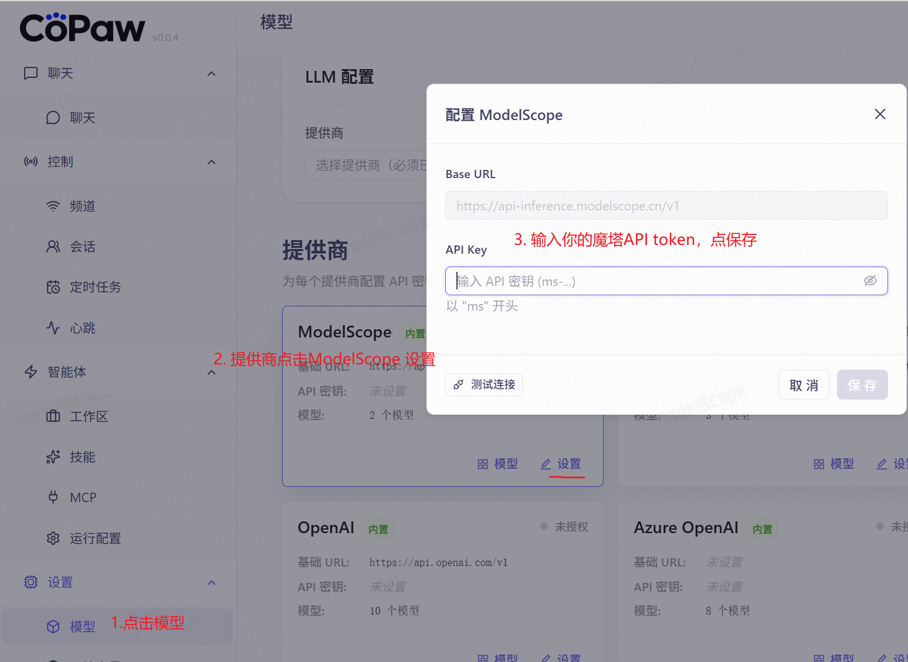
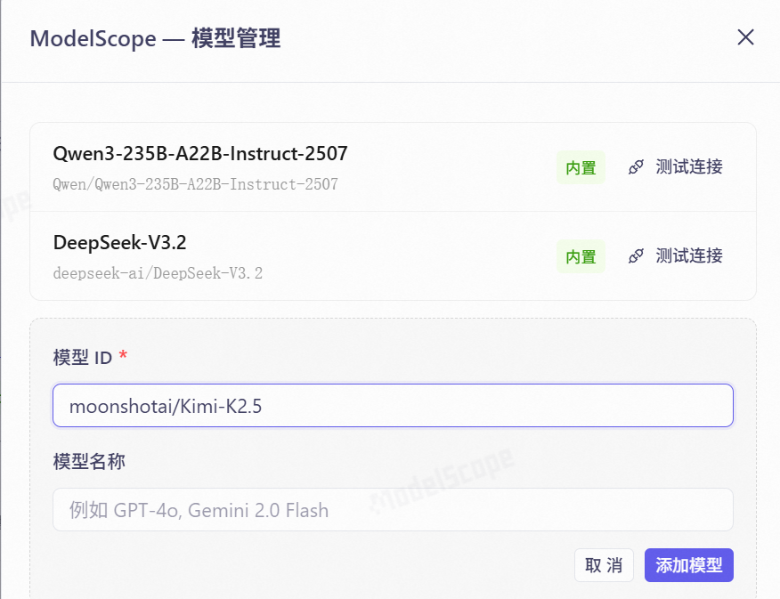
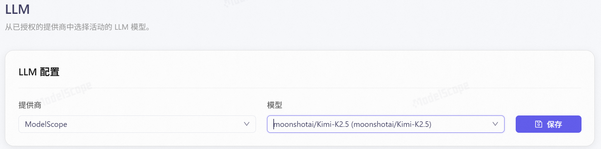
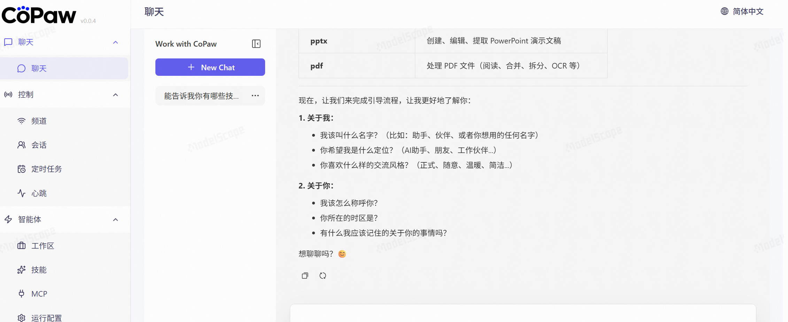
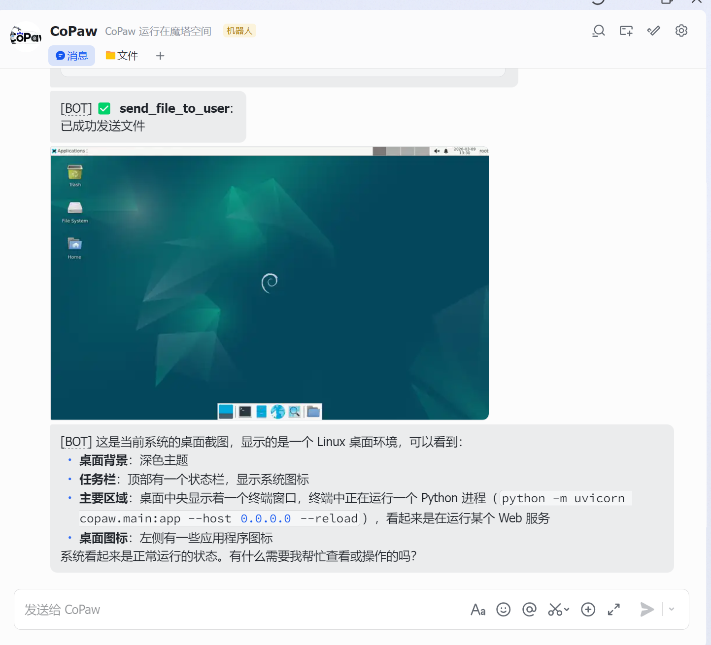

# 附录 A06：无需购买 API 与云主机，也能体验“养虾”的快乐 (CoPaw 零成本教程)

!!! quote "🦐 什么是“养虾”？"
    **CoPaw** (Copilot Paw) 是由 AgentScope 团队开源的一款超可爱的个人 AI 助理。它的标志性 Mascot 是一只活蹦乱跳的“赛博大虾”，因此在开发者圈子里，使用 CoPaw 通常被称为**“养虾”**。
    
    通常，部署一个全功能的 AI Agent 需要云服务器和昂贵的 API Key。但今天，我们将利用**魔搭社区 (ModelScope) 的创空间**和**免费模型 API**，一键“白嫖”属于你的专属 AI 助理！

---

## 🎯 课前准备

在开始“养虾”之前，请确保你已经拥有了**魔搭社区 (ModelScope)** 的账号和 API Key。

* 如果你还没有，请出门左转查看：[👉 附录 A：开发者账号申请指南](a01-account-guide.md)。
* 请准备好你的魔搭 Access Token（以 `sk-` 开头）。

---

## 🚀 第一步：魔搭创空间一键部署 (无需安装)

传统的开源项目需要你在本地执行 `git clone`，安装一堆 Python 依赖环境，非常容易报错。而魔搭的**“创空间 (Spaces)”**提供了一键克隆运行的魔法。

1. **访问官方创空间**：
   打开浏览器，访问 CoPaw 在魔搭的官方空间：
   [🔗 https://www.modelscope.cn/studios/AgentScope/CoPaw](https://www.modelscope.cn/studios/AgentScope/CoPaw)

2. **复制空间 (Clone Space)**：
   在页面右上角，找到并点击 **“复制空间”** 按钮。

3. **配置你的私有空间**：
   * **空间名称**：随意起个名字，比如 `My-Smart-CoPaw`。
   * **空间可见性**：建议选择 **“私有”**（专属于你自己的助理）。
   * 点击 **“确认”**。

4. **等待环境构建**：
   系统会自动为你分配免费的云端 CPU 算力，并拉取代码构建环境。这个过程大概需要 1-3 分钟。当状态变为 **“运行中 (Running)”** 时，你的专属“赛博大虾”就部署成功了！

---

## ⚙️ 第二步：配置大模型 (零成本 API)

此时你应该能看到 CoPaw 的操作界面了。但是，现在的“大虾”还没有大脑，我们需要把免费大模型接入进去。

最新版的 CoPaw 已经原生支持了 **ModelScope (魔搭)** 作为模型提供商，我们只需填入 API Key 即可激活。

1. **填写 API Key**：在 CoPaw 界面左侧导航栏点击 **【设置】**，找到 **【模型 (Models)】** 列表。找到 `ModelScope`，点击它旁边的“设置”图标（⚙️），输入你的魔搭 API Key (`sk-...`)，并保存配置。  
   { width="70%" .shadow }

2. **添加具体模型**：在模型列表顶部，点击 **“+ 添加模型”**。在弹出的窗口中输入你想使用的免费模型 ID，例如：`moonshotai/Kimi-K2.5`。  
   { width="70%" .shadow }  
   *(💡提示：只要魔搭平台支持且免费，你也可以随时添加 `deepseek-ai/DeepSeek-R1-0528` 等其他优秀的大模型。)*

3. **激活 LLM 大脑**：切换到 **【LLM】** 选项卡。将“提供商”选择为 `ModelScope`，“模型”选择你刚刚配置的 `moonshotai/Kimi-K2.5`，点击保存。大功告成！  
   { width="70%" .shadow }

---

## 🦐 第三步：开始体验“养虾”的快乐

大脑安装完毕！回到 CoPaw 的主对话界面，你可以开始使唤你的专属 AI 助理了。

### 💬 进阶玩法建议：

1. **完成首次引导 (建立人设)**：  
    > 试着对它发一句：“嘿，大虾，让我们开启一段新的旅程吧！”    
    > 跟着它的提示，提供一些你的专业背景和偏好信息。完成预设后，它会变成最懂你的私人助理！  
   
    { width="70%" .shadow }

2. **扩展智能体能力 (无缝衔接第 5 章)**：  
    CoPaw 最强大的地方在于支持工具调用。点击左侧的 **【智能体】** 菜单，你可以为它配置 **MCP** 或 **技能(Skills)**。  
    > **学以致用**：试着把我们在**第 5 章**学过的高德地图 MCP、12306 MCP 地址配置进去。你的大虾瞬间就拥有了查路线、买火车票的超能力！

3. **打通移动端 (接入飞书)**：
    想随时随地“撸虾”？你可以将 CoPaw 接入飞书频道。配置完成后，直接通过手机飞书 APP 就能向它发送指令，甚至让它直接读取你的手机截图。 
    
    * 详细配置教程请参考官方文档： [🔗 飞书频道接入指南](https://copaw.agentscope.io/docs/channels#%E9%A3%9E%E4%B9%A6)
    * *下图是通过手机飞书 APP 与 CoPaw 对话的实测演示：“当前系统界面截图发我一下”。*
   
    { width="70%" .shadow }

---

## ✅ 总结与自查

通过这个有趣的扩展实验，你不仅零成本获得了一个高颜值的个人 AI 助理，更重要的是，你亲自体验了：

* **Serverless 部署**：理解了不需要买服务器，也能通过“创空间 (ModelScope Spaces)” 运行完整应用。
* **协议兼容的红利**：验证了只要掌握标准的模型接入方法，各种开源大模型任你差遣。
* **Agent 生态的繁荣**：感受到了 MCP 协议和渠道接入（飞书/微信）给 AI 带来的无限可能。

**遇到问题？**
* 如果提示 `401 Unauthorized`：请检查你的魔搭 API Key 是否复制完整，首尾不要有空格。
* 如果一直无响应：可能是魔搭的免费并发接口比较拥挤，稍微等一下或多重试几次即可。

快去调教你的“赛博大虾”吧！🎉