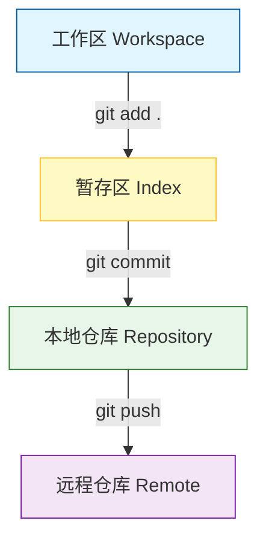

# 工程化基石：Maven 与 Git

!!! quote "告别“石器时代”的手工作坊"
    如果你还在手动复制 `lib` 文件夹里的 jar 包，或者用 U 盘拷贝代码给老师，那你还在软件开发的“石器时代”。
    
    本节课我们将掌握现代 Java 开发的两大护法：**Maven（大管家）** 与 **Git（时光机）**。这是从“写代码的学生”进化为“软件工程师”的必经之路。

---

## 🐘 Maven：Java 世界的“大管家”

### 1. 为什么要用 Maven？
在写代码时，我们需要用到很多第三方库（比如 Spring Boot、MyBatis、MySQL 驱动）。

* **传统方式 (石器时代)**：去各个官网下载 jar 包 -> 复制到项目 -> 右键 Add to Path -> 版本冲突报错 -> 崩溃 😫。
* **Maven 方式 (现代工业)**：列一张清单（pom.xml），Maven 自动帮你从阿里云仓库下载所有 jar 包，并解决依赖冲突 😎。

### 2. 核心概念：POM 与 坐标 (GAV)
Maven 的核心是一个名为 `pom.xml` 的文件。你只需要在这个文件里告诉 Maven 你想要什么（**坐标**），它就会自动“快递到家”。

一个标准的坐标包含三个要素（G-A-V）：

* **GroupId** (集团ID)：通常是公司域名的倒写，如 `com.alibaba`。
* **ArtifactId** (产品ID)：项目的名字，如 `fastjson`。
* **Version** (版本号)：如 `1.2.83`。

### 3. 实战：如何引入依赖
假设我们需要引入 `Lombok` 工具，只需要在 `<dependencies>` 标签中加入以下代码：

```xml
<dependency>
    <groupId>org.projectlombok</groupId>
    <artifactId>lombok</artifactId>
    <version>1.18.30</version>
    <scope>provided</scope>
</dependency>

```

!!! tip "AI 提效技巧"
    记不住复杂的坐标怎么办？**直接问 AI！**
    > **你**：DeepSeek，请给我 Maven 引入 Spring Web 和 Lombok 的依赖代码。  
    > **AI**：(秒回 xml 代码，你直接复制粘贴即可)

---

## 🕸️ Git：代码的“时光机”与“后悔药”

### 1. 为什么必须学 Git？

Git 是目前世界上最先进的分布式版本控制系统。除了应付作业考核，它对你的开发生涯有着致命的吸引力：

* 💊 **世上真有后悔药**：代码改崩了？误删了文件？Git 让你一键回退到昨天（或任意时间点）的正常状态。
* ☁️ **多端无缝同步**：在机房写了一半，提交到远程仓库（Gitee），回到宿舍拉取下来继续写。**再也不用拿 U 盘拷来拷去了**。
* 🤝 **企业协作标准**：在大厂，没有 Git 也就没有团队合作。多人同时修改一个项目，Git 能自动合并代码，解决冲突。

!!! example "真实案例：本课程电子教材"
    你正在阅读的这份《Java Web 开发技术》在线文档，就是 **Git 的最佳实践案例**。

    * 老师在本地编写 Markdown 文件。
    * 通过 Git 推送到 **GitHub**。
    * 利用 **GitHub Pages** 自动构建并托管网站。
    * 这意味着：**万物皆可 Git**，不仅是代码，文档、网页、配置都可以用它管理。


### 2. 核心工作流图解

Git 的操作虽然命令很多，但核心只有三步：



### 3. 认识远程仓库：GitHub 与 Gitee

代码存在本地硬盘是不安全的（硬盘坏了怎么办？），我们需要把它托管到云端。

| 平台 | 特点 | 本课程用途 |
| --- | --- | --- |
| **Gitee (码云)** | **国内速度快**，全中文界面，无网络障碍。 | **[主力]** 用于提交平时的实验作业和代码。 |
| **GitHub** | **全球最大**的开源社区，被戏称为“程序员的 Facebook”。 | **[拓展]** 托管本课程电子教材，查阅全球顶级开源项目（如 Spring Boot 源码）。 |

### 4. 常用命令速查

在 IDEA 中，你既可以使用右上角的图形化按钮（✅ Commit, ⬇️ Pull, ↗️ Push），也可以在 Terminal 中输入命令：

| 命令 | 作用 | 说明 |
| --- | --- | --- |
| `git init` | 初始化 | 在当前文件夹创建一个 Git 仓库 |
| `git add .` | 添加文件 | 将所有修改过的文件放入“暂存区” |
| `git commit -m "完成登录"` | **提交存档** | **最常用！** 生成一个版本节点，必须写清楚备注 |
| `git push` | 推送 | 将代码上传到远程服务器 (Gitee) |
| `git pull` | 拉取 | 在宿舍电脑上，把机房写的代码拉下来 |
| `git status` | 查看状态 | 看看哪些文件改了还没提交 |

!!! warning "考核指标：拒绝“一次性提交”"
    根据教学大纲，**平时作业/实验成绩占 40%** 。老师将重点检查你的 **Git 提交记录 (Commit History)** 。

    * ✅ **高分做法**：每天都有提交，记录了从 0 到 1 的开发过程（Feature A -> Fix Bug -> Feature B）。
    * ❌ **0分风险**：期末最后一天突然提交了所有代码（疑似抄袭/直接拷贝）。

### 5. 忽略文件 (.gitignore)

有些文件是不应该上传的（比如编译后的 `.class` 文件、几百兆的 `.jar` 包、IDE 的配置 `.idea` 文件夹）。我们会在项目根目录放一个 `.gitignore` 文件。

**通用的 Java .gitignore 模板：**

```text
target/
.idea/
*.iml
*.class
.DS_Store

```

---

## 🤖 实验 1 预热：创建你的第一个工程

现在，请打开 IDEA，结合 AI 助手完成以下任务：

1. **新建 Spring Boot 项目**：使用 Spring Initializr。
2. **查看 POM**：观察 `pom.xml` 中自动生成的 `spring-boot-starter-web` 依赖。
3. **初始化 Git**：在项目根目录执行 `git init`。
4. **初次提交**：执行 `git add .` 和 `git commit -m "init project"`。


!!! success "工程化成就达成"
    当你看到控制台显示 `[master (root-commit)] init project` 时，你已经成功建立了工程化管理的基石。下一节，我们将解锁真正的 **AI 结对编程** 能力。

[下一步：你的 AI 编程搭档 >>](ai-tools.md){ .md-button .md-button--primary }
