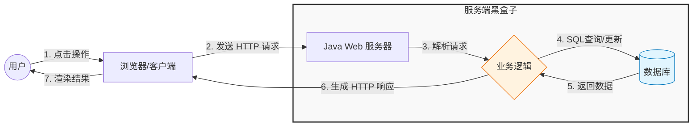

# 第1章 Web 开发全貌与效能工具

!!! quote "本章金句"
    工欲善其事，必先利其器。在写下第一行 Java 代码之前，先让我们看清 Web 世界的地图，并将你的开发环境“武装到牙齿”。

## 📖 本章导读

欢迎推开 Java Web 开发的大门！

很多同学可能听说过“做网站”、“写后端”或者“写接口”，但它们到底是什么？根据教学大纲，本章只有 **2 个理论学时**，我们的目标非常明确：

1.  **建立认知**：搞清楚 Java Web 到底是干什么的，理解一次点击背后发生了什么。
2.  **配置环境**：跳过繁琐的手动配置，利用集成包和 AI 工具，构建一套秒级就绪的现代化开发流。

---

## ❓ 什么是 Java Web？

简单来说，**Java Web 就是用 Java 语言开发“运行在服务器端”的程序**，用来服务互联网上的各种客户端（浏览器、手机 App、小程序，甚至现在的 AI 大模型）。

在现代互联网架构（B/S 架构）中，Java Web 扮演着 **“大管家”** 的角色：

* **前端 (Frontend)**：负责“貌美如花”（页面展示、用户交互）。
* **后端 (Java Web)**：负责“赚钱养家”（业务逻辑、数据处理、安全校验）。
* **数据库 (Database)**：负责“存储资产”（保存用户数据）。

!!! note "时代的变迁：从页面到智能"
    早期的 Java Web 主要用来生成 HTML 页面（JSP 技术）。
    而现在的 Java Web（本课程重点），更多是提供 **RESTful API 接口**——它不仅服务于人类用户，更为 **AI 智能体** 提供数据支撑，成为连接大模型与现实业务的桥梁。

---

## 🔄 核心原理：一次 Web 请求发生了什么？

当你打开浏览器，点击“登录”按钮时，幕后发生了一场毫秒级的接力赛。这就是 Web 开发的核心模型：**请求-响应 (Request-Response)**。

**这个流程中的关键环节，就是我们要学的技术：**

1. **HTTP 协议**：浏览器和服务器说话的“语言”。
2. **Servlet/Controller**：服务器端的“接待员”，负责接收请求。
3. **Service**：业务逻辑的“办事员”，处理核心规则（如：判断密码对不对）。
4. **MyBatis/DAO**：仓库的“管理员”，负责去数据库拿数据。

---

## 🗺️ 这门课我们学什么？

本课程采用 **“Spring Boot First”** 策略，不走弯路，直击企业级开发与 AI 实战核心。

### 1. 核心技术栈

我们将组装以下“武器”来搞定上面的流程：

| 领域 | 核心技术 | 说明 |
| --- | --- | --- |
| **框架层** | **Spring Boot** | 现代 Java 开发标准，简化配置，开箱即用。 |
| **持久层** | **MyBatis + openGauss** | 连接国产信创数据库，灵活操作数据。 |
| **底层原理** | **Servlet & HTTP** | 虽不常用但必须懂的“地基”，理解 Session 会话机制。 |
| **AI 赋能** | **MCP & Tool Calling** | **(课程特色)** 让 Java 代码成为 AI 大模型的手脚。 |

### 2. 效能工具链 (本章重点)

工欲善其事，必先利其器。本章我们将重点配置以下工具：

* **Maven**：Java 世界的“超市”，自动下载和管理 jar 包。
* **Git**：代码的“时光机”，作业提交的唯一通道。
* **DeepSeek / 通义灵码**：你的 24 小时“私人助教”。

---

## 🎯 本章学习目标

通过本章学习，你需要达成以下目标：

* **⚡️ 环境秒级就绪**：基于教师提供的集成包，配置 JDK (Dragonwell)、Idea 和 Maven。
* **🏗️ 工程化思维**：理解 Maven 的坐标概念，不再手动复制 jar 包。
* **🤖 AI 结对编程**：安装并配置 AI 插件，学会用 AI 解释代码、生成测试用例。

---

## 🧪 实验任务预告

**实验 1：Web环境与AI助手配置 (2学时)**

* **内容**：配置 JDK/Maven/Idea，安装 AI 编程插件。
* **成果物**：提交一张 AI 对话截图（证明你会用 AI 辅助学习）和 Java Web Hello World 的运行截图。

!!! tip "老师的建议"
    不要被“底层原理”吓到，也不要死记硬背 Maven 的标签。
    **本章的重点是“跑通流程”**。只要你的 IDEA 能成功运行 Hello World，并且能呼出 AI 助手帮你解释代码，你就已经战胜了 50% 的初学者。
   

👇 **准备好了吗？让我们开始配置环境！**

[开始配置开发环境](01-env-setup.md){ .md-button .md-button--primary }
