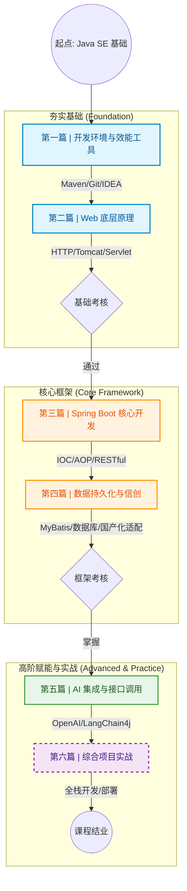

# Java Web开发技术

## 课程简介

《Java Web开发技术》是计算机科学与技术专业的核心课程，旨在帮助学生掌握 **Java Web开发** 的核心技能，深入了解 **Spring Boot** 和 **MyBatis** 等流行框架，熟练运用 **RESTful API** 设计与开发。同时，课程将结合 **信创国产化技术栈**（龙蜥 OS + openGauss 数据库），并通过项目驱动式学习，帮助学生在现代企业级开发环境中提升实际开发能力。课程最后，学生将通过构建 **智能航班管理系统** 项目，将所学知识应用于真实的开发环境中。

本课程采用 **“Spring Boot 优先”** 的教学模式，侧重于企业级开发框架的实战应用，并通过集成 **AI 大模型接口**，让学生在实际项目中体验到前沿技术的应用。

## 课程目标

通过本课程的学习，学生将能够：

- **理解并掌握 Web 开发的基础知识**：包括 HTTP 协议、Session 会话机制、Spring 容器（IoC/DI）和 AOP 等核心原理。
- **熟练使用 Spring Boot 和 MyBatis 进行开发**：掌握 RESTful API 设计，能够快速开发企业级 Web 应用。
- **掌握信创国产化技术栈**：能够使用国产数据库 **openGauss**，并集成 **AI 大模型 API**，如 DeepSeek。
- **具备工程化开发能力**：通过实际的项目开发，培养学生的团队合作与工程化思维。

## 学习路线图

以下是课程的学习路线图，展示了每个模块的学习内容及其顺序：

