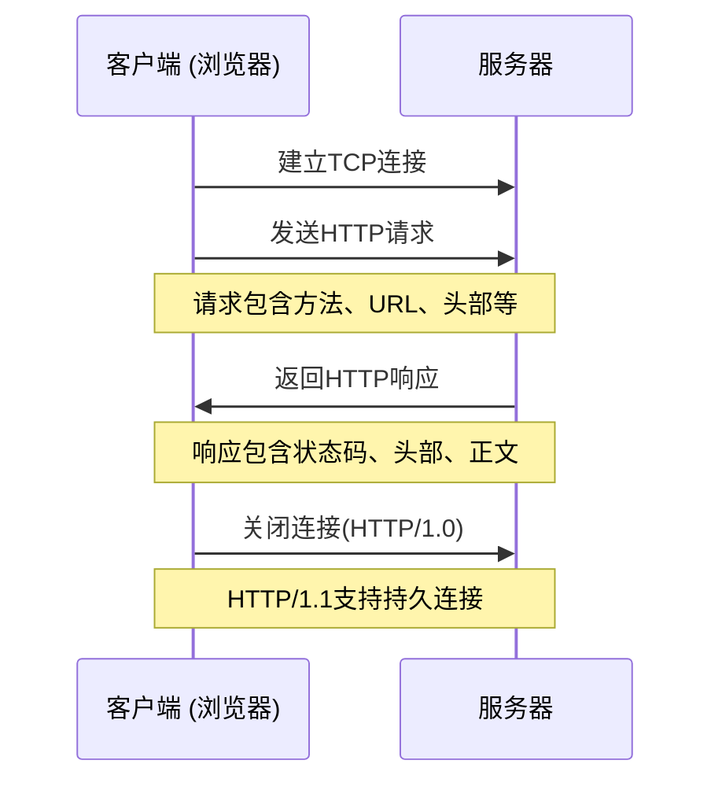
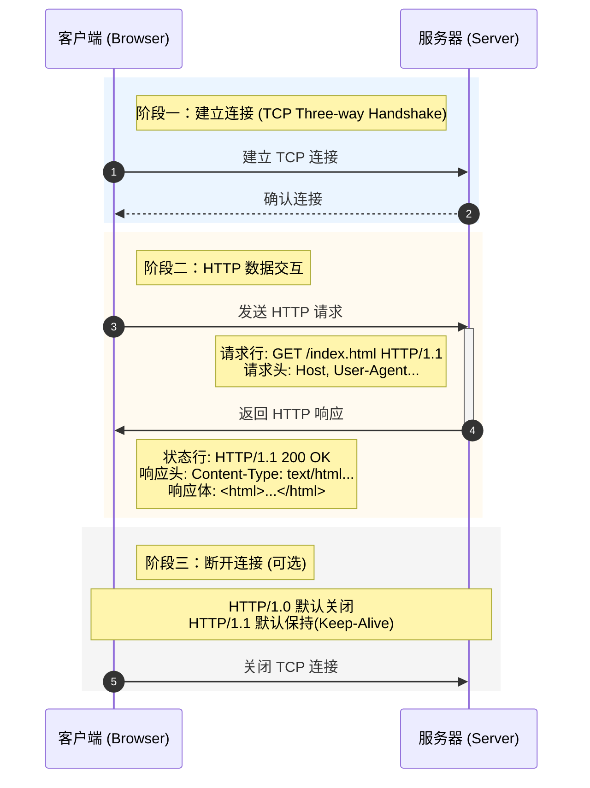

#  HTTP协议与开发者工具

!!! quote "本节目标"
    在开始编写 Java Web 代码之前，我们必须先掌握 Web 世界的“通用语言”——**HTTP 协议**。
    
    本节将带你掌握后端开发者的核心技能：**读懂报文**与**使用显微镜 (DevTools)**。拒绝死记硬背，我们直接动手“抓包”。

---

## 🌍 第一步：宏观视角 (B/S 架构)

现代 Web 开发主要基于 **B/S 架构 (Browser/Server)**，即 **浏览器/服务器** 模式。

* **Browser (浏览器)**：客户端（Client）。负责向用户展示界面，并代表用户向服务器发送请求（点菜）。
* **Server (服务器)**：服务端。负责处理业务逻辑、查询数据库，并将结果返回给浏览器（后厨做菜）。
* **HTTP 协议**：浏览器和服务器之间沟通的**规则**（菜单和传菜单的格式）。

{ width="100%" .shadow }


!!! note "核心区别：B/S vs C/S"
    * **C/S (Client/Server)**：如 LOL、QQ。**需安装**，性能强，但更新麻烦（每次都要下载补丁）。
    * **B/S (Browser/Server)**：如 淘宝网页版、B站。**零安装**，有浏览器就能用，更新只在服务器端进行。**这是本课程的开发重点。**

---

## 🔍 第二步：开发者的显微镜 (DevTools)

作为一名 Web 工程师，浏览器不仅仅是用来上网的，它是你的**调试终端**。我们主要使用 Google Chrome 或 Microsoft Edge 的开发者工具。

### 如何开启
在浏览器页面按键盘上的 <kbd>F12</kbd> 键（或右键 -> 检查）。

### 核心面板：Network（网络）
这是后端开发最常打交道的面板。它能记录浏览器发出的所有请求。

**操作练习**：
1.  打开 [Gitee](https://gitee.com)。
2.  按 <kbd>F12</kbd> 打开控制台，切换到 **Network** 标签页。
3.  按 <kbd>F5</kbd> 刷新页面。
4.  观察列表中不断跳动的数据。

**重点关注的列**：
* **Name**：请求的资源名称（如 `logo.png` 或 `login` 接口）。
* **Status**：状态码（如 `200` 表示成功，`404` 表示找不到）。
* **Type**：资源类型（`document` 是网页，`xhr/fetch` 通常是数据接口，`png` 是图片）。

---

## ⚡ 第三步：HTTP 协议图解

HTTP (HyperText Transfer Protocol) 是超文本传输协议。它是一种**无状态**的、**请求-响应 (Request-Response)** 模式的协议。

<!-- 

-->




### 报文结构拆解

HTTP 的交互分为“去”和“回”两个动作。

=== "📤 HTTP 请求 (Request)"

    浏览器发给服务器的数据包，包含三部分：

    1.  **请求行**: `GET /index.html HTTP/1.1` (方法 + 路径 + 版本)
    2.  **请求头**: `User-Agent` (我是谁), `Content-Type` (我发什么格式数据)
    3.  **请求体**: POST 请求存放表单或 JSON 数据的地方 (GET 通常为空)。

    ```http
    GET /index.html HTTP/1.1
    Host: www.example.com
    User-Agent: Mozilla/5.0
    Accept: text/html
    Connection: keep-alive
    ```

=== "📥 HTTP 响应 (Response)"

    服务器回送给浏览器的数据包，也包含三部分：

    1.  **响应行**: `HTTP/1.1 200 OK` (版本 + **状态码** + 描述)
    2.  **响应头**: `Content-Type` (我回给你的是图片还是HTML?), `Set-Cookie` (给你的令牌)
    3.  **响应体**: 真正的 HTML 代码、图片数据或 JSON。

    ```http
    HTTP/1.1 200 OK
    Content-Type: text/html; charset=UTF-8
    Content-Length: 138

    <html>
      <body><h1>Hello World</h1></body>
    </html>
    ```

---


## 🧠 第四步：核心背诵点

###  常见请求方法 (Method)

| 方法 | 描述 | 典型场景 |
| :--- | :--- | :--- |
| **GET** | **获取**资源 | 在地址栏输入 URL、点击超链接、搜索查询。参数通常拼接到 URL 后面（`?id=1`）。 |
| **POST** | **提交**数据 | 登录、注册、上传文件。数据存放在**请求体**中，相对安全且容量大。 |
| PUT | 修改资源 | 更新用户信息（RESTful 风格）。 |
| DELETE | 删除资源 | 删除一条订单（RESTful 风格）。 |

###  常见状态码 (Status Code)

看到状态码，要能立刻反应出大概的问题所在：

* **2xx (成功)**
    * 🟢 **200 OK**：一切正常。
* **3xx (重定向)**
    * 🟡 **302 Found**：你访问的资源搬家了，浏览器会自动跳转到新地址。
* **4xx (客户端错误 - 你写错了)**
    * 🔴 **404 Not Found**：路径写错了，或者文件不存在。
    * 🔴 **405 Method Not Allowed**：服务器只允许 POST，你却用了 GET。
    * 🔴 **400 Bad Request**：参数格式不对（比如要数字你传了字母）。
* **5xx (服务端错误 - 后端代码炸了)**
    * 💥 **500 Internal Server Error**：Java 代码抛出了异常（空指针等），快去看服务器控制台日志！

---

## 🤖 第五步：AI 辅助学习：读懂“天书”

初学者在 Network 面板看到一堆原始报文（Raw）时容易发懵。利用 AI，我们可以通过“自然语言”来学习协议细节，把枯燥的参数变成看得懂的解释。

**实战步骤**：

1.  在 Network 面板找到一个请求，点击它。
2.  点击 **Headers** 标签，找到 **Request Headers** 或 **Response Headers**，点击旁边的 **View source** (查看源码)。
3.  复制那一堆文本。
4.  **发送给 AI 助手**（DeepSeek / ChatGPT / Claude）。

!!! example "Prompt (提示词) 示例"
    我正在学习 Java Web，这是我从浏览器抓包抓到的一个 HTTP 请求，请帮我逐行分析它的含义，特别是 User-Agent 和 Cookie 是做什么的？

    ```http
    GET /search?q=java HTTP/1.1
    Host: [www.baidu.com](https://www.baidu.com)
    Connection: keep-alive
    User-Agent: Mozilla/5.0 ...
    Accept: text/html...
    ```

!!! tip "作业：利用 AI 分析一次登录请求"
    请尝试在任意网站进行一次登录操作（或尝试登录失败），在 Network 中找到那个 Method 为 **POST** 的请求。
    
    **任务**：复制它的请求头（Request Headers）和请求体（Payload/Form Data），发送给 AI，询问：“这个请求向服务器提交了哪些数据？是以什么格式（Form 表单还是 JSON）提交的？”

---

## 🛠️ 第六步: 课堂练习,所见即所得

!!! question "练习 1：读一次真实报文"
    使用 **Apifox** 或 **Postman** 对任意接口发起一次请求并截图。
    
    **截图要求**（需包含以下信息）：
    
    1.  请求方法（GET/POST）与 URL
    2.  `Content-Type` 头
    3.  响应状态码（Status Code）
    4.  实际返回的响应体内容

!!! question "练习 2：让 AI 生成报文（你来验收）"
    把下面提示词发给 AI，并**检查**它输出的报文结构是否符合 HTTP 协议规范：

    ```text
    请模拟一个 HTTP POST 请求报文：
    场景：用户注册
    Body数据格式：JSON
    包含字段：username, password, phone
    
    任务：同时模拟一个“注册成功”的响应报文与一个“格式错误”的失败响应报文，并解释每一行的含义。
    ```

---


---

## 👩‍💻 随堂实验：使用 Java 发送 HTTP 请求

理解了浏览器如何发送请求后，我们来看看如何用 Java 代码模拟这个过程。这在后续调用第三方接口（如微信支付、短信验证码）时非常有用。

下面的代码使用了 JDK 自带的 `HttpURLConnection`。

```java title="HttpClientExample.java" linenums="1"
import java.net.*;
import java.io.*;

public class HttpClientExample {
    public static void main(String[] args) throws Exception {
        // 1. 定义目标地址
        URL url = new URL("http://example.com/api/data");
        
        // 2. 打开连接
        HttpURLConnection conn = (HttpURLConnection) url.openConnection();
        conn.setRequestMethod("GET"); // 设置请求方法
        
        // 3. 设置请求头 (模拟浏览器行为)
        conn.setRequestProperty("User-Agent", "Java/HttpClient");
        conn.setRequestProperty("Accept", "application/json");
        
        // 4. 获取响应码
        int responseCode = conn.getResponseCode();
        System.out.println("响应码: " + responseCode);
        
        // 5. 读取响应体内容
        BufferedReader in = new BufferedReader(
            new InputStreamReader(conn.getInputStream())
        );
        String inputLine;
        StringBuilder response = new StringBuilder();
        
        while ((inputLine = in.readLine()) != null) {
            response.append(inputLine);
        }
        in.close();
        
        // 6. 打印结果
        System.out.println("响应内容: " + response.toString());
    }
}

```

!!! note "说明"
    虽然现在流行使用 `HttpClient` (JDK 11+) 或 `OkHttp` 等第三方库，但掌握基础的 IO 流和连接原理对于理解 HTTP 通信至关重要。

---

## 📝 总结与展望

HTTP 协议是 Java Web 开发的基石。深入理解它，对于以下方面至关重要：

1. **编写高效代码**：知道何时用 GET 何时用 POST。
2. **设计 API**：设计合理的 RESTful 接口。
3. **性能优化**：理解缓存（Cache-Control）和连接复用（Keep-Alive）。
4. **系统安全**：理解 HTTPS 和 Cookie/Session 机制。

在实际开发中，我们通常不会手动解析 HTTP 字符串，而是使用 **Servlet API** 或 **Spring MVC** 框架。但请记住，无论框架多么高级，底层依然是我们今天学习的这些报文。

!!! check "下课前自检：F12 排错三部曲"
    遇到 Bug 养成先看 Network 面板的习惯：

    * ✅ **请求发出去了吗？**（看 Status 状态）
    * ✅ **参数传对了吗？**（看 Payload/Query String）
    * ✅ **服务器报错了吗？**（是 200 OK 还是 500 Error）

---


### 📚 扩展阅读：HTTP 官方规范

> 如果你想深入研究协议的最底层细节，可以查阅官方 RFC 文档（纯英文，难度较大，选读）。

* [🌐 RFC 2616: HTTP/1.1 规范文档](https://tools.ietf.org/html/rfc2616){ target="_blank" }

---

<div class="grid cards" markdown>

-   **:material-chart-bubble: 核心原理可视化**

    ---
    这里有一个互动的演示页面，帮助你直观理解 HTTP 流程。

    [📄 图解 HTTP 原理](../assets/html/HTTP协议基础讲解.html){ .md-button target="_blank" }

-   **:material-arrow-right-circle: 继续学习**

    ---
    Web 开发的第一步已迈出，接下来学习 Java 如何处理这些请求。

    [Servlet 起步与生命周期](02-servlet-basics.md){ .md-button .md-button--primary }

</div>
