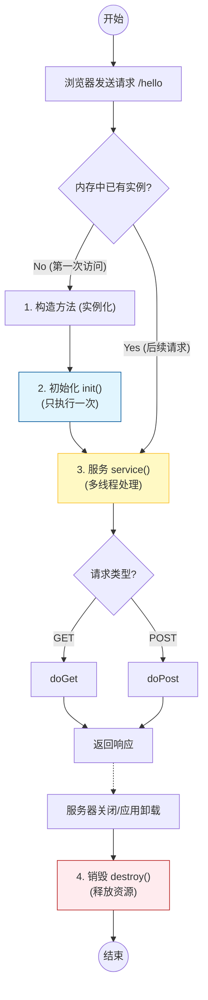

# 2. Servlet 起步与生命周期

!!! quote "本节目标"
    上一章我们学会了如何用浏览器“点菜”（发送 HTTP 请求）。
    
    现在，我们要进入后厨，学习**如何用 Java 代码接单并做菜**。本节将带你手写第一个 **Servlet**，并深入理解它从出生到销毁的全过程（面试必问）。

---

## 🚀 第一步：什么是 Servlet？

**Servlet** (Server Applet) 也就是“运行在服务器端的小程序”。

如果把 Web 服务器（Tomcat）比作一家餐厅，那么 Servlet 就是**服务员**。它的核心职责只有三件事：

1.  **接单 (Request)**：接收浏览器发来的请求数据（用户填的表单、JSON）。
2.  **干活 (Service)**：调用业务逻辑（找厨师做菜、查数据库）。
3.  **上菜 (Response)**：把结果（HTML 页面、JSON 数据）端给浏览器。

---

## 👩‍💻 第二步：第一个 Hello World

拒绝纸上谈兵，我们直接动手写一个能运行的 Servlet。

### 1. 编写 Java 类
在项目中创建一个类 `HelloServlet`，继承 `HttpServlet`，并打上注解。

```java title="src/main/java/edu/wtbu/cs/coursedemoservlet/HelloServlet.java"


import java.io.*;

import jakarta.servlet.ServletException;
import jakarta.servlet.http.*;
import jakarta.servlet.annotation.*;

// ✅ 1. 告诉 Tomcat：只要有人访问 /hello，就找我！
@WebServlet("/hello")
public class HelloServlet extends HttpServlet {

    // ✅ 2. 构造方法：对象出生时调用
    public HelloServlet() {
        System.out.println("👉 1. [构造方法] HelloServlet 实例被创建了！");
    }

    // ✅ 3. 初始化方法：刚出生后立刻调用，用于加载资源
    @Override
    public void init() throws ServletException {
        System.out.println("👉 2. [init] 初始化完成，准备接客！");
    }

    // ✅ 4. 服务方法：每次有请求来，都会先经过这里！
    @Override
    protected void service(HttpServletRequest req, HttpServletResponse resp) throws ServletException, IOException {
        System.out.println("👉 3. [service] 有新的请求进来了，正在判断是 GET 还是 POST...");
        // 🚨 注意：super.service() 会自动帮我们分发到 doGet 或 doPost
        // 如果删掉这一行，doGet/doPost 就不会被执行了！
        super.service(req, resp);
    }

    // ✅ 5. 业务逻辑：处理 GET 请求
    @Override
    protected void doGet(HttpServletRequest req, HttpServletResponse resp)
            throws ServletException, IOException {
        System.out.println("👉 4. [doGet] 执行具体业务逻辑...");

        // 设置响应格式
        resp.setContentType("text/html;charset=UTF-8");
        PrintWriter out = resp.getWriter();

        // 写入页面内容
        out.println("<h1>Hello, Servlet!</h1>");
        out.println("<p>请观察 IDEA 的控制台日志，看懂生命周期。</p>");
    }

    // ✅ 6. 销毁方法：服务器关闭时调用
    @Override
    public void destroy() {
        System.out.println("👉 5. [destroy] 服务器要关了，我先下班了(释放资源)...");
    }
}
```

### 2. 运行与验证


!!! tip "⚠️ 关键配置：检查你的 Application Context"
    很多同学访问报错 **404**，是因为 URL 写错了！URL 的组成规则是：
    `http://localhost:8080` + **/部署路径** + `/Servlet路径`
    
    * 本教材案例统一将部署路径（Application context）配置为 **`/demo`**。
    * **配置方法**：点击 IDEA 右上角 Tomcat -> `Edit Configurations` -> `Deployment` 选项卡 -> 修改下方的 `Application context` 为 `/demo`。
    * 如果你没改这里（默认为 `/`），请去掉 URL 里的 `/demo` 再试。


1. 启动 Tomcat。
2. 打开浏览器访问：`http://localhost:8080/demo/hello`。
!!! success "所见即所得"
    如果你在页面上看到了 **Hello, Servlet!** 和当前时间，恭喜你，你已经打通了从“浏览器 -> Tomcat -> Java代码”的完整链路！
3. **刷新**浏览器页面 2 次。
4. 点击 IDEA 里的红色方块⏹ 停止服务器。

!!! success "控制台日志解析 (预期结果)"
    ```text
    👉 1. [构造方法] HelloServlet 实例被创建了！   <-- 仅第1次访问时出现
    👉 2. [init] 初始化完成，准备接客！             <-- 仅第1次访问时出现
    
    👉 3. [service] 有新的请求进来了...             <-- 每次刷新都出现
    👉 4. [doGet] 执行具体业务逻辑...               <-- 每次刷新都出现
    
    👉 3. [service] 有新的请求进来了...
    👉 4. [doGet] 执行具体业务逻辑...

    👉 5. [destroy] 服务器要关了...                 <-- 停止服务器时出现
    
    ```
---

## 🧬 第三步：生命周期 (核心考点)

Servlet 不是普通的 Java 类，你**不需要**自己 `new HelloServlet()`。它的生老病死全权由 **Web 容器（Tomcat）** 管理。

Servlet 的生命周期主要包含四个阶段：**加载与实例化** -> **初始化** -> **服务** -> **销毁**。




### 阶段详解表


| 阶段 | 方法 | 说明 | 执行次数 |
| --- | --- | --- | --- |
| **1. 实例化** | `Constructor` | Tomcat 通过反射 `new` 出 Servlet 对象。默认是**懒加载**（第一次被访问时才创建）。 | **1次** |
| **2. 初始化** | `init()` | 实例创建后立刻调用。通常用于加载资源（如读取配置文件、建立数据库连接池）。 | **1次** |
| **3. 服务** | `service()` | 每次请求都会调用。它会自动判断请求是 GET 还是 POST，然后分发给 `doGet` 或 `doPost`。 | **N次** |
| **4. 销毁** | `destroy()` | 当服务器关闭或项目被移除时调用。用于释放资源（如保存数据、断开连接）。 | **1次** |


!!! warning "高频面试题：Servlet 是线程安全的吗？"
    **不是！Servlet 是单例的 (Singleton)。**  
    这意味着全网用户访问 `/demo/hello` 时，都在共用**同一个** `HelloServlet` 对象。  
    **❌ 禁忌**：千万不要在 Servlet 类中定义**成员变量**来存储用户数据（比如 `private String username;`）。否则，张三存进去的名字，可能会被李四读出来！

---

## ⚙️ 第四步：配置方式的演变 XML-->注解

在 Servlet 3.0 之前（十几年前），我们需要在 `web.xml` 文件中配置 Servlet。虽然现在很少用了，但看懂老项目是必要的技能。

=== "✅ 注解方式 (推荐)"

    这是现在的标准写法，简洁明了。

    ```java
    @WebServlet(
        name = "MyServlet",
        urlPatterns = {"/hello", "/hi"}, // 一个 Servlet 可以对应多个路径
        loadOnStartup = 1 // 可选：服务器启动时就创建，不用等第一次请求
    )
    public class HelloServlet extends HttpServlet { ... }
    ```

=== "👴 XML 方式 (历史)"

    需要在 `src/main/webapp/WEB-INF/web.xml` 中写两段配置，非常繁琐。

    ```xml
    <web-app>
        <servlet>
            <servlet-name>MyServlet</servlet-name>
            <servlet-class>edu.wtbu.cs.coursedemoservlet.HelloServlet</servlet-class>
        </servlet>
    
        <servlet-mapping>
            <servlet-name>MyServlet</servlet-name>
            <url-pattern>/hello</url-pattern>
        </servlet-mapping>
    </web-app>
    ```

---

## 🧪 第五步：随堂实验

!!! question "练习：验证生命周期"
    仿照前文案例，修改你的 `HelloServlet`，重写 `init()` 和 `destroy()` 方法，并在所有方法（包括构造方法）中加入 `System.out.println("xxx 方法执行了");`。

    ---

    **操作步骤：**

    1.  **启动服务器**：观察控制台日志。
    2.  **首次访问**：打开浏览器访问 `/hello`（观察控制台）。
    3.  **多次刷新**：刷新浏览器 3 次（观察控制台，哪行语句重复了？）。
    4.  **关闭服务**：停止 Tomcat 服务器（观察控制台）。

    **预期结果：**

    * `init` 只出现一次。
    * 每次刷新，`doGet` 都会出现。
    * 关闭时，`destroy` 出现。

---

## 📝 总结与展望

Servlet 是 Java Web 的基石。无论后续学习多么高级的框架（Spring MVC, Spring Boot），它们底层**本质上都是一个封装好的 Servlet**（`DispatcherServlet`）。

* **Request/Response** 对象怎么用？
* 如何处理中文乱码？
* 如何获取请求参数？

这些实战技巧，我们将在下一节逐一攻克。

[下一节：Request 请求对象详解](03-request-response.md){ .md-button .md-button--primary }
