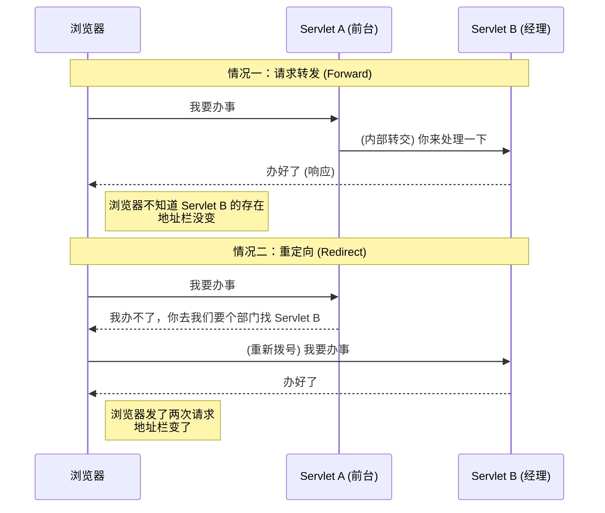

# 3. Request 与 Response 对象详解

!!! quote "本节目标"
    如果把 Servlet 比作餐厅服务员，那么：
    
    * **HttpServletRequest (请求对象)**：就是**用户的点餐单**。用户想要什么（参数）、用户是谁（Header）、从哪来（IP），都在这里。
    * **HttpServletResponse (响应对象)**：就是**服务员的托盘**。你要给用户上什么菜（HTML/JSON）、告诉他多少钱（状态码），都通过它操作。
    
    掌握这两个对象，你就能在浏览器和服务器之间自如地传递数据。

---

## 📨 第一步：Request 对象 (读取请求)

**HttpServletRequest** 封装了浏览器发送给服务器的所有信息。

### 1. 获取请求参数 (核心)
这是最常用的功能。无论前端是 GET 还是 POST 请求，获取参数的方法是一样的。

| 方法名 | 作用 | 示例场景 |
| :--- | :--- | :--- |
| `String getParameter(String name)` | 获取单个值 | 用户名、密码、年龄 |
| `String[] getParameterValues(String name)` | 获取多个值 | 复选框 (爱好: 唱、跳、Rap) |
| `Map<String, String[]> getParameterMap()` | 获取所有参数 | 框架底层自动封装数据时用 |

### 2. 实战代码示例

```java title="RequestDemoServlet.java"
@WebServlet("/request-demo")
public class RequestDemoServlet extends HttpServlet {
    @Override
    protected void doGet(HttpServletRequest req, HttpServletResponse resp) throws IOException {
        // 1. 获取基本信息
        String method = req.getMethod(); // GET
        String uri = req.getRequestURI(); // /request-demo
        
        // 2. 获取请求头 (Header)
        // 场景：判断用户是用电脑还是手机访问
        String userAgent = req.getHeader("User-Agent");
        
        // 3. 获取参数 (Parameter) - 最重要！
        // 假设 URL 是：/request-demo?username=zhangsan&age=18
        String username = req.getParameter("username");
        String ageStr = req.getParameter("age");
        
        System.out.println("用户: " + username + ", 年龄: " + ageStr);
    }
}

```

!!! warning "避坑指南：参数类型转换"
    `getParameter()` 返回的永远是 **String**。
    如果你需要数字，必须自己转换，例如 `Integer.parseInt(ageStr)`。转换前记得**判空**，否则会报空指针异常（NPE）或格式转换异常。

---

## 😵‍💫 第二步：解决中文乱码 (请求篇)


这是新手噩梦 Top 1。当你表单提交中文（如“张三”）时，后台可能打印出 `å¼ ä¸` 这样的乱码。

在获取任何参数**之前**，强制设置字符集。

```java
// ✅ 必须放在 getParameter 之前！
req.setCharacterEncoding("UTF-8");
String username = req.getParameter("username"); // 现在正常了
```

!!! info "Tomcat 版本差异"
    * **Tomcat 8.0 及以上**：GET 请求的乱码已自动解决，只需要处理 POST 请求。
    * **Tomcat 7 及以下**：GET 请求也需要繁琐的手动转码（`new String(s.getBytes("ISO-8859-1"), "UTF-8")`），不过现在很少见到了。

---
## 📤 第三步：Response 对象 (设置响应)

**HttpServletResponse** 用于向浏览器发送数据。

### 1. 常用方法

| 方法 | 作用 |
| --- | --- |
| `PrintWriter getWriter()` | 获取字符输出流（输出 HTML、JSON 文本） |
| `ServletOutputStream getOutputStream()` | 获取字节输出流（下载文件、图片时用） |
| `void setContentType(String type)` | 告诉浏览器怎么解析数据 |

### 2. 实战代码示例

```java title="ResponseDemoServlet.java"
@WebServlet("/response-demo")
public class ResponseDemoServlet extends HttpServlet {
    @Override
    protected void doGet(HttpServletRequest req, HttpServletResponse resp) throws IOException {
        // 1. 设置响应状态码 (可选，默认 200)
        // resp.setStatus(500); // 如果你想模拟报错
        
        // 2. 设置响应头 (Header)
        // 示例：告诉浏览器 2 秒后自动跳转到百度
        resp.setHeader("Refresh", "2;URL=[https://www.baidu.com](https://www.baidu.com)");
        
        // 3. 设置响应内容类型 & 编码 (核心)
        // ⚠️ 必须在 getWriter() 之前设置，否则乱码
        resp.setContentType("text/html;charset=utf-8");
        
        // 4. 获取输出流并写入响应体 (Body)
        PrintWriter out = resp.getWriter();
        out.println("<h1>操作成功！</h1>");
        out.println("<p>2秒后将跳转到百度...</p>");
    }
}

```

### 3. 解决中文乱码 (响应篇)

如果你直接 `out.println("你好");`，浏览器可能会显示乱码。必须在获取流之前设置 Content-Type。

```java
// ✅ 这一句代码解决了两个问题：
// 1. 设置服务器发送的编码为 UTF-8
// 2. 告诉浏览器用 UTF-8 打开
resp.setContentType("text/html;charset=utf-8");

PrintWriter out = resp.getWriter();
out.println("<h1>你好，世界！</h1>");

```

!!! failure "严重错误：流的冲突"
    在一个 Servlet 中，`getWriter()` 和 `getOutputStream()` **只能选一个用**。
    如果你既想输出文本，又想输出文件流，服务器会报错抛出异常。

---

## 🔀 第四步：请求转发 vs 重定向 (面试必考)

这是 Web 开发中最容易混淆的两个概念。

### 1. 核心区别图解



### 2. 对比总结表

| 特性 | 请求转发 (Forward) | 重定向 (Redirect) |
| --- | --- | --- |
| **比喻** | **“借钱”**：A找B借钱，B没有，B找C借到后给A。A不知道钱其实是C的。 | **“指路”**：A找B借钱，B说“我没有，你去找C借”。A得自己再跑一趟找C。 |
| **地址栏** | **不变** (用户不知道内部发生了跳转) | **变化** (变成了新的 URL) |
| **请求次数** | **1 次** | **2 次** |
| **数据共享** | 可以共享 `request` 域中的数据 | **不可以** (因为是全新的请求) |
| **跳转范围** | 只能在**当前项目内部**跳转 | 可以跳转到**外部网站** (如百度) |
| **代码** | `req.getRequestDispatcher("/target").forward(req, resp);` | `resp.sendRedirect("/target");` |

---

## 🧪 第五步：随堂实验 (综合练习)

!!! question "练习：简单的登录逻辑"
    **需求**：

    1.  创建一个 `LoginServlet`。
    2.  接收参数 `username` 和 `password`。
    3.  如果 `username` 是 "admin" 且 `password` 是 "123"：
        * **转发**到 `/home` (模拟首页)，并显示 "欢迎你，管理员"。
    4.  否则：
        * **重定向**到 `/login_fail.html` (模拟错误页)，或直接打印 "登录失败"。

    ```java title="LoginServlet.java 参考代码"
    @WebServlet("/login")
    public class LoginServlet extends HttpServlet {
        protected void doPost(HttpServletRequest req, HttpServletResponse resp) throws ServletException, IOException {
            // 1. 处理乱码
            req.setCharacterEncoding("UTF-8");
            resp.setContentType("text/html;charset=utf-8");
            
            // 2. 获取参数
            String u = req.getParameter("username");
            String p = req.getParameter("password");
            
            // 3. 逻辑判断
            if ("admin".equals(u) && "123".equals(p)) {
                // --- 登录成功：转发 ---
                // 可以在 request 里存个数据带过去
                req.setAttribute("msg", "欢迎尊贵的管理员！");
                // 转发是服务器内部路径，不需要写项目名
                req.getRequestDispatcher("/home").forward(req, resp);
            } else {
                // --- 登录失败：重定向 ---
                // 重定向建议写完整的路径
                resp.sendRedirect("/app/login_fail.html"); 
            }
        }
    }
    ```

---

## 📝 总结

* **Request** 是“输入”，用来拿参数 (`getParameter`)。
* **Response** 是“输出”，用来写页面 (`getWriter`)。
* 遇到中文**乱码**，先检查是否设置了 `setCharacterEncoding` 和 `setContentType`。
* **转发**是内部的事（一次请求），**重定向**是外部的事（两次请求）。

[下一节：会话管理 (Cookie & Session)](04-state-management.md){ .md-button .md-button--primary }


