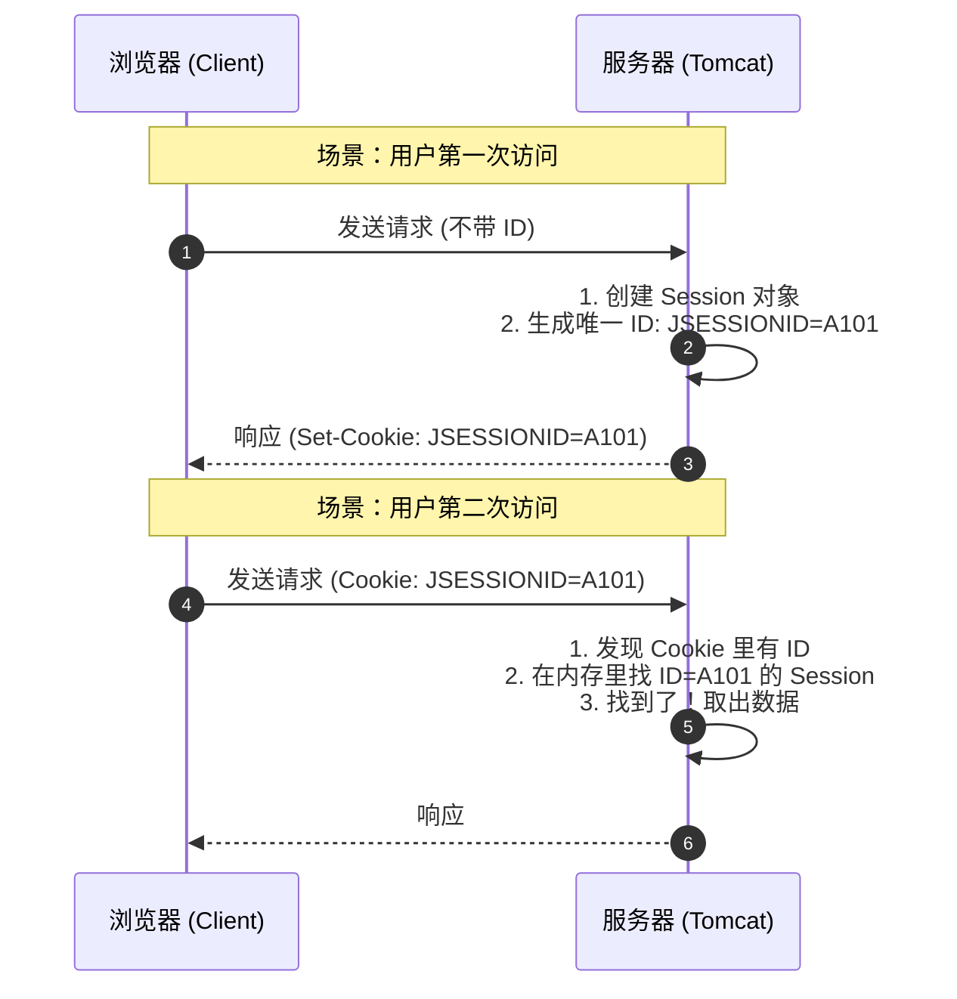

# 4. 会话跟踪技术 (Cookie & Session)

!!! quote "本节目标：让服务器拥有“记忆”"
    **“HTTP 不记得你是谁，但业务必须记得你是谁。”** —— 这就是会话机制存在的根本原因。

    HTTP 协议天生是**“健忘”的（无状态）**。当你登录了淘宝，刷新一下页面，服务器凭什么还能认出“还是你”？
    
    为了解决这个问题，本节我们将学习 Web 开发中的两种核心“记忆术”：
    
    * **Cookie**：把数据存在**用户兜里**（客户端技术）。
    * **Session**：把数据存在**服务器保险箱里**（服务端技术）。

---

## 🤯 第一步：为什么需要会话跟踪？

HTTP 协议是**无状态 (Stateless)** 的。

打个比方：HTTP 服务器就像一个**“失忆的收银员”**。
1.  你买了一瓶水，结账。（请求 A）
2.  你转身又拿了一包薯片，去结账。（请求 B）
3.  收银员会问：“先生您好，请问有会员卡吗？” —— **他完全不记得刚才接待过你！**

为了让服务器“记住”用户（比如保持登录状态、购物车商品），我们需要给每个用户发一个**“信物”**。

---

## 🍪 第二步：Cookie (客户端技术)

**Cookie** 是服务器发送给浏览器的一小段文本信息。浏览器把它存下来，以后每次访问这个服务器，都会自动带上。

### 1. 核心机制
* **颁发**：服务器通过响应头 `Set-Cookie` 给浏览器。
* **携带**：浏览器通过请求头 `Cookie` 把数据带回给服务器。
* **限制**：只能存字符串，大小有限（4KB），且不安全（用户可见）。

### 2. 实战代码：“记住上次访问时间”

```java title="CookieDemoServlet.java"
@WebServlet("/cookie-demo")
public class CookieDemoServlet extends HttpServlet {
    @Override
    protected void doGet(HttpServletRequest req, HttpServletResponse resp) throws IOException {
        resp.setContentType("text/html;charset=utf-8");
        PrintWriter out = resp.getWriter();

        // 1. 获取 Cookie (注意：返回的是数组，可能为 null)
        Cookie[] cookies = req.getCookies();
        boolean found = false;
        
        if (cookies != null) {
            for (Cookie c : cookies) {
                if ("lastTime".equals(c.getName())) {
                    out.write("欢迎回来！您上次访问时间是：" + c.getValue());
                    found = true;
                    break;
                }
            }
        }
        
        if (!found) {
            out.write("您是第一次访问本站！");
        }

        // 2. 发送新 Cookie (记录当前时间)
        // Cookie 值不支持空格和特殊字符，建议用 URLEncoder 编码，这里简单演示用字符串
        String time = String.valueOf(System.currentTimeMillis());
        Cookie cookie = new Cookie("lastTime", time);
        
        // 3. 设置存活时间 (单位：秒)
        // 正数：存活多久；0：立即删除；负数：浏览器关闭即失效
        cookie.setMaxAge(60 * 60 * 24); // 存活 1 天
        
        // 4. 加入响应
        resp.addCookie(cookie);
    }
}

```

!!! warning "Cookie 的坑"
    * `req.getCookies()` 如果没有 Cookie 会返回 `null`，不判空会报 **NullPointerException**。
    * Cookie 只能存 ASCII 字符串，存中文必须先用 `URLEncoder.encode()` 编码。

---

## 🔐 第三步：Session (服务端技术)

**Session** 是 Java Web 提供的**服务端**会话技术。它在服务器内存中为每个用户开辟了一个**独立的储物柜**。

### 1. JSESSIONID 机制 (背诵全文)

用户手里只拿一把**钥匙**（Session ID），具体的数据（如用户对象、购物车）都在服务器的柜子里。



### 2. 实战代码：Session 登录校验

Session 可以存**任意类型**的对象（Object），非常适合存用户信息。

```java title="SessionDemoServlet.java"
@WebServlet("/session-demo")
public class SessionDemoServlet extends HttpServlet {
    @Override
    protected void doGet(HttpServletRequest req, HttpServletResponse resp) throws IOException {
        // 1. 获取 Session
        // true(默认): 没有就创建新的；false: 没有就返回 null
        HttpSession session = req.getSession();
        
        // 2. 存入数据 (相当于把东西锁进柜子)
        session.setAttribute("username", "陈老师");
        session.setAttribute("role", "admin");
        
        // 3. 取出数据 (从柜子里拿东西)
        String user = (String) session.getAttribute("username");
        
        // 4. 销毁 Session (通常用于退出登录)
        // session.invalidate(); 
        
        resp.getWriter().write("Session ID: " + session.getId());
    }
}

```

---

## ⚔️ 第四步：Cookie vs Session 终极对决

| 特性 | Cookie | Session |
| --- | --- | --- |
| **存储位置** | **客户端** (浏览器) | **服务端** (服务器内存) |
| **安全性** | 低 (容易被伪造、截获) | **高** (数据在服务器，客户端只有 ID) |
| **存储容量** | 小 (约 4KB) | 大 (取决于服务器内存) |
| **数据类型** | 只能 String | 任意 Object |
| **对服务器压力** | 无 | 有 (用户多了内存占用大) |
| **典型应用** | “记住我”、购物车(未登录)、广告追踪 | **用户登录状态**、敏感数据 |

!!! tip "比喻记忆法"
    * **Cookie** 就像 **会员卡**：卡上写着你的名字和积分，你自己装着。
    * **Session** 就像 **健身房储物柜**：你只拿一把手牌号 (JSESSIONID)，衣服和手机都锁在健身房里。

---
## 🧪 第五步：随堂实验

!!! question "练习：简单的登录 + 首页验证"
    **需求**：

    1.  **LoginServlet**: 接收用户名。如果登录成功，将用户名存入 Session：
        `session.setAttribute("user", username);`
    2.  **HomeServlet**: 这是一个受保护的页面。
        * 先尝试从 Session 获取 "user"。
        * 如果不为空：显示 "欢迎回来，xxx"。
        * 如果为空（或 Session 不存在）：重定向回登录页，并提示 "请先登录"。

    ---

    > **🤔 思考**：为什么关闭浏览器后再打开，Session 就丢了？
    >
    > (提示：因为存 `JSESSIONID` 的那个 Cookie 默认是会话级的，浏览器一关就没了)。

---

## 📝 总结

* **HTTP 是无状态的**，所以我们需要会话跟踪。
* **Cookie** 数据在客户端，不安全，适合存不重要的小数据。
* **Session** 数据在服务端，安全，依赖 Cookie 传输 JSESSIONID。
* **核心 API**:
    * `req.getCookies()` / `resp.addCookie()`
    * `req.getSession()` / `setAttribute()` / `getAttribute()`

---
[下一节：Filter 过滤器与 Listener 监听器](05-filter-listener.md){ .md-button .md-button--primary }


