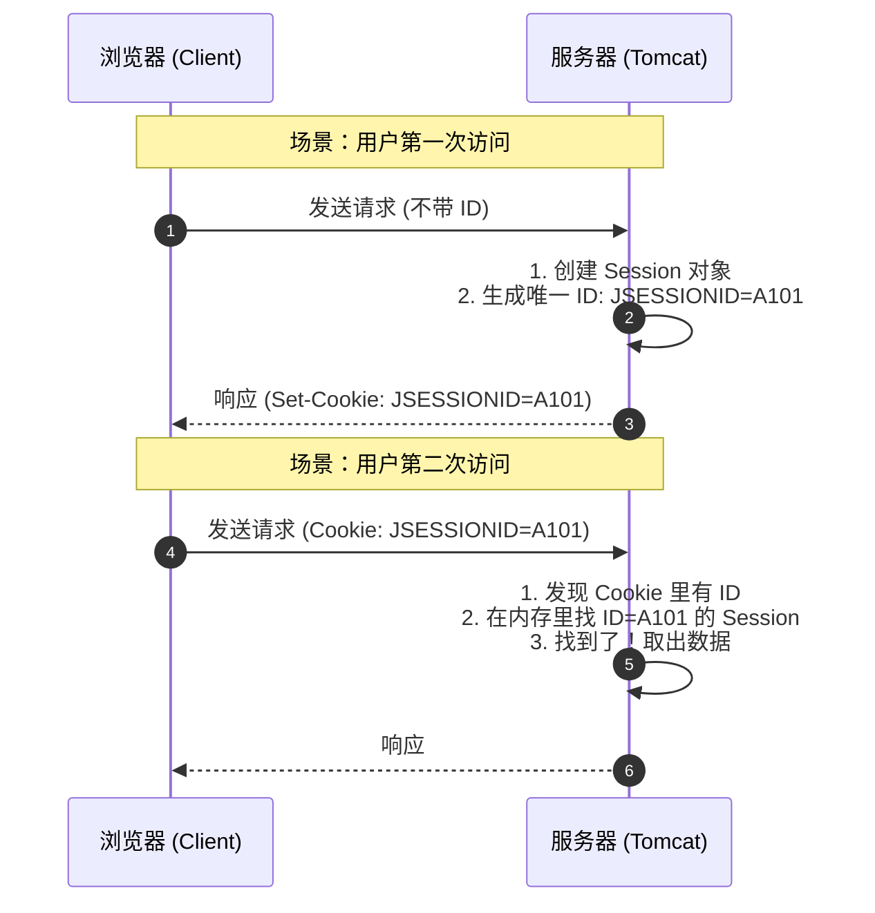

# 会话跟踪与三大作用域

  
!!! quote "本节目标：让数据“活”得久一点"
    **“HTTP 是健忘的，但业务需要记忆。”**
    
    当你刷新页面时，服务器怎么知道“你还是你”？（会话跟踪）
    当你在不同页面跳转时，数据该存在哪里？（作用域）
    
    本节我们将攻克 Web 开发中最核心的**“数据管理”**难题：
    
    1.  **Cookie & Session**：解决“你是谁”的问题（会话跟踪）。
    2.  **三大作用域**：解决“数据存多久”的问题（生命周期管理）。
        * **Request**：一次请求（像**闪现**）。
        * **Session**：一次会话（像**短期租房**）。
        * **ServletContext**：整个应用（像**永久买房**）。

---

## 🤯 第一步：为什么需要会话跟踪？

HTTP 协议是**无状态 (Stateless)** 的。

打个比方：HTTP 服务器就像一个**“失忆的收银员”**。
1.  你买了一瓶水，结账。（请求 A）
2.  你转身又拿了一包薯片，去结账。（请求 B）
3.  收银员会问：“先生您好，请问有会员卡吗？” —— **他完全不记得刚才接待过你！**

为了让服务器“记住”用户（比如保持登录状态、购物车商品），我们需要给每个用户发一个**“信物”**。

---

## 🍪 第二步：Cookie (客户端技术)

**Cookie** 是服务器发送给浏览器的一小段文本信息。浏览器把它存下来，以后每次访问这个服务器，都会自动带上。

### 1. 核心机制
* **颁发**：服务器通过响应头 `Set-Cookie` 给浏览器。
* **携带**：浏览器通过请求头 `Cookie` 把数据带回给服务器。
* **限制**：只能存字符串，大小有限（4KB），且不安全（用户可见）。

### 2. 实战代码：“记住上次访问时间”

```java title="CookieDemoServlet.java"
@WebServlet("/cookie-demo")
public class CookieDemoServlet extends HttpServlet {
    @Override
    protected void doGet(HttpServletRequest req, HttpServletResponse resp) throws IOException {
        resp.setContentType("text/html;charset=utf-8");
        PrintWriter out = resp.getWriter();

        // 1. 获取 Cookie (注意：返回的是数组，可能为 null)
        Cookie[] cookies = req.getCookies();
        boolean found = false;
        
        if (cookies != null) {
            for (Cookie c : cookies) {
                if ("lastTime".equals(c.getName())) {
                    out.write("欢迎回来！您上次访问时间是：" + c.getValue());
                    found = true;
                    break;
                }
            }
        }
        
        if (!found) {
            out.write("您是第一次访问本站！");
        }
       
        // 2. 发送新 Cookie (记录当前时间)
        // ⚠️注意：Cookie 值不支持空格和中文，如果存中文必须使用 URLEncoder.encode("张三", "UTF-8")
        String time = String.valueOf(System.currentTimeMillis());
        Cookie cookie = new Cookie("lastTime", time);
        
        // 3. 设置存活时间 (单位：秒)
        // 正数：存活多久；0：立即删除；负数：浏览器关闭即失效
        cookie.setMaxAge(60 * 60 * 24); // 存活 1 天
        
        // 4. 加入响应
        resp.addCookie(cookie);
    }
}


```

!!! warning "Cookie 的坑"
    * `req.getCookies()` 如果没有 Cookie 会返回 `null`，不判空会报 **NullPointerException**。
    * Cookie 只能存 ASCII 字符串，存中文必须先用 `URLEncoder.encode()` 编码。

---

## 🔐 第三步：Session (服务端技术)

**Session** 是 Java Web 提供的**服务端**会话技术。它在服务器内存中为每个用户开辟了一个**独立的储物柜**。


### 1. 原理图解：钥匙与柜子

用户手里只拿一把**钥匙**（Session ID），具体的数据（如用户对象、购物车）都在服务器的柜子里。




### 2. 实战代码：Session 登录校验

Session 可以存**任意类型**的对象（Object），非常适合存用户信息。

```java title="SessionDemoServlet.java"
@WebServlet("/session-demo")
public class SessionDemoServlet extends HttpServlet {
    @Override
    protected void doGet(HttpServletRequest req, HttpServletResponse resp) throws IOException {
        // 1. 获取 Session
        // true(默认): 没有就创建新的；false: 没有就返回 null
        HttpSession session = req.getSession();
        
        // 2. 存入数据 (相当于把东西锁进柜子)
        session.setAttribute("username", "陈老师");
        session.setAttribute("role", "admin");
        
        // 3. 取出数据 (从柜子里拿东西)
        String user = (String) session.getAttribute("username");
        
        // 4. 销毁 Session (通常用于退出登录)
        // session.invalidate(); 
        
        resp.getWriter().write("Session ID: " + session.getId());
    }
}


```

---

## 🌍 第四步：ServletContext (全局应用域)

如果说 Session 是属于**某个用户**的私有储物柜，那么 **ServletContext** 就是整个大楼的**“公共公告栏”**。

### 1. 核心概念
* **唯一性**：一个 Web 应用（Project）只有一个 ServletContext 对象。
* **共享性**：**所有用户**、**所有 Servlet** 都能访问同一个 ServletContext。
* **生命周期**：最长。服务器启动时创建，服务器关闭时销毁。

### 2. 实战代码：网站访问计数器

由于它是全局共享的，非常适合存放 **“在线人数”**、**“网站总访问量”** 或 **“系统全局配置”**。

```java title="ContextDemoServlet.java"
@WebServlet("/context-demo")
public class ContextDemoServlet extends HttpServlet {
    @Override
    protected void doGet(HttpServletRequest req, HttpServletResponse resp) throws IOException {
        resp.setContentType("text/html;charset=utf-8");
        
        // 1. 获取全局唯一的 ServletContext 对象
        ServletContext context = this.getServletContext();
        // 或者：req.getServletContext();
        
        // 2. 模拟：读取当前的访问量 (如果是第一次，默认为0)
        Integer count = (Integer) context.getAttribute("total_visitors");
        if (count == null) {
            count = 0;
        }
        
        // 3. 访问量 +1
        count++;
        
        // 4. 写回全局域 (所有用户看到的都会变成新的数字)
        context.setAttribute("total_visitors", count);
        
        resp.getWriter().write("你是本站第 " + count + " 位访客！(所有用户共享此数据)");
    }
}

```

!!! warning "线程安全问题"
    因为 ServletContext 是**全局共享**的，当多个用户同时修改同一个属性（如上面的 `count++`）时，会有线程安全问题。在生产环境中，通常配合数据库或 Redis 使用，尽量避免在 Context 中频繁修改可变数据。


## ⚔️ 第五步：Java Web 三大作用域对比

在 Java Web 开发中，我们经常需要在不同的地方“传值”。根据数据存活的时间长短，分为三大作用域对象：

| 作用域 (Scope) | 对应对象 | 存活范围 | 典型应用场景 |
| :--- | :--- | :--- | :--- |
| **请求域 (Request)** | `HttpServletRequest` | **一次请求** (请求转发有效，重定向失效) | 页面间传值 (如 Servlet 查完数据传给 JSP/Thymeleaf 显示) |
| **会话域 (Session)** | `HttpSession` | **一次会话** (浏览器打开到关闭，或超时) | 用户登录状态、购物车、验证码 |
| **应用域 (Application)** | `ServletContext` | **整个应用** (服务器启动到关闭) | 全局配置、统计在线人数、共享字典数据 |

!!! tip "比喻记忆法 (作用域版)"
    * **Request (便签)**：同事间递一张纸条，看完就扔了。（一次性）
    * **Session (储物柜)**：你专用的柜子，存你的私人物品，别人打不开。（私有长效）
    * **ServletContext (公告栏)**：大厅里的黑板，贴个通知，全公司的人都能看到。（全局共享）


---
## 🧪 第六步：随堂实验

!!! question "练习：简单的登录 + 首页验证"
    **需求**：

    1.  **LoginServlet**: 接收用户名。如果登录成功，将用户名存入 Session：
        `session.setAttribute("user", username);`
    2.  **HomeServlet**: 这是一个受保护的页面。
        * 先尝试从 Session 获取 "user"。
        * 如果不为空：显示 "欢迎回来，xxx"。
        * 如果为空（或 Session 不存在）：重定向回登录页，并提示 "请先登录"。

    ---

    > **🤔 思考**：为什么关闭浏览器后再打开，Session 就丢了？
    >
    > (提示：因为存 `JSESSIONID` 的那个 Cookie 默认是会话级的，浏览器一关就没了)。

---
## 📝 总结

* **HTTP 是无状态的**，所以我们需要会话跟踪。
* **Cookie**：数据在客户端，不安全，适合存不重要的小数据。
* **Session**：数据在服务端，安全，依赖 Cookie 传输 JSESSIONID。
* **ServletContext**：数据在服务端，**全局共享**，适合存所有用户公用的数据。
* **核心 API**:
    * `req.getCookies()` / `resp.addCookie()`
    * `req.getSession()` / `session.setAttribute()`
    * `getServletContext()` / `context.setAttribute()`
  


---
[下一节：Filter 过滤器与 Listener 监听器](06-filter-listener.md){ .md-button .md-button--primary }


