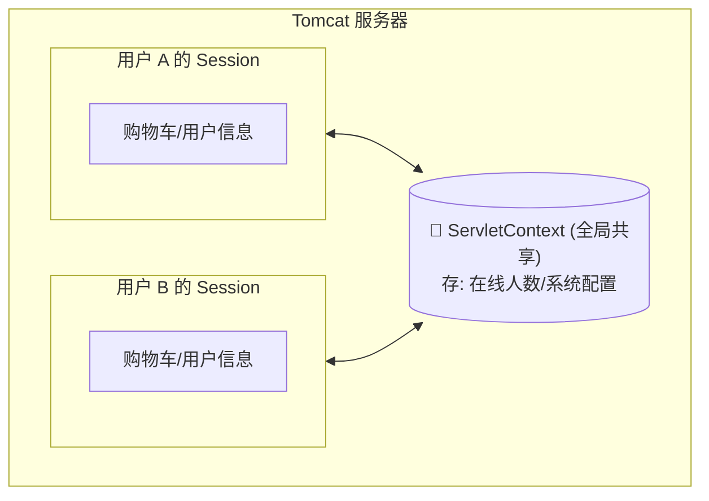
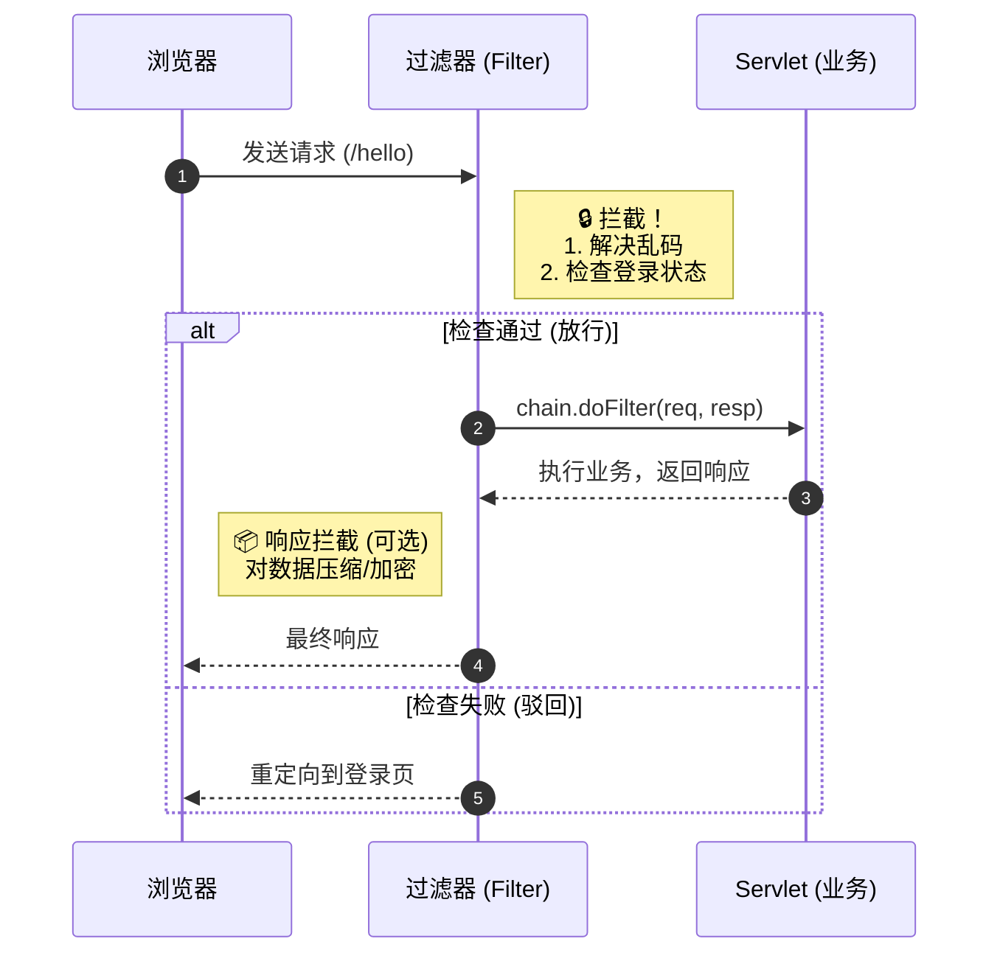

# 5. Web 核心组件：Filter, Listener 与 ServletContext

!!! quote "本节目标"
    写了这么多 Servlet，你是否发现一个烦恼：**每个 `doPost` 第一行都要写 `req.setCharacterEncoding("UTF-8")`？**
    
    如果不小心忘了写，中文就乱码。有没有一种办法能**统一处理**所有请求？
    本节我们将引入 Web 应用的**“安保系统” (Filter)** 和 **“公共公告栏” (ServletContext)**。

---

## 🌐 第一步：ServletContext (全局大管家)

我们之前学的 `HttpServletRequest` 是“一次性的”，`HttpSession` 是“私有的”。
那如果我想统计**“本站总访问次数”**，数据该存哪？存 Session 里肯定不行（张三看不见李四的数据）。

这时就需要 **ServletContext**。

### 1. 核心概念
* **唯一性**：一个 Web 应用只有一个 ServletContext 实例。
* **共享性**：所有用户、所有 Servlet 都能访问它。
* **生命周期**：服务器启动时创建，服务器关闭时销毁（与天地同寿）。

### 2. 作用域对比图



### 3. 实战代码：统计访问量

```java title="GlobalCountServlet.java"
@WebServlet("/count")
public class GlobalCountServlet extends HttpServlet {
    protected void doGet(HttpServletRequest req, HttpServletResponse resp) throws IOException {
        // 1. 获取全局上下文对象
        ServletContext ctx = getServletContext();
        
        // 2. 读取旧值 (注意类型转换，第一次可能是 null)
        Integer count = (Integer) ctx.getAttribute("total_visit");
        if (count == null) {
            count = 0;
        }
        
        // 3. 自增并存回
        count++;
        ctx.setAttribute("total_visit", count);
        
        resp.setContentType("text/html;charset=utf-8");
        resp.getWriter().write("你是本站第 " + count + " 位访客！");
    }
}

```

---

## 🛡️ 第二步：Filter (过滤器)

**Filter** 是 Java Web 中最强大的组件之一。它就像是小区门口的**保安**。
任何请求到达 Servlet 之前，都必须先经过 Filter 的检查。

### 1. 核心工作流程



### 2. 实战场景 A：全站解决中文乱码

再也不用在每个 Servlet 里写 `setCharacterEncoding` 了！

```java title="EncodingFilter.java"
@WebFilter("/*") // "/*" 表示拦截所有请求
public class EncodingFilter implements Filter {
    
    @Override
    public void doFilter(ServletRequest req, ServletResponse resp, FilterChain chain) 
            throws IOException, ServletException {
        
        // --- 1. 请求到达 Servlet 之前执行 ---
        req.setCharacterEncoding("UTF-8");
        resp.setContentType("text/html;charset=UTF-8");
        System.out.println("Filter: 编码已设置，准备放行...");

        // --- 2. 放行 (关键！) ---
        // 如果不写这行，请求就死在这里了，永远到不了 Servlet
        chain.doFilter(req, resp);
        
        // --- 3. Servlet 执行完之后执行 (很少用) ---
        System.out.println("Filter: Servlet 执行完毕，响应已返回。");
    }

    // init() 和 destroy() 是可选的，可以不重写
}

```

!!! warning "千万别忘了放行"
    新手常犯错误：写了 Filter 逻辑，却忘了调用 `chain.doFilter(req, resp)`。  
    **结果**：页面一片空白，Servlet 根本没执行。

---

## 🚧 第三步：实战场景 B - 登录权限拦截

这是 Filter 最经典的用途：**非管理员禁止访问后台**。

**逻辑**：
用户访问 `/admin/*` -> Filter 拦截 -> 检查 Session 有没有 "user" -> 有则放行，无则踢回登录页。

```java title="AdminFilter.java"
// 只拦截 /admin/ 下的所有路径
@WebFilter("/admin/*") 
public class AdminFilter implements Filter {
    @Override
    public void doFilter(ServletRequest request, ServletResponse response, FilterChain chain) 
            throws IOException, ServletException {
        
        // Filter 拿到的参数是父接口 ServletRequest，需要强转成 HttpServletRequest 才能用 Session
        HttpServletRequest req = (HttpServletRequest) request;
        HttpServletResponse resp = (HttpServletResponse) response;

        // 1. 获取 Session 中的用户
        Object user = req.getSession().getAttribute("loginUser");

        // 2. 判断
        if (user != null) {
            // 已登录，放行
            chain.doFilter(req, resp);
        } else {
            // 未登录，重定向到登录页
            // 注意：要加上 ContextPath，或者直接写绝对路径
            resp.sendRedirect(req.getContextPath() + "/login.html");
        }
    }
}

```

---

## 👂 第四步：Listener (监听器) - 简单了解

**Listener** 就像是潜伏在系统里的“间谍”。它不主动干活，而是**监听**某个事件（比如服务器启动、Session 创建），一旦事件发生，它就触发代码。

最常用的是 `ServletContextListener`。

**场景**：Web 项目启动时，自动加载数据库配置，或初始化一些全局数据。

```java title="MyConfigListener.java"
@WebListener
public class MyConfigListener implements ServletContextListener {

    // 服务器启动时执行 (项目的一生只执行一次)
    @Override
    public void contextInitialized(ServletContextEvent sce) {
        System.out.println("✅ 系统启动中... 正在加载数据库配置...");
    }

    // 服务器关闭时执行
    @Override
    public void contextDestroyed(ServletContextEvent sce) {
        System.out.println("❌ 系统正在关闭... 正在释放资源...");
    }
}

```

---

## 🧪 第五步：随堂实验

!!! question "练习：开发一个“敏感词过滤器”"
    **需求**：

    1.  创建一个 Servlet，接收 `content` 参数并直接打印到页面上。
    2.  创建一个 Filter，拦截该 Servlet。
    3.  **功能**：如果参数 `content` 中包含 "笨蛋"、"坏人" 等词汇，不要直接放行，而是输出 "您的评论包含违规内容，已被拦截"。
    4.  如果内容正常，则放行。

    **提示**：
    在 Filter 中可以使用 `req.getParameter("content")` 检查内容。如果不符合要求，直接 `resp.getWriter().write(...)` 并 `return`（不再调用 `chain.doFilter`）。

---

## 📝 总结

| 组件 | 角色 | 核心代码 | 典型用途 |
| :--- | :--- | :--- | :--- |
| **ServletContext** | **公告栏** | `getServletContext().setAttribute()` | 全局共享数据、统计访问量 |
| **Filter** | **保安** | `chain.doFilter(req, resp)` | **解决乱码**、**登录验证**、敏感词过滤 |
| **Listener** | **观察者** | `contextInitialized()` | 项目启动时的初始化工作 |

**至此，Java Web 原生开发的核心三大件（Servlet, Filter, Listener）你已全部掌握！** 接下来，我们将开始接触数据库，让数据持久化。
jdbc-intro.md

[下一节：JDBC 数据库交互基础](jdbc-intro.md){ .md-button .md-button--primary }
