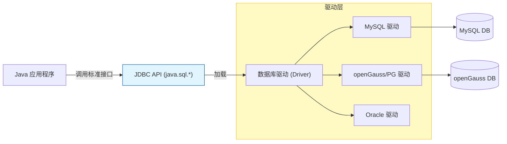
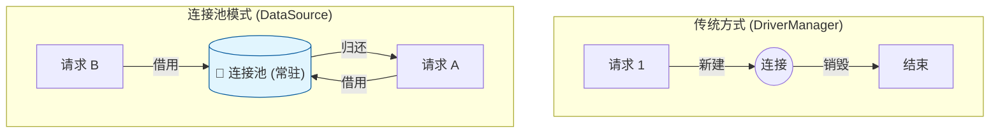

# 数据持久化原理 (JDBC & Druid)

!!! tip "本节目标：从内存到持久化"
    **痛点**：变量存在内存中，重启后数据丢失。  
    **解决**：学习 JDBC 与数据库（openGauss）交互，掌握两大企业级规范：

    1.  **安全 (Security)** —— 杜绝 SQL 注入漏洞。
    2.  **性能 (Performance)** —— 使用 Druid 连接池管理资源。

---

## 🌉 第一部分：JDBC 本质论

我们有各种数据库（MySQL, Oracle, openGauss），底层指令各不相同。Java 制定了一套**标准接口 JDBC (Java Database Connectivity)**，就像“通用遥控器”。

* **Java 程序员**：只按标准按钮（`Connection`, `PreparedStatement`）。
* **数据库厂商**：负责在内部实现电路（**Driver 驱动 Jar 包**）。



### 1. 引入依赖

要实现交互，我们需要引入两个 Jar 包：一个是**数据库驱动**，一个是**连接池**。

```xml title="pom.xml"
<dependencies>
    <dependency>
        <groupId>org.postgresql</groupId>
        <artifactId>postgresql</artifactId>
        <version>42.6.0</version>
    </dependency>
    
    <dependency>
        <groupId>com.alibaba</groupId>
        <artifactId>druid</artifactId>
        <version>1.2.20</version>
    </dependency>
</dependencies>

```

---

## 🔌 第二部分：JDBC 标准五步法 (原生写法)

在学习高级连接池之前，我们先用最原始的 `DriverManager` 体验一次完整的交互。这是所有数据库操作的“内功心法”。

### 1. 核心 API 速查

* `DriverManager`：**老司机**，负责加载驱动，获取连接。
* `Connection`：**电话线**，代表与数据库的连接通道。
* `Statement/PreparedStatement`：**搬运工**，用于发送 SQL 语句。
* `ResultSet`：**结果集**，查询返回的表格数据。

### 2. 原生代码示例 (Hello World)

```java title="JdbcHello.java"
import java.sql.*;

public class JdbcHello {
    public static void main(String[] args) {
        // 数据库配置
        String url = "jdbc:postgresql://localhost:5432/postgres";
        String user = "gaussdb";
        String pwd = "SecretPassword@123";
        
        String sql = "SELECT id, username FROM t_user WHERE id > ?";

        // ✅ 使用 try-with-resources 自动关闭资源
        try (
            // 1. 获取连接 (这一步很耗时，约100ms)
            Connection conn = DriverManager.getConnection(url, user, pwd);
            // 2. 获取预编译语句执行器
            PreparedStatement pstmt = conn.prepareStatement(sql)
        ) {
            // 3. 设置参数 (填空)
            pstmt.setInt(1, 0); 

            // 4. 执行查询
            try (ResultSet rs = pstmt.executeQuery()) {
                // 5. 遍历结果集
                while (rs.next()) {
                    System.out.println("User: " + rs.getString("username"));
                }
            }
        } catch (SQLException e) {
            e.printStackTrace();
        }
    }
}

```

---

## 🛡️ 第三部分：安全核心 (PreparedStatement)

在 JDBC 的操作中，最核心的概念不是如何写代码，而是**Web 安全**。

### 1. 致命错误：拼接 SQL

早期的代码常使用字符串拼接，这会导致 **SQL 注入漏洞**。

```java
// ❌ 危险！黑客输入 "' OR '1'='1" 即可绕过登录
String sql = "SELECT * FROM user WHERE name = '" + inputName + "'";

```

### 2. 正确姿势：预编译 (PreparedStatement)

使用 `?` 作为占位符。数据库会先编译 SQL 骨架，再把参数当作“纯文本”填进去，从而从根源上杜绝注入。

```java
// ✅ 安全！数据库只把 ? 当作文本内容
String sql = "SELECT * FROM user WHERE name = ?";
PreparedStatement pstmt = conn.prepareStatement(sql);
pstmt.setString(1, "张三");

```

---

## 🔋 第四部分：性能核心 (连接池 Druid)

### 1. 为什么要“池化”？

上面的原生写法中，`DriverManager.getConnection` 就像**“打车”**——每次都要呼叫、等待、建立 TCP 握手，用完就断开。这在并发高时会让服务器崩溃。

**连接池 (Connection Pool)** 就像**“公司班车”**：
系统启动时预先创建好（比如 10 个）连接放在池子里。

* **借**：线程需要查库，从池里拿一个。
* **还**：用完**不关闭**，而是放回池里供他人复用。



### 2. 配置 Druid (德鲁伊)

**Druid** 是阿里巴巴开源的数据库连接池，自带强大的监控功能。我们在 `src/main/resources` 下新建配置文件：

```properties title="druid.properties"
# 数据库连接参数
driverClassName=org.postgresql.Driver
url=jdbc:postgresql://localhost:5432/postgres
username=gaussdb
password=SecretPassword@123

# 连接池调优
initialSize=5
maxActive=10
maxWait=3000

```

---

## 🛠️ 第五部分：通用工具类 JDBCUtils

为了避免在每次操作时都写重复代码，我们将 Druid 封装为一个工具类。
**这是本章最重要的代码，请务必掌握。**

```java title="JDBCUtils.java"
import com.alibaba.druid.pool.DruidDataSourceFactory;
import javax.sql.DataSource;
import java.io.InputStream;
import java.sql.*;
import java.util.Properties;

public class JDBCUtils {
    private static DataSource ds;

    // 静态代码块：类加载时初始化连接池
    static {
        try {
            Properties pro = new Properties();
            InputStream is = JDBCUtils.class.getClassLoader().getResourceAsStream("druid.properties");
            pro.load(is);
            ds = DruidDataSourceFactory.createDataSource(pro);
        } catch (Exception e) {
            e.printStackTrace();
            throw new RuntimeException("连接池初始化失败！");
        }
    }

    // 获取连接：从池中拿
    public static Connection getConnection() throws SQLException {
        return ds.getConnection();
    }

    // 获取数据源：供后续框架使用
    public static DataSource getDataSource() {
        return ds;
    }

    // 释放资源：归还连接
    public static void close(ResultSet rs, Statement stmt, Connection conn) {
        if (rs != null) try { rs.close(); } catch (SQLException e) {}
        if (stmt != null) try { stmt.close(); } catch (SQLException e) {}
        if (conn != null) try { 
            conn.close(); // 注意：此处是“归还”给连接池
        } catch (SQLException e) {}
    }
}

```

---

## 🧪 第五步：随堂实验

!!! question "练习：基于 Druid 实现用户登录"
    **任务**：编写 `LoginDao` 类，使用 `JDBCUtils` 验证用户名和密码。

    ```java
    public boolean login(String username, String password) {
        Connection conn = null;
        PreparedStatement pstmt = null;
        ResultSet rs = null;
        
        try {
            // 1. 获取连接 (从 Druid 池中借用)
            conn = JDBCUtils.getConnection();
            
            // 2. 定义 SQL (必须用 ? 占位符防止注入)
            String sql = "SELECT count(*) FROM t_user WHERE username=? AND password=?";
            
            // 3. 获取预编译对象
            pstmt = conn.prepareStatement(sql);
            pstmt.setString(1, username);
            pstmt.setString(2, password);
            
            // 4. 执行查询
            rs = pstmt.executeQuery();
            
            // 5. 判断结果
            if (rs.next()) {
                // 如果 count(*) > 0 则登录成功
                return rs.getInt(1) > 0;
            }
        } catch (SQLException e) {
            e.printStackTrace();
        } finally {
            // 6. 归还连接 (注意：这里不是切断 TCP，而是还回池子)
            JDBCUtils.close(rs, pstmt, conn);
        }
        return false;
    }
    ```

---


## 📝 总结

这一章我们不需要死记硬背 JDBC 的 API，但必须理解以下三点，因为它们是所有 ORM 框架（MyBatis, Hibernate）的基石：

1. **Driver**：是 Java 也就是应用层与数据库的翻译官。
2. **PreparedStatement**：通过预编译解决 SQL 注入安全问题。
3. **DataSource**：通过连接池解决频繁创建连接的性能问题。

**下一步预告**：
虽然 `JDBCUtils` 简化了连接获取，但你也看到了，我们还是要写繁琐的 `try-catch-finally` 和 `set/get` 参数。
在**第 4 章**，我们将引入 **MyBatis**，它将帮我们自动完成这些枯燥的工作，让 Java 开发真正起飞！ 🚀
