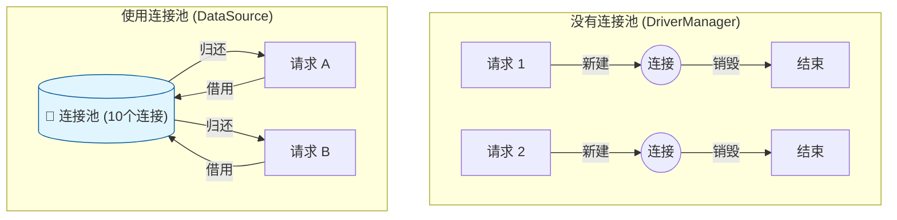

# 8. 数据源与连接池 (DataSource & Druid)

!!! quote "本节目标"
    在上一节中，我们通过 `DriverManager` 获取连接。这种方式就像**“打车”**——每次出门都要临时叫车，等车来，用完就走，效率很低。
    
    在企业级开发中，我们需要**“公司班车”**——车子一直停在楼下（连接池），随用随走，用完归还。
    本节我们将学习 **DataSource（数据源）** 规范和阿里开源的 **Druid（德鲁伊）** 连接池。

---

## 🔋 第一步：为什么需要连接池？

### 1. 传统方式的痛点
每次执行 SQL 时：
1.  **建立连接**：TCP 三次握手 + 数据库验证账号密码（耗时约 100ms+）。
2.  **执行 SQL**：真正的业务耗时（可能只有 10ms）。
3.  **断开连接**：释放资源。

**结论**：大部分时间都浪费在“打电话”上了，而不是“通话”本身。如果有 1000 人并发访问，服务器瞬间就会因为频繁创建连接而崩溃。

### 2. 池化思想 (Pooling)

连接池在系统启动时，预先创建好一堆连接（比如 10 个）放在内存池子里。

* **借**：线程需要查数据库时，从池子里拿一个现成的连接。
* **还**：用完之后，**不关闭连接**，而是把它放回池子里，供下一个人用。



---

## 📜 第二步：标准接口 DataSource

Java 官方制定了标准接口 `javax.sql.DataSource`。
无论底层用的是 Druid、HikariCP 还是 C3P0，它们都实现了这个接口。

我们只需要关注一个方法：

```java
// 从池中获取一个连接
Connection getConnection() throws SQLException;

```

!!! tip "核心概念：逻辑关闭"
    当使用连接池时，调用 `conn.close()` **不再是断开 TCP 连接**，而是**“归还连接到池中”**。这是通过装饰者模式或动态代理实现的。

---

## 🦅 第三步：引入 Druid (德鲁伊)

**Druid** 是阿里巴巴开源的数据库连接池，被誉为“Java 语言中最好的数据库连接池”。它自带强大的监控页面，能让你看到哪些 SQL 执行慢。

### 1. 添加 Maven 依赖

在 `pom.xml` 中加入：

```xml
<dependency>
    <groupId>com.alibaba</groupId>
    <artifactId>druid</artifactId>
    <version>1.2.20</version>
</dependency>

```

### 2. 准备配置文件

在 `src/main/resources` 下新建 `druid.properties`。不要把账号密码写死在 Java 代码里！

```properties title="src/main/resources/druid.properties"
# 数据库连接参数 (适配 openGauss/PostgreSQL)
driverClassName=org.postgresql.Driver
url=jdbc:postgresql://localhost:5432/postgres
username=gaussdb
password=SecretPassword@123

# 连接池配置
initialSize=5
maxActive=10
maxWait=3000

```

---

## 🛠️ 第四步：编写 JDBCUtils 工具类

我们将构建一个通用的工具类，以后所有地方都通过它来拿连接。

```java title="JDBCUtils.java"
import com.alibaba.druid.pool.DruidDataSourceFactory;
import javax.sql.DataSource;
import java.io.InputStream;
import java.sql.Connection;
import java.sql.ResultSet;
import java.sql.SQLException;
import java.sql.Statement;
import java.util.Properties;

public class JDBCUtils {
    // 1. 定义成员变量 DataSource，整个项目只有这一个池子
    private static DataSource ds;

    // 2. 静态代码块：类加载时执行，只执行一次
    static {
        try {
            // 加载配置文件
            Properties pro = new Properties();
            InputStream is = JDBCUtils.class.getClassLoader().getResourceAsStream("druid.properties");
            pro.load(is);
            
            // 使用工厂模式创建连接池
            ds = DruidDataSourceFactory.createDataSource(pro);
            
        } catch (Exception e) {
            e.printStackTrace();
            throw new RuntimeException("连接池初始化失败！");
        }
    }

    // 3. 获取连接的方法
    public static Connection getConnection() throws SQLException {
        return ds.getConnection();
    }

    // 4. 获取连接池对象的方法 (后面学 SpringJdbcTemplate 会用到)
    public static DataSource getDataSource() {
        return ds;
    }

    // 5. 释放资源 (归还连接)
    public static void close(ResultSet rs, Statement stmt, Connection conn) {
        if (rs != null) {
            try { rs.close(); } catch (SQLException e) { e.printStackTrace(); }
        }
        if (stmt != null) {
            try { stmt.close(); } catch (SQLException e) { e.printStackTrace(); }
        }
        if (conn != null) {
            try { 
                conn.close(); // ⚠️注意：这里是归还，不是断开
            } catch (SQLException e) { e.printStackTrace(); }
        }
    }
}

```

---

## 🧪 第五步：随堂实验

!!! question "练习：使用 Druid 改造登录功能"
    **需求**：

    1.  复制上一节的 `LoginDao`。
    2.  修改其中的 `login` 方法。
    3.  **不再使用** `DriverManager.getConnection(...)`。
    4.  **改为使用** `JDBCUtils.getConnection()`。
    5.  运行测试，观察控制台日志（Druid 初始化时通常会打印 Logo）。

    **代码片段对比**：

    ```java
    // ❌ 以前的写法
    // conn = DriverManager.getConnection(url, user, pwd);

    // ✅ 现在的写法 (清爽！)
    conn = JDBCUtils.getConnection();
    ```

---

## 📝 总结

| 概念 | 说明 |
| :--- | :--- |
| **DataSource** | Java 标准的数据源接口，规范了获取连接的方式。 |
| **Druid** | 阿里开源的连接池实现，性能强，监控全。 |
| **连接池原理** | **复用连接**，避免频繁创建销毁，极大提升性能。 |
| **最佳实践** | 使用 `JDBCUtils` 封装，配合 `druid.properties` 配置文件。 |

**预告**：
虽然 JDBC 已经封装了连接，但每次都要写 `try-catch`、`PreparedStatement`、`ResultSet` 遍历封装对象，代码还是太啰嗦了！

第四章，我们将学习 **MyBatis** 框架，看看它如何帮我们自动“映射”结果集，真正解放双手。

[MyBatis 入门与配置](../chapter04/01-mybatis-intro.md){ .md-button .md-button--primary }

