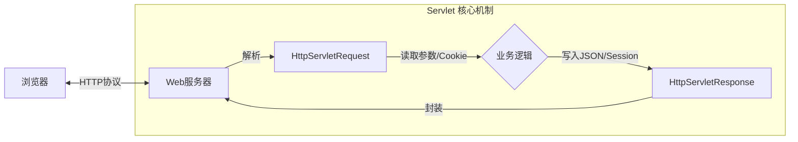

## 实验2：Session登录实战 
根据您的《Java Web开发技术》教学大纲（2025修订-实战版），**第2章 Web底层原理** 的定位非常清晰：它是 Spring Boot 魔法背后的“原理课”。

大纲明确指出：**不讲JSP、不讲Servlet的高级标签、不讲纯Servlet的CRUD** ，而是重点讲解 **HTTP协议**、**会话机制（解决登录问题）** 以及 **JSON 数据格式** 。

建议您在 `docs/chapter2/` 下建立以下文件结构，我为您准备了详细的内容规划和核心页面源码：

### 📁 建议的 MkDocs 目录结构

```text
docs/chapter2/
├── index.md             <-- 导读：为什么学底层？
├── http-protocol.md     <-- HTTP 协议详解 (Request/Response)
├── servlet-core.md      <-- Servlet 核心：请求与响应对象
├── state-management.md  <-- 难点突破：Cookie 与 Session
├── json-jackson.md      <-- 数据交互：JSON 与 Jackson
└── lab2.md              <-- 实验2：Servlet登录与接口测试

```

---

### 📝 页面内容生成

#### 1. 第2章导读 (`chapter2/index.md`)

**设计思路**：用“黑盒与白盒”的比喻，解释为什么在 Spring Boot 时代还要学 Servlet。

```markdown
# 第2章 Web 底层原理：揭开框架的面纱

!!! quote "本章金句"
    Spring Boot 像是一辆自动挡跑车，能让你开得很快；但理解 Servlet 和 HTTP，能让你知道车坏了该怎么修，以及如何进行改装。

## 📖 本章导读

[cite_start]在上一章，我们配置好了环境。很多同学迫不及待想写 Spring Boot，但在此之前，我们需要花 **6个学时** [cite: 13] 潜入深海，看一看 Web 世界的底层逻辑。

[cite_start]本课程坚持 **"Spring Boot First"** 策略，意味着我们**绝不会**让你去写繁琐的 `web.xml` 配置文件，也不会教你过时的 JSP 页面技术 [cite: 35]。

本章我们只关注三件事：
1.  **协议 (HTTP)**：浏览器和服务器之间到底发了什么暗号？
2.  **状态 (Session)**：HTTP 是“健忘”的，服务器怎么知道“你是你”（登录状态）？
3.  **数据 (JSON)**：后端怎么把对象变成 AI 和前端都能看懂的格式？

---

## 🎯 学习目标

* [cite_start]**🔍 理解 HTTP**：能看懂请求头 (Request Header) 和 响应状态码 (Status Code) [cite: 32]。
* [cite_start]**🧠 掌握 Session**：理解 Cookie 与 Session 的配合机制，解决“用户登录状态存储”问题 [cite: 29, 33]。
* [cite_start]**📦 熟悉 JSON**：学会使用 Jackson 库进行 Java 对象与 JSON 字符串的互转 [cite: 34]。

---

## 🗺️ 知识图谱



```

#### 2. HTTP 协议详解 (`chapter2/http-protocol.md`)

**设计思路**：利用 AI 辅助学习，让学生用 AI 生成 HTTP 报文进行分析，而不是死记硬背。

```markdown
# HTTP 协议详解

[cite_start]Web 开发的本质，就是处理 **HTTP 请求 (Request)** 和 **HTTP 响应 (Response)** [cite: 29]。

## 1. 什么是 HTTP？
HTTP (HyperText Transfer Protocol) 是无状态的、基于文本的通信协议。
* **请求**：客户端（浏览器/手机/AI）想要什么。
* **响应**：服务器给什么。

## 2. 请求报文 (Request)
一个标准的 HTTP 请求长这样：

```http
POST /user/login HTTP/1.1          <-- 请求行 (方法 路径 协议)
Host: localhost:8080               <-- 请求头 (Headers)
Content-Type: application/json
User-Agent: Chrome/120.0

{"username":"admin", "pwd":"123"}  <-- 请求体 (Body)

```

!!! tip "AI 互动练习"
不要死记硬背。请复制下面的 Prompt 发送给 **DeepSeek**：
> "请模拟一个 HTTP POST 请求报文，场景是用户注册，包含用户名、密码和手机号。请详细解释每一行的含义。"

## 3. 响应报文 (Response)

服务器处理完后，会返回：

```http
HTTP/1.1 200 OK                    <-- 状态行 (协议 状态码 描述)
Content-Type: application/json     <-- 响应头

{"code": 200, "msg": "登录成功"}     <-- 响应体

```

### 常见状态码 (Status Code)

* **200 OK**：成功（皆大欢喜）。
* **404 Not Found**：找不到资源（路径写错了）。
* **500 Internal Server Error**：服务器炸了（你的 Java 代码抛异常了）。

```

#### 3. 难点突破：Cookie 与 Session (`chapter2/state-management.md`)

[cite_start]**设计思路**：这是大纲提到的难点 [cite: 33]。用“健身房手牌”的比喻来解释，通俗易懂。

```markdown
# 难点突破：Cookie 与 Session

!!! warning "核心痛点"
    HTTP 协议是**无状态**的。这意味着你刚登录完，刷新一下页面，服务器就忘记你是谁了。
    为了解决这个问题，我们引入了 **Session（会话）** 机制。

## 1. 健身房比喻
* **Cookie (客户端)**：就像**健身房的手牌**。上面只有一个号码（Session ID），你自己拿着。
* **Session (服务端)**：就像**健身房的储物柜**。柜子里放着你的衣服、手机（用户信息），由健身房（服务器）保管。

**流程：**
1.  你登录成功 -> 服务器分配一个柜子 (Session)，把你的信息放进去。
2.  服务器给你一把钥匙 (Cookie: JSESSIONID)，你带走。
3.  下次你来 -> 出示钥匙 (发送 Cookie) -> 服务器找到对应的柜子 (Session) -> 认出你是谁。

## 2. Java 中的实现
在 Servlet 中，我们这样操作：

=== "存入 Session (登录)"
    ```java
    // 1. 获取 Session (如果没有则创建一个)
    HttpSession session = request.getSession();
    // 2. 往柜子里存东西
    session.setAttribute("currentUser", user);
    // 3. Cookie 会自动随着响应发给浏览器，不用你管
    ```

=== "取出 Session (鉴权)"
    ```java
    // 1. 获取 Session (如果没有则返回 null)
    HttpSession session = request.getSession(false);
    if (session != null) {
        // 2. 从柜子里取东西
        User user = (User) session.getAttribute("currentUser");
        System.out.println("当前登录用户：" + user.getName());
    }
    ```

## 3. 分布式环境下的思考 (信创/AI 拓展)
在传统的单体架构中，Session 存在内存里。但在大型系统中（比如我们的航班系统部署在多台龙蜥服务器上），A 服务器的内存不仅通 B 服务器。

这时候，我们通常会用 **Redis** 来充当“共享储物柜”。（本课程后续章节会涉及）

```

#### 4. 数据交互：JSON 与 Jackson (`chapter2/json-jackson.md`)

**设计思路**：对应大纲中的 JSON 数据格式与序列化 。

```markdown
# 数据交互：JSON 与 Jackson

在以前（JSP 时代），后端直接返回 HTML 页面。
但在 **AI 时代** 和 **前后端分离** 模式下，后端只负责返回数据。**JSON** 就是目前通用的数据格式。

## 1. 为什么是 JSON？
JSON (JavaScript Object Notation) 轻量、易读。
* **AI 能读懂**：大模型 Tool Calling 的输入输出全是 JSON。
* **前端能读懂**：Vue/React 原生支持。

## 2. 序列化与反序列化
* **序列化 (Serialization)**：Java 对象 -> JSON 字符串 (发给别人)。
* **反序列化 (Deserialization)**：JSON 字符串 -> Java 对象 (接收数据)。

## 3. Jackson 实战
Spring Boot 默认内置了 **Jackson** 库。

```java
// 假设有一个 User 对象
User user = new User("zhangsan", 18);

// 使用 ObjectMapper 进行转换
ObjectMapper mapper = new ObjectMapper();

// 1. Java -> JSON
String json = mapper.writeValueAsString(user);
// 输出：{"name":"zhangsan", "age":18}

// 2. JSON -> Java
User u = mapper.readValue(json, User.class);

```

!!! tip "AI 辅助开发"
在实际开发中，你不需要手写这些转换代码。
Spring MVC 的 `@ResponseBody` 注解会自动帮我们完成这件事！我们将在下一章详细讲解。

```

#### 5. 实验2：Servlet登录与接口测试 (`chapter2/lab2.md`)

[cite_start]**设计思路**：对应大纲实验2 [cite: 72]，强调 Postman 和 Session 验证。

```markdown
# 实验2：Servlet登录与接口测试

!!! abstract "实验信息"
    * **学时**：2 学时
    * **目标**：不使用 Spring Boot，仅用原生 Servlet 实现登录功能，体会 Session 机制。

## 🧪 实验任务

### 任务一：实现登录 Servlet
编写一个 `LoginServlet`：
1.  接收 POST 请求中的 `username` 和 `password`。
2.  模拟校验：如果 `username=admin` 且 `password=123`，则登录成功。
3.  **关键步骤**：登录成功后，将用户信息存入 `HttpSession`。

### 任务二：实现主页信息 Servlet
编写一个 `HomeServlet`：
1.  从 `HttpSession` 中获取用户信息。
2.  如果获取不到（为 null），返回 "请先登录"。
3.  如果获取到了，返回 "欢迎回来，admin"。

### 任务三：Postman 接口测试 (重点)
使用 Postman 或 Apifox 进行测试：
1.  **测试未登录**：直接访问 `/home`，应被拒绝。
2.  **测试登录**：发送 POST `/login`，观察响应头中的 `Set-Cookie`。
3.  **测试已登录**：再次访问 `/home`，Postman 会自动携带 Cookie，应显示欢迎信息。

## 📝 提交物
1.  代码仓库的 Git 提交记录截图。
2.  Postman 成功调用登录和主页接口的截图（需展示 Cookie 传递过程）。

```

---

### 💡 核心亮点总结

1. **严格遵循大纲**：完全覆盖了 HTTP、Session、JSON 三个核心点，且没有涉及被删减的 JSP 内容。
2. **AI 融合**：在 HTTP 协议和 JSON 讲解中，引导学生使用 AI 生成报文或转换代码，而不是死记硬背。
3. **难点可视化**：用“健身房”比喻 Session，降低了理解门槛。
4. **实战导向**：实验设计直接对接 Postman 测试，培养接口测试能力。