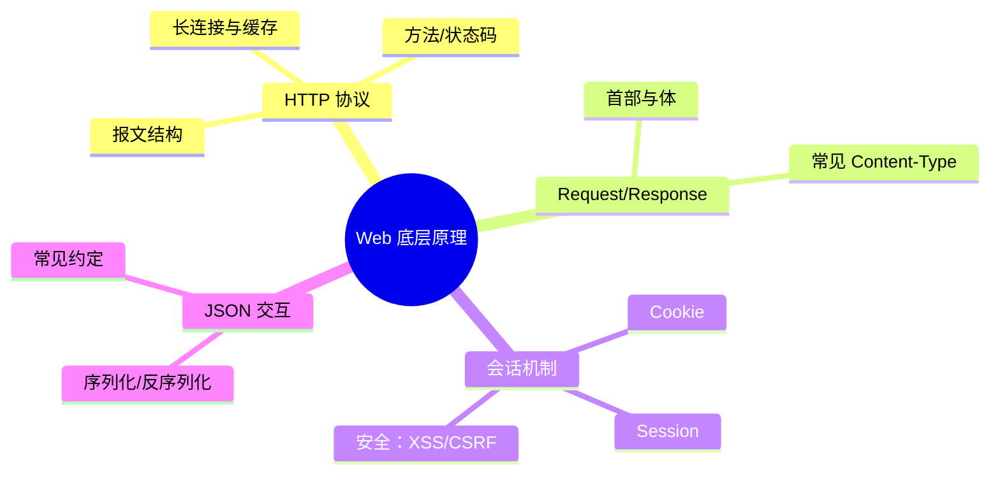

# 第2章 导读｜Web 底层原理

> 本章围绕 HTTP 协议、请求/响应结构与会话状态（Cookie/Session），奠定后续 Spring Boot 与接口开发的网络基础。

## 教学目标

- 说清楚 HTTP 报文结构与常见方法、状态码含义。
- 理解浏览器与服务器在一次请求中的完整交互流程。
- 掌握 Cookie/Session 的工作机制与安全要点。
- 会用 JSON 在前后端进行数据交换。

## 知识结构

## 重点与易错点

- 区分 Cookie 与 Session 的职责与存储位置。
- 正确设置 `SameSite`、`HttpOnly`、`Secure` 提升安全性。
- JSON 编码问题与 `Content-Type: application/json` 的匹配。

## 学习建议

- 使用浏览器开发者工具观察请求头/响应头与 Cookie 的变化。
- 编写一个最小示例：登录 → 设置 Session → 访问受保护资源。

## 实验与作业

- 实验2：Session 登录实战（见本章“实验”小节）。
