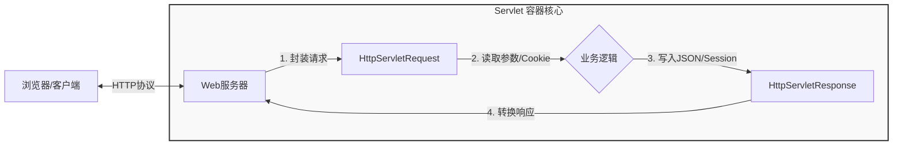

# 第2章 Web 底层原理：揭开框架的面纱

!!! quote "本章金句"
    Spring Boot 像是一辆自动挡跑车，能让你开得很快；但理解 Servlet 和 HTTP，能让你知道车坏了该怎么修，以及如何进行改装。

## 📖 本章导读

在上一章，我们配置好了高效的开发环境。很多同学迫不及待想直接上手 Spring Boot 写业务，但在此之前，我们需要花 **6个学时** 潜入深海，看一看 Web 世界的底层逻辑。

根据课程 **"Spring Boot First"** 的策略，意味着我们**绝不会**让你去写繁琐的 `web.xml` 配置文件，也不会教你过时的 JSP 页面技术。

我们只关注那些 **“即便用了 Spring Boot 也绕不开”** 的核心原理：
1.  **协议 (HTTP)**：浏览器和服务器之间到底发了什么暗号？
2.  **状态 (Session)**：HTTP 是“健忘”的，服务器怎么知道“你是你”（登录状态）？
3.  **数据 (JSON)**：后端怎么把对象变成 AI 和前端都能看懂的格式？

---

## ❓ 为什么要学底层？

你可能会问：“老师，Spring Boot 不是已经帮我们封装好了吗？为什么还要学 Servlet？”

理由有三点：

1.  **调试的根本**：当你遇到 `404 Not Found` 或者 `500 Internal Server Error` 时，如果你不懂 HTTP 状态码，不懂请求路径映射，你将无从下手。
2.  **框架的基石**：Spring MVC 的 `DispatcherServlet` 本质上就是一个 Servlet。理解了 Servlet 的生命周期（初始化 -> 服务 -> 销毁），你才能理解 Spring Bean 的生命周期。
3.  **安全的防线**：后续课程中的“拦截器（Interceptor）”和“过滤器（Filter）”都是基于 Servlet 规范的。不懂 Session 和 Cookie，你就写不出安全的登录功能。

---

## 🎯 学习目标

通过本章学习，你需要达成以下目标：

* **🔍 理解 HTTP 协议**：能看懂请求头 (Request Header) 和 响应状态码 (Status Code)，理解 GET 与 POST 的区别。
* **🧠 掌握 Session 机制**：理解 Cookie 与 Session 的配合机制，解决 B/S 架构下的“用户登录状态存储”难题。
* **⚙️ 熟悉 Servlet 核心**：掌握 `HttpServletRequest`（读取请求）和 `HttpServletResponse`（写入响应）的基本用法。
* **📦 认识 JSON**：学会使用 Jackson 库进行 Java 对象与 JSON 字符串的互转，为后续的前后端分离打基础。

---

## 🚫 本章“三不讲”

为了给实战腾出时间，根据大纲安排，以下内容我们**不讲**（因为它们真的过时了）：

* ❌ **不讲 JSP**：现代开发都用 Vue/React 或直接调 API。
* ❌ **不讲复杂的 web.xml**：现在是全注解时代。
* ❌ **不讲纯 Servlet 的 CRUD**：写 JDBC 太痛苦，我们在第4章直接上 MyBatis。

---

## 🗺️ 核心流程图谱

一次简单的 Web 请求，底层到底发生了什么？

👇 **准备好了吗？让我们先来破解 HTTP 协议的密码。**

[深入 HTTP 协议详解](http-protocol.md){ .md-button .md-button--primary }
