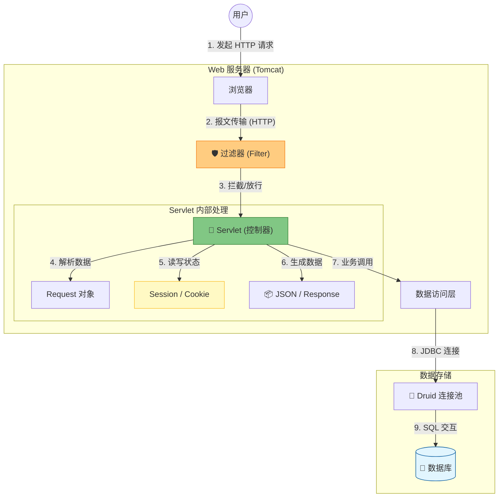

# 第二章：Java Web 核心原理 (Servlet & JDBC)

!!! quote "本章导读：揭开 Spring Boot 的面纱"
    在第一章中，我们搭建好了开发环境。现在，我们将进入 Web 开发的**“深水区”**。
    
    你可能会问：*“现在都用 Spring Boot 了，为什么还要学 Servlet 和 JDBC？”*
    
    答案很简单：**万变不离其宗**。Spring Boot 的底层依然是 Servlet，MyBatis 的底层依然是 JDBC。
    本章我们将**抛开所有高级框架**，用最原生的 Java API 手写一个具备**登录、认证、数据交互**功能的 Web 系统。只有懂了底层，未来遇到 Bug 你才知道去哪里修。

---

## 🗺️ 学习路线图：请求的“奇幻漂流”

本章的七节课，实际上是讲述了一个 **HTTP 请求** 从离开浏览器，到进入数据库，最后返回浏览器的完整旅程。

---

## 📚 课程目录与核心知识点

本章内容环环相扣，建议按顺序学习：

### **第一阶段：通信与控制 (Web 基础)**

* **[01. HTTP 协议与开发者工具](01-http-protocol.md)**
* **核心**：读懂请求头/响应头，学会用 F12 "抓包"。
* **工具**：Chrome DevTools。

* **[02. Servlet 起步与生命周期](02-servlet-basics.md)**
* **核心**：编写第一个 Hello World，理解 `init`、`service`、`destroy` 三部曲。
* **重点**：Servlet 是单例的（线程不安全）。

* **[03. Request 与 Response 对象详解](03-request-response.md)**
* **核心**：如何拿参数？如何解决乱码？如何跳转页面？
* **难点**：请求转发 (Forward) vs 重定向 (Redirect) 的区别。

### **第二阶段：数据与交互 (前后端分离铺垫)**

* **[04. 数据桥梁：JSON 与前后端交互](04-json-interaction.md)**
* **核心**：后端不再返回 HTML，而是返回 JSON 数据。
* **工具**：Jackson 注解 (`@JsonProperty`, `@JsonFormat`)。

* **[05. 会话跟踪与三大作用域](05-state-management.md)**
* **核心**：解决 HTTP "健忘"的问题。
* **对比**：Cookie (客户端) vs Session (服务端)。

### **第三阶段：全局管控与持久化 (系统成型)**

* **[06. 过滤器与监听器 (Filter & Listener)](06-filter-listener.md)**
* **核心**：AOP 思想的雏形。统一处理乱码、登录拦截、CORS 跨域。

* **[07. 数据持久化原理 (JDBC & Druid)](07-jdbc-core.md)**
* **核心**：从内存数据走向磁盘存储。
* **规范**：防止 SQL 注入 (`PreparedStatement`)，使用连接池 (`Druid`) 提升性能。

---

## 💻 本章终极实战 (Lab)

纸上得来终觉浅。本章**只有一个**综合性的大实验，它是对本章所有知识点的**“大阅兵”**。

* **[👉 实验 2：核心组件与持久化综合实战](lab2.md)**
* **任务目标**：抛弃内存模拟，直接连接 **MySQL** 数据库。
* **综合技能**：你需要将 **Servlet** (接收参数)、**JDBC** (查询数据)、**Session** (保持登录)、**Filter** (权限拦截) 像乐高积木一样组装起来，构建一个真正能跑的**“用户登录与后台管理系统”**。

> *注：请确保你已在第一章完成了环境配置实验（Lab 1），否则本实验无法进行。*

---

## 🚀 准备好了吗？

在开始之前，请确保你已经安装好了 **JDK 17**、**Maven**、**IDEA** 以及 **MySQL** 数据库。

让我们从 Web 世界的通用语言——HTTP 协议开始吧！

[开始第一节：HTTP 协议详解](01-http-protocol.md){ .md-button .md-button--primary .md-button--block }

