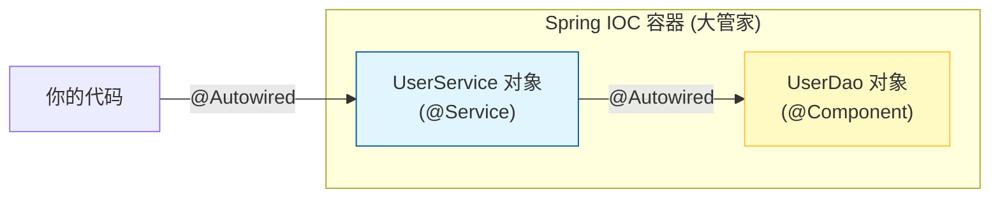

# 1. 框架革命：Spring Boot 快速入门

!!! quote "本节目标"
    在第二章，我们像“原始人”一样，徒手搓出了 Servlet、配置了 Tomcat、手动管理了 JDBC 连接。
    
    虽然原理懂了，但你一定想吐槽：**“配置太麻烦了！代码太啰嗦了！”**
    
    欢迎来到 **Spring Boot** 的时代。如果说 Servlet 是**手工刀耕火种**，那么 Spring Boot 就是**全自动流水线**。本节我们将体验“开箱即用”的快乐，并接触 Spring 的灵魂思想——**IOC (控制反转)**。

---

## 🤯 第一步：为什么是 Spring Boot？

### 1. 传统开发的痛点 (Servlet/SSM)

* 😫 **配置地狱**：`web.xml` 写错一行，服务器就启动不了。
* 😫 **依赖冲突**：Jar 包版本打架，`ClassNotFoundException` 让你怀疑人生。
* 😫 **部署繁琐**：必须安装 Tomcat，把 war 包扔进去才能跑。

### 2. Spring Boot 的魔法
Spring Boot 不是一门新技术，它是一个**“脚手架”**，旨在**简化 Spring 应用的初始搭建和开发过程**。

* **自动配置 (Auto Configuration)**：不需要写 XML，它根据你引入的 Jar 包自动配置好 Bean。
* **起步依赖 (Starters)**：一个 `spring-boot-starter-web` 就把 Tomcat、Jackson、Spring MVC 全带进来了。
* **内嵌容器**：自带 Tomcat，直接运行 `main` 方法就能启动服务器。

---

## 🚀 第二步：Hello Spring Boot

让我们在 1 分钟内创建一个 Web 服务器。

### 1. 使用 Spring Initializr 创建项目
打开 IDEA，选择 **New Project** -> **Spring Boot** (或访问 [start.spring.io](https://start.spring.io)):

* **Name**: `demo-boot`
* **Language**: `Java`
* **Type**: `Maven`
* **Java**: `17`
* **Dependencies (重点)**: 勾选 **Spring Web** 和 **Lombok**。

### 2. 核心文件解密

=== "pom.xml (依赖管理)"
    
    ```xml
    <parent>
        <groupId>org.springframework.boot</groupId>
        <artifactId>spring-boot-starter-parent</artifactId>
        <version>3.5.9</version>
    </parent>

    <dependencies>
        <dependency>
            <groupId>org.springframework.boot</groupId>
            <artifactId>spring-boot-starter-web</artifactId>
        </dependency>
    </dependencies>
    ```

=== "Application.java (启动类)"

    ```java
    // 标注这是一个 Spring Boot 应用
    @SpringBootApplication
    public class DemoBootApplication {
        public static void main(String[] args) {
            // 一键启动内置 Tomcat
            SpringApplication.run(DemoBootApplication.class, args);
        }
    }
    ```

### 3. 写个接口试试
新建 `HelloController.java`：

```java
@RestController // 复合注解：等于 @Controller + @ResponseBody
public class HelloController {

    @GetMapping("/hello")
    public String sayHi() {
        return "Hello Spring Boot! 🚀";
    }
}

```

运行 `main` 方法，访问 `http://localhost:8080/hello`。**没有 web.xml，没有 Tomcat 配置，一切就是这么简单！**

---

## 🧠 第三步：核心思想 - IOC 与 DI

Spring 的核心不是代码，而是思想。最著名的就是 **IOC (Inversion of Control，控制反转)**。

### 1. 什么是控制反转？

* **传统方式 (主动)**：
我要吃饭，必须**自己买菜、自己做**。
`UserDao dao = new UserDao(); // 我自己创建对象`
* **IOC 方式 (被动)**：
我要吃饭，直接**告诉管家**（Spring 容器），管家做好后**端给我**。
`@Autowired private UserDao dao; // Spring 帮我创建并注入`

**控制权**从“程序员手动 new”**反转**到了“Spring 容器自动管理”。

### 2. 核心注解实战

* **`@Component`** (或 `@Service`, `@Controller`): **贴标签**。告诉 Spring：“这个类归你管，请把它加入 IOC 容器（Bean）”。
* **`@Autowired`**: **伸手要**。告诉 Spring：“我这里需要一个对象，请从容器里拿一个给我”。



### 3. 代码对比

=== "❌ 以前的写法 (耦合)"
    ```java
    public class UserService {
        // 必须手动 new，如果 UserDao 改名了，这里也要改
        private UserDao userDao = new UserDao();

        public void login() {
            userDao.query();
        }
    }
    ```

=== "✅ Spring 写法 (解耦)"
    ```java
    @Service // 1. 注册：我是服务层 Bean
    public class UserService {

        @Autowired // 2. 注入：自动把 UserDao 对象给我也
        private UserDao userDao;

        public void login() {
            userDao.query();
        }
    }
    ```

---

## 🤖 第四步：AI 辅助学习

IOC 的概念比较抽象，可以让 AI 给你举个生动的例子。

!!! question "让 AI 解释 IOC"
    **Prompt**:
    > “我是 Java 初学者，请用‘去餐厅点餐’或者‘乐高积木’的比喻，通俗易懂地解释 Spring 的 IOC（控制反转）和 DI（依赖注入）是什么？并给出一段对比代码。”

!!! question "让 AI 写代码"
    **Prompt**:
    > “请基于 Spring Boot 写一个简单的 Service 和 Controller。需求：Controller 调用 Service 的 `sayHello()` 方法。请展示如何使用 @Service 和 @Autowired 注解。”

---

## 📝 总结

* **Spring Boot** 是 Spring 的“自动挡”，通过 **Starter** 和 **自动配置** 解决了依赖和配置痛点。
* **IOC (控制反转)**：对象不由我们 `new`，而是交给 **Spring 容器** 管理。
* **DI (依赖注入)**：通过 `@Autowired` 自动获取容器中的对象。
* **核心注解**：
    * `@SpringBootApplication`: 启动类。
    * `@RestController`: 声明接口控制器。
    * `@Component` / `@Service`: 注册 Bean。
    * `@Autowired`: 注入 Bean。


**下一步**：
虽然我们已经成功启动了 Spring Boot，也体验了 `@Autowired` 的便利，但你心中一定有两个巨大的问号：
**Spring 容器到底长什么样？它是怎么神奇地把对象“变”出来的？**

下一节，我们将深入 Spring 的“灵魂”，揭开 **IOC 容器** 与 **依赖注入 (DI)** 的神秘面纱，真正读懂“控制反转”。

[下一节：核心原理：IOC 容器与依赖注入 (DI)](02-ioc-di.md){ .md-button .md-button--primary }