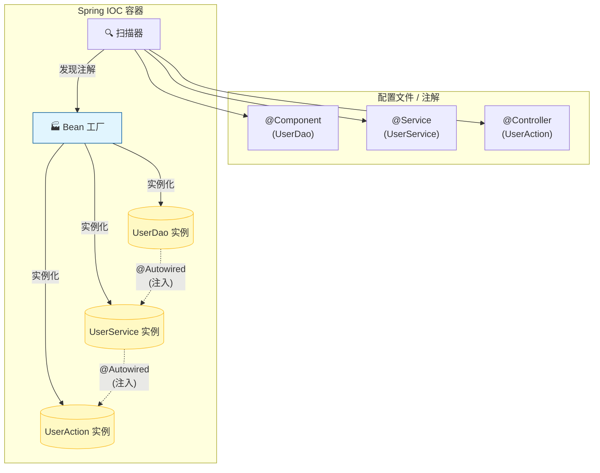

# 2. 核心原理：IOC 容器与依赖注入 (DI)

!!! quote "本节目标"
    在上一节，我们已经见识了 `@Autowired` 的魔法：不需要 `new`，对象自己就来了。  
    但这背后到底发生了什么？

    * **谁**创建了这些对象？
    * **谁**把它们塞进变量里的？
    * **为什么**这种“饭来张口”的模式被称为**控制反转**？
    
    本节我们将深入 Spring 的“灵魂”——**IOC 容器**，彻底理解这个改变了 Java 开发历史的设计模式。

---

## 🤯 第一步：通俗理解 IOC 与 DI

别被这些高大上的名词吓跑。我们用生活中的例子来还原它们的本质。

### 1. 什么是 IOC (Inversion of Control 控制反转)？

* **传统模式 (正向控制)**：
    你要租房，你必须**亲自**去满大街找房源、联系房东、签合同。
    > **代码体现**：`House house = new House();` （你亲自管理资源的创建）

* **IOC 模式 (反向控制)**：
    你把需求告诉**中介**（Spring 容器），中介手里握着成千上万套房源（Bean）。当你需要时，中介直接把钥匙**给**你。
    > **代码体现**：`@Autowired private House house;` （资源的创建权交给了中介）

**核心变化**：控制权从 **“程序员手动 new”** 反转到了 **“Spring 容器自动管理”**。

### 2. 什么是 DI (Dependency Injection 依赖注入)？

**IOC 是思想，DI 是实现手段。**

如果说 IOC 是“我想要个对象”，那么 DI 就是“容器把对象**塞**到你手里的过程”。
就像你给电脑插 USB 鼠标：

* 你的电脑（主程序）预留了一个 USB 接口（变量）。
* 你把鼠标（对象）**注入**（插）进去，电脑就能用了。

---

## 📦 第二步：Spring 容器 (The Container)

在 Spring 的世界里，有一个超级大管家，我们称之为 **ApplicationContext (应用上下文)**，俗称 **Spring 容器**。

它的工作流程如下：



1. **扫描 (Scan)**：Spring 启动时，会扫描包下所有带“标签”的类。
2. **注册 (Register)**：把这些类实例化，并起个名字（Bean ID），存到容器的大池子里。
3. **注入 (Inject)**：发现某个 Bean 里写了 `@Autowired`，就从池子里找对应的对象塞进去。

---

## 🏷️ 第三步：核心注解详解 (魔法咒语)

要让 Spring 帮你干活，你得学会用“标签”指挥它。

### 1. 注册 Bean 的注解 (贴标签)

告诉 Spring：“这个类归你管”。

| 注解 | 含义 | 适用层级 |
| --- | --- | --- |
| **`@Component`** | **通用组件** | 任何类都可以用，万能标签。 |
| **`@Repository`** | **持久层** (Dao) | 专门用于数据库操作类，自带异常翻译功能。 |
| **`@Service`** | **业务层** (Service) | 专门用于业务逻辑类。 |
| **`@RestController`** | **表现层** (Web) | 专门用于 Web 接口，含 `@ResponseBody`。 |
| `@Configuration` | **配置类** | 用于替代 XML 配置文件。 |

!!! tip "为什么不全用 @Component？"
    虽然功能上它们差不多，但为了**代码可读性**，请严格按照分层使用。

    * 看到 `@Service` 就知道这里面是业务逻辑。
    * 看到 `@Repository` 就知道这里面是 SQL 操作。

### 2. 注入 Bean 的注解 (伸手要)

告诉 Spring：“给我一个对象”。

* **`@Autowired`** (推荐)：Spring 官方注解。默认按**类型 (Type)** 找，如果找不到或找到多个会报错。
* **`@Resource`** (JDK 标准)：Java 标准注解。默认按**名称 (Name)** 找。

---

## 💻 第四步：实战演练 - 面向接口编程

在企业开发中，我们通常遵循 **“接口 + 实现类”** 的规范，这能体现 IOC 的最大优势：**解耦**。

### 1. 定义接口

```java
public interface PaymentService {
    void pay(double money);
}

```

### 2. 编写实现类 (多态)

假设我们有两种支付方式，我们都交给 Spring 管理。

```java
@Service("alipay") // 给 Bean 起个名字叫 alipay
public class AlipayServiceImpl implements PaymentService {
    @Override
    public void pay(double money) {
        System.out.println("支付宝到账：" + money);
    }
}

@Service("wechat") // 给 Bean 起个名字叫 wechat
public class WechatServiceImpl implements PaymentService {
    @Override
    public void pay(double money) {
        System.out.println("微信支付成功：" + money);
    }
}

```

### 3. 在 Controller 中注入

注意：我们注入的是**接口** `PaymentService`，而不是具体的实现类。

```java
@RestController
public class PayController {

    // ⚡️ 挑战：容器里有两个 PaymentService (支付宝/微信)，Spring 该给哪一个？
    // 答案：如果不指定，Spring 会懵圈，报错 "NoUniqueBeanDefinitionException"
    
    @Autowired
    @Qualifier("alipay") // 💡 指定 Bean 的名字，精准注入支付宝
    private PaymentService paymentService;

    @GetMapping("/pay")
    public String pay() {
        paymentService.pay(100.0);
        return "支付完成";
    }
}

```

!!! success "解耦的魅力"
    如果你想把支付方式换成微信，只需要改动 `@Qualifier("wechat")` 这一行代码。
    你的业务逻辑代码（`pay` 方法内部）完全不需要修改！这就是**低耦合**。

---

## 🧐 第五步：构造器注入 (进阶写法)

虽然 `@Autowired` 写在变量上（字段注入）最简单，但 IDEA 经常会报黄色的警告。
Spring 官方更推荐 **构造器注入**。

### ❌ 字段注入 (Field Injection)

```java
@Service
public class UserService {
    @Autowired
    private UserDao userDao; // 简单，但容易导致空指针，且不利于单元测试
}

```

### ✅ 构造器注入 (Constructor Injection)

结合 Lombok 的 `@RequiredArgsConstructor`，可以写出极其优雅的代码：

```java
@Service
@RequiredArgsConstructor // Lombok 会自动生成包含 final 字段的构造方法
public class UserService {

    // 声明为 final，保证不可变
    private final UserDao userDao; 
    
    // Spring 4.3+ 特性：如果类只有一个构造方法，Spring 会自动把参数注入进去
    // 不需要写 @Autowired
}

```

---

## 📝 总结

1.  **IOC (控制反转)**：把创建对象的权利交给 Spring 容器。
2.  **DI (依赖注入)**：Spring 容器把创建好的对象赋值给你的变量。
3.  **开发三部曲**：
    * **定义**：写好类。
    * **注册**：加上 `@Service`, `@Component` 等注解。
    * **注入**：使用 `@Autowired` (或构造器) 引用它。

**下一步**：
现在我们已经掌握了 Spring 的“内功心法”，是时候去练“外功招式”了。
如何设计一个**符合大厂规范**的 HTTP 接口？如何处理 URL 中的参数？
下一节，我们将学习 **RESTful 接口设计规范**。

[下一节：接口规范：RESTful 风格与统一响应](03-restful-api.md){ .md-button .md-button--primary }
