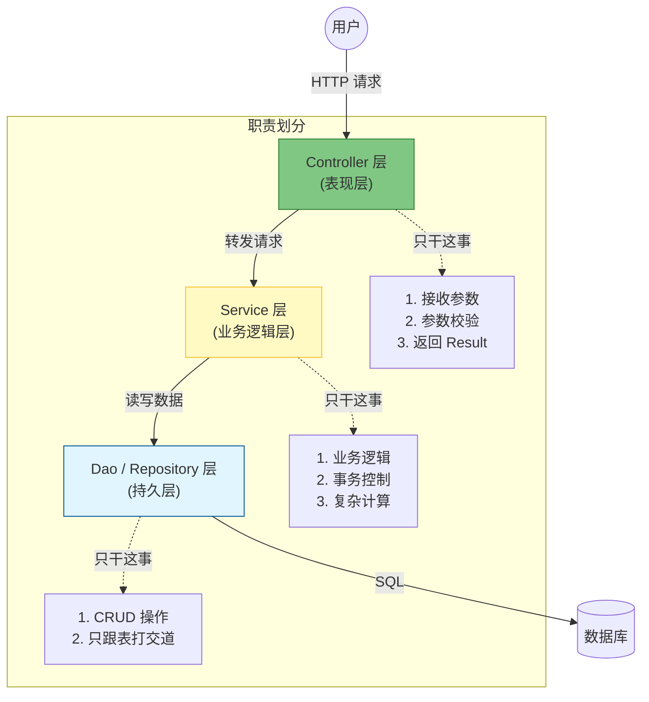

# 4. 架构设计：分层解耦 (Controller-Service-Dao)

!!! quote "本节目标"
    在之前的代码中，我们把接收参数、业务逻辑、数据库查询全写在了一个类里。这种代码被称为**“面条代码” (Spaghetti Code)**——纠缠不清，难以维护。
    
    本节我们将学习企业级开发必须遵守的**“三层架构”**，并引入 **Lombok** 插件，让你的代码像大厂工程师一样整洁、优雅。

---

## 🏗️ 第一步：为什么要分层？

想象一家正规的餐厅：
* **前台 (Controller)**：只负责接待客人、记下菜单、收钱。**不负责炒菜！**
* **厨师 (Service)**：只负责根据菜单炒菜。**不负责接待客人！**
* **采购 (Dao)**：只负责去仓库拿菜。**不负责炒菜！**

如果你让前台一边接待，一边炒菜，一边去仓库搬货，这家餐厅早就倒闭了。软件开发也是同理。

### 标准的三层架构



---

## 🔨 第二步：神器 Lombok 登场

在写分层代码前，我们先解决一个痛点：**Java Bean 太啰嗦了！**
写一个 `Student` 类，要写一堆 `get`, `set`, `toString`, `hashCode`... 看着就烦。

**Lombok** 是一个编译时插件，它能通过注解自动生成这些“样板代码”。

### 1. 引入依赖

在 `pom.xml` 中（如果使用了 Spring Initializr，通常已内置）：

```xml
<dependency>
    <groupId>org.projectlombok</groupId>
    <artifactId>lombok</artifactId>
    <optional>true</optional>
</dependency>

```
### 2. 常用注解速查

| 注解 | 作用 | 替代了什么？ |
| :--- | :--- | :--- |
| **`@Data`** | **最常用** | `@Getter` + `@Setter` + `@ToString` + `@EqualsAndHashCode` |
| `@Slf4j` | 日志记录 | 自动生成 `log` 对象，不再需要 `LoggerFactory.getLogger(...)` |
| `@NoArgsConstructor` | 无参构造 | `public User() {}` |
| `@AllArgsConstructor` | 全参构造 | `public User(String name, int age) {...}` |
| `@Builder` | 链式调用 | `User.builder().name("张三").age(18).build()` |

**代码对比：**

=== "❌ 使用前 (臃肿)"
    ```java
    public class User {
        private String name;
        private Integer age;
        
        // 此处省略 50 行 getter/setter/toString...
        public String getName() { return name; }
        public void setName(String name) { this.name = name; }
        // ...
    }
    ```

=== "✅ 使用后 (清爽)"
    ```java
    @Data // 一键生成所有方法
    @AllArgsConstructor
    @NoArgsConstructor
    public class User {
        private String name;
        private Integer age;
    }
    ```

---

## 💻 第三步：实战重构 (Refactoring)

让我们把上一节那个“野路子”代码重构成标准的三层架构。

### 1. Dao 层 (持久层)

使用 `@Repository` 注解。负责数据的模拟存储。

```java
@Repository // 告诉 Spring：我是管数据的
public class UserDao {
    // 模拟数据库
    public String getUserName(Integer id) {
        // 假装查了数据库
        return id == 1 ? "张三" : "李四";
    }
}

```

### 2. Service 层 (业务层)

使用 `@Service` 注解。负责核心逻辑（比如判断用户是否存在）。

```java
@Service // 告诉 Spring：我是管业务的
public class UserService {

    @Autowired // 注入 Dao
    private UserDao userDao;

    public String findUser(Integer id) {
        // 可以在这里写业务逻辑，比如：
        if (id < 0) {
            throw new RuntimeException("ID 不能为负数");
        }
        // 调用 Dao 查数据
        return userDao.getUserName(id);
    }
}

```

### 3. Controller 层 (表现层)

使用 `@RestController` 注解。只负责收发信件。

```java
@RestController
@RequestMapping("/users")
public class UserController {

    @Autowired // 注入 Service (注意：不要直接注入 Dao！)
    private UserService userService;

    @GetMapping("/{id}")
    public Result<String> getUser(@PathVariable Integer id) {
        // 1. 调用业务层
        String name = userService.findUser(id);
        
        // 2. 包装统一响应
        return Result.success(name);
    }
}

```

!!! success "层级依赖原则"
    **Controller -> Service -> Dao -> DB**

    * 严禁越级访问：Controller 不准直接调用 Dao！
    * 严禁反向依赖：Dao 不准调用 Service！

---

## 🤖 第四步：AI 辅助重构

当你面对一堆老旧的“面条代码”时，可以让 AI 帮你拆分。

!!! question "让 AI 帮你分层"
    **Prompt**:
    > "我有一段 Java 代码，所有的逻辑都写在了一个 Controller 方法里（包含 SQL 查询和业务判断）。  
    > 请帮我按照 **Controller-Service-Dao** 三层架构进行重构。  
    > 1. 抽取出 Dao 层，使用 `@Repository`。  
    > 2. 抽取出 Service 层，使用 `@Service`。  
    > 3. 修改 Controller，使用 `@Autowired` 注入 Service。  
    >   
    > [粘贴你的烂代码...]"

---

## 📝 总结

1. **分层架构**：各司其职。Controller 负责接待，Service 负责业务，Dao 负责数据。
2. **Lombok**：使用 `@Data` 和 `@Slf4j` 告别样板代码，提升开发效率。
3. **依赖原则**：上层依赖下层，严禁越级和反向调用。

**下一步**：
现在的系统虽然结构清晰了，但如果 Service 层抛出了异常（比如 `ID不能为负数`），前端会收到什么？  
很可能是一个 500 错误页和满屏的报错信息！这太不友好了。  
下一节，我们将学习 **全局异常处理**，给系统装上“安全气囊”。  

[下一节：全局兜底：异常处理与 AOP 简介](05-exception-aop.md){ .md-button .md-button--primary }
