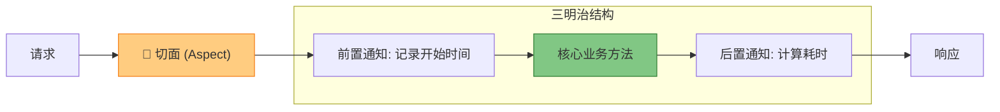

# 5. 全局兜底：异常处理与 AOP 简介

!!! quote "本节目标"
    在之前的代码中，如果代码报错（比如除以零、空指针），浏览器会直接展示一个丑陋的 500 错误页，甚至把报错堆栈打印出来。这不仅**体验极差**，还可能**泄露系统机密**。
    
    本节我们将给系统装上**“安全气囊” (全局异常处理)**，并接触 Spring 最神奇的黑科技——**AOP (面向切面编程)**，让你的代码真正具备企业级水准。

---

## 🛡️ 第一步：拒绝“裸奔”——全局异常处理

### 1. 痛点分析
想象一下，你的 Service 层代码写了 `throw new RuntimeException("余额不足")`。
如果没有全局处理，前端收到的将是：

=== "❌ 惨不忍睹的默认响应"
    ```json
    {
      "timestamp": "2025-12-23T10:00:00",
      "status": 500,
      "error": "Internal Server Error",
      "trace": "java.lang.RuntimeException: 余额不足 at com.example...",
      "path": "/pay"
    }
    ```

前端想要的是统一的 `Result` 格式，比如 `{code: 500, msg: "余额不足"}`。

### 2. 核心注解：`@RestControllerAdvice`
Spring Boot 提供了一个“超级拦截器”，它可以捕获所有 Controller 抛出的异常。

* **`@RestControllerAdvice`**: 声明这是一个全局异常处理类。
* **`@ExceptionHandler`**: 声明具体要捕获哪一种异常。

### 3. 实战代码

新建 `common/GlobalExceptionHandler.java`：

```java
@RestControllerAdvice // 1. 我是全局异常管家
@Slf4j
public class GlobalExceptionHandler {

    // 场景 A：捕获我们自定义的业务异常 (如：余额不足、用户不存在)
    @ExceptionHandler(BusinessException.class)
    public Result<Void> handleBusinessException(BusinessException e) {
        log.warn("业务异常：{}", e.getMessage());
        // 返回我们约定的 Result 格式
        return Result.error(e.getMessage());
    }

    // 场景 B：捕获所有未知的系统异常 (如：空指针、数据库连不上)
    // 相当于 try-catch 中的 catch(Exception e)
    @ExceptionHandler(Exception.class)
    public Result<Void> handleSystemException(Exception e) {
        log.error("系统严重错误：", e); // 务必打印堆栈，方便排查
        return Result.error("系统繁忙，请稍后再试");
    }
}

```

!!! success "效果立竿见影"
    现在，无论你在 Service 层哪里抛出异常，前端收到的永远是整齐划一的 JSON。哪怕发生了空指针，用户也只会看到“系统繁忙”，而不是可怕的代码堆栈。

---

## 🔧 第二步：自定义异常 (BusinessException)

Java 自带的 `RuntimeException` 太笼统了。在企业开发中，我们通常会定义自己的异常类。

```java
@Data
// 继承 RuntimeException，这样在代码中抛出时不需要写 try-catch
public class BusinessException extends RuntimeException {
    
    private Integer code;

    public BusinessException(String msg) {
        super(msg);
        this.code = 500;
    }
    
    public BusinessException(Integer code, String msg) {
        super(msg);
        this.code = code;
    }
}

```

**使用方式：**

```java
if (user == null) {
    // 抛出异常，剩下的交给 GlobalExceptionHandler
    throw new BusinessException("用户不存在"); 
}

```

---

## 🕸️ 第三步：魔法切面——AOP 简介

### 1. 什么是 AOP (Aspect Oriented Programming)？

如果说 OOP (面向对象) 是把代码封装成一个个**“积木”**，那么 AOP 就是一把**“切刀”**，把积木横向切开，往里面塞东西。

**经典场景**：你需要统计所有接口的执行耗时。

* **笨办法**：在每个方法的开头写 `long start = ...`，结尾写 `long end = ...`。
* **AOP 办法**：定义一个“切面”，告诉 Spring：“在运行所有 Controller 方法之前记录时间，运行完之后计算时长”。

### 2. AOP 核心概念图解



### 3. 实战：接口耗时统计

引入依赖：

```xml
<dependency>
    <groupId>org.springframework.boot</groupId>
    <artifactId>spring-boot-starter-aop</artifactId>
</dependency>

```

编写切面类 `LogAspect.java`：

```java
@Aspect // 1. 声明我是切面
@Component // 2. 交给 Spring 管理
@Slf4j
public class LogAspect {

    // 定义切点：拦截 com.example.controller 包下的所有方法
    @Around("execution(* com.example.controller.*.*(..))")
    public Object recordTime(ProceedingJoinPoint joinPoint) throws Throwable {
        
        // --- 方法执行前 ---
        long start = System.currentTimeMillis();
        String methodName = joinPoint.getSignature().getName();
        
        // 执行真正的目标方法
        Object result = joinPoint.proceed();
        
        // --- 方法执行后 ---
        long end = System.currentTimeMillis();
        log.info("接口 [{}] 耗时：{} ms", methodName, (end - start));
        
        return result;
    }
}

```

!!! info "AOP vs Filter"
    你可能会问：这跟我们之前学的 Filter 有什么区别？

    * **Filter (过滤器)**：基于 Servlet 规范，只能拦截 HTTP 请求，不知道是哪个 Java 方法在处理。
    * **AOP (切面)**：基于 Spring 框架，能精确拦截到**具体的 Java 方法**，甚至能拿到方法的参数和返回值。

---

## 🤖 第四步：AI 辅助开发

AOP 的切点表达式（`execution(* ...)`）非常难记，这时候 AI 就派上用场了。

!!! question "让 AI 写切面"
    **Prompt**:
    > "我正在使用 Spring Boot。请帮我写一个 AOP 切面。
    > 需求：拦截所有标注了自定义注解 `@Log` 的方法，打印方法的入参（args）和返回值。
    > 请提供完整的切面类代码和自定义注解代码。"

!!! question "让 AI 写异常处理"
    **Prompt**:
    > "请帮我生成一个 Spring Boot 的全局异常处理类。要求能够分别捕获 `NullPointerException`、`ArithmeticException` 和自定义的 `BusinessException`，并返回统一的 JSON 格式。"

---

## 📝 总结

恭喜你！到这里，你已经掌握了 Spring Boot 开发最核心的 **“三板斧”**：

1. **IOC & DI**：让对象自动管理，实现解耦。
2. **RESTful & 分层**：规范接口设计，代码各司其职。
3. **Exception & AOP**：全局兜底与横向增强，提升系统健壮性。

至此，**理论部分课程已全部结束**。
你现在已经具备了开发一个完整后端系统的能力。接下来，我们将通过一个**综合实战实验**，将这几章学到的所有知识串联起来。

[👉 实验 3：构建标准化的 RESTful 后端系统](lab3.md){ .md-button .md-button--primary .md-button--block }