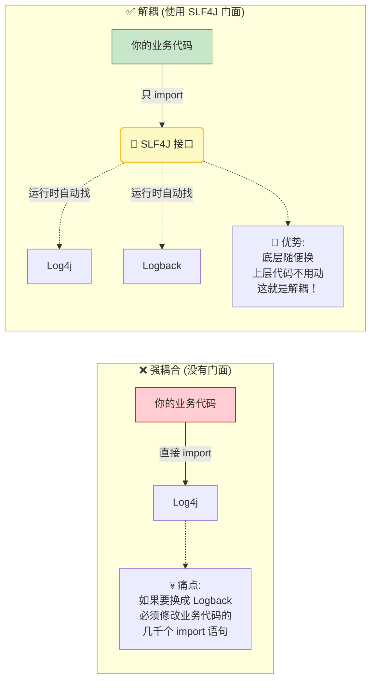

# 06. 生产级基石：单元测试与日志管理

!!! quote "🎯 本节目标：告别“野路子”开发"
    你是否还在用 `System.out.println` 调试代码？
    你是否每次修改代码后，都要手动启动项目、打开浏览器、点击按钮才能验证对错？

    本节我们将掌握两项区分**“业余”**与**“专业”**的关键技能：

    * 🪵 **日志系统 (Logging)**：程序的“黑匣子”，生产环境排错的唯一依靠。
    * 🧪 **单元测试 (JUnit)**：程序的“安检员”，一键自动化验证逻辑，让你放心重构。


## 🪵 第一部分：日志系统 (Logging)

在 Java Web 开发中，**严禁使用 `System.out.println**`。
因为它有两个致命缺点：

1. **性能差**：频繁的 IO 操作会拖慢服务器。
2. **不可控**：无法开关，上线后控制台满屏垃圾信息，掩盖了真正的报错。

### 1. 核心概念：门面模式 (Facade Pattern)

Spring Boot 默认使用 **SLF4J** 作为日志门面，**Logback** 作为具体实现。很多同学不理解为什么要搞两个东西，这里涉及到一个经典的设计模式——**门面模式**。

!!! info "通俗理解：门面模式 (Facade)"
    想象你去一家大公司办事：

    * **没有门面（惨痛经历）**：你需要分别跑去财务部盖章、去行政部签字、去后勤部拿钥匙。你需要认识所有部门的人，累个半死。
    * **有门面（轻松体验）**：你只找**前台接待员 (SLF4J)**。你对她说“我要办入职”，她负责去后台联系财务、行政、后勤 (Logback/Log4j) 帮你搞定一切。

    **好处**：你只需要和“接待员”打交道。即使后台的财务换人了（切换日志框架），你也不需要知道，你的代码完全不用改。这也是**“解耦”**的核心体现。

**技术映射**：

* **Client (你的代码)**：只调用 `org.slf4j.Logger`。
* **Facade (SLF4J)**：前台接待员，负责“转发”请求，屏蔽底层复杂性。
* **Subsystem (Logback)**：真正干活的苦力，负责把日志写进文件。

**一句话总结**：**“有事找管家，别来烦我。”**

### 2. 图解：为什么要解耦？

我们来看一下，如果没有 SLF4J 这个“门面”，当你想从 Log4j 切换到 Logback 时会发生什么？



### 3. 日志级别 (Level)

日志是有优先级的，从低到高依次为：

| 级别 | 说明 | 适用场景 |
| --- | --- | --- |
| **TRACE** | 追踪 | 极详细的流水账（通常不用）。 |
| **DEBUG** | 调试 | 开发时的关键变量、流程判断（生产环境通常关闭）。 |
| **INFO** | 信息 | **(默认)** 系统启动、关键业务完成（如“用户A登录成功”）。 |
| **WARN** | 警告 | 潜在问题，但不影响运行（如“磁盘空间不足80%”）。 |
| **ERROR** | 错误 | 发生异常，业务中断（如“数据库连接失败”）。 |

### 4. 实战：使用 Lombok 的 @Slf4j

得益于 Lombok，我们不需要手动创建 Logger 对象，只需一个注解。

```java title="UserService.java"
@Service
@Slf4j // 1. 自动注入 log 对象 (相当于雇佣了接待员)
public class UserService {

    public void processOrder(String orderId) {
        // 2. 使用占位符 {}，比字符串拼接性能更好
        log.info("开始处理订单，订单号：{}", orderId);

        try {
            // 模拟业务
            if ("error".equals(orderId)) {
                throw new RuntimeException("库存不足");
            }
            log.debug("订单 {} 校验通过...", orderId);
            
        } catch (Exception e) {
            // 3. 记录异常堆栈信息 (ERROR级别)
            log.error("订单处理失败，原因：", e);
        }
    }
}

```

### 5. 配置日志 (application.properties)

```properties title="application.properties"
# 1. 设置全局日志级别 (默认 INFO)
logging.level.root=INFO

# 2. 单独设置 Dao 层的级别 (DEBUG 级别可以看到 SQL 语句)
logging.level.com.example.usermanager.dao=DEBUG

# 3. 日志文件输出路径 (会自动创建文件)
logging.file.name=logs/app.log

# 4. (可选) 自定义控制台输出格式
logging.pattern.console=%d{yyyy-MM-dd HH:mm:ss} [%thread] %-5level %logger{36} - %msg%n

```

---

## 🧪 第二部分：单元测试 (JUnit 5)

**单元测试 (Unit Test)** 是指对软件中的最小可测试单元（通常是方法）进行检查。Spring Boot 内置了 `spring-boot-starter-test`，包含了 JUnit 5、Mockito 等神器。

### 1. 编写第一个测试用例

测试类通常位于 `src/test/java` 下，包路径与主代码保持一致。

```java title="UserServiceTest.java"
package com.example.usermanager.service;

import org.junit.jupiter.api.Assertions; // 断言工具
import org.junit.jupiter.api.DisplayName;
import org.junit.jupiter.api.Test;
import org.springframework.beans.factory.annotation.Autowired;
import org.springframework.boot.test.context.SpringBootTest;

@SpringBootTest // 1. 启动 Spring 容器环境 (为了能 @Autowired)
class UserServiceTest {

    @Autowired
    private UserService userService;

    @Test
    @DisplayName("测试：正常添加用户") // 测试用例的可读名称
    void testAddUser() {
        // Given (准备数据)
        User user = new User();
        user.setUsername("junit_user");
        
        // When (执行动作)
        userService.addUser(user);
        
        // Then (验证结果 - 断言)
        User queryUser = userService.findByUsername("junit_user");
        
        // 断言：期望值 vs 实际值
        Assertions.assertNotNull(queryUser, "用户应该被查到");
        Assertions.assertEquals("junit_user", queryUser.getUsername(), "用户名不匹配");
    }
}

```

### 2. 关键概念：断言 (Assertion)

**断言**就是“程序里的测谎仪”。如果实际结果与期望不符，测试就会变红（失败）。

* `assertEquals(expect, actual)`: 判断相等。
* `assertTrue(condition)`: 判断为真。
* `assertNotNull(obj)`: 判断非空。
* `assertThrows(...)`: 判断是否抛出了指定的异常。

---

## 🎭 第三部分：测试 Web 接口 (MockMvc)

如果不启动 Tomcat，怎么测试 Controller 的接口呢？Spring 提供了 **MockMvc**，它能模拟发送 HTTP 请求。

```java title="UserControllerTest.java"
@SpringBootTest
@AutoConfigureMockMvc // 开启虚拟 MVC
class UserControllerTest {

    @Autowired
    private MockMvc mockMvc; // 注入模拟请求工具

    @Test
    void testGetUserList() throws Exception {
        // 链式编程：构建请求 -> 执行 -> 验证
        mockMvc.perform(MockMvcRequestBuilders.get("/users")) // 1. 发起 GET /users
                .andDo(MockMvcResultHandlers.print())        // 2. 打印请求响应详情
                .andExpect(MockMvcResultMatchers.status().isOk()) // 3. 断言状态码 200
                .andExpect(MockMvcResultMatchers.jsonPath("$.code").value(1)); // 4. 断言 JSON 中的 code 为 1
    }
}

```

---
## 🤖 特别篇：用 AI 辅助生成测试用例

!!! tip "🚀 AI 时代开发新姿势"
    写单元测试虽然重要，但重复的断言代码写起来很枯燥。
    **现在，我们可以让 AI (如 DeepSeek, ChatGPT, 通义千问) 帮我们打工！**

    👉 我们要学会做 **“飞行员”**，让 AI 做 **“副驾驶”**。


### 1. 场景一：一键生成测试代码

当你写完 `UserService` 的业务逻辑后，试着把代码复制给 AI，让它完成繁琐的测试编写工作。

!!! example "🔮 第一步：复制 Prompt (提示词) 给 AI"
    "我是一个 Java 初学者。请基于 JUnit 5 和 Mockito，为下面的 `UserService` 类生成单元测试代码。
    
    **要求：**
    1. 覆盖‘正常添加用户’和‘用户名重复抛出异常’两个场景。
    2. 代码中包含中文注释，解释每一行在做什么。
    3. 附带代码：`[在此处粘贴你的 UserService 代码]`"

!!! success "👨‍💻 第二步：执行与验收 (机长操作)"
    1.  **搬运**：将 AI 生成的代码复制到 IDEA 的 `src/test/java` 对应包下。
    2.  **验证**：运行测试类，盯着进度条——直到它变成**全绿 (Pass)**。
    3.  **审查**：如果报错（比如 AI 瞎编了方法名），请手动修正。
        > **记住：AI 是你的副驾驶，你才是对最终结果负责的机长！**
        
### 2. 场景二：AI 帮你“看病” (日志分析)

当你看到控制台报了一大堆 `Exception`，看不懂怎么办？请使用以下“问诊单”：

!!! example "🏥 复制此 Prompt (提示词) 给 AI"
    我的 Spring Boot 项目报错了，这是控制台的日志堆栈。请帮我分析：
    
    1. 核心错误原因是什么？
    2. 我应该去检查哪一行代码？
    3. 给出修复建议。
    
    **错误日志：**
    `[在此处粘贴那一大段红色的报错信息]`

---


## 📝 总结

| 特性 | 传统/业余做法 | 现代/专业做法 | 优势 |
| --- | --- | --- | --- |
| **输出信息** | `System.out.println` | **Slf4j + Logback** | 性能高、分级别、可持久化到文件 |
| **验证逻辑** | 写个 `main` 方法跑一下 | **JUnit 单元测试** | 一键运行、可重复执行、CI/CD 基础 |
| **接口测试** | 打开浏览器/Postman 点点点 | **MockMvc** | 无需启动服务器，自动化验证 |

!!! tip "陈老师的建议"
    从今天开始，养成两个好习惯：  
    1.  **遇事不决查日志**：报错了先看控制台的 ERROR 信息，不要盲目改代码。  
    2.  **写完代码跑测试**：确保你的代码逻辑在交给别人之前，自己已经验证过了。  

---

[👉 实验 3：构建标准化的 RESTful 后端系统](lab3.md){ .md-button .md-button--primary .md-button--block }
