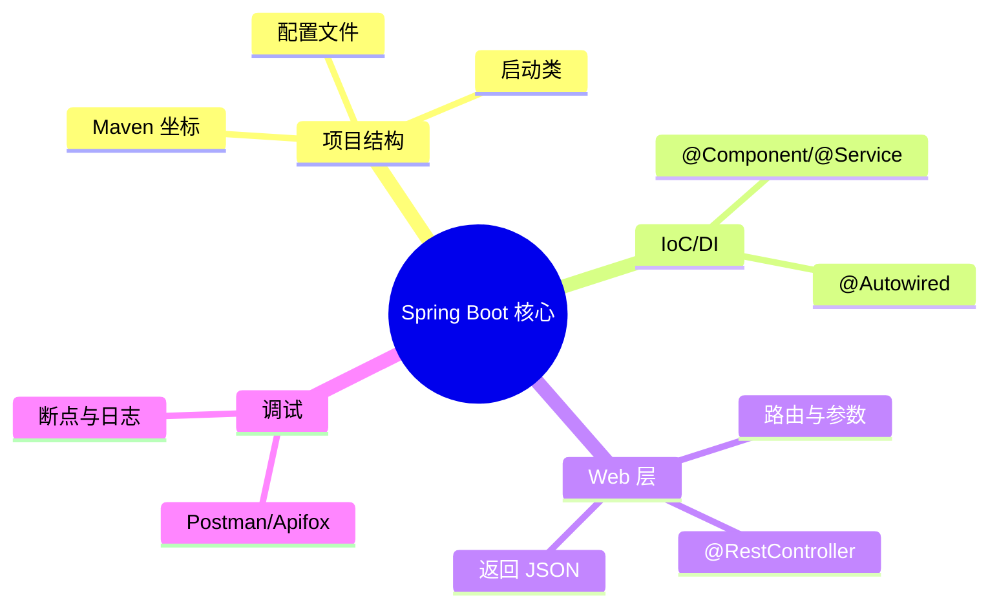

# 第3章 导读｜Spring Boot 核心

> 以“少即是多”的理念，直奔 Spring Boot：项目结构、自动装配、IoC/DI、控制器与 RESTful API，配合接口测试工具完成端到端闭环。

## 教学目标

- 会从模板快速创建 Spring Boot 项目并理解目录结构。
- 能解释 IoC/DI 的直观含义并在代码中应用。
- 能编写 `@RestController` 并返回 JSON，掌握常见注解与参数绑定。
- 学会用 `Postman`/`Apifox`/`HTTPie` 等工具进行接口调试。

## 知识结构

## 重点与易错点

- Bean 注入失败（包扫描、构造器注入 vs 字段注入）。
- 路由冲突、参数绑定与数据校验。
- 统一返回结构与异常处理（全局异常处理器）。

## 实验与作业

- 实验3：航班查询 API（从 Controller 到 Service 的完整链路）。
