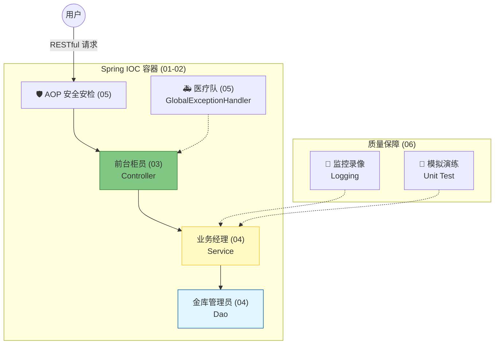

# 第三章：Spring Boot 核心与 RESTful API

!!! quote "本章导读：从“手工作坊”到“现代工厂”"
    在第二章，我们体验了 Servlet 的“刀耕火种”。你一定受够了繁琐的 `web.xml` 配置、手动管理的 JDBC 连接、以及一堆重复的样板代码。
    
    **第三章，我们将迎来生产力的第一次大爆发。**
    
    Spring Boot 不仅仅是一个框架，它是一套**“约定优于配置”**的现代化开发标准。本章我们将掌握企业级开发的核心“六脉神剑”：**IOC、RESTful、三层架构、异常拦截、AOP、单元测试**。
    
    学完这一章，你将能够独立开发出一个**健壮、规范、可维护**的后端系统。

---

## 🗺️ 知识全景图

如果把一个 Web 系统比作一家**现代化的银行**，本章的各节课分别对应了以下角色：

---

## 📚 课程目录

本章共 6 节理论课 + 1 个综合实验，建议按顺序攻破：

### **第一阶段：框架觉醒 (入门与原理)**

* **[01. 框架革命：Spring Boot 快速入门](01-springboot-start.md)**
* **核心**：1分钟搭建 Web 服务器，体验“零配置”的快乐。
* **重点**：理解 Starter 起步依赖。

* **[02. 核心原理：IOC 容器与依赖注入](02-ioc-di.md)**
* **核心**：**Spring 的灵魂**。理解“控制反转”，学会用 `@Autowired` 让对象自动装配。

### **第二阶段：规范立项 (设计与架构)**

* **[03. 接口规范：RESTful 风格与统一响应](03-restful-api.md)**
* **核心**：拒绝“野路子”接口。掌握 `@GetMapping` 等注解，封装 `Result<T>`。

* **[04. 架构设计：分层解耦 (Controller-Service-Dao)](04-architecture.md)**
* **核心**：代码的“收纳整理术”。引入 **Lombok** 神器，消除样板代码。

### **第三阶段：企业级增强 (健壮与质量)**

* **[05. 全局兜底：异常处理与 AOP 简介](05-exception-aop.md)**
* **核心**：给系统装上“安全气囊” (`@RestControllerAdvice`) 和“监控切面”。

* **[06. 生产基石：单元测试与日志管理](06-test-logging.md)**
* **核心**：告别 `System.out`。掌握 **SLF4J** 日志与 **JUnit 5** 自动化测试。

---

## 💻 本章终极挑战 (Lab)

* **[👉 实验 3：构建标准化的 RESTful 后端系统](lab3.md)**
* **任务**：综合运用本章所有知识，开发一个**“图书管理系统”**后端。
* **目标**：实现三层架构、RESTful 接口、全局异常处理，并体验 AI 辅助生成单元测试。

---

## 🚀 准备好了吗？

Spring Boot 的世界非常广阔，但只要掌握了本章的**“核心六讲”**，你就已经拿到了一把通往高薪职位的钥匙。

让我们开始第一场革命吧！

[开始学习：Spring Boot 快速入门](01-springboot-start.md){ .md-button .md-button--primary .md-button--block }

