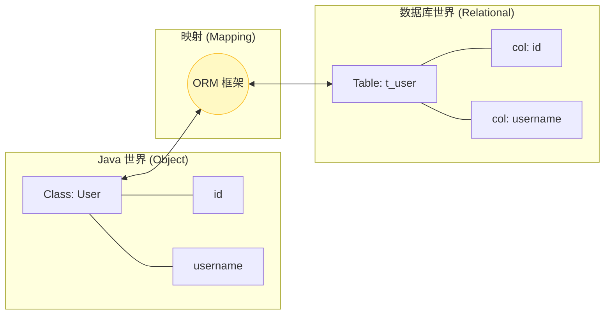

# 01. ORM 思想与 MyBatis 初探

!!! quote "🏗️ 本节目标：从“搬砖”到“自动化”"
    在上一章的 JDBC 实验中，你是否感到痛苦？

    * 手动写 `Connection.close()`？
    * 手动写 `PreparedStatement.setString(1, "xxx")`？
    * **最痛苦的是**：要把 `ResultSet` 里的数据一行行取出来，再 `new User()`，再 `user.setName(...)`...

    如果有 100 个字段，难道要写 100 行 `set` 代码吗？
    **ORM (对象关系映射)** 技术的出现，就是为了把程序员从这种枯燥的“体力活”中解放出来。


---

## 😫 第一步：回顾 JDBC 的痛点

让我们重温一下 JDBC 的“噩梦”代码（如果你刚写完实验，应该深有体会）：

```java
// ❌ 传统 JDBC 的繁琐日常
User user = new User();
while (rs.next()) {
    // 痛点 1：列名写错就报错
    // 痛点 2：类型转换要小心
    // 痛点 3：几十个字段要写几十行 set
    user.setId(rs.getInt("id"));
    user.setUsername(rs.getString("username"));
    user.setPassword(rs.getString("password"));
    user.setPhone(rs.getString("phone"));
    // ... 此处省略 50 行 ...
}

```

**结论**：我们在做大量的**数据搬运工作**（把数据库的表记录，搬运到 Java 对象中）。
这导致核心的业务逻辑（比如“判断用户是否存在”）被**繁琐的样板代码**无情掩盖，不仅写起来累，维护起来更难找重点。
---

## 🌉 第二步：什么是 ORM？

**ORM (Object-Relational Mapping)**，即**对象关系映射**。
它就像一座**自动化的桥梁**，连接了 Java 的“面向对象世界”和数据库的“关系型世界”。

* **O (Object)**：Java 对象（类）。
* **R (Relational)**：关系型数据库（表）。
* **M (Mapping)**：映射配置（XML 或注解）。

### 核心思想

**让 Java 程序员忘记数据库表的存在，像操作 Java 集合一样操作数据库。**

* 数据库的一张**表** (`t_user`) <==映射==> Java 的一个**类** (`User`)
* 表中的一条**记录** (Row) <==映射==> Java 的一个**对象** (Instance)
* 表中的**列** (Column) <==映射==> Java 的**属性** (Field)



---

## 🦅 第三步：为什么选择 MyBatis？

在 Java 的 ORM 历史中，有两个超级巨星：**Hibernate (JPA)** 和 **MyBatis**。

### 1. 全自动 vs 半自动

| 特性 | Hibernate / JPA (全自动) | MyBatis (半自动) |
| --- | --- | --- |
| **SQL 编写** | **不用写 SQL**。框架自动生成。 | **需要写 SQL**。在 XML 中手写。 |
| **上手难度** | 难。配置复杂，黑盒机制多。 | **简单**。只要会写 SQL 就能上手。 |
| **性能优化** | 难。由于 SQL 是自动生成的，很难进行极致的 SQL 调优。 | **容易**。SQL 就在你手边，想怎么改就怎么改。 |
| **适用场景** | 传统的 ERP、OA 系统（逻辑复杂，并发低）。 | **互联网应用**（高并发，对 SQL 性能要求极高）。 |

### 2. 为什么中国企业偏爱 MyBatis？

在国外的教程中，你会发现他们更喜欢 JPA。但在中国的互联网大厂（阿里、腾讯、美团）以及信创领域，**MyBatis 是绝对的霸主**。

原因很简单：**掌控力**。

* 在“双十一”这种高并发场景下，DBA（数据库管理员）需要对每一条 SQL 进行极致优化。
* 全自动生成的 SQL 往往性能不可控。
* MyBatis 允许程序员手写 SQL，这正好满足了**“灵活+高效”**的需求。

---

## 🛠️ 第四步：MyBatis 初体验

MyBatis 是怎么工作的呢？相比于 JDBC，它帮我们做了什么？

### 1. 我们只需要写 SQL (Mapper.xml)

MyBatis 把 SQL 语句从 Java 代码中剥离出来，放在 XML 配置文件中。

```xml
<select id="findById" resultType="com.example.entity.User">
    SELECT * FROM t_user WHERE id = #{id}
</select>

```

### 2. Java 代码清爽了

```java
// UserMapper.java (接口)
public interface UserMapper {
    User findById(Integer id);
}

// 业务代码中调用
User user = userMapper.findById(1); // ✅ 一行代码搞定！
System.out.println(user.getUsername());

```

**MyBatis 帮我们做了什么？**

1. **自动连接**：自动管理 JDBC 连接的获取和关闭。
2. **自动输入**：自动把 Java 方法的参数 (`1`) 填入 SQL 的 `#{id}` 中。
3. **自动输出**：自动把数据库查出来的 `ResultSet`，通过反射机制，一行行 `set` 到 `User` 对象中。

---

## 📝 总结

* **JDBC** 是手动挡赛车：控制力最强，但开着太累，容易熄火（资源未关闭）。
* **Hibernate** 是无人驾驶：很省心，但你不知道它会怎么走，路况复杂时容易翻车（性能问题）。
* **MyBatis** 是**自动挡跑车**：既帮你省去了换挡（封装连接、结果集）的麻烦，又保留了踩油门（手写 SQL）的快感。

这也正是为什么 MyBatis 能够成为 Java Web 事实标准的根本原因。

**下一步预告**：
光说不练假把式。下一节，我们将把 MyBatis 引入到我们的 Spring Boot 项目中，并尝试连接国产信创之光 —— **openGauss** 数据库。

[下一节：整合信创数据库 (Spring Boot + openGauss)](02-integrate-gauss.md){ .md-button .md-button--primary }
}