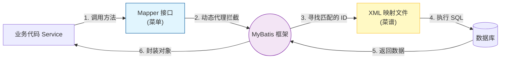
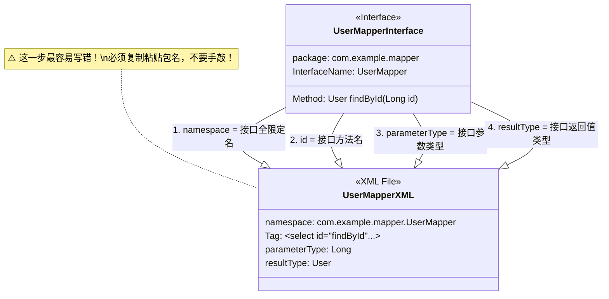

# 03. 核心映射：Mapper 接口与 XML

!!! quote "本节目标：掌握 MyBatis 的“双剑合璧”"
    在 JDBC 时代，写完 `UserDao` 接口后，还得苦哈哈地写一个 `UserDaoImpl` 实现类。

    而在 MyBatis 中，**你根本不需要写实现类！**
    你只需要写一个**接口**（菜单）和一个 **XML 文件**（菜谱），MyBatis 就会在运行时自动帮你生成实现代码。

    本节我们将学习这对“黄金搭档”是如何配合工作的。

---

## 🔗 第一步：理解“双剑合璧”

MyBatis 的核心思想是将 **Java 接口**与 **XML 配置文件**绑定在一起。我们可以这样理解它们的关系：

* **Mapper 接口 (`UserMapper.java`)**：好比餐厅的**菜单**。它告诉外界“我可以提供什么服务”（查用户、删用户），但不关心具体怎么做。
* **XML 文件 (`UserMapper.xml`)**：好比后厨的**详细菜谱**。它记录了“这道菜具体怎么做”（具体的 SQL 语句是什么）。

### 1. 它们是怎么配合的？

当你调用接口方法时，MyBatis 会充当“传菜员”，根据接口上的信息，去 XML 里找到对应的 SQL 执行。



---

## 🗝️ 第二步：四大“暗号” (绑定规则)

接口和 XML 本是两个独立的文件，MyBatis 怎么知道 `UserMapper.java` 里的 `findById` 方法，对应的就是 `UserMapper.xml` 里的那段 SQL 呢？

这就需要它们之间**“对暗号”**。只有暗号完全匹配，MyBatis 才能把它们连起来。



!!! tip "陈老师的记忆口诀"
    * **门当户对**：XML 的 `namespace` 必须是接口的**全家桶名字**（包名+类名）。
    * **指名道姓**：XML 的 `id` 必须和**方法名**一模一样。
    * **有来有回**：入参类型 (`parameterType`) 和出参类型 (`resultType`) 必须要对上。

---

## 📝 第三步：实战代码 (CRUD)

让我们来实现对 `User` 表的增删改查。

### 1. 准备实体类 (Entity)

首先确保你的实体类与数据库表对应。

```java title="src/main/java/.../entity/User.java"
@Data // Lombok 自动生成 getter/setter/toString
public class User {
    private Long id;
    private String username;
    private String password;
    private String phone;
    private LocalDateTime createTime; // 对应数据库的 create_time
}

```

### 2. 编写 Mapper 接口 (菜单)

```java title="src/main/java/.../mapper/UserMapper.java"
package com.example.usermanager.mapper;

import com.example.usermanager.entity.User;
import org.apache.ibatis.annotations.Mapper;
import java.util.List;

@Mapper // ✅ 告诉 Spring：这是一个 MyBatis 接口，请帮我生成代理对象
public interface UserMapper {

    // 查询所有用户
    List<User> findAll();

    // 根据 ID 查询
    User findById(Long id);

    // 新增用户 (返回影响行数)
    int insert(User user);

    // 删除用户
    int deleteById(Long id);
}

```

### 3. 编写 Mapper XML (菜谱)

在 `src/main/resources/mapper` 目录下新建 `UserMapper.xml`。

```xml title="src/main/resources/mapper/UserMapper.xml"
<?xml version="1.0" encoding="UTF-8" ?>
<!DOCTYPE mapper
        PUBLIC "-//mybatis.org//DTD Mapper 3.0//EN"
        "http://mybatis.org/dtd/mybatis-3-mapper.dtd">

<mapper namespace="com.example.usermanager.mapper.UserMapper">

    <select id="findAll" resultType="com.example.usermanager.entity.User">
        SELECT * FROM t_user
    </select>

    <select id="findById" resultType="com.example.usermanager.entity.User">
        SELECT * FROM t_user WHERE id = #{id}
    </select>

    <insert id="insert" useGeneratedKeys="true" keyProperty="id">
        INSERT INTO t_user (username, password, phone, create_time)
        VALUES (#{username}, #{password}, #{phone}, #{createTime})
    </insert>

    <delete id="deleteById">
        DELETE FROM t_user WHERE id = #{id}
    </delete>

</mapper>

```

---

## 🚧 第四部分：经典深坑——结果映射 (ResultMap)

### 💀 问题描述

你可能会发现，运行上面的 `findById` 代码后，查出来的 `User` 对象中，`username` 有值，但 **`createTime` 却是 null**。

这是因为数据库和 Java 的命名规范不同：

* **数据库**：`create_time` (下划线，像蛇一样)
* **Java**：`createTime` (驼峰，像骆驼一样)

MyBatis 比较“笨”，它默认只把名字一模一样的字段赋值。`create_time` 和 `createTime` 长得不一样，它就不管了。

### ✅ 解决方案 A：开启自动翻译 (推荐)

我们在 `application.properties` 中配置这个开关，MyBatis 就会自动把“下划线”翻译成“驼峰”。

```properties
mybatis.configuration.map-underscore-to-camel-case=true

```

**这是处理单表查询最快的方法。**

### ✅ 解决方案 B：手动绘制映射图 (ResultMap)

如果字段名差得太远（比如数据库叫 `user_pwd`，Java 叫 `password`），或者涉及多表关联查询（后面会学），就必须用 `ResultMap` 手动指路。

```xml
<resultMap id="UserMap" type="com.example.usermanager.entity.User">
    <id column="id" property="id"/>
    <result column="user_pwd" property="password"/>
    <result column="create_time" property="createTime"/>
</resultMap>

<select id="findById" resultMap="UserMap">
    SELECT * FROM t_user WHERE id = #{id}
</select>

```

---

## 🧪 第五步：单元测试

写完 Mapper 必须测试，否则到了 Service 层报错很难查。

```java title="src/test/java/.../mapper/UserMapperTest.java"
@SpringBootTest
class UserMapperTest {

    @Autowired
    private UserMapper userMapper;

    @Test
    void testInsertAndFind() {
        // 1. 测试插入
        User user = new User();
        user.setUsername("mybatis_test");
        user.setPassword("123456");
        user.setCreateTime(LocalDateTime.now());
        
        int rows = userMapper.insert(user);
        System.out.println("插入行数: " + rows);
        System.out.println("回填的主键 ID: " + user.getId()); // 关键验证点

        // 2. 测试查询
        User queryUser = userMapper.findById(user.getId());
        Assertions.assertNotNull(queryUser);
        System.out.println("查到的用户: " + queryUser);
    }
}

```

---

## 🤖 特别篇：让 AI 帮你写 XML

!!! tip "🚀 效率革命：拒绝重复造轮子"
    你可能发现了，写 XML 真的很繁琐！复制粘贴 `namespace`、一个个对齐字段名...这些都是机械劳动。

    **现在，请把这些脏活累活交给 AI，你只负责设计接口！**

### 1. 场景：一键生成 CRUD 代码

当你写好了 `User` 实体类和 `UserMapper` 接口后，不需要再去手敲 XML 了。试着把这两个文件的代码复制给 AI，并发送以下指令：

!!! example "🔮 复制此 Prompt (提示词) 给 AI"
    "我是一个 Java 初学者，正在学习 MyBatis。
    请根据我提供的 **实体类 (User)** 和 **Mapper 接口 (UserMapper)**，帮我生成对应的 **MyBatis XML 配置文件**。

    **要求：**
    1.  必须使用 `ResultMap` 来解决数据库下划线字段与 Java 驼峰属性的映射问题。
    2.  `namespace` 必须正确对应接口的全限定名。
    3.  生成 `insert`, `deleteById`, `update`, `findById`, `findAll` 五个方法的 SQL 实现。
    4.  给每一段 SQL 加上中文注释。

    **附带代码：**
    `[在此处粘贴 User.java 和 UserMapper.java 的代码]`"

### 2. 👨‍💻 关键环节：代码审查 (Code Review)

AI 生成的代码虽然很快，但它偶尔会犯傻（比如写错表名、拼错包名）。此时，你的身份不再是“写代码的学生”，而是**“审核代码的技术经理”**。

**请务必检查以下 3 个“死穴”：**

* [ ] **暗号是否对上？** 检查 XML 顶部的 `namespace` 是否和你的接口路径完全一致？
* [ ] **字段是否遗漏？** 检查 `ResultMap` 里是否漏掉了 `createTime` 等字段？
* [ ] **逻辑是否正确？** 检查 `delete` 语句是否忘了加 `WHERE` 条件？（**⚠️ 这是一个由于 AI 偷懒导致删库的经典惨案！**）

---

## 📝 总结

MyBatis 的核心魅力在于**“控制权”**。通过接口与 XML 的分离，既保持了 Java 代码的清爽，又保留了 SQL 的灵活性。


| 核心组件 | 角色比喻 | 核心职责 |
| :--- | :--- | :--- |
| **Mapper 接口** | **菜单** | 定义“我要做什么”（业务规范），不关心具体实现。 |
| **XML 文件** | **后厨** | 定义“具体怎么做”（SQL 细节），处理复杂的数据库操作。 |
| **namespace** | **连接器** | 像 USB 接口一样，把 Java 接口和 XML 强力绑定在一起。 |
| **ResultMap** | **翻译官** | 抹平数据库（下划线）与 Java（驼峰）之间的语言差异。 |

!!! tip "陈老师的肺腑之言"
    很多同学问：**“既然 AI 能写 XML，我为什么还要学 XML 语法？”**

    因为 AI 只是你的**副驾驶**。当程序报错（比如 `Invalid bound statement`）时，或者需要优化一条慢查询 SQL 时，**只有懂原理的你，才能精准地找到问题所在。**

    **AI 决定了开发的下限，而你对原理的掌握，决定了开发的上限。**
---
[下一节：MyBatis 的杀手锏：动态 SQL](04-dynamic-sql.md){ .md-button .md-button--primary }