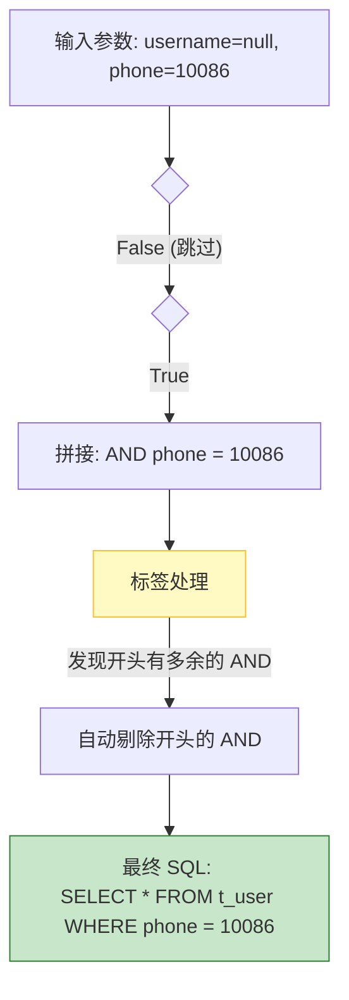

# 04. MyBatis 的杀手锏：动态 SQL

!!! quote "告别“字符串拼接”的噩梦"
    在 JDBC 时代，如果你要实现一个“多条件搜索”功能（比如用户可能只填名字，也可能只填电话，或者两个都填），你需要在 Java 代码里写一堆 `if (name != null) { sql += " AND name = ..." }`。

    一旦漏掉一个空格，程序就报错；一旦多了一个 `AND`，SQL 就语法错误。

    **动态 SQL** 是 MyBatis 最强大的特性之一。它让你在 XML 中像写代码一样写 SQL（支持 if, foreach 等逻辑），彻底终结了手动拼接 SQL 的“石器时代”。

---

## 🚦 场景一：智能条件查询 (`<if>` 与 `<where>`)

### 1. 业务痛点

用户在搜索框里：

* 有时只输入用户名。
* 有时只输入手机号。
* 有时什么都不输（想看全部）。

如果用传统的 SQL 写死 `WHERE username = ? AND phone = ?`，当用户没填手机号时，查询条件变成了 `phone = null`，导致查不到数据。

### 2. MyBatis 的解决方案

我们需要 SQL 能根据参数**“动态变形”**。

```xml title="UserMapper.xml"
<select id="searchUser" resultType="com.example.entity.User">
    SELECT * FROM t_user
    <where>
        <if test="username != null and username != ''">
            AND username LIKE concat('%', #{username}, '%')
        </if>
        
        <if test="phone != null and phone != ''">
            AND phone = #{phone}
        </if>
    </where>
</select>

```

### 3. `<where>` 标签的魔法

你可能会问：*“如果第一个条件不满足，直接拼接第二个条件，SQL 会不会变成 `SELECT * FROM t_user WHERE AND phone = ...`（多了一个 AND）？”*

别担心，`<where>` 标签非常智能：

* **自动剔除**：如果标签内部的内容以 `AND` 或 `OR` 开头，它会自动把第一个 `AND` 删掉。
* **自动隐藏**：如果标签内部没有任何条件成立（所有 `if` 都为假），它连 `WHERE` 关键字都不会生成。



---

## 🛠️ 场景二：智能更新 (`<set>`)

### 1. 业务痛点

在“修改个人信息”页面，用户可能只改了头像，没改密码。
如果我们执行 `UPDATE t_user SET password = #{password}, avatar = #{avatar} ...`，那些没改的字段（为 null）就会把数据库里原本的数据覆盖为空。

### 2. 实战代码

`<set>` 标签专门用于 update 语句，它会自动处理行尾多余的逗号。

```xml title="UserMapper.xml"
<update id="updateUser">
    UPDATE t_user
    <set>
        <if test="username != null">username = #{username},</if>
        <if test="password != null">password = #{password},</if>
        <if test="phone != null">phone = #{phone},</if>
        <if test="avatar != null">avatar = #{avatar},</if>
    </set>
    WHERE id = #{id}
</update>

```

---

## 🚀 场景三：批量操作 (`<foreach>`)

### 1. 为什么需要批量？

假设你要删除 100 个用户。

* **低效做法**：在 Java 里写个 `for` 循环，调用 100 次数据库。这会建立 100 次连接，性能极差。
* **高效做法**：生成一条 SQL `DELETE FROM t_user WHERE id IN (1, 2, 3, ...)`。一次连接，搞定所有。

### 2. 实战代码

`<foreach>` 标签可以遍历 Java 传递过来的 List 或 Array 集合。

```xml title="UserMapper.xml"
<delete id="deleteBatch">
    DELETE FROM t_user WHERE id IN
    <foreach collection="ids" item="id" open="(" separator="," close=")">
        #{id}
    </foreach>
</delete>

```

**生成的 SQL 效果**：

```sql
DELETE FROM t_user WHERE id IN (101, 102, 103)

```

---

## 🤖 AI 提效技巧

动态 SQL 的语法（特别是 `<foreach>` 的属性）很容易记混。这时候，AI 又是你的好帮手。

!!! tip "Prompt (提示词) 范例"
    **你**：DeepSeek，请帮我写一个 MyBatis 的动态 update 语句。  
    **场景**：表名 `t_product`，主键 `id`。  
    **要求**：  
    1. 使用 `<set>` 标签。  
    2. 只有当字段 `price`, `stock`, `name` 不为空时才更新它们。  
    3. 请直接给出 XML 代码。  

---

## 🤖 特别篇：AI 结对编程 (AI Pair Programming)

!!! tip "🧠 你的外脑：把记忆负担交给 AI"
    动态 SQL 的标签语法（尤其是 `<foreach>` 的 `collection`, `open`, `separator` 属性）非常琐碎，像以前那样死记硬背已经过时了。
    
    **现在的开发模式是：你负责提供逻辑，AI 负责提供语法。**

### 1. 场景：秒写“批量插入”语句

手写一个支持 List 集合的批量插入语句（Batch Insert）非常痛苦，极易写错。

**👨‍💻 工程师职责：定义接口**
首先，由你来定义清晰的 Java 接口规范：

```java
// UserMapper.java
// 这是一个难点，参数是一个 List
int insertBatch(@Param("users") List<User> userList);

```

**🤖 AI 职责：生成实现**
接着，将繁琐的 XML 语法工作交给 AI。试着发送以下 Prompt：

!!! example "🔮 复制此 Prompt 给 AI"
    "我正在使用 MyBatis。
    请帮我生成一个 **批量插入 (Batch Insert)** 的 XML 语句。

    * **表名**: `t_user`
    * **字段**: `username`, `password`, `phone`
    * **接口参数名**: `users` (这是一个 List<User>)
    * **要求**: 使用 `<foreach>` 标签，注意 separator 的处理。请直接给出 XML 代码。"

### 2. ⚠️ 关键检查点：AI 经常犯的错

AI 生成的代码通常长这样：

```xml
<insert id="insertBatch">
    INSERT INTO t_user (username, password, phone) VALUES
    <foreach collection="users" item="u" separator=",">
        (#{u.username}, #{u.password}, #{u.phone})
    </foreach>
</insert>

```

**作为技术经理，你需要检查 AI 的一个经典 Bug：**

* **检查 collection 属性**：
* 如果你在接口里用了 `@Param("users")`，那么 XML 里的 `collection` **必须** 是 `"users"`。
* 如果你没用 `@Param`，MyBatis 默认的名字通常是 `"list"` 或 `"arg0"`。
* **AI 经常会猜错这个名字！** 如果报错 `Parameter 'users' not found`，请第一时间检查这里。

---

## 📝 总结与速查表

动态 SQL 是 MyBatis 区别于其他 ORM 框架（如 JPA）的核心竞争力，它赋予了开发者对 SQL 的**绝对控制权**。

| 标签 | 作用 | 这里的“智能”体现在哪？ |
| --- | --- | --- |
| `<if>` | 条件判断 | 类似于 Java 的 if，通过 `test` 属性判断真假。 |
| `<where>` | 组装条件 | 自动处理 SQL 开头多余的 `AND` / `OR`；如果没条件则不生成 WHERE。 |
| `<set>` | 组装更新 | 自动处理 SQL 行尾多余的 `逗号 (,)`。 |
| `<foreach>` | 循环遍历 | 专治 `IN (...)` 查询和批量插入，性能极其强悍。 |

!!! warning "避坑指南"
    在 `<if test="...">` 中，判断字符串非空时，一定要同时判断 `null` 和 `空字符串`。

    * ❌ **错误**：`test="username != null"` (如果传空串 `""`，会生成 `name = ''`，可能查不到数据)
    * ✅ **正确**：`test="username != null and username != ''"`
  
[下一节：插件生态 - PageHelper 分页查询](https://www.google.com/search?q=05-pagehelper.md){ .md-button .md-button--primary }