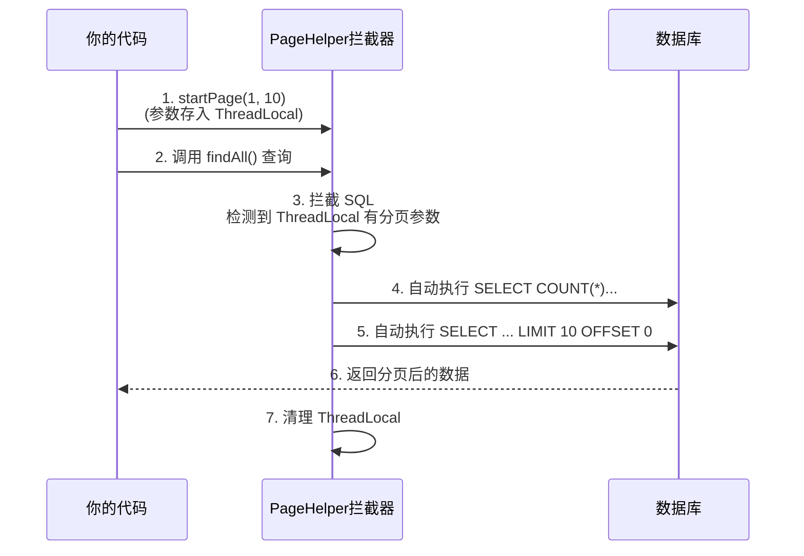

# 05. 插件生态：PageHelper 分页查询

!!! quote "🛍️ 想象一下：如果你打开淘宝..."
    如果淘宝把所有 10 亿件商品一次性全部加载到你的手机屏幕上，会发生什么？

    1.  📱 **手机爆炸**：内存溢出（OOM）。
    2.  🐌 **网络瘫痪**：下载这几 TB 数据需要好几年。
    3.  💥 **老板发火**：数据库服务器瞬间崩溃。

    所以，**“分页查询”**（每次只查 10 条）是后端开发的**生存必备技能**。
    在 JDBC 时代，我们需要手动计算 `LIMIT offset, size`，极其繁琐。今天，我们将引入 **PageHelper**，它能让你**彻底告别 SQL 分页语法**，用一行代码实现“魔法”分页。

---

## 🆚 第一步：物理分页 vs 逻辑分页 (面试必问)

在学习插件之前，必须懂原理。实现分页有两种流派：

| 特性 | 逻辑分页 (内存分页) | 物理分页 (数据库分页) |
| --- | --- | --- |
| **原理** | 把所有数据（如 100万条）查到内存，再截取第 10-20 条。 | 在 SQL 末尾加 `LIMIT`，数据库**只返回**这 10 条。 |
| **优点** | 跨数据库通用。 | **性能极高**，内存占用极小。 |
| **缺点** | **性能灾难**！数据量大时直接 OOM。 | 不同数据库语法不同 (MySQL 用 LIMIT, Oracle 用 ROWNUM)。 |
| **结论** | ❌ **坚决抵制** | ✅ **企业级标准** |

**PageHelper 的核心价值**：
它让我们在 Java 代码中写起来像“逻辑分页”一样简单，但底层自动帮我们转换成最高效的“物理分页” SQL。

---

## ⚙️ 第二步：PageHelper 魔法原理

为什么我们不需要写 `LIMIT` 还能实现分页？因为 PageHelper 使用了 **MyBatis 拦截器 (Interceptor)** 机制。



---

## 📦 第三步：引入依赖

PageHelper 专门为 Spring Boot 提供了 Starter 包。

> **注意**：Spring Boot 3 + JDK 17 环境下，请务必使用 **1.4.6** 及以上版本（或适配 SB3 的最新版 2.1.0+），避免循环依赖报错。

```xml title="pom.xml"
<dependency>
    <groupId>com.github.pagehelper</groupId>
    <artifactId>pagehelper-spring-boot-starter</artifactId>
    <version>2.1.0</version>
</dependency>

```

!!! tip "Maven 刷新提醒"
    修改 `pom.xml` 后，别忘了点击 IDEA 右上角的 **"Load Maven Changes"** (小刷新图标)，或者按 `Ctrl + Shift + O`。

---

## ⚡ 第四步：Service 层实战 (核心)

这是 PageHelper 最核心的用法，请务必背诵这 **"三部曲"**。我们不需要修改 Mapper 里的任何 SQL！

=== "✅ 正确写法 (三部曲)"
    ```java
    public PageInfo<User> findUserList(int pageNum, int pageSize) {
        // 1. 开启分页 (魔法开始的地方)
        // ⚠️ 这一句必须紧贴在查询语句之前！
        PageHelper.startPage(pageNum, pageSize);

        // 2. 执行查询
        // 此时发出的 SQL 会自动包含 LIMIT 语句
        List<User> users = userMapper.selectAll();
        
        // 3. 封装结果
        // PageInfo 包含了总页数、总记录数、当前页数据等所有信息
        return new PageInfo<>(users);
    }
    ```

=== "❌ 常见错误 (千万别犯)"
    ```java
    // 错误示范：startPage 和查询之间隔了其他代码
    PageHelper.startPage(1, 10);

    // 💀 假如这里插入了一段逻辑，或者抛出了异常...
    doSomethingElse(); 

    // 这里的查询可能就不会被分页，或者消耗掉分页参数导致后续查询出错！
    // 因为 PageHelper 使用的是 ThreadLocal，必须保证 "即用即销"。
    List<User> users = userMapper.selectAll();
    ```

---

## 📡 第五步：Controller 层响应

前端通常需要知道“一共有多少页”、“当前是第几页”。`PageInfo` 对象完美封装了这些数据。

```java title="UserController.java"
@GetMapping
public Result<PageInfo<User>> list(
        @RequestParam(defaultValue = "1") int page,
        @RequestParam(defaultValue = "10") int size) {
    
    // 调用 Service
    PageInfo<User> pageInfo = userService.findUserList(page, size);
    return Result.success(pageInfo);
}

```

**前端收到的 JSON 结构**：

```json
{
  "code": 1,
  "msg": "success",
  "data": {
    "pageNum": 1,       // 当前页
    "pageSize": 10,     // 每页几条
    "total": 105,       // 总记录数 (最重要！前端用来算页码条)
    "pages": 11,        // 总页数
    "list": [           // 真正的数据列表
       { "id": 1, "username": "admin", ... }
    ],
    "isFirstPage": true,
    "isLastPage": false
  }
}

```

---

## ⚠️ 避坑指南 (严厉警告)

PageHelper 非常好用，但有两个**致命隐患**，新手极容易翻车：

### 1. 致命死穴：分页污染

`PageHelper.startPage()` 使用 `ThreadLocal` 传递参数。**它只对紧随其后的 第一条 SQL 语句生效！**

* **场景**：如果你调用了 `startPage`，但紧接着的代码抛出了异常，导致 `userMapper.findAll()` 没有执行。
* **后果**：这个分页参数会**残留在当前线程中**。当这个线程被复用去处理下一个请求（比如查询全校班级）时，下一个请求明明没想分页，却莫名其妙被加上了 `LIMIT 10`。
* **对策**：始终保持 `startPage` 和 `mapper` 查询**紧紧挨在一起**，中间不要有任何逻辑代码。

### 2. 级联查询坑 (1对N)

* **场景**：你在 XML 中使用 `<collection>` 关联查询（比如“查班级同时也查出所有学生”）。
* **后果**：PageHelper 是对**结果集**分页的。如果 1 个班级有 50 个学生，数据库返回 50 行数据。PageHelper `LIMIT 10` 后，可能连第 1 个班级的学生都没查全。
* **对策**：复杂的多表关联分页，建议在 Service 层分步查询，或者手动手写 SQL 分页。

---

## 🤖 特别篇：AI 帮你重构代码

!!! tip "🚀 场景：老代码改造"
    有时候你接手了一个老项目，发现里面全是 `findAll()`，老板让你把它们全部改成即插即用的分页接口。手动改很累，交给 AI 吧！

    * **👨‍💻 工程师职责**：找到需要改造的 Service 方法。
    * **🤖 AI 职责**：生成分页封装代码。

您可以复制以下指令发送给 AI：

!!! example "🔮 复制此 Prompt (提示词) 给 AI"
    "我正在使用 Spring Boot 和 PageHelper。请帮我把下面的普通查询方法，改造成**分页查询方法**。

    **原始代码**：
    `[在此处粘贴你的 Service 代码]`

    **要求**：
    1. 方法参数增加 `int pageNum`, `int pageSize`。  
    2. 使用 `PageHelper.startPage` 实现分页。  
    3. 返回类型改为 `PageInfo<User>`。  
    4. **特别注意**：请解释为什么 `PageHelper.startPage` 必须写在 SQL 查询的第一行前面。"  

---

## 📝 总结

| 核心类 | 作用 | 备注 |
| --- | --- | --- |
| `PageHelper` | 工具类 | 核心方法 `startPage(page, size)`，开启拦截器。 |
| `PageInfo` | 结果封装类 | 包含 `total`, `list` 等信息，直接返回给前端。 |
| **物理分页** | 核心思想 | 利用 SQL 的 `LIMIT`，保护数据库内存。 |

!!! success "通关标志"
    如果你能通过修改 URL 中的 `page` 和 `size` 参数（例如 `?page=2&size=5`），看到返回的数据随之变化，且 `total` 总数正确，说明你已经掌握了企业级分页开发的精髓！

[下一节：事务管理：@Transactional 与 ACID](06-transaction.md){ .md-button .md-button--primary }