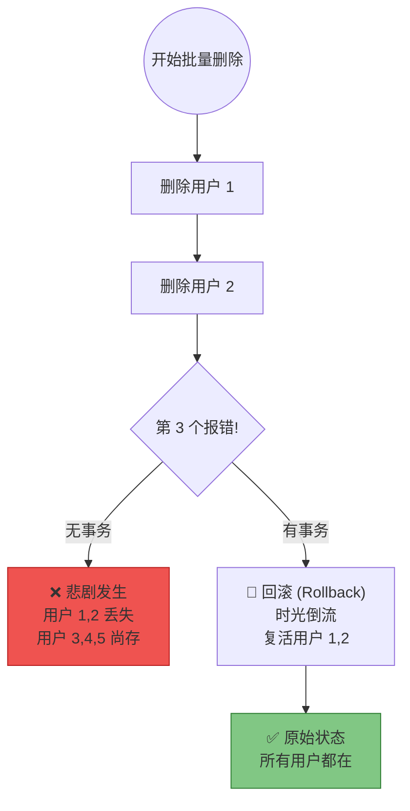

# 06. 事务管理：@Transactional 与 ACID

!!! quote "本节目标"
    在上一节中，我们实现了**“批量删除用户”**的功能。
    
    想象一下，管理员勾选了 10 个用户点击删除。系统正在一个个地执行删除操作，当删到第 5 个用户时，系统突然报错（比如网络断了，或者触发了某种保护机制）。

    **后果：** 前 4 个用户已经被删没了，后面的没删掉，系统处于一个**“半死不活”**的尴尬状态。

    本节我们将学习数据库的**事务 (Transaction)** 机制，利用 Spring Boot 的 **`@Transactional`** 注解，实现**“要么全部删除成功，要么一个都别动”**的安全机制。


---

## 💣 第一步：危机时刻——数据“半死不活”

我们先来看一个没有事务保护的批量删除场景。假设由于业务逻辑复杂，我们需要在 Service 层遍历删除。

### 1. 模拟代码 (无事务)

```java
@Service
public class UserService {

    @Autowired
    private UserDao userDao;

    /**
     * 批量删除用户 (模拟逐个处理)
     */
    public void deleteBatch(List<Long> ids) {
        for (int i = 0; i < ids.size(); i++) {
            Long id = ids.get(i);
            
            // 1. 执行删除
            userDao.deleteById(id);
            System.out.println("已删除用户 ID: " + id);

            // 2. 模拟意外：如果删的是第 3 个用户，程序崩溃！
            if (i == 2) {
                throw new RuntimeException("系统崩溃：删除中断！");
            }
        }
    }
}

```

### 2. 后果演示

假设前端传来了 `[101, 102, 103, 104, 105]` 五个 ID。

* **执行前**：5 个用户都在。
* **执行后**：
* ID `101`, `102` **没了** (被永久删除了)。
* ID `103` 报错。
* ID `104`, `105` 还在。


* **结论**：操作只成功了一半，数据不一致！如果这是银行转账，后果不堪设想。

---

## 🛡️ 第二步：事务与 ACID 理论

为了解决这个问题，我们需要引入 **事务 (Transaction)**。事务能保证这一组删除操作是一个**原子包**：**同生共死**。

### 1. 核心理论：ACID

面试必考题，结合用户模块理解：

| 特性 | 英文 | 解释 (用户管理版) |
| --- | --- | --- |
| **原子性** | **A**tomicity | **同生共死**。这一批 10 个用户的删除操作是一个整体。要么 10 个全删掉，要么一个都别删（回滚）。 |
| **一致性** | **C**onsistency | **守恒定律**。事务结束后，数据库必须处于合法的状态。 |
| **隔离性** | **I**solation | **各玩各的**。当我在批量删除时（事务未提交），别的管理员在查询用户列表，他应该看到的是删除前的完整列表，而不是只剩一半的残缺列表。 |
| **持久性** | **D**urability | **落袋为安**。一旦提示“删除成功”，这些数据就彻底从硬盘消失了，服务器重启也找不回。 |

### 2. 事务的运作流程



---

## ⚡ 第三步：Spring Boot 的魔法——@Transactional

在 Spring Boot 中，开启事务保护易如反掌。

### 1. 加上注解

在 `UserService` 的方法上添加 **`@Transactional`** 注解。

```java
import org.springframework.transaction.annotation.Transactional;

@Service
public class UserService {

    @Autowired
    private UserMapper userMapper;

    @Transactional // 👈 加上它，Spring 自动开启事务保护
    public void deleteBatch(List<Long> ids) {
        for (int i = 0; i < ids.size(); i++) {
            Long id = ids.get(i);
            
            userMapper.deleteById(id); // 删除
            
            // 模拟异常
            if (i == 2) { 
                int crash = 1 / 0; // 抛出异常
            }
        }
    }
}

```

### 2. 效果验证

当代码运行到第 3 个用户抛出异常时：

1. Spring 捕获到异常。
2. Spring 指挥数据库执行 **ROLLBACK** 操作。
3. 你会惊奇地发现：**之前被删掉的用户 1 和 用户 2，又重新出现在数据库里了！**

---

## 🚧 第四步：避坑指南——事务失效的“元凶”

很多新手加了注解，发现事务还是没回滚。**90% 的原因是你自己把异常“吃掉”了！**

### ❌ 错误写法 (Swallowing Exceptions)

```java
@Transactional
public void deleteBatch(List<Long> ids) {
    try {
        for (Long id : ids) {
            userMapper.deleteById(id);
            if (id == 999) int i = 1/0; // 报错
        }
    } catch (Exception e) {
        // 😱 致命错误！你自己捕获了异常，但没抛出。
        // Spring 认为："哦，程序员自己处理了，没报错嘛，那我提交事务咯！"
        // 结果：前几个用户真被删了。
        e.printStackTrace(); 
    }
}

```

### ✅ 正确写法 1：不捕获 (推荐)

让异常直接抛给 Controller，最后由全局异常处理器（GlobalExceptionHandler）去处理。

```java
@Transactional
public void deleteBatch(List<Long> ids) {
    // 放心写业务，出了事往外抛，Spring 会接盘
    for (Long id : ids) {
        userMapper.deleteById(id);
    }
}

```

### ✅ 正确写法 2：捕获并手动抛出

如果你非要自己 catch 做记录，必须在 catch 块里再抛出一个 `RuntimeException`。

```java
@Transactional
public void deleteBatch(List<Long> ids) {
    try {
        // ... 业务代码
    } catch (Exception e) {
        log.error("批量删除失败", e);
        // 🚨 必须抛出！告诉 Spring 出事了，需要回滚
        throw new RuntimeException(e); 
    }
}

```

---

## 🤖 第五步：AI 辅助理解

事务隔离级别（Isolation Level）也是面试重点。可以让 AI 帮你模拟场景。

!!! question "让 AI 解释隔离级别"
    **Prompt**:
    > "请以用户管理系统为例，解释数据库事务的四大隔离级别（读未提交、读已提交、可重复读、串行化）。
    >
    > 场景：管理员 A 正在修改张三的密码（事务未提交），管理员 B 同时在查询张三的信息。不同的隔离级别下，B 会看到什么？（脏读、不可重复读、幻读）"

---

## 📝 总结

1. **为什么需要事务**：为了保证批量操作或多步骤操作（如删用户+删日志）的**原子性**。
2. **ACID**：原子性、一致性、隔离性、持久性。
3. **`@Transactional`**：Spring 的声明式事务注解，通常加在 Service 层。
4. **失效陷阱**：**try-catch 必须抛出异常**，否则事务不回滚。

**下一步**：
至此，你已经掌握了 Java Web 数据持久化层的四大护法：

* **CRUD** (基本功)
* **动态 SQL** (灵活搜索)
* **PageHelper** (海量数据分页)
* **事务管理** (数据安全兜底)

但纸上得来终觉浅，目前我们的 `BookDao` 还是个“冒牌货”（使用 `static Map` 模拟）。
接下来，是时候进行**大扫除**了！我们将移除所有模拟代码，运用本章所学，真正打通 **Spring Boot + MyBatis + MySQL** 的任督二脉，实现数据的持久化存储。

[👉 实验 4：数据落地——从内存 Map 到 MySQL](lab4.md){ .md-button .md-button--primary .md-button--block }