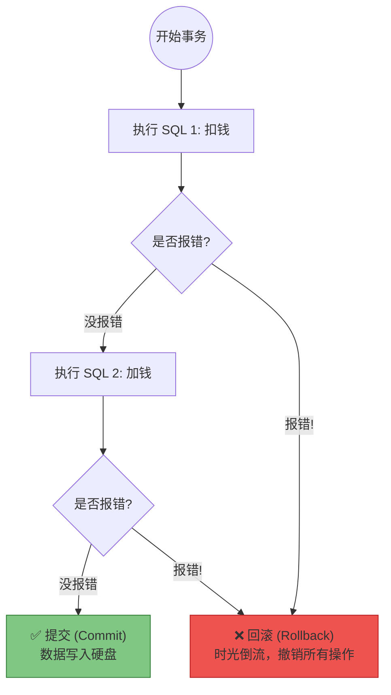

# 06. 事务管理：@Transactional 与 ACID

!!! quote "本节目标"
    在之前的代码中，我们是一个个独立的 SQL 操作。但在真实业务中，往往需要多条 SQL **“同生共死”**。
    
    最经典的场景就是**转账**：

    * 第一步：张三账户减 100 元。
    * 第二步：李四账户加 100 元。
    
    如果第一步成功了，但第二步报错了，会发生什么？**钱凭空消失了！**
    本节我们将学习数据库的**事务 (Transaction)** 机制，并掌握 Spring Boot 中只需一个注解就能搞定的 **`@Transactional`** 神器。

---

## 💸 第一步：危机时刻——钱没了？

我们先来看一个没有事务保护的“翻车现场”。

### 1. 模拟代码 (无事务)

```java
@Service
public class AccountService {

    @Autowired
    private AccountMapper accountMapper;

    public void transfer(int fromId, int toId, double money) {
        // 1. 扣钱 (张三 - 100)
        accountMapper.updateBalance(fromId, -money);
        
        // 模拟：突然断电或代码抛出异常
        int i = 1 / 0; 
        
        // 2. 加钱 (李四 + 100) —— 这一行永远不会执行！
        accountMapper.updateBalance(toId, +money);
    }
}

```

### 2. 后果

* **数据库状态**：张三的钱少了 100，但李四的钱没增加。
* **业务结果**：数据**不一致**，这是金融系统的严重事故。

---

## 🛡️ 第二步：事务与 ACID 理论

为了解决这个问题，数据库引入了 **事务 (Transaction)** 的概念。事务就是把一组操作打包成一个**原子包**：**要么全做，要么全不做**。

### 1. 核心理论：ACID

面试必考题，请务必理解（不要死记硬背）。

| 特性 | 英文 | 解释 (人话版) |
| --- | --- | --- |
| **原子性** | **A**tomicity | **同生共死**。这一组 SQL 是一个整体，不可分割。要么都成功，要么都失败。 |
| **一致性** | **C**onsistency | **守恒定律**。转账前后，张三和李四的钱加起来的总数必须不变。 |
| **隔离性** | **I**solation | **各玩各的**。我在转账时，别人查我的账户，要么看到转账前的数据，要么看到转账后的，不能看到中间扣了一半的状态。 |
| **持久性** | **D**urability | **落袋为安**。一旦事务提交，数据就永久写在硬盘里了，断电也不会丢。 |

### 2. 事务的运作流程



---

## ⚡ 第三步：Spring Boot 的魔法——@Transactional

在 JDBC 时代，我们需要手动写 `conn.setAutoCommit(false)` 和 `conn.commit()`。
在 Spring Boot 中，你只需要一个注解。

### 1. 加上注解

在 Service 类或方法上添加 **`@Transactional`**。

```java
@Service
public class AccountService {

    @Autowired
    private AccountMapper accountMapper;

    @Transactional // 👈 加上它，Spring 自动开启事务保护
    public void transfer(int fromId, int toId, double money) {
        
        accountMapper.updateBalance(fromId, -money);
        
        // 模拟异常
        int i = 1 / 0; 
        
        accountMapper.updateBalance(toId, +money);
    }
}

```

### 2. 效果验证

当 `1/0` 抛出异常时，Spring 会捕获到这个异常，并触发 **回滚 (Rollback)**。
你会发现，数据库里张三的余额**纹丝不动**，就像什么都没发生过一样。

---

## 🚧 第四步：避坑指南——事务失效的“元凶”

很多新手加了注解，发现事务还是没回滚。**90% 的原因是你把异常“吃掉”了！**

### ❌ 错误写法 (Swallowing Exceptions)

```java
@Transactional
public void transfer() {
    try {
        accountMapper.updateBalance(fromId, -money);
        int i = 1 / 0; // 报错
        accountMapper.updateBalance(toId, +money);
    } catch (Exception e) {
        // 😱 致命错误！你自己捕获了异常，但没抛出。
        // Spring 认为："哦，程序员自己处理了，没报错嘛，那我提交事务咯！"
        e.printStackTrace(); 
    }
}

```

### ✅ 正确写法 1：不捕获 (推荐)

让异常直接抛给 Controller，最后由全局异常处理器（GlobalExceptionHandler）去处理。

```java
@Transactional
public void transfer() {
    accountMapper.updateBalance(fromId, -money);
    int i = 1 / 0; 
    accountMapper.updateBalance(toId, +money);
}

```

### ✅ 正确写法 2：捕获并手动抛出

如果你非要自己 catch 做点记录，必须在 catch 块里再抛出一个 `RuntimeException`。

```java
@Transactional
public void transfer() {
    try {
        // ... 业务代码
    } catch (Exception e) {
        log.error("转账失败", e);
        // 🚨 必须抛出！告诉 Spring 出事了，需要回滚
        throw new RuntimeException(e); 
    }
}

```

!!! warning "Spring 的默认规则"
    默认情况下，`@Transactional` 只有遇到 **RuntimeException** (运行时异常) 或 **Error** 时才会回滚。
    如果抛出的是 `IOException` 等 **Checked Exception**，Spring 默认是**不回滚**的（除非你配置 `rollbackFor = Exception.class`）。

---

## 🤖 第五步：AI 辅助理解

事务隔离级别（Isolation Level）也是面试的重灾区，概念非常抽象。让 AI 帮你举例子。

!!! question "让 AI 解释隔离级别"
    **Prompt**:
    > "请用通俗易懂的例子（比如买票或转账）解释数据库事务的四大隔离级别：读未提交、读已提交、可重复读、串行化。说明它们分别解决了什么问题（脏读、不可重复读、幻读）？"

---

## 📝 总结

1. **为什么需要事务**：为了保证一组 SQL 操作的一致性（同生共死）。
2. **ACID**：原子性、一致性、隔离性、持久性。
3. **`@Transactional`**：Spring 的声明式事务注解，通常加在 Service 层的方法上。
4. **失效陷阱**：**千万不要在 try-catch 中吃掉异常**，否则事务无法回滚。

**下一步**：
所有的“招式”都学会了！

* 整合 MyBatis ✔️
* 动态 SQL ✔️
* 分页插件 ✔️
* 事务管理 ✔️

现在，我们有能力去完成本章的**大作业**了：**真正连接 openGauss 数据库，开发一个具备搜索、分页功能的完整用户管理模块**。

[👉 实验 4：数据落地——从内存 Map 到 openGauss](lab4.md){ .md-button .md-button--primary .md-button--block }
