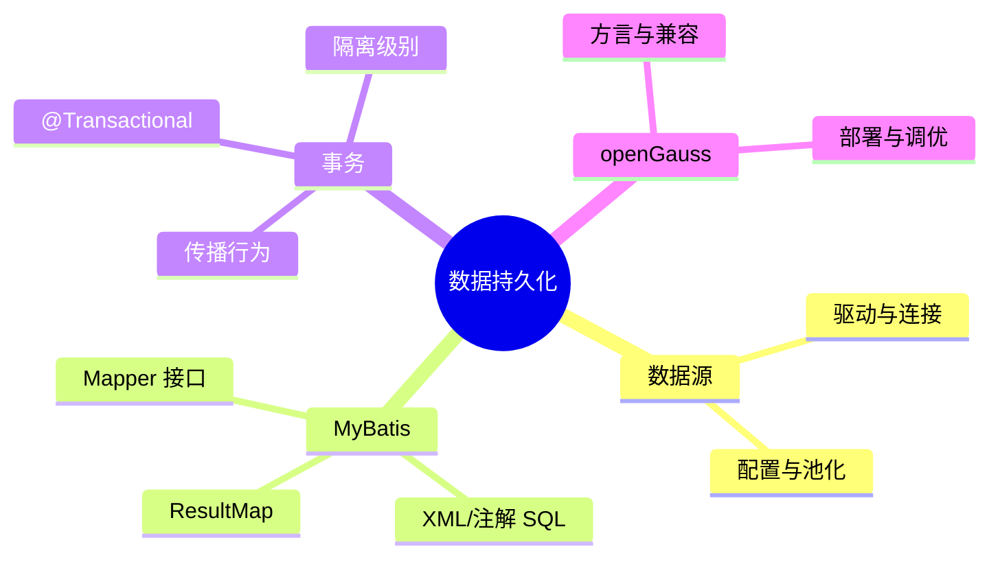

# 第4章 导读｜数据持久化与信创

> 聚焦 MyBatis 的 Mapper/CRUD/事务，配合 openGauss 完成国产数据库的连接与实战开发，强调 SQL 规范与事务一致性。

## 教学目标

- 会配置数据源并连通 openGauss。
- 掌握 MyBatis 的 Mapper 定义、参数与结果映射。
- 能编写事务性业务（如多表更新、扣减余票）。
- 了解信创环境下常见兼容性与部署要点。

## 知识结构

## 重点与易错点

- 参数占位与空值处理，批量操作的性能与边界。
- 事务的自调用失效、传播行为误用。
- openGauss 与 MySQL 语法差异及驱动配置。

## 实验与作业

- 实验4：航班数据管理（增删改查 + 事务）。
