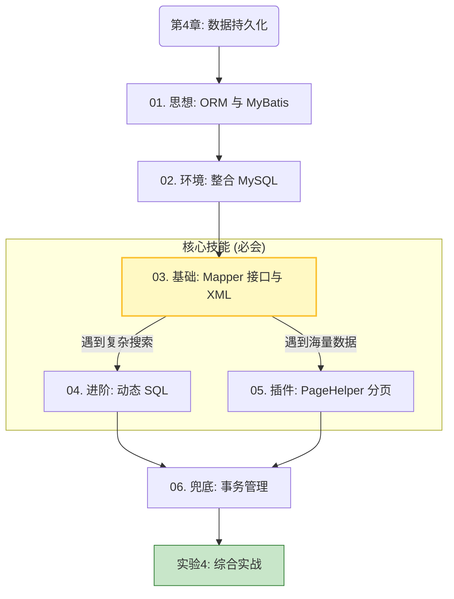

# 第4章 导读｜数据持久化

第四章是整个后端开发中最关键的转折点：我们不再在内存（Map）里玩“过家家”，而是要**从“面向对象”真正跨越到“面向关系型数据库”**，实现数据的永久存储。

这份目录规划非常符合**“企业级实战”**的教学方向。我们将以行业标准的 **MySQL** 为主战场，同时兼顾对国产数据库（信创）的认知拓展。

### 🗺️ 第4章 知识逻辑关系

这一章的知识点之间存在严格的**依赖关系**。我画了一张逻辑图，帮助理清思路。

---

### 📂 详细目录与内容规划

#### **📖 第4章 导读**

* **核心隐喻**: JDBC 是“手动挡”，Hibernate 是“无人驾驶”，MyBatis 是“自动挡”。
* **目的**: 建立信心，说明为什么我们要学这个框架（为了能精准控制 SQL）。

#### 🤔 [**01. ORM 思想与 MyBatis 初探**](01-orm-intro.md)

* **核心**: 痛点回顾与思想升级。
* **内容**:

    * **痛点**: 体验 JDBC 的繁琐样板代码（Boilerplate Code）。
    * **概念**: 图解 ORM（对象-关系映射）如何连接 Java 与数据库。
    * **对比**: 为什么互联网大厂首选 MyBatis？（强调对 SQL 的极致掌控力）。

#### 🔌 [**02. 整合数据库 (Spring Boot + MySQL)**](02-integrate-mysql.md)

* **核心**: 环境搭建与行业标准。
* **内容**:
    
    * **行业视野**: 介绍 openGauss/OceanBase 等国产数据库崛起的大趋势（拓展视野）。
    * **环境搭建**: 引入 `mybatis-starter` 和 `mysql-connector-j`。
    * **配置**: `application.properties` 连接池配置与连通性测试。

#### 🔥 [**03. 核心映射：Mapper 接口与 XML**](03-mapper-xml.md)

* **地位**: **本章最重要的一节**（核心基本功）。
* **内容**:
    
    * **双剑合璧**: 理解 Java 接口（菜单）与 XML（后厨）的绑定关系。
    * **实战**: 实现标准的 CRUD 操作。
    * **深坑**: 解决 `user_id` (数据库) 与 `userId` (Java) 命名不一致的 ResultMap 映射问题。

#### ⚡ [**04. 动态 SQL：MyBatis 的杀手锏**](04-dynamic-sql.md)

* **逻辑**: 基础 CRUD 只能做固定查询，业务中需要“多条件灵活搜索”。
* **内容**:
    
    * **`<if>`**: 智能判空（有名字查名字，没名字查全部）。
    * **`<where>`**: 自动处理 SQL 语法中的多余 `AND`。
    * **`<foreach>`**: 实现高性能的**批量插入**和**批量删除**。

#### 📄 [**05. 插件生态：PageHelper 分页查询**](05-pagehelper.md)

* **逻辑**: 数据量大了不能一次全查出来，必须分页。
* **内容**:
    
    * **原理**: 物理分页 (`LIMIT`) vs 逻辑分页的区别。
    * **实战**: 使用 PageHelper 实现一行代码分页 `PageHelper.startPage(...)`。
    * **避坑**: 级联查询与 ThreadLocal 分页参数污染问题。

#### 🛡️ [**06. 事务管理：@Transactional 与 ACID**](06-transaction.md)

* **逻辑**: 批量操作中途报错怎么办？
* **内容**:
    
    * **场景模拟**: 模拟“批量删除用户”时，删了一半系统崩溃，导致数据不一致。
    * **解决方案**: 使用 `@Transactional` 实现事务回滚。
    * **原理**: ACID 理论与 Spring 的声明式事务。

#### 🧪 [**实验 4：数据落地——从内存 Map 到数据库**](lab4.md)

* **任务目标**: 将之前实验中的“内存版”图书管理系统改造为“持久化版”。
* **核心任务**:
    
    * **大清洗**: 删除之前所有的 Mock 代码（静态 Map）。
    * **重构**: 编写真正的 `BookMapper` 接口与 XML。
    * **功能**: 实现一个包含 **“模糊搜索”** + **“分页展示”** 的完整图书管理接口。

---

### ❓ 关键决策点：关于 MyBatis-Plus

**问题：是否要讲 MyBatis-Plus (MP)？**

* **建议**：在**本章不讲**，或者只作为“扩展阅读”提一句。
* **理由**：MyBatis-Plus 封装程度很高，如果在学生还没理解 XML、ResultMap 和动态 SQL 原理之前直接上手 MP，会变成“知其然不知其所以然”。
* **策略**：本章让大家先通过 XML 感受 SQL 的力量和底层逻辑。等到期末大作业或者进阶章节，再引入 MP 作为“效率神器”。
