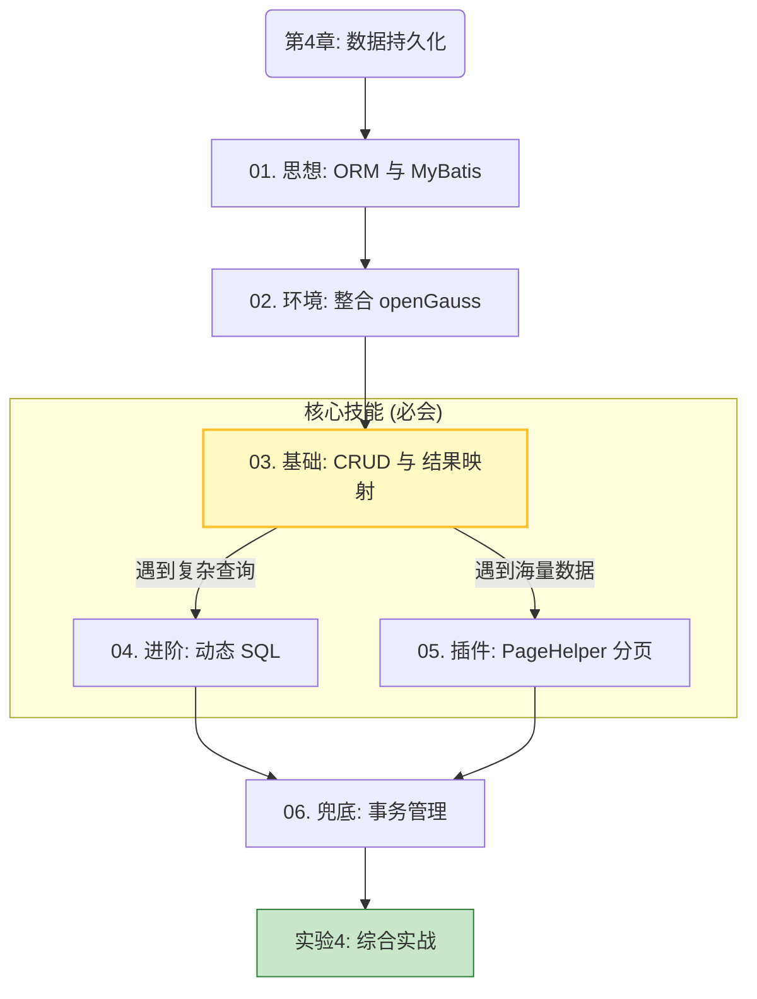

# 第4章 导读｜数据持久化与信创
这份目录规划非常符合**“信创国产化”**和**“企业级实战”**的教学方向。
第四章是整个后端开发中最关键的转折点：**从“面向对象”真正跨越到“面向关系型数据库”**。


### 第4章 知识逻辑关系
这一章的知识点之间存在严格的**依赖关系**。我画了一张逻辑图，帮助理清思路。

---

### 📂 详细目录与内容规划

#### **📖 第4章 导读**

* **文件**: `chapter04/index.md`
* **核心隐喻**: JDBC 是“手动挡”，Hibernate 是“无人驾驶”，MyBatis 是“自动挡”。
* **目的**: 建立信心，说明为什么我们要学这个框架（为了能精准控制 SQL）。

#### **01. ORM 思想与 MyBatis 初探**

* **文件**: `chapter04/01-orm-intro.md`
* **内容**:
  
    * **痛点回顾**: JDBC 的样板代码（Boilerplate Code）有多繁琐。
    * **概念**: ORM（对象-关系映射）图解。
    * **对比**: 为什么互联网大厂和信创选 MyBatis 而不是 Hibernate？（强调 SQL 可控性）。


#### **02. 整合信创数据库 (Spring Boot + openGauss)**

* **文件**: `chapter04/02-integrate-gauss.md`
* **内容**:
  
    * **信创背景**: 介绍 openGauss/OceanBase 等国产数据库崛起的大趋势。
    * **实战**: 引入 `mybatis-starter` 和 `opengauss-jdbc` 依赖。
    * **配置**: 在 `application.properties` 中完成连接池配置。
    * **验证**: 编写单元测试确保能成功连接数据库。


#### **🔥 03. 核心映射：Mapper 接口与 XML**

* **文件**: `chapter04/03-mapper-xml.md`
* **地位**: **本章最重要的一节**（核心基本功）。
* **内容**:
  
* **双剑合璧**: Java 接口 (`UserMapper.java`) 与 XML (`UserMapper.xml`) 如何通过 `namespace` 绑定。
* **基本 CRUD**: `<select>`, `<insert>`, `<update>`, `<delete>` 标签的使用。
* **结果映射 (ResultMap)**: 重点解决数据库 `user_id` 与 Java `userId` 命名不一致的问题（新手最大的坑）。
* **注解**: `@Mapper` 与 `@MapperScan` 的区别与使用。


#### **⚡ 04. 动态 SQL：MyBatis 的杀手锏**

* **文件**: `chapter04/04-dynamic-sql.md`
* **逻辑**: 基础 CRUD 只能做固定查询，但在业务中通常需要“多条件灵活搜索”。
* **内容**:
  
* **`<if>`**: 判空逻辑（有名字查名字，没名字查全部）。
* **`<where>`**: 智能去除 SQL 语句中多余的 `AND`。
* **`<foreach>`**: 批量删除/批量插入（提升性能的关键技术）。


#### **📄 05. 插件生态：PageHelper 分页查询**

* **文件**: `chapter04/05-pagehelper.md`
* **逻辑**: 数据量大了不能一次全查出来，必须分页。
* **内容**:
* **原理**: 物理分页 (`LIMIT`) vs 逻辑分页的区别。
* **实战**: 引入 PageHelper，一行代码实现分页 `PageHelper.startPage(1, 10)`。
* **封装**: 如何将分页结果封装给前端 (`PageInfo` -> `Result`)。


#### **🛡️ 06. 事务管理：@Transactional 与 ACID**

 06. 事务管理：@Transactional 与 ACID  06-transaction.md
* **文件**: `chapter04/06-transaction.md`
* **逻辑**: 写操作多了，如何保证数据一致性？
* **内容**:
* **场景模拟**: 模拟转账失败，钱丢了的严重后果。
* **解决方案**: `@Transactional` 注解的使用。
* **原理简介**: AOP 代理与数据库事务的提交/回滚机制。


#### **🧪 实验 4：数据落地——从内存 Map 到 openGauss**

* **文件**: `chapter04/lab4.md`
* **任务**:
* **清理**: 将第三章 `UserService` 中的 Mock 代码（静态 Map）全部删除。
* **连接**: 真正连接 openGauss 数据库。
* **功能**: 实现一个包含 **“模糊搜索”** + **“分页展示”** 的用户列表接口。

### 💡 各小节内容设计建议 (Teacher Chen's Notes)

#### 1. 导读 (`index.md`)

* **痛点回顾**：还记得 JDBC 里拼字符串写 SQL 的痛苦吗？还记得手动封装 `ResultSet` 的繁琐吗？
* **引入**：MyBatis 帮我们完成了 90% 的脏活累活，我们只需要专注 SQL 本身。

#### 2. 整合信创数据库 (`02-integrate-gauss.md`)

* **信创特色**：这里要专门强调 **openGauss** 的连接配置，因为它和 MySQL 略有不同（虽然兼容 PG 协议）。
* **配置示例**：
```yaml
spring:
  datasource:
    # ⚠️ 注意：openGauss 使用 PostgreSQL 驱动
    driver-class-name: org.opengauss.Driver 
    # 或者 org.postgresql.Driver (视版本而定)
    url: jdbc:opengauss://localhost:5432/postgres
    username: gaussdb
    password: SecretPassword@123
mybatis:
  mapper-locations: classpath:mapper/*.xml
  configuration:
    map-underscore-to-camel-case: true # 开启驼峰映射

```


#### 3. 动态 SQL (`04-dynamic-sql.md`)

* **教学价值**：这是 MyBatis 区别于其他 ORM 最亮眼的功能。
* **场景**：用户搜索时，有时只输名字，有时只输电话，有时都输。
* **代码**：
```xml
<select id="search" resultType="User">
  SELECT * FROM t_user
  <where>
    <if test="username != null">AND username like #{username}</if>
    <if test="phone != null">AND phone = #{phone}</if>
  </where>
</select>

```


#### 4. 事务管理 (`06-transaction.md`)

* **教学法**：不要只讲概念。
* **反面教材**：演示没有事务时，A 扣钱了，报错了，B 没加钱 —— **钱丢了！**
* **正面教材**：加上 `@Transactional`，报错后 A 的钱自动回滚。

#### 5. 实验 4 (`lab4.md`)

* **核心任务**：
1. 建表脚本 (`user.sql`)。
2. 删除 `ConcurrentHashMap` 的模拟代码。
3. 编写 `UserMapper` 接口。
4. 编写 `UserMapper.xml`。
5. Service 层调用 Mapper。


---

### ❓ 关键决策点

**问题：是否要讲 MyBatis-Plus (MP)？**

* **建议**：在**本章不讲，或者只作为“扩展阅读”提一句**。
* **理由**：MyBatis-Plus 封装得太好了，学生如果直接学 MP，会完全不懂 SQL 是怎么执行的，也不懂什么是 ResultMap。
* **策略**：先让学生在第4章痛苦地写一下 XML，感受 SQL 的力量。等到期末大作业或者进阶章节，再引入 MP 作为“效率神器”。

您觉得这个安排是否合理？如果没有问题，我可以帮您先撰写 **“02. 整合信创数据库 (Spring Boot + openGauss)”** 这一节，把环境先配通。
