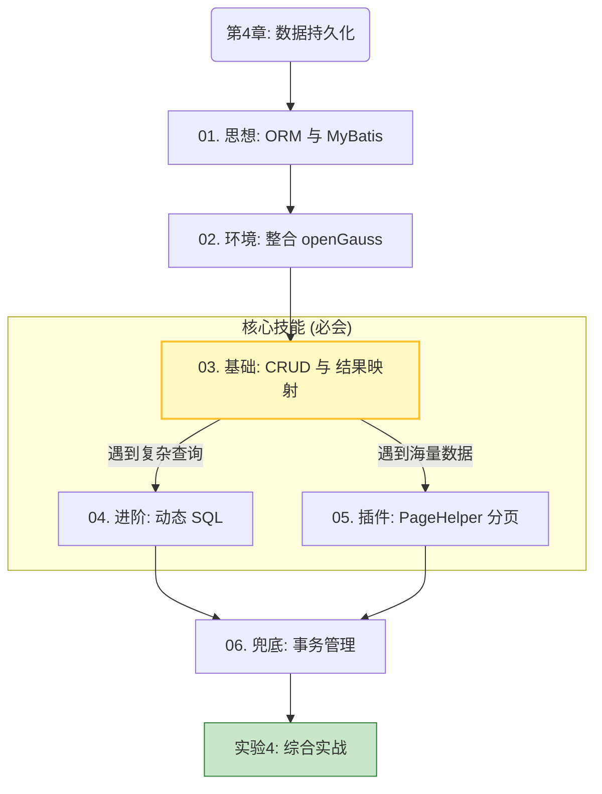

### 🗺️ 第四章：教学逻辑全景图

这一章的知识点之间存在严格的**依赖关系**。我画了一张逻辑图，帮助学生（和您）理清思路：

---

### 📂 详细目录与内容规划

#### **第4章 导读**

* **文件**: `chapter04/index.md`
* **核心隐喻**: JDBC 是“手动挡”，Hibernate 是“无人驾驶”，MyBatis 是“自动挡”。
* **目的**: 建立信心，说明为什么我们要学这个框架（为了能精准控制 SQL）。

#### **01. ORM 思想与 MyBatis 初探**

* **文件**: `chapter04/01-orm-intro.md`
* **内容**:
* 痛点回顾：JDBC 的样板代码（Boilerplate Code）。
* 概念：ORM（对象-关系映射）图解。
* 对比：为什么互联网大厂和信创选 MyBatis 而不是 Hibernate？（强调 SQL 可控性）。

#### **02. 整合信创数据库 (Spring Boot + openGauss)**

* **文件**: `chapter04/02-integrate-gauss.md`
* **内容**:
* **信创背景**: 介绍 openGauss/OceanBase 等国产数据库。
* **实战**: 引入 `mybatis-starter` 和 `opengauss-jdbc`。
* **配置**: `application.properties` 连接池配置。
* **验证**: 写个单元测试确保能连上。

#### **03. 核心映射：Mapper 接口与 XML**

* **文件**: `chapter04/03-mapper-xml.md`
* **地位**: **🔥 本章最重要的一节**。
* **内容**:
* **双剑合璧**: Java 接口 (`UserMapper.java`) 与 XML (`UserMapper.xml`) 如何通过 `namespace` 绑定。
* **基本 CRUD**: `select`, `insert`, `update`, `delete` 标签。
* **结果映射 (ResultMap)**: 重点解决数据库 `user_id` 与 Java `userId` 不一致的问题（这是新手最大的坑）。
* **注解**: `@Mapper` 与 `@MapperScan`。

#### **04. 动态 SQL：MyBatis 的杀手锏**

* **文件**: `chapter04/04-dynamic-sql.md`
* **逻辑**: 基础 CRUD 只能做固定查询，但业务通常需要“多条件搜索”。
* **内容**:
* `<if>`: 判空（有名字查名字，没名字查全部）。
* `<where>`: 智能去除多余的 `AND`。
* `<foreach>`: 批量删除/批量插入（提升性能的关键）。

#### **05. 插件生态：PageHelper 分页查询**

* **文件**: `chapter04/05-pagehelper.md`
* **逻辑**: 数据多了不能一次全查出来，需要分页。
* **内容**:
* 原理：物理分页 (`LIMIT`) vs 逻辑分页。
* 实战：引入 PageHelper，一行代码实现分页 `PageHelper.startPage(1, 10)`。
* 封装：如何将分页结果封装给前端 (`PageInfo` -> `Result`).

#### **06. 事务管理：@Transactional 与 ACID**

* **文件**: `chapter04/06-transaction.md`
* **逻辑**: 写操作多了，如何保证数据一致性？
* **内容**:
* 场景模拟：转账失败，钱丢了。
* 解决方案：`@Transactional` 注解。
* 原理简介：AOP 代理与数据库事务的提交/回滚。

#### **实验 4：数据落地——从内存 Map 到 openGauss**

* **文件**: `chapter04/lab4.md`
* **任务**:
* 将第三章 `UserService` 中的 Mock 代码全部删除。
* 真正连接 openGauss 数据库。
* 实现一个包含“模糊搜索”+“分页展示”的用户列表接口。

---

### 💡 为什么这么排序？（给陈老师的教学建议）

1. **02 和 03 分开**：配置环境（02）和写业务代码（03）通常是两个维度的认知。如果混在一起，学生报错时不知道是网不通，还是 SQL 写错了。分开能降低排错难度。
2. **ResultMap 放在 03**：很多教材把 `ResultMap` 放在进阶里，但我建议放在基础里。因为现在的数据库规范通常是下划线（`create_time`），Java 是驼峰（`createTime`）。**如果不讲 ResultMap 或 mapUnderscoreToCamelCase，学生第一写代码查出来全是 null，打击积极性。**
3. **动态 SQL 单独一节**：这是 MyBatis 区别于 JPA 最明显的优势，也是期末考试/面试的重点，值得单独拿出来讲。

您觉得这个梳理是否清晰？如果没有问题，我们接下来就可以按照这个顺序，从 **03. 核心映射** 开始继续撰写了。