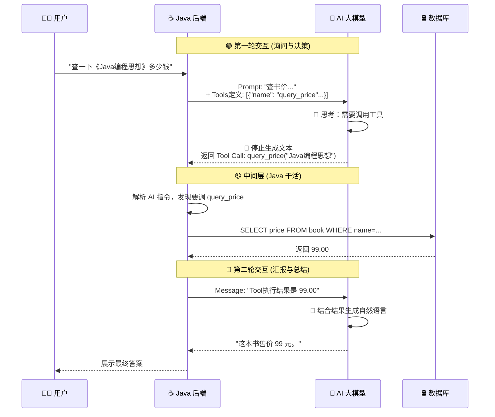

# 04. 赋予 AI 双手：Tool Calling (Function Calling)

!!! quote "🔥 本节目标：从 Chatbot 到 Agent"
    之前的章节中，AI 只是一个**“缸中之脑”**：它知识渊博，但没有手脚，无法连接现实世界（数据库、文件、API）。


    * **用户问**：“《Java编程思想》现在卖多少钱？”
    * **AI (委屈)**：“我不知道...我的训练数据截止到 2023 年，而且我无法访问你的书店数据库。”

    今天，我们要给 AI 装上**“双手”**，让它能**自主决定**调用我们的 Java 方法去查数据库！


---

## 🤯 第一部分：核心原理——“三明治”交互模式

很多同学误以为 Tool Calling 是 AI 自己去运行 Java 代码。
**错！AI 绝不会运行代码，它只是“发号施令”。**

整个过程像一个“三明治”：

1. **第一层面包 (第一次请求)**：

    * **Java**: “用户问《Java编程思想》多少钱。另外，我有这些工具：`query_price(book_name)`...”
    * **AI**: (思考：我不知道价格，但我看你有工具) -> **“请帮我调用 `query_price`，参数是 `Java编程思想`。”**


2. **中间的肉 (Java 执行)**：

    * **Java**: 收到 AI 的指令 -> 拦截 -> **查数据库** -> 拿到结果 `99.00`。


3. **第二层面包 (第二次请求)**：

    * **Java**: “工具执行完了，结果是 `99.00`。”
    * **AI**: (结合结果生成回复) -> **“这本书的价格是 99 元。”**




---

## 🛠️ 第二部分：定义工具 (Schema)

AI 怎么知道你有 `query_price` 这个方法？我们需要用 JSON 告诉它。
这也就是我们在上一节学的 **JSON Schema** 的用武之地。

```json
// 这是一个告诉 AI 的“工具说明书”
{
  "type": "function",
  "function": {
    "name": "query_price",
    "description": "查询书店中某本书的当前售价",
    "parameters": {
      "type": "object",
      "properties": {
        "book_name": {
          "type": "string",
          "description": "书籍的名称，例如 'Java编程思想'"
        }
      },
      "required": ["book_name"]
    }
  }
}

```

---

## 💻 第三部分：实战——手撸 Tool Calling

为了让大家看清本质，我们先不使用高级框架（如 Spring AI），而是**手动实现**这个闭环。

### 1. 模拟数据库服务

先写一个简单的 Service，假装在查库。

```java title="BookService.java"
public class BookService {
    public double queryPrice(String bookName) {
        System.out.println("===> 正在查询数据库: " + bookName);
        if (bookName.contains("Java")) return 99.00;
        if (bookName.contains("Python")) return 88.50;
        return 0.00;
    }
}

```

### 2. 完整调用逻辑 (ToolAgentTest.java)

这是本章最长的一段代码，请耐心读完注释，它完整展示了 Agent 的思考过程。

```java title="ToolAgentTest.java"
package com.example.demo;

import com.fasterxml.jackson.databind.JsonNode;
import com.fasterxml.jackson.databind.ObjectMapper;
import org.junit.jupiter.api.Test;
import org.springframework.web.client.RestClient;
import org.springframework.http.MediaType;

import java.util.ArrayList;
import java.util.List;
import java.util.Map;

@SpringBootTest
public class ToolAgentTest {

    private static final String API_KEY = "sk-你的Token";
    private static final String API_URL = "https://api-inference.modelscope.cn/v1/chat/completions";
    private final ObjectMapper objectMapper = new ObjectMapper();
    private final BookService bookService = new BookService(); // 我们的“工具”

    @Test
    void testToolCalling() throws Exception {
        RestClient client = RestClient.builder()
                .baseUrl(API_URL)
                .defaultHeader("Authorization", "Bearer " + API_KEY)
                .build();

        // 1. 定义工具描述 (Tools Schema)
        // 告诉 AI：我有这个本事，你看着用
        List<Map<String, Object>> tools = List.of(
            Map.of(
                "type", "function",
                "function", Map.of(
                    "name", "query_price",
                    "description", "查询图书价格",
                    "parameters", Map.of(
                        "type", "object",
                        "properties", Map.of(
                            "book_name", Map.of("type", "string", "description", "书名")
                        ),
                        "required", List.of("book_name")
                    )
                )
            )
        );

        // 2. 初始化对话历史
        List<Map<String, Object>> messages = new ArrayList<>();
        messages.add(Map.of("role", "user", "content", "帮我查一下《Java编程思想》多少钱？"));

        // ==========================================
        // Round 1: 发送问题 + 工具定义
        // ==========================================
        System.out.println("🤖 Round 1: AI 思考中...");
        Map<String, Object> requestBody1 = Map.of(
            "model", "deepseek-ai/DeepSeek-R1-0528", // 建议用 Qwen 或 DeepSeek-V3，对工具支持更好
            "messages", messages,
            "tools", tools
        );

        String response1 = client.post().contentType(MediaType.APPLICATION_JSON)
                .body(objectMapper.writeValueAsString(requestBody1))
                .retrieve().body(String.class);

        // 解析 AI 的响应
        JsonNode responseNode = objectMapper.readTree(response1);
        JsonNode choice = responseNode.path("choices").get(0);
        JsonNode message = choice.path("message");

        // 3. 检查 AI 是否想要调用工具
        if (message.has("tool_calls")) {
            JsonNode toolCall = message.path("tool_calls").get(0);
            String functionName = toolCall.path("function").path("name").asText();
            String arguments = toolCall.path("function").path("arguments").asText();

            System.out.println("🚨 AI 请求调用工具: " + functionName + " | 参数: " + arguments);

            // ==========================================
            // Round 2: Java 执行代码 (中间层)
            // ==========================================
            double price = 0.0;
            if ("query_price".equals(functionName)) {
                // 解析参数 {"book_name": "Java编程思想"}
                String bookName = objectMapper.readTree(arguments).path("book_name").asText();
                // 真正的干活！！！
                price = bookService.queryPrice(bookName);
            }

            // ==========================================
            // Round 3: 把结果喂回给 AI
            // ==========================================
            // 3.1 把 AI 刚才的 "Tool Call" 请求加入历史 (必须加，否则 AI 会断片)
            // 注意：这里需要构造一个符合 OpenAI 标准的 assistant message
            // 为了演示简单，我们直接把 AI 原始返回的 message 塞回去
            // (实际开发中需要严谨构造对象)
            
            // 3.2 构造 "Tool 运行结果" 消息
            Map<String, Object> toolOutputMessage = Map.of(
                "role", "tool",
                "content", String.valueOf(price), // 告诉它：结果是 99.0
                "tool_call_id", toolCall.path("id").asText() // 对应刚才的请求 ID
            );
            
            // 这里的 messages 列表逻辑比较复杂，为了演示核心流程，我们直接发一个新的请求
            // 告诉 AI：这是刚才那个工具的结果，请总结
            System.out.println("🤖 Round 2: 拿着结果 (99.0) 再次问 AI...");
            
            String promptWithContext = """
                用户问：《Java编程思想》多少钱？
                你决定调用工具 query_price。
                工具返回结果：99.0。
                请根据结果回复用户。
                """;
                
             Map<String, Object> finalRequest = Map.of(
                "model", "deepseek-ai/DeepSeek-R1-0528",
                "messages", List.of(Map.of("role", "user", "content", promptWithContext))
            );
            
            String finalResponse = client.post().contentType(MediaType.APPLICATION_JSON)
                .body(objectMapper.writeValueAsString(finalRequest))
                .retrieve().body(String.class);
                
            System.out.println("✅ 最终答案: " + extractContent(finalResponse));
        }
    }

    private String extractContent(String json) throws Exception {
        return objectMapper.readTree(json).path("choices").get(0).path("message").path("content").asText();
    }
}

```

### 3. 运行结果

```text
🤖 Round 1: AI 思考中...
🚨 AI 请求调用工具: query_price | 参数: {"book_name": "Java编程思想"}
===> 正在查询数据库: Java编程思想
🤖 Round 2: 拿着结果 (99.0) 再次问 AI...
✅ 最终答案: 《Java编程思想》的价格是 99.0 元。

```

---

## 🔍 第四部分：Agent (智能体) 的诞生

恭喜你！当你跑通上面的代码时，你编写的程序就不再是一个简单的“对话框”，而是一个 **Agent (智能体)** 的雏形。

**公式：Agent = LLM (大脑) + Memory (记忆) + Tools (手脚)**

* **Chatbot**: 只能陪你聊它训练库里有的东西。
* **Agent**: 能根据你的指令，去操作数据库、发邮件、订机票。

### 痛点：手动拼接太累了

你肯定发现了，上面代码中处理 `tool_calls` JSON 的过程非常繁琐且容易出错。
这就是为什么我们需要 **LangChain4j** 或 **Spring AI** 这样的高级框架，它们把这些“脏活累活”都封装好了。但在使用框架之前，**理解底层的 HTTP 交互原理**是至关重要的。

---

## 🔌 预告：简化开发：拥抱Spring AI框架

**下一步**：Spring 官方也看到了 AI 的潜力，推出了 **Spring AI** 框架来简化这些步骤。现在，让我们先庆祝一下你已经掌握了 AI 开发的底层原理！🚀

[下一节：简化开发：拥抱Spring AI框架](05-spring-ai.md){ .md-button .md-button--primary }