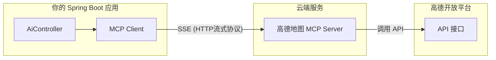

# 05. 未来的标准：MCP (Model Context Protocol) 简介

!!! quote "🔌 本节目标：从“手搓线缆”到“USB 即插即用”"
    在第四节中，为了让 AI 查一个书价，我们写了整整 50 行代码来定义 JSON Schema、解析参数、回传结果。
    在第五节中，需要定义一个Tool Calling 来对接AI完成查书的功能。
    
    试想一下：如果你想把你的 **MySQL 数据库**、**本地日志文件**、**Home Lab 里的 NAS** 全部开放给 AI，难道要为每一个服务都手写一遍 Tool Calling 代码吗？
    
    **MCP (Model Context Protocol)** 的出现，就是为了解决这个“连接噩梦”。它是 AI 时代的 **USB 协议**。本节我们将使用 Spring AI 最新的 **MCP Client Starter**，演示如何一行代码不写，给 AI 装上“高德地图”。

---

## 🕸️ 第一部分：为什么我们需要 MCP？

### 现状：巴别塔的混乱
目前，每家 AI 厂商的连接方式都不一样：

* **OpenAI** 有自己的 Assistants API。
* **Claude** 有自己的 Tool Use 格式。
* **LangChain** 有自己的封装。

如果你写了一个 Java 方法 `queryStudentInfo()`，你想让 Cursor 编辑器能用它，想让 Claude Desktop 能用它，又想让自己的 Web 官网能用它，你需要写三套适配代码。这就是**数据孤岛**。

### 解决方案：MCP 协议

**MCP (Model Context Protocol)** 是一个开放标准。它规定了：  
1.  **AI 应该怎么问**（标准化的请求格式）。  
2.  **程序应该怎么答**（标准化的资源、提示词和工具格式）。  

**一句话总结**：只要你的 Java 程序支持 MCP 标准，它就可以被**任何**支持 MCP 的 AI 客户端直接连接，无需改代码！

---

## 🏗️ 第二部分：核心架构三剑客

MCP 的架构非常像我们熟悉的 C/S (客户端/服务端) 模式：

| 角色 | 比喻 | 职责 | 本案例中的对应 |
| :--- | :--- | :--- | :--- |
| **MCP Host** | **电脑主机** | 运行 AI 模型的主程序。 | **你的 Spring Boot 应用** |
| **MCP Client** | **USB 接口** | Host 内部的连接器。 | **Spring AI MCP Starter** |
| **MCP Server** | **U 盘 / 鼠标** | 提供数据和工具能力。 | **高德地图 MCP 服务 (云端)** |



---


## 🚀 第三部分：实战 - 给 AI 装上“高德地图”

以前我们要让 AI 具备查询路线的能力，需要在 Java 代码里写一堆 HTTP 请求去对接高德 API。
现在，利用 **Spring AI MCP Client**，我们只需要做配置，**不需要写任何工具定义代码**。

### 步骤 1：部署 MCP Server (服务端)

我们在 **ModelScope (魔搭)** 平台上，使用现成的高德 MCP Server。

1. 访问 ModelScope 的MCP专区：[ https://www.modelscope.cn/mcp](https://www.modelscope.cn/mcp)，找到[高德地图的MCP](https://www.modelscope.cn/mcp/servers/@amap/amap-maps)。
2. 选择`Remote`, 传输类型选择`SSE`, 填入 `AMAP_MAPS_API_KEY` (你申请的高德 API_Key)。
{ width="50%" height="200px" .shadow }{ width="50%" height="200px" .shadow }
3. 点击连接，获得一个 **SSE URL** (例如：`https://mcp.api-inference.modelscope.net/35ab39184eba47/sse`)。

> *注：这个 Server 是别人写好的，符合 MCP 标准，我们直接连就行！*

部署完成后，你会获得一个 **SSE URL**。
当我们将这个 URL 填入 **MCP Client** (如 [Cherry Studio](https://www.cherry-ai.com/) 或我们的 Java 程序) 后，AI 瞬间就学会了以下技能：

* `amap_weather_info`: 查询天气。
* `amap_search_places`: 搜索地点（找美食、找加油站）。
* `amap_direction_driving`: 规划驾车路线。


### 步骤 2：引入 Maven 依赖

在 `pom.xml` 中引入 Spring AI 的 MCP 客户端启动器：

```xml
<dependency>
    <groupId>org.springframework.ai</groupId>
    <artifactId>spring-ai-starter-mcp-client</artifactId>
</dependency>

```

### 步骤 3：配置 application.properties

这是最神奇的一步。我们不需要写 Java 代码来注册工具，只需要在配置文件中告诉 Spring Boot 去哪里连接 MCP Server。

```properties
# 1. 开启 MCP 功能
spring.ai.mcp.client.enabled=true
spring.mvc.async.request-timeout=600000
spring.ai.mcp.client.type=ASYNC

# 2. 配置高德 MCP Server 的连接信息
# 给这个连接起个名字叫 amap
# 将申请到的 SSE URL:https://mcp.api-inference.modelscope.net/35ab39184eba47/sse 
# 分成两部分别填入到url和sse-endpoint
spring.ai.mcp.client.sse.connections.amap.url=https://mcp.api-inference.modelscope.net
spring.ai.mcp.client.sse.connections.amap.sse-endpoint=/35ab39184eba47/sse
```

### 步骤 4：编写 Controller

在 `AiController` 中，我们像往常一样使用 `ChatClient`。Spring AI 会自动扫描配置好的 MCP Server，发现里面的工具（查天气、搜地点等），并自动挂载到 `ChatClient` 上。

```java
@RestController
@RequestMapping("/ai")
public class AiController {

    private final ChatClient chatClient;

    // 构造器注入：Spring AI 自动配置好的 Builder
    public AiController(ChatClient.Builder builder, List<McpAsyncClient> mcpAsyncClients) {
        this.chatClient = builder
                .defaultToolCallbacks(new AsyncMcpToolCallbackProvider(mcpAsyncClients))
                .build();
    }

    @GetMapping("/chat")
    public String chat(@RequestParam String message) {
        // 🚀 核心：这里不需要手动指定 .functions(...)
        // MCP Starter 已经自动把远程的高德工具“插”进来了
        return chatClient.prompt(message)
                .call()
                .content();
    }
}
```

---

###  这个案例说明了什么？

* **即插即用**：高德地图官方（或社区）写好了一次 MCP Server，全世界的 AI 都能直接用，不需要每个开发者重复造轮子。
* **云端与本地的连接**：你的 Java 程序运行在本地，高德 MCP 运行在云端 (ModelScope)，两者通过 MCP 协议无缝协作。

---

## ☁️ 第四部分：见证魔法

注意看，我们**不需要**告诉 AI “高德地图的 API 文档是什么”，也不需要定义 Schema。连接成功后，直接问：
启动 Spring Boot 应用，访问你的接口：

**请求 URL**：
`http://localhost:8080/ai/chat?message=我在武汉工商学院，想去最近的茶颜悦色喝奶茶，开车要多久？`

**后台发生的真实交互 (Logs)**：

1. **Spring Boot (Client)** 连接到 **ModelScope (Server)**。
2. Client 询问：“你有哪些本事？” Server 回答：“我会 `amap_search_places` 和 `amap_direction_driving`”。
3. **AI (大模型)** 思考后决定调用工具。
4. Client 发送指令给 Server：`execute amap_search_places("茶颜悦色", "武汉")`。
5. Server 返回：“最近的是白沙洲店...”。
6. Client 再次发送指令：`execute amap_direction_driving(...)`。
7. Server 返回：“耗时 15 分钟”。

**浏览器响应**：

> "帮你查到了，距离武汉工商学院最近的茶颜悦色是**白沙洲店**，大约 3.5 公里。目前路况通畅，**开车大约需要 15 分钟**。"

---

## 🆚 总结：Tool Calling vs MCP

| 特性 | Tool Calling  | MCP |
| --- | --- | --- |
| **连接方式** | **硬编码** (Hardcoded) | **标准化协议** (Standard Protocol) |
| **代码量** | 50+ 行 (定义 Request, Response, Function) | **0 行** (仅配置) |
| **发现机制** | 手动告诉 AI 有哪些工具 | AI 自动询问 Server 有哪些能力 |
| **复用性** | 低 (只能当前项目用) | **极高** (任何支持 MCP 的 AI 都能连) |
| **维护成本** | 高 (高德 API 变了你要改代码) | **低** (服务端升级，客户端无感) |
| **模式** | 本地硬编码 | **远程即插即用** |

**总结： MCP 的价值**  
**标准化**: 你不再需要为每个外部工具写特定的 Java 代码 (Function<T, R>)。只要该工具符合 MCP 标准，Spring AI 就能直接“插拔”使用。  
**解耦**: 实际的工具逻辑（Python, TS, Go）与 Spring AI 应用逻辑分离。  
**生态复用**: 你可以直接连接社区现有的 MCP Server（如 Google Drive, Slack, Postgres），而无需重新造轮子。  

### 🔮 展望

**MCP 是 AI 应用开发的下一个里程碑。**

在未来的 **Agent 开发** 中，你将不再是一个“写接口的人”，而是一个**“连接者”**，而是一个**“为 AI 构建感知器官（Context）和执行器官（Tools）的造物主”**。你只需要在配置文件里填入各种 MCP Server 的地址（数据库 MCP、文件系统 MCP、微信 MCP...），你的 AI 就瞬间拥有了三头六臂。

---

!!! success "第五章通关"
    恭喜你完成了 **《Java 与 AI 的握手》** 这一章！

    1.  你学会了把 Java 当浏览器用 (**Http Client**)。
    2.  你学会了用 Java 管理提示词 (**Prompt**)。
    3.  你学会了让 AI 说人话 (**JSON Parsing**)。
    4.  你甚至赋予了 AI 双手 (**Tool Calling**)。
    5.  你还了解了未来的标准 (**MCP**)。


[返回目录](index.md){ .md-button }


