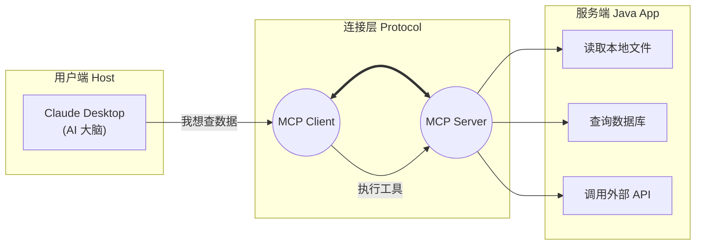

# 05. 未来的标准：MCP (Model Context Protocol) 简介

!!! quote "🔌 本节目标：从“手搓线缆”到“USB 即插即用”"
    在上一节 `04-tool-calling.md` 中，为了让 AI 查一个书价，我们写了整整 50 行代码来定义 JSON Schema、解析参数、回传结果。
    
    试想一下：如果你想把你的 **MySQL 数据库**、**本地日志文件**、**Home Lab 里的 NAS** 全部开放给 AI，难道要为每一个服务都手写一遍 Tool Calling 代码吗？
    
    **MCP (Model Context Protocol)** 的出现，就是为了解决这个“连接噩梦”。它是 AI 时代的 **USB 协议**。

---

## 🕸️ 第一部分：为什么我们需要 MCP？

### 现状：巴别塔的混乱
目前，每家 AI 厂商的连接方式都不一样：

* **OpenAI** 有自己的 Assistants API。
* **Claude** 有自己的 Tool Use 格式。
* **LangChain** 有自己的封装。

如果你写了一个 Java 方法 `queryStudentInfo()`，你想让 Cursor 编辑器能用它，想让 Claude Desktop 能用它，又想让自己的 Web 官网能用它，你需要写三套适配代码。这就是**数据孤岛**。

### 解决方案：MCP 协议
**MCP (Model Context Protocol)** 是一个开放标准。它规定了：  
1.  **AI 应该怎么问**（标准化的请求格式）。  
2.  **程序应该怎么答**（标准化的资源、提示词和工具格式）。  

**一句话总结**：只要你的 Java 程序支持 MCP 标准，它就可以被**任何**支持 MCP 的 AI 客户端（如 Claude Desktop, Cursor, IDEs）直接连接，无需改代码！

---

## 🏗️ 第二部分：核心架构三剑客

MCP 的架构非常像我们熟悉的 C/S (客户端/服务端) 模式，但角色略有不同：

| 角色 | 比喻 | 职责 | 典型代表 |
| :--- | :--- | :--- | :--- |
| **MCP Host** | **电脑主机** | 运行 AI 模型的宿主程序，负责发起请求。 | Claude Desktop App, Cursor, Zed 编辑器 |
| **MCP Client** | **USB 接口** | Host 内部的连接器，负责与 Server 建立连接 (1:1 或 1:N)。 | Host 内置模块 |
| **MCP Server** | **U 盘 / 鼠标** | **Java 程序员要开发的部分！** 提供数据和工具能力。 | 你写的 Spring Boot 应用 |



---

## 🚀 第三部分：MCP 的三大能力

一旦你的 Java 程序实现了 MCP Server，它就能向 AI 提供三种能力：

### 1. Resources (资源) —— "给 AI 看文件"

类似于**只读权限**。

* **场景**：让 AI 读取你的服务器日志 (`app.log`) 或数据库 schema。
* **效果**：AI 可以直接读取内容作为上下文，不需要你手动复制粘贴。

### 2. Prompts (提示词) —— "给 AI 存模板"

类似于**预设指令**。

* **场景**：你写好了一个复杂的 Prompt 叫“Java 代码审查专家”。
* **效果**：用户在 AI 界面点击一下“代码审查”，MCP Server 就会把这个写好的 Prompt 发送给 AI。

### 3. Tools (工具) —— "给 AI 双手"

这就是我们上一节学的 **Function Calling**，但在 MCP 中被标准化了。

* **场景**：`execute_sql`, `restart_server`。
* **效果**：AI 发现问题后，自动调用你的 Java 方法去解决问题。

---


## ☁️ 第四部分：实战演示 (ModelScope × 高德地图)

为了让你明白 MCP 到底有多强，我们来看一个**“给 AI 装上高德地图”**的真实案例。

以前我们要让 AI 具备查询路线的能力，需要在 Java 代码里写一堆 HTTP 请求去对接高德 API。
现在，利用 **ModelScope (魔搭)** 提供的 **MCP 部署服务**，我们只需要点几下鼠标。

### 1. 部署 MCP Server (服务端)

我们在 ModelScope 平台上，找到“高德地图 MCP”服务，填入你的高德 API Key，点击部署。

* **运行环境**：阿里云函数计算 (FC) —— **Serverless**，按量付费（有免费额度）。
* **传输协议**：**SSE (Server-Sent Events)** —— 这是 MCP 基于 HTTP 的标准通讯方式。
* **配置**：仅需配置 `AMAP_MAPS_API_KEY`，无需写一行代码。

### 2. 连接与能力 (Capabilities)

部署完成后，你会获得一个 **SSE URL**。
当我们将这个 URL 填入 **MCP Client** (如 Claude Desktop 或我们的 Java 程序) 后，AI 瞬间就学会了以下技能：

* **Tools (工具)**:
* `amap_weather_info`: 查询天气。
* `amap_search_places`: 搜索地点（找美食、找加油站）。
* `amap_direction_driving`: 规划驾车路线。


### 3. 真实对话演示

注意看，我们**不需要**告诉 AI “高德地图的 API 文档是什么”，也不需要定义 Schema。连接成功后，直接问：

!!! example "🚗 对话场景：周末去哪玩？"
**👨‍🏫 老师 (User)**：
> “我现在在武汉工商学院，想去最近的‘茶颜悦色’喝奶茶，开车要多久？”

```
**🤖 AI (Client)**：
> *(AI 自动思考：我需要先搜地点，再算路程)*
>
> 🛠️ **Calling Tool**: `amap_search_places(keywords="茶颜悦色", city="武汉", location="武汉工商学院坐标...")`
>
> **System (MCP Server)**: Found: "茶颜悦色(白沙洲店)", Distance: 3.5km...
>
> 🤖 **AI**: 找到了最近的一家在白沙洲。我来算算时间。
>
> 🛠️ **Calling Tool**: `amap_direction_driving(origin="...", destination="...")`
>
> **System (MCP Server)**: Duration: 15 mins, Traffic: Smooth.
>
> 🤖 **AI**: 帮你查到了，去最近的**白沙洲店**开车大约需要 **15 分钟**，目前路况通畅。

```

### 4. 这个案例说明了什么？

* **即插即用**：高德地图官方（或社区）写好了一次 MCP Server，全世界的 AI 都能直接用，不需要每个开发者重复造轮子。
* **云端与本地的连接**：你的 Java 程序运行在本地，高德 MCP 运行在云端 (ModelScope)，两者通过 MCP 协议无缝协作。

---

## 🆚 总结：Tool Calling vs MCP

| 特性 | Tool Calling (上一节) | MCP (这一节) |
| --- | --- | --- |
| **连接方式** | **硬编码** (Hardcoded) | **标准化协议** (Standard Protocol) |
| **复用性** | 低 (换个模型就要改 Schema) | **极高** (一次编写，到处运行) |
| **发现机制** | 手动告诉 AI 有哪些工具 | AI 自动询问 Server 有哪些能力 |
| **地位** | 就像把线焊死在主板上 | **就像 USB 接口** |

### 🔮 展望

虽然目前 Java 生态的 MCP SDK 还在起步阶段（Spring AI 正在跟进），但理解这个概念能让你站在技术的最前沿。

在未来的 **Agent 开发** 中，你将不再是一个“写接口的人”，而是一个**“为 AI 构建感知器官（Context）和执行器官（Tools）的造物主”**。

---

!!! success "第五章通关"
恭喜你完成了 **《Java 与 AI 的握手》** 这一章！

```
1.  你学会了把 Java 当浏览器用 (**Http Client**)。
2.  你学会了用 Java 管理提示词 (**Prompt**)。
3.  你学会了让 AI 说人话 (**JSON Parsing**)。
4.  你甚至赋予了 AI 双手 (**Tool Calling**)。
5.  你还了解了未来的标准 (**MCP**)。

**下一步**：Spring 官方也看到了 AI 的潜力，推出了 **Spring AI** 框架来简化这些步骤。我们将把这部分作为**附录**供大家探索，现在，让我们先庆祝一下你已经掌握了 AI 开发的底层原理！🚀

```

[返回目录](index.md){ .md-button }