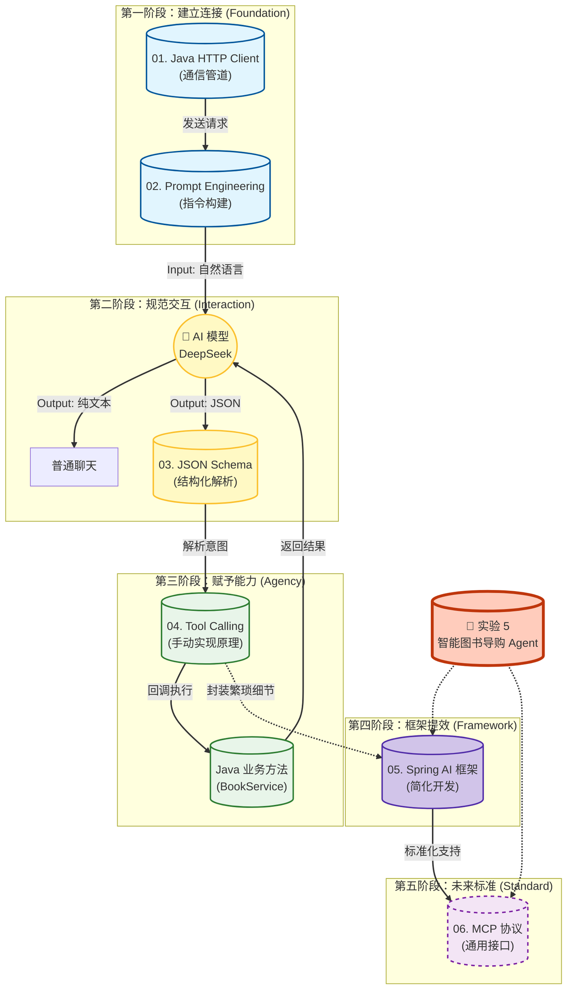

# 第 5 章导读 ：AI 集成与智能体基础  

### 📊 第 5 章知识模块关系图

为了让你更直观地理解本章的知识脉络，我为你绘制了这张**“AI 智能体进化路线图”**。
我们将经历从**“手搓原生代码”**了解原理，到**“使用 Spring AI 框架”**提效，最后展望**“MCP 协议”**的完整过程。

---

---
### 💡 模块关系深度解读（配合教学讲解）

您可以这样给学生讲解这张图，将抽象的技术概念比喻为**“人的进化”**：

#### 1. 通信基础 (01 & 02)：学会说话

* 👄 **Java HTTP Client** 是“嘴巴”，负责张嘴说话（发送请求）。
* 🗣️ **Prompt Engineering** 是“语言”，决定了你说得好不好听，AI 能不能听懂。
> *没有这两步，Java 只是个哑巴，无法连接 AI。*

#### 2. 结构化交互 (03)：学会守规矩

* AI 天生喜欢聊散天（返回 Text），但程序需要严谨的数据（JSON）。
* 🧐 **JSON Schema** 就是“翻译官”，强迫 AI 把诗情画意变成严谨的代码格式。
> *没有这一步，Java 拿到的是“散文”，无法进行逻辑处理。*

#### 3. 赋予能力 (04)：学会动手

* 这是本章的高潮。**Tool Calling** 是 AI 的“双手”。
* 场景：AI 发现自己不知道书价，于是通过 JSON 告诉 Java：“去帮我查一下数据库”。Java 查完后把结果喂回给 AI。
> *这一步实现了从 Chatbot（只会聊天的机器人）到 **Agent（能干活的智能体）** 的质变。*

#### 4 装备升级 (05)：框架提效

* 手动拼接 JSON 太累了？引入 **Spring AI** 框架。
* 它就像 MyBatis 之于 JDBC，帮我们封装了所有底层细节，一行代码实现对话和流式响应。

#### 5. 未来标准 (06)：通用接口

* 🔌 不想为每个工具写代码？了解未来的 USB 标准——**MCP 协议**。
* 现在我们手写 Tool Calling 就像焊死在主板上的线（专用），以后用 MCP 就能即插即用（通用）。通过配置直接连接高德地图、Github 或本地文件。

### 📂 目录结构规划

####  [**01. Java 也就是个“浏览器”：HTTP Client 调用 AI**](01-ai-api.md)

* **核心**: 去掉 SDK 滤镜，还原 HTTP 本质。
* **内容**:

    * **原理**: AI 接口其实就是个标准的 POST 请求（URL, Headers, Body）。
    * **工具**: 使用 Spring Boot 3.2+ 新特性 **`RestClient`** (比 RestTemplate 更优雅) 或 **OkHttp**。
    * **实战**: 对接 **DeepSeek-V3** (兼容 OpenAI 格式)，跑通第一个 "Hello AI"。

#### [**02. 提示词工程 (Prompt Engineering) 与 Java 模板**](02-prompt-java.md)
* **核心**: 如何用 Java 代码动态组装 Prompt。
* **内容**:

    * **结构**: System Prompt (人设) vs User Prompt (指令)。
    * **Java 新特性**: 使用 **JDK 15+ Text Blocks (文本块)** 优雅地拼接 JSON 和 Prompt。
    * **技巧**: Few-Shot (少样本提示) —— 给 AI 几个例子，它学得更快。

####  [**03. 让 AI 说“机器话”：JSON Schema 与解析**](03-structured-output.md)

* **痛点**: AI 默认喜欢聊散天，但程序需要准确的 JSON。
* **内容**:

    * **Markdown 解析**: 简单的正则提取（提取代码块）。
    * **JSON Mode**: 强制 AI 返回 JSON 格式。
    * **JSON Schema**: 严格定义字段类型（String? Int? Array?），这是 Tool Calling 的前置知识。

#### 🔥 [**04. 赋予 AI 双手：Tool Calling (Function Calling)**](04-tool-calling.md)

* **地位**: **本章最难点，也是 Agent 的核心**。
* **原理图解**:
    1. 用户问：“查一下 Java 编程思想多少钱？”    
    2. AI 思考：“我不知道，但我有个工具叫   `queryBookPrice`。”   
    3. AI 返回：`{"tool": "queryBookPrice", "args": {"name": "Java编程思想"}}`   
    4. Java 后端：拦截到这个指令 -> **执行数据库查询** -> 拿到结果 99元。  
    5. Java 后端：把“99元”发给 AI。  
    6. AI 回复：“这本书的价格是 99 元。”  
* **实战**: 实现一个“查书价”的 Tool。

#### 🚀 [**05. 框架篇：拥抱 Spring AI (简化开发)**](05-spring-ai.md)

* **核心**: **实战篇**。从“造轮子”到“用轮子”。
* **技术**:
    * 引入 `spring-ai-starter`。
    * 配置 `application.properties` 连接 ModelScope。
    * 使用 `@Tool` 注解自动注册 Java 方法为 AI 工具。
    

#### 🔌 [**06. 未来的标准：MCP (Model Context Protocol) 简介**](06-mcp-intro.md)

* **背景**: 各种 Tool Calling 写法都不一样，太乱了。解决工具连接的“巴别塔”问题。
* **技术**: 使用 Spring AI MCP Client，**零代码**接入高德地图能力。
* **概念**:

    * **Context (上下文)**: 让 AI 看到本地文件/数据库。
    * **Tools (工具)**: 标准化的执行能力。
    * **Resources (资源)**: 标准化的数据读取。
* **意义**: 就像 USB 协议，只要符合 MCP，任何 AI 都能用你的工具（连接陈老师的 Home Lab 场景）。

#### 🧪 [**实验 5：为“智能图书交易系统”开发 AI 客服**](q=lab5.md)

* **任务**:
    * 集成 **Spring AI** 框架。
    * 编写 `BookStoreService` (库存/订单查询)。
    * 实现一个能查库存、查物流的 7x24 小时智能客服。

---

### 📝 课前准备建议

1. **API Key**: 提前注册 **ModelScope (魔搭社区)** 并获取 Access Token（免费且兼容 OpenAI 协议）。
2. **JDK 版本**: 建议使用 **JDK 17+**（为了支持文本块和 Record 特性）。
3. **Spring Boot**: 建议版本 **3.2.x** 或 **3.3.x**。

