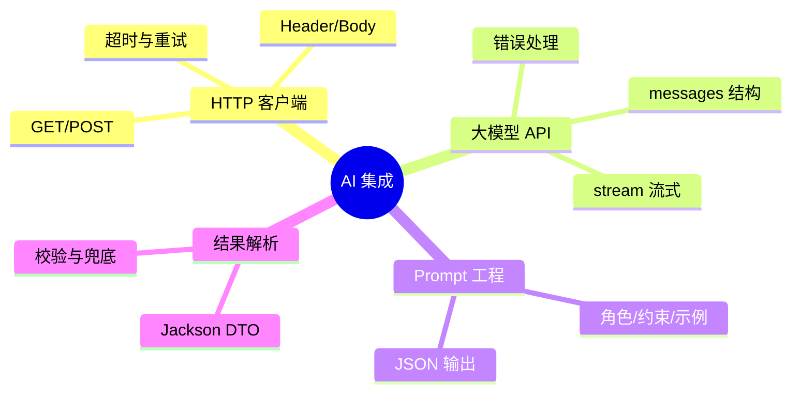

# 第5章 导读｜AI 集成与接口调用

> 以“智能航班助手”为场景，学习 Java HTTP 客户端调用外部接口（含大模型 API），并完成 Prompt 设计、结果解析与健壮性处理。

## 教学目标

- 熟练使用 `HttpClient` 调用第三方 REST API。
- 能调用大模型接口（非流式与流式），并解析 JSON 输出。
- 掌握 Prompt 工程的基础套路与小样本提示。
- 实现健壮的错误处理和超时/重试策略。

## 知识结构

## 重点与易错点

- Key 安全与配置信息管理。
- 流式解析与前端逐字渲染。
- JSON 解析失败的容错与用户提示。

## 实验与作业

- 实验5：AI 旅行助手（目的地→JSON 行程 → 前端渲染）。
