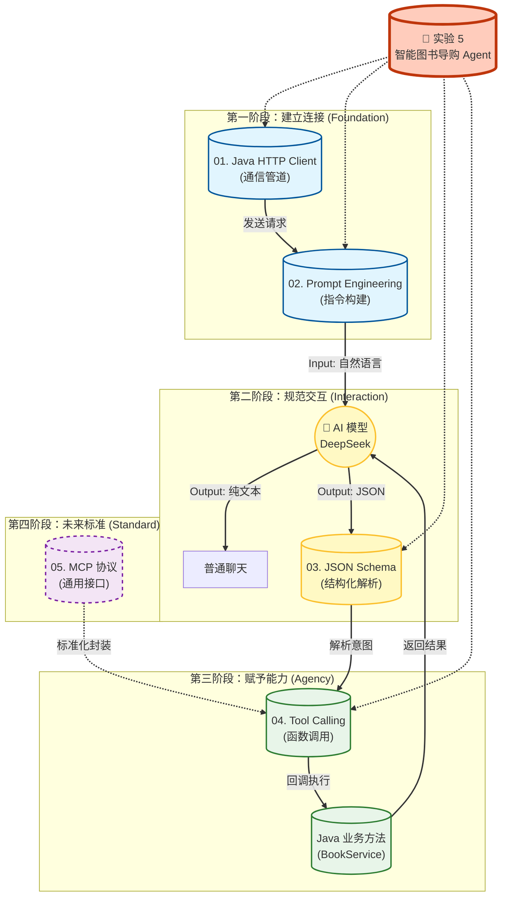
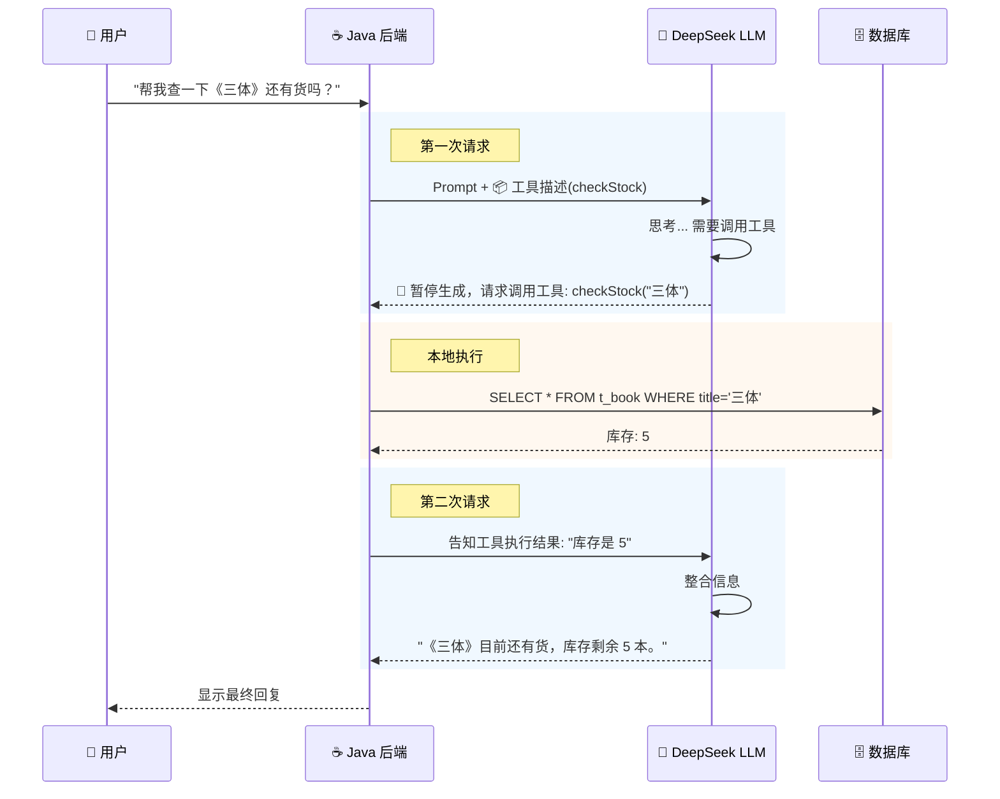

# 第 5 章导读 ：AI 集成与智能体基础  

### 📊 第 5 章知识模块关系图

陈老师，为了让学生（以及您自己）更直观地理解第 5 章各个知识点之间的逻辑联系，我为您设计了一张**“AI 智能体能力构建图”**。
这张图将看似独立的 5 个小节串联成了一个**从“能说话”到“能干活”**的完整进化过程。

---
### 💡 模块关系深度解读（配合教学讲解）

您可以这样给学生讲解这张图，将抽象的技术概念比喻为**“人的进化”**：

#### 1. 通信基础 (01 & 02)：学会说话
* 👄 **Java HTTP Client** 是“嘴巴”，负责张嘴说话（发送请求）。
* 🗣️ **Prompt Engineering** 是“语言”，决定了你说得好不好听，AI 能不能听懂。
> *没有这两步，Java 只是个哑巴，无法连接 AI。*

#### 2. 结构化交互 (03)：学会守规矩
* AI 天生喜欢聊散天（返回 Text），但程序需要严谨的数据（JSON）。
* 🧐 **JSON Schema** 就是“翻译官”，强迫 AI 把诗情画意变成严谨的代码格式。
> *没有这一步，Java 拿到的是“散文”，无法进行逻辑处理。*

#### 3. 赋予能力 (04)：学会动手
* 这是本章的高潮。**Tool Calling** 是 AI 的“双手”。
* 场景：AI 发现自己不知道书价，于是通过 JSON 告诉 Java：“去帮我查一下数据库”。Java 查完后把结果喂回给 AI。
> *这一步实现了从 Chatbot（只会聊天的机器人）到 **Agent（能干活的智能体）** 的质变。*

#### 4. 未来标准 (05)：通用接口
* 🔌 **MCP** 是未来的“USB 接口”。
* 现在我们手写 Tool Calling 就像焊死在主板上的线（专用），以后用 MCP 就能即插即用（通用）。

### 📂 目录结构规划

#### **📖 第5章 导读**

* **文件**: `chapter05/index.md`
* **核心隐喻**:
    * **API 调用**: 就像“打电话咨询专家”。
    * **Prompt**: 就像“给专家写需求文档”。
    * **Tool Calling**: 就像“给专家配一个助手去查数据库”。
    * **MCP**: 就像“给 AI 装上了 USB 接口”，标准化的连接万物。

#### **01. Java 也就是个“浏览器”：HTTP Client 调用 AI**

* **文件**: `chapter05/01-ai-api.md`
* **核心**: 去掉 SDK 滤镜，还原 HTTP 本质。
* **内容**:

    * **原理**: AI 接口其实就是个标准的 POST 请求（URL, Headers, Body）。
    * **工具**: 使用 Spring Boot 3.2+ 新特性 **`RestClient`** (比 RestTemplate 更优雅) 或 **OkHttp**。
    * **实战**: 对接 **DeepSeek-V3** (兼容 OpenAI 格式)，跑通第一个 "Hello AI"。

#### **02. 提示词工程 (Prompt Engineering) 与 Java 模板**

* **文件**: `chapter05/02-prompt-java.md`
* **核心**: 如何用 Java 代码动态组装 Prompt。
* **内容**:

    * **结构**: System Prompt (人设) vs User Prompt (指令)。
    * **Java 新特性**: 使用 **JDK 15+ Text Blocks (文本块)** 优雅地拼接 JSON 和 Prompt。
    * **技巧**: Few-Shot (少样本提示) —— 给 AI 几个例子，它学得更快。

#### **03. 让 AI 说“机器话”：JSON Schema 与解析**

* **文件**: `chapter05/03-structured-output.md`
* **痛点**: AI 默认喜欢聊散天，但程序需要准确的 JSON。
* **内容**:

    * **Markdown 解析**: 简单的正则提取（提取代码块）。
    * **JSON Mode**: 强制 AI 返回 JSON 格式。
    * **JSON Schema**: 严格定义字段类型（String? Int? Array?），这是 Tool Calling 的前置知识。

#### **🔥 04. 赋予 AI 双手：Tool Calling (Function Calling)**

* **文件**: `chapter05/04-tool-calling.md`
* **地位**: **本章最难点，也是 Agent 的核心**。
* **原理图解**:
    1. 用户问：“查一下 Java 编程思想多少钱？”    
    2. AI 思考：“我不知道，但我有个工具叫   `queryBookPrice`。”   
    3. AI 返回：`{"tool": "queryBookPrice", "args": {"name": "Java编程思想"}}`   
    4. Java 后端：拦截到这个指令 -> **执行数据库查询** -> 拿到结果 99元。  
    5. Java 后端：把“99元”发给 AI。  
    6. AI 回复：“这本书的价格是 99 元。”  
* **实战**: 实现一个“查书价”的 Tool。

#### **🔌 05. 未来的标准：MCP (Model Context Protocol) 简介**

* **文件**: `chapter05/05-mcp-intro.md`
* **背景**: 各种 Tool Calling 写法都不一样，太乱了。
* **概念**:

    * **Context (上下文)**: 让 AI 看到本地文件/数据库。
    * **Tools (工具)**: 标准化的执行能力。
    * **Resources (资源)**: 标准化的数据读取。
* **意义**: 就像 USB 协议，只要符合 MCP，任何 AI 都能用你的工具（连接陈老师的 Home Lab 场景）。

#### **🧪 实验 5：实战——智能图书导购 Agent**

* **文件**: `chapter05/lab5.md`
* **任务**:

    * 基于实验 4 的数据库。
    * 实现一个 `ChatController`。
* **功能**: 用户输入自然语言“帮我找一本 Bruce Eckel 写的书，最贵的那本”，系统自动解析意图，调用 `BookService` 查询数据库，并返回结果。

---

### 📝 部分核心内容预览（可直接用于文档）

#### 关于 Tool Calling 的图解 (用于 04-tool-calling.md)

---

#### 实验 5 的 Prompt 设计 (用于 lab5.md)

!!! question "让 AI 写代码"
**Prompt**:
> "我正在用 Java Spring Boot 3 + `RestClient`。
> 请帮我写一个 Service 方法 `chatWithTools(String userMessage)`。
>
> 1. API 地址: `https://api.deepseek.com/v1/chat/completions`
> 2. 模型: `deepseek-chat`
> 3. 核心逻辑：
>    - 定义一个 JSON Schema 描述我的方法 `searchBooks(String keyword)`。
>    - 发送请求给 AI。
>    - 如果 AI 返回 `tool_calls`，解析出函数名和参数。
>    - **不要真的去调 API，只打印出'正在执行工具: xxx'即可**（这步我自己填业务逻辑）。"

---

### 💡 教学建议

1. **API Key 安全**: 提醒学生不要把 API Key 传到 Gitee/Github。教他们使用环境变量或 `application-dev.properties` 并配置 `.gitignore`。
2. **模型选择**: 推荐 **DeepSeek**（深度求索）。

* 原因 1：**国产之光**（符合信创背景）。
* 原因 2：API 极其便宜（几乎免费），适合学生折腾。
* 原因 3：完全兼容 OpenAI 格式，代码以后换 GPT-4 也能用。

3. **MCP 的处理**: 这一块比较新，建议以**概念介绍**为主，让学生知道“这是未来”，不需要像 Tool Calling 那样要求手写底层实现，因为 Java 的 MCP SDK 还不够成熟。

您觉得这个安排是否符合您的教学进度？如果没问题，我可以开始为您撰写具体章节内容。