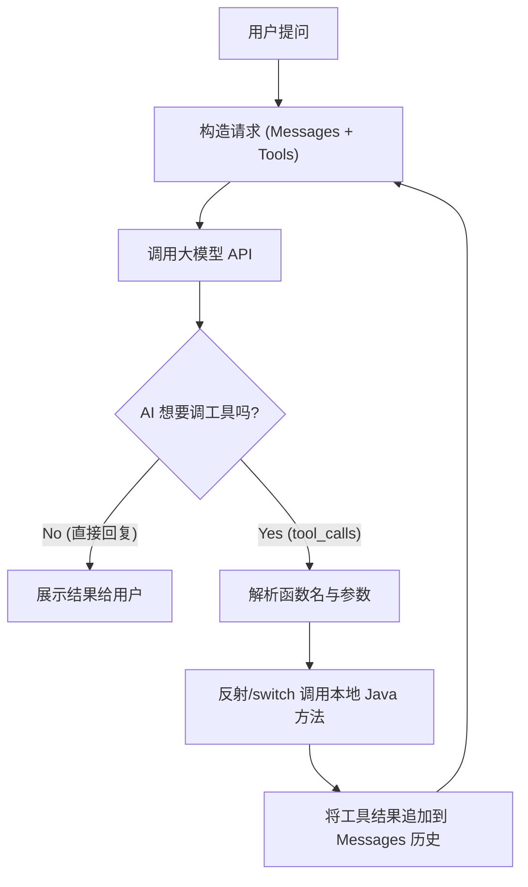

# 实验 5：实战——手搓智能图书导购 Agent (AI 辅助版)

!!! abstract "🧪 实验卡片"
    * **难度**: ⭐⭐⭐⭐⭐ (硬核原理 + 现代工具)
    * **耗时**: 60 分钟
    * **目标**: 理解 Agent 思考循环；**掌握使用 AI 编程插件辅助开发**。
    * **工具**: IntelliJ IDEA + **通义灵码 (或 CodeGeeX)**。

---

## 🗺️ 架构设计图 (Agent Loop)

我们要手动实现下面这个“死循环”逻辑：


---

## 🤖 场景 0：准备你的“副驾驶”

本实验代码量较大，请确保你的 IDEA 已经安装了 AI 插件（参考附录 A05）。
我们将采用 **“Copilot 模式”**：你负责设计逻辑，AI 插件负责写脏活累活。

---

## 🛠️ 步骤 1：让 AI 生成模拟数据

手动敲 10 本书的初始化代码太累了。我们让 AI 帮我们生成。

1. 创建 `LocalBookService.java` 和 `Book` 记录类（空壳）。
2. **呼叫 AI**: 在编辑器中打开 AI 对话框（通常是侧边栏）。
3. **发送指令**:
> "我正在写一个 Java 图书商城。请帮我生成一个包含 10 本热门计算机和科幻书籍的 `List<Book>` 初始化代码。`Book` 包含 name(String), price(Double), category(String)。书名要真实，价格在 30-100 之间。"


4. **操作**: 点击 AI 生成代码块右上角的 **"Insert"**，直接插入到你的代码中。

```java title="LocalBookService.java (AI 生成后)"
@Service
public class LocalBookService {
    public record Book(String name, Double price, String category) {}

    // 👇 下面这堆代码是 AI 秒生成的，不需要手敲
    private static final List<Book> DB = List.of(
        new Book("深入理解Java虚拟机", 89.0, "编程"),
        new Book("Java编程思想", 108.0, "编程"),
        new Book("三体全集", 56.0, "科幻"),
        new Book("流浪地球", 35.0, "科幻"),
        new Book("高性能MySQL", 78.5, "编程"),
        // ... 更多数据
    );
    
    // ... searchBooks 方法保持不变
}

```

---
## 🧠 步骤 2：让 AI 编写 JSON Schema (难点攻克)

还记得第 04 节那个复杂的 `TOOLS_SCHEMA` 吗？嵌套的 Map 结构非常容易写错括号。
这正是 AI 最擅长的地方——**代码翻译**。

1.  **复制方法签名**：
    把 `LocalBookService` 里的 `searchBooks` 方法签名复制一下。

2.  **呼叫 AI**：
    发送如下 Prompt (提示词)：
    ```text
    我有一个 Java 方法：public List<Book> searchBooks(String category, Double maxPrice)。
    请帮我把它转换为 OpenAI Function Calling 格式的 JSON Schema。
    
    要求：
    1. 直接给我 Java 的 List<Map<String, Object>> 代码写法。
    2. 不要 JSON 字符串，我要放到代码常量里。
    ```

3.  **验收与插入**：
    AI 会生成一段完美的 Map 嵌套代码，直接复制到 `AgentController` 中。

!!! tip "🤖 AI 辅助演示"
    **AI 生成的代码可能长这样 (省去了你查文档和调试的时间)：**

    ```java
    private static final List<Map<String, Object>> TOOLS_SCHEMA = List.of(
        Map.of(
            "type", "function",
            "function", Map.of(
                "name", "search_books",
                "description", "根据分类或价格查询图书",
                "parameters", Map.of(
                    "type", "object",
                    "properties", Map.of(
                        "category", Map.of("type", "string", "description", "图书分类"),
                        "maxPrice", Map.of("type", "number", "description", "最高价格")
                    ),
                    "required", List.of("category")
                )
            )
        )
    );
    ```
---

## 💻 步骤 3：核心 Agent 引擎 (人机协作)

核心的 `for` 循环逻辑建议**手写**，以加深对 Agent "思考-执行-再思考" 闭环的理解。

!!! tip "💡 IDE 技巧：让 AI 教你写代码"
    在手写过程中，如果遇到不懂的 API（例如 `RestClient` 的异常处理），不要卡住，请充分利用 IDE 的 AI 插件：

    * **遇到问题**：写到 `restClient.post()...` 时，不知道网络超时会抛出什么异常？
    * **操作方法**：选中代码 -> 右键 -> **"Ask AI"** (或使用侧边栏)。
    * **提问示例**："这段代码如果网络超时会抛出什么异常？如何优雅处理？"

这是实验最核心的部分。请新建 `HandwrittenAgentController.java` 并输入以下代码：

```java title="HandwrittenAgentController.java"
@RestController
@RequestMapping("/agent")
public class HandwrittenAgentController {

    private final LocalBookService bookService;
    private final RestClient restClient;
    private final ObjectMapper objectMapper = new ObjectMapper();

    // 配置：真实开发中请移至 application.yml
    private static final String API_KEY = "sk-你的Token";
    private static final String API_URL = "[https://api-inference.modelscope.cn/v1/chat/completions](https://api-inference.modelscope.cn/v1/chat/completions)";

    public HandwrittenAgentController(LocalBookService bookService, RestClient.Builder builder) {
        this.bookService = bookService;
        this.restClient = builder
                .baseUrl(API_URL)
                .defaultHeader("Authorization", "Bearer " + API_KEY)
                .build();
    }

    @GetMapping("/chat")
    public String chat(@RequestParam String msg) throws Exception {
        // 1. 初始化对话历史 (History)
        List<Map<String, Object>> messages = new ArrayList<>();
        messages.add(new HashMap<>(Map.of("role", "system", "content", "你是一个图书导购。")));
        messages.add(new HashMap<>(Map.of("role", "user", "content", msg)));

        // 🔄 2. 进入 Agent 循环 (最多交互 3 次，防止死循环)
        for (int i = 0; i < 3; i++) {
            // 2.1 构建请求体
            Map<String, Object> requestBody = Map.of(
                "model", "Qwen/Qwen2.5-7B-Instruct",
                "messages", messages,
                "tools", TOOLS_SCHEMA // 👈 把工具箱交给 AI
            );

            // 2.2 发送 HTTP 请求
            String responseJson = restClient.post()
                    .contentType(MediaType.APPLICATION_JSON)
                    .body(requestBody)
                    .retrieve()
                    .body(String.class);

            // 2.3 解析响应
            JsonNode rootNode = objectMapper.readTree(responseJson);
            JsonNode choice = rootNode.path("choices").get(0);
            JsonNode message = choice.path("message");

            // 🚨 2.4 关键判断：AI 是想说话(content)，还是想调工具(tool_calls)？
            if (message.has("tool_calls")) {
                // === 情况 A: AI 想调工具 ===
                JsonNode toolCall = message.path("tool_calls").get(0);
                String functionName = toolCall.path("function").path("name").asText();
                String argsJson = toolCall.path("function").path("arguments").asText();
                
                // ⚠️ 必须把 AI 的这轮思考（含 tool_calls）加入历史，否则它会“断片”
                // 这里为了简单，我们手动构造一个 Map 加进去
                Map<String, Object> aiMessage = new HashMap<>();
                aiMessage.put("role", "assistant");
                aiMessage.put("content", null);
                aiMessage.put("tool_calls", List.of(objectMapper.convertValue(toolCall, Map.class)));
                messages.add(aiMessage);

                // 🛠️ 执行本地 Java 方法
                String toolResult = "未找到书籍";
                if ("search_books".equals(functionName)) {
                    JsonNode args = objectMapper.readTree(argsJson);
                    String category = args.path("category").asText(null);
                    Double maxPrice = args.has("maxPrice") ? args.path("maxPrice").asDouble() : null;
                    
                    // 调用 Service
                    List<LocalBookService.Book> books = bookService.searchBooks(category, maxPrice);
                    toolResult = objectMapper.writeValueAsString(books);
                }

                // 📤 将工具结果回填给 AI (role = tool)
                messages.add(Map.of(
                    "role", "tool",
                    "content", toolResult,
                    "tool_call_id", toolCall.path("id").asText()
                ));

                System.out.println("🤖 工具执行完毕，结果已回填，进入下一轮思考...");
                // 循环继续，带着结果再次请求 AI

            } else {
                // === 情况 B: AI 也就是普通回复 (有了结果或只是闲聊) ===
                String finalContent = message.path("content").asText();
                System.out.println("✅ AI 最终回复: " + finalContent);
                return finalContent; // 结束循环，返回结果
            }
        }
        return "交互次数过多，强行终止。";
    }
}
```

---

## 🐛 步骤 4：让 AI 帮忙 Debug

实验中，你可能会遇到 **JSON 解析报错**（比如 AI 返回了 markdown 格式的 json）。

**模拟场景**: 控制台报错 `JsonParseException: Unexpected character '`'`...`。

1. **操作**: 复制控制台的报错堆栈。
2. **呼叫 AI**: 粘贴报错信息，并附上你的 `chat` 方法代码。
> "我的 Agent 报错了，似乎是 Jackson 解析的问题。这是报错信息和代码。帮我分析原因。"


3. **AI 诊断**:
> "原因是大模型返回的内容可能包含 Markdown 代码块标记（```json），导致 Jackson 无法直接解析。建议在 `objectMapper.readTree` 之前，先用正则表达式清洗 `responseJson` 字符串..."


---

## 🏆 挑战作业：增加“下单”功能 (全自动模式)

现在，请完全依赖 AI 插件，完成“下单工具”的开发。

1. **Prompt**: "在 `LocalBookService` 中帮我写一个 `orderBook(String bookName)` 方法，打印一条日志即可。" -> **插入代码**。
2. **Prompt**: "请把刚才写的 `orderBook` 方法也加入到 `TOOLS_SCHEMA` 的定义中。" -> **替换常量**。
3. **Prompt**: "在 `AgentController` 的 `if (tool_calls)` 分支里，增加对 `order_book` 函数的处理逻辑。" -> **合并代码**。

!!! success "实验总结"
    本实验你不仅学会了 **Agent 的底层原理**，更掌握了 **AI 辅助编程** 的三大法宝：  
    1.  **生成样板代码** (Mock Data)。  
    2.  **生成复杂配置** (JSON Schema)。  
    3.  **智能 Debug** (日志分析)。  

    以后在工作中，这些“脏活累活”都可以交给 AI，你只需要专注于**核心逻辑的设计**。

