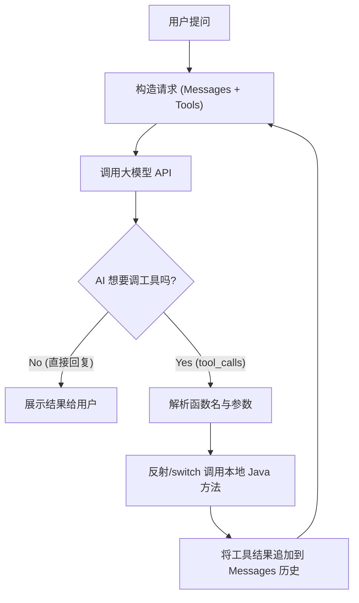

# 实验 5：实战——手搓智能图书导购 Agent (原理篇)

!!! abstract "🧪 实验卡片"
* **难度**: ⭐⭐⭐⭐⭐ (硬核)
* **耗时**: 60 分钟
* **目标**: 不依赖 AI 框架，**徒手实现** Agent 的核心循环（思考-执行-回复）。
* **核心考点**: RestClient 使用、JSON 复杂解析、多轮对话状态维护。

---

## 🗺️ 架构设计图 (Agent Loop)

我们要手动实现下面这个“死循环”逻辑：


---

## 🛠️ 步骤 1：准备工作

### 1. 模拟数据库 (LocalBookService)

这一步不变，我们依然需要一个本地的 Java 方法供 AI 调用。

```java title="LocalBookService.java"
@Service
public class LocalBookService {
    // 模拟数据
    private static final List<Book> DB = List.of(
        new Book("Java核心技术", 89.0, "编程"),
        new Book("三体", 35.0, "科幻")
    );

    public record Book(String name, Double price, String category) {}

    // 🔧 工具方法
    public List<Book> searchBooks(String category, Double maxPrice) {
        System.out.println("🔍 [本地方法触发] 正在查询分类: " + category + ", 预算: " + maxPrice);
        return DB.stream()
            .filter(b -> category == null || b.category().contains(category))
            .filter(b -> maxPrice == null || b.price() <= maxPrice)
            .toList();
    }
}

```

---

## 🧠 步骤 2：定义工具描述 (JSON Schema)

因为没有 Spring AI 帮我们自动生成，我们需要手动定义工具的 JSON 结构（复习第 04 节）。

在 `AgentController` 中定义常量：

```java
private static final List<Map<String, Object>> TOOLS_SCHEMA = List.of(
    Map.of(
        "type", "function",
        "function", Map.of(
            "name", "search_books",
            "description", "根据分类或价格预算查询图书库存",
            "parameters", Map.of(
                "type", "object",
                "properties", Map.of(
                    "category", Map.of("type", "string", "description", "图书分类，如：编程、科幻"),
                    "maxPrice", Map.of("type", "number", "description", "最高价格预算")
                ),
                "required", List.of("category")
            )
        )
    )
);

```

---

## 💻 步骤 3：核心 Agent 引擎 (手写 Loop)

这是实验最核心的部分。新建 `HandwrittenAgentController.java`。

```java
@RestController
@RequestMapping("/agent")
public class HandwrittenAgentController {

    private final LocalBookService bookService;
    private final RestClient restClient;
    private final ObjectMapper objectMapper = new ObjectMapper();

    // 配置
    private static final String API_KEY = "sk-你的Token";
    private static final String API_URL = "https://api-inference.modelscope.cn/v1/chat/completions";

    public HandwrittenAgentController(LocalBookService bookService, RestClient.Builder builder) {
        this.bookService = bookService;
        this.restClient = builder
                .baseUrl(API_URL)
                .defaultHeader("Authorization", "Bearer " + API_KEY)
                .build();
    }

    @GetMapping("/chat")
    public String chat(@RequestParam String msg) throws Exception {
        // 1. 初始化对话历史 (History)
        List<Map<String, Object>> messages = new ArrayList<>();
        messages.add(new HashMap<>(Map.of("role", "system", "content", "你是一个图书导购。")));
        messages.add(new HashMap<>(Map.of("role", "user", "content", msg)));

        // 🔄 2. 进入 Agent 循环 (最多交互 3 次，防止死循环)
        for (int i = 0; i < 3; i++) {
            // 2.1 构建请求体
            Map<String, Object> requestBody = Map.of(
                "model", "Qwen/Qwen2.5-7B-Instruct",
                "messages", messages,
                "tools", TOOLS_SCHEMA // 👈 把工具箱交给 AI
            );

            // 2.2 发送 HTTP 请求
            String responseJson = restClient.post()
                    .contentType(MediaType.APPLICATION_JSON)
                    .body(requestBody)
                    .retrieve()
                    .body(String.class);

            // 2.3 解析响应
            JsonNode rootNode = objectMapper.readTree(responseJson);
            JsonNode choice = rootNode.path("choices").get(0);
            JsonNode message = choice.path("message");

            // 🚨 2.4 关键判断：AI 是想说话(content)，还是想调工具(tool_calls)？
            if (message.has("tool_calls")) {
                // === 情况 A: AI 想调工具 ===
                JsonNode toolCall = message.path("tool_calls").get(0);
                String functionName = toolCall.path("function").path("name").asText();
                String argsJson = toolCall.path("function").path("arguments").asText();
                
                // ⚠️ 必须把 AI 的这轮思考（含 tool_calls）加入历史，否则它会“断片”
                // 这里为了简单，我们手动构造一个 Map 加进去
                Map<String, Object> aiMessage = new HashMap<>();
                aiMessage.put("role", "assistant");
                aiMessage.put("content", null);
                aiMessage.put("tool_calls", List.of(objectMapper.convertValue(toolCall, Map.class)));
                messages.add(aiMessage);

                // 🛠️ 执行本地 Java 方法
                String toolResult = "未找到书籍";
                if ("search_books".equals(functionName)) {
                    JsonNode args = objectMapper.readTree(argsJson);
                    String category = args.path("category").asText(null);
                    Double maxPrice = args.has("maxPrice") ? args.path("maxPrice").asDouble() : null;
                    
                    // 调用 Service
                    List<LocalBookService.Book> books = bookService.searchBooks(category, maxPrice);
                    toolResult = objectMapper.writeValueAsString(books);
                }

                // 📤 将工具结果回填给 AI (role = tool)
                messages.add(Map.of(
                    "role", "tool",
                    "content", toolResult,
                    "tool_call_id", toolCall.path("id").asText()
                ));

                System.out.println("🤖 工具执行完毕，结果已回填，进入下一轮思考...");
                // 循环继续，带着结果再次请求 AI

            } else {
                // === 情况 B: AI 也就是普通回复 (有了结果或只是闲聊) ===
                String finalContent = message.path("content").asText();
                System.out.println("✅ AI 最终回复: " + finalContent);
                return finalContent; // 结束循环，返回结果
            }
        }
        return "交互次数过多，强行终止。";
    }
}

```

---

## 🧪 步骤 4：测试与观察

### 测试用例：

访问：`http://localhost:8080/agent/chat?msg=帮我找一本50块以内的编程书`

### 预期日志流：

1. **Round 1**: 发送用户问题。
2. **AI 响应**: `tool_calls: search_books`。
3. **Java 执行**: `[本地方法触发] 正在查询分类: 编程, 预算: 50.0`。
4. **Java 回填**: `role: tool, content: [{"name":"三体" ...}]`。
5. **Round 2**: 发送 (问题 + AI思考 + 工具结果)。
6. **AI 响应**: `content: "为您找到一本《三体》，价格35元..."`。
7. **程序退出**。

---

## 📝 实验总结 (引导至 Spring AI)

!!! question "思考题"
做完这个实验，你是否感觉：
1.  手动维护 `messages` 列表很麻烦？如果不小心漏加了一条，AI 就报错。
2.  解析 `tool_calls` 的 JSON 结构代码写得想吐？
3.  如果有 10 个工具，`if-else` 会写到天荒地老？

```
**这就是框架存在的意义！**
在 **附录 A** 中，我们将介绍 **Spring AI**。刚才那 50 行核心代码，用 Spring AI 只需要 **5 行**。

*想要从“造轮子”进化到“开法拉利”吗？请继续选修附录 A！*

```

---
