# Prompt 工程基础  数据持久化原理 (JDBC & Druid)

!!! tip "本节目标：从内存到持久化"
**痛点**：变量存在内存中，重启后数据丢失。

**解决**：学习 JDBC 与数据库（openGauss）交互，掌握两大企业级规范：

```
1.  **安全 (Security)** —— 杜绝 SQL 注入漏洞。
2.  **性能 (Performance)** —— 使用 Druid 连接池管理资源。

```

---

## 🌉 第一部分：JDBC 本质论

我们有各种数据库（MySQL, Oracle, openGauss），底层指令各不相同。Java 制定了一套**标准接口 JDBC (Java Database Connectivity)**，就像“通用遥控器”。

* **Java 程序员**：只按标准按钮（`Connection`, `PreparedStatement`）。
* **数据库厂商**：负责在内部实现电路（**Driver 驱动 Jar 包**）。

```mermaid
graph LR
    App["Java 应用程序"] -- 调用标准接口 --> API["JDBC API (java.sql.*)"]
    API -- 加载 --> Driver["数据库驱动 (Driver)"]
    
    subgraph Drivers [驱动层]
        Driver --> MySQL["MySQL 驱动"]
        Driver --> PG["openGauss/PG 驱动"]
        Driver --> Oracle["Oracle 驱动"]
    end
    
    MySQL --> DB1[("MySQL DB")]
    PG --> DB2[("openGauss DB")]
    
    style API fill:#e1f5fe,stroke:#01579b
    style Drivers fill:#fff9c4,stroke:#fbc02d


```



### 1. 引入依赖

要实现交互，我们需要引入两个 Jar 包：一个是**数据库驱动**，一个是**连接池**。

```xml title="pom.xml"
<dependencies>
    <dependency>
        <groupId>org.postgresql</groupId>
        <artifactId>postgresql</artifactId>
        <version>42.6.0</version>
    </dependency>
    
    <dependency>
        <groupId>com.alibaba</groupId>
        <artifactId>druid</artifactId>
        <version>1.2.20</version>
    </dependency>
</dependencies>


```

---

## 🔌 第二部分：JDBC 标准五步法 (原生写法)

在学习高级连接池之前，我们先用最原始的 `DriverManager` 体验一次完整的交互。这是所有数据库操作的“内功心法”。

### 1. 核心 API 速查

* `DriverManager`：**老司机**，负责加载驱动，获取连接。
* `Connection`：**电话线**，代表与数据库的连接通道。
* `Statement/PreparedStatement`：**搬运工**，用于发送 SQL 语句。
* `ResultSet`：**结果集**，查询返回的表格数据。

### 2. 原生代码示例 (Hello World)

```java title="JdbcHello.java"
import java.sql.*;

public class JdbcHello {
    public static void main(String[] args) {
        // 数据库配置
        String url = "jdbc:postgresql://localhost:5432/postgres";
        String user = "gaussdb";
        String pwd = "SecretPassword@123";
        
        String sql = "SELECT id, username FROM t_user WHERE id > ?";

        // ✅ 使用 try-with-resources 自动关闭资源
        try (
            // 1. 获取连接 (这一步很耗时，约100ms)
            Connection conn = DriverManager.getConnection(url, user, pwd);
            // 2. 获取预编译语句执行器
            PreparedStatement pstmt = conn.prepareStatement(sql)
        ) {
            // 3. 设置参数 (填空)
            pstmt.setInt(1, 0); 

            // 4. 执行查询
            try (ResultSet rs = pstmt.executeQuery()) {
                // 5. 遍历结果集
                while (rs.next()) {
                    System.out.println("User: " + rs.getString("username"));
                }
            }
        } catch (SQLException e) {
            e.printStackTrace();
        }
    }
}


```

---

## 🛡️ 第三部分：安全核心 (PreparedStatement)

在 JDBC 的操作中，最核心的概念不是如何写代码，而是**Web 安全**。

### 1. 致命错误：拼接 SQL

早期的代码常使用字符串拼接，这会导致 **SQL 注入漏洞**。

```java
// ❌ 危险！黑客输入 "' OR '1'='1" 即可绕过登录
String sql = "SELECT * FROM user WHERE name = '" + inputName + "'";


```

### 2. 正确姿势：预编译 (PreparedStatement)

使用 `?` 作为占位符。数据库会先编译 SQL 骨架，再把参数当作“纯文本”填进去，从而从根源上杜绝注入。

```java
// ✅ 安全！数据库只把 ? 当作文本内容
String sql = "SELECT * FROM user WHERE name = ?";
PreparedStatement pstmt = conn.prepareStatement(sql);
pstmt.setString(1, "张三");


```

---

## 🔋 第四部分：性能核心 (连接池 Druid)

### 1. 为什么要“池化”？

上面的原生写法中，`DriverManager.getConnection` 就像**“打车”**——每次都要呼叫、等待、建立 TCP 握手，用完就断开。这在并发高时会让服务器崩溃。

**连接池 (Connection Pool)** 就像**“公司班车”**：
系统启动时预先创建好（比如 10 个）连接放在池子里。

* **借**：线程需要查库，从池里拿一个。
* **还**：用完**不关闭**，而是放回池里供他人复用。

```mermaid
graph TD
    subgraph "传统方式 (DriverManager)"
        A1[请求 1] -->|新建| C1((连接)) -->|销毁| X1[结束]
    end

    subgraph "连接池模式 (DataSource)"
        Pool[("🔋 连接池 (常驻)")]
        B1[请求 A] -->|借用| Pool
        Pool -->|归还| B1
        B2[请求 B] -->|借用| Pool
    end
    style Pool fill:#e1f5fe,stroke:#01579b


```



### 2. 配置 Druid (德鲁伊)

**Druid** 是阿里巴巴开源的数据库连接池，它的一大卖点就是**自带监控页面**。我们需要在配置文件中开启它。

我们在 `src/main/resources` 下新建配置文件：

```properties title="druid.properties"
# 数据库连接参数
driverClassName=org.postgresql.Driver
url=jdbc:postgresql://localhost:5432/postgres
username=gaussdb
password=SecretPassword@123

# 连接池调优
initialSize=5
maxActive=10
maxWait=3000

# 🌟 开启监控统计功能 (filters=stat)
filters=stat

```

---

## 🛠️ 第五部分：通用工具类 JDBCUtils

为了避免在每次操作时都写重复代码，我们将 Druid 封装为一个工具类。
**这是本章最重要的代码，请务必掌握。**

```java title="JDBCUtils.java"
import com.alibaba.druid.pool.DruidDataSourceFactory;
import javax.sql.DataSource;
import java.io.InputStream;
import java.sql.*;
import java.util.Properties;

public class JDBCUtils {
    private static DataSource ds;

    // 静态代码块：类加载时初始化连接池
    static {
        try {
            Properties pro = new Properties();
            InputStream is = JDBCUtils.class.getClassLoader().getResourceAsStream("druid.properties");
            pro.load(is);
            ds = DruidDataSourceFactory.createDataSource(pro);
        } catch (Exception e) {
            e.printStackTrace();
            throw new RuntimeException("连接池初始化失败！");
        }
    }

    // 获取连接：从池中拿
    public static Connection getConnection() throws SQLException {
        return ds.getConnection();
    }

    // 获取数据源：供后续框架使用
    public static DataSource getDataSource() {
        return ds;
    }

    // 释放资源：归还连接
    public static void close(ResultSet rs, Statement stmt, Connection conn) {
        if (rs != null) try { rs.close(); } catch (SQLException e) {}
        if (stmt != null) try { stmt.close(); } catch (SQLException e) {}
        if (conn != null) try { 
            conn.close(); // 注意：此处是“归还”给连接池
        } catch (SQLException e) {}
    }
}

```

---

## 👀 第六部分：开启上帝视角 (Druid 监控)

Druid 最酷的功能就是它的**监控后台**。它可以告诉你当前有多少连接、哪条 SQL 执行最慢、是否有 SQL 注入攻击。

### 1. 配置 Web.xml

由于我们目前还在学习 Web 基础，需要在 `web.xml` 中注册 Druid 提供的 Servlet 来开启监控页面。

```xml title="src/main/webapp/WEB-INF/web.xml"
<servlet>
    <servlet-name>DruidStatView</servlet-name>
    <servlet-class>com.alibaba.druid.support.http.StatViewServlet</servlet-class>
    <init-param>
        <param-name>resetEnable</param-name>
        <param-value>true</param-value>
    </init-param>
    <init-param>
        <param-name>loginUsername</param-name>
        <param-value>admin</param-value>
    </init-param>
    <init-param>
        <param-name>loginPassword</param-name>
        <param-value>123456</param-value>
    </init-param>
</servlet>
<servlet-mapping>
    <servlet-name>DruidStatView</servlet-name>
    <url-pattern>/druid/*</url-pattern>
</servlet-mapping>

```

### 2. 访问监控页面

启动 Tomcat，访问：`http://localhost:8080/你的项目名/druid/index.html`

你将看到如下功能：

* **数据源**：查看当前连接池的忙碌情况。
* **SQL 监控**：查看被执行过的 SQL 语句，按执行时间排序，揪出**“慢 SQL”**。

---

## 🤖 7. AI 特别篇：AI 做你的 DBA (数据库管理员)

!!! tip "🧠 AI 赋能开发"
作为初学者，看到 Druid 监控里复杂的统计数据（如 `FetchCount`, `EffectedRowCount`）或者一条很慢的 SQL，你可能不知道如何优化。

```
**这时候，请呼叫 AI 助手！**

```

### 场景：优化慢 SQL

假设你在 Druid 监控页面的“SQL 监控”中，发现了一条红色的 SQL 语句，执行时间超过了 2000ms。

> **❌ 慢 SQL 示例**：
> `SELECT * FROM t_user WHERE phone LIKE '%8888'`

你可以复制这条 SQL，发送给 AI：

!!! example "🔮 复制此 Prompt (提示词) 给 AI"
"我是一名 Java 开发人员。在 Druid 监控中发现了一条**慢 SQL**，执行时间很长。

```
**SQL 语句**：`SELECT * FROM t_user WHERE phone LIKE '%8888'`
**数据库**：openGauss / PostgreSQL

**请帮我分析：**
1. 这条 SQL 为什么慢？（解释原理）
2. 如何优化它？（给出具体的索引建议或 SQL 改写方案）"

```

**💡 预期 AI 回复核心点**：

1. **原因**：`%8888` 是左模糊查询，会导致数据库**全表扫描 (Full Table Scan)**，无法使用普通索引。
2. **建议**：
* 业务允许的话，改为右模糊 `phone LIKE '138%'`。
* 或者使用倒排索引 / 全文检索技术。


---

## 🧪 第八步：随堂实验

!!! question "练习：基于 Druid 实现用户登录"
**任务**：编写 `LoginDao` 类，使用 `JDBCUtils` 验证用户名和密码。

```
```java
public boolean login(String username, String password) {
    Connection conn = null;
    PreparedStatement pstmt = null;
    ResultSet rs = null;
    
    try {
        // 1. 获取连接 (从 Druid 池中借用)
        conn = JDBCUtils.getConnection();
        
        // 2. 定义 SQL (必须用 ? 占位符防止注入)
        String sql = "SELECT count(*) FROM t_user WHERE username=? AND password=?";
        
        // 3. 获取预编译对象
        pstmt = conn.prepareStatement(sql);
        pstmt.setString(1, username);
        pstmt.setString(2, password);
        
        // 4. 执行查询
        rs = pstmt.executeQuery();
        
        // 5. 判断结果
        if (rs.next()) {
            // 如果 count(*) > 0 则登录成功
            return rs.getInt(1) > 0;
        }
    } catch (SQLException e) {
        e.printStackTrace();
    } finally {
        // 6. 归还连接 (注意：这里不是切断 TCP，而是还回池子)
        JDBCUtils.close(rs, pstmt, conn);
    }
    return false;
}
```

```

---

## 📝 总结

这一章我们不需要死记硬背 JDBC 的 API，但必须理解以下三点，因为它们是所有 ORM 框架（MyBatis, Hibernate）的基石：

1. **Driver**：是 Java 也就是应用层与数据库的翻译官。
2. **PreparedStatement**：通过预编译解决 SQL 注入安全问题。
3. **DataSource**：通过连接池解决频繁创建连接的性能问题。

**下一步预告**：
虽然 `JDBCUtils` 简化了连接获取，但你也看到了，我们还是要写繁琐的 `try-catch-finally` 和 `set/get` 参数。
在**第 4 章**，我们将引入 **MyBatis**，它将帮我们自动完成这些枯燥的工作，让 Java 开发真正起飞！ 🚀