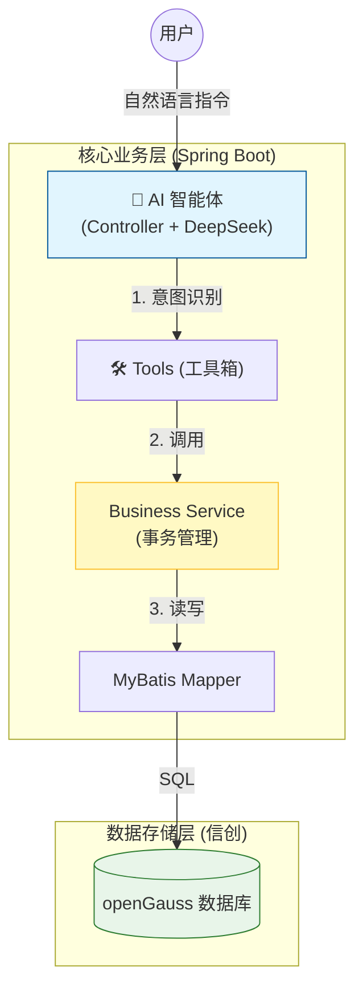
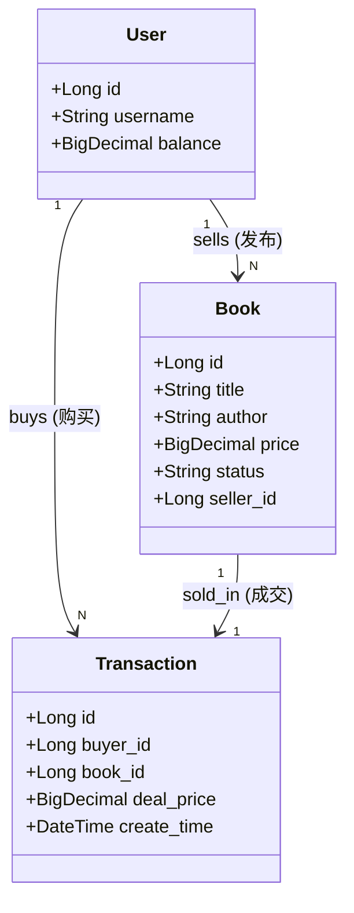

#  第六章：综合项目实战——SmartBook

这部分内容是地基，确保学生在进入 AI 环节前，先搭建好一个稳固的、支持事务的 Java 业务系统。

---

### 1. 章节导读 (`chapter06/index.md`)

```markdown
---
title: 第六章：综合项目实战——SmartBook 二手书交易智能体
---

# 第六章：综合项目实战——SmartBook 二手书交易智能体

!!! quote "本章目标"
    还记得我们在实验 3 和 4 中写的“图书管理系统”吗？那时候它只是个简单的增删改查玩具。
    
    **今天，我们要让它“长大”了。**
    
    我们将引入**用户**和**订单**的概念，把它升级为一个真正的 **C2C (个人对个人) 二手书交易平台**。更酷的是，我们将接入 AI，让交易不再需要点击繁琐的表单，而是像聊天一样自然。

---

## 🗺️ 项目蓝图

**项目名称**：SmartBook（智慧书摊）  
**核心理念**：让二手交易像聊天一样简单。

**场景演示**：

* **场景 A (我是卖家)**：
    * 同学说：“我有一本《算法导论》想卖 25 块钱，九成新。”
    * **AI 助手**：自动提取书名、价格、成色，自动上架到数据库。

* **场景 B (我是买家)**：
    * 同学说：“帮我找找有没有便宜的 Java 书？最好是 20 块以下的。”
    * **AI 助手**：自动搜索数据库，列出符合条件的书，并问：“要下单吗？”

---

## 🏗️ 架构设计

我们将严格遵循企业级开发流程，而不是上来就写代码：



## 📚 课程目录

* **[01. 需求分析与建模](https://www.google.com/search?q=01-design.md)**：想清楚人、书、交易之间的关系，并在 openGauss 建表。
* **[02. 核心业务开发](https://www.google.com/search?q=02-implementation.md)**：编写健壮的 Service，使用 `@Transactional` 保证钱货两清。
* **[03. 智能体集成](https://www.google.com/search?q=03-agent-integration.md)**：定义 Tools，让 DeepSeek 替我们操作 Service。
* **[实验 6：结课大作业](https://www.google.com/search?q=lab6.md)**：亲手打造你的 SmartBook 系统。

[开始第一步：需求分析与建模](https://www.google.com/search?q=01-design.md){ .md-button .md-button--primary }

```

---

### 2. 需求分析与建模 (`chapter06/01-design.md`)

```markdown
# 01. 需求分析与建模 (AI 辅助设计)

在开始写代码之前，我们需要用 **ER 图** 来理清业务逻辑。不要一上来就打开 IDEA 写代码，那是“码农”的做法，架构师都是先画图的。

## 🏢 第一步：需求分析

我们要实现一个 C2C 交易模型，核心实体有三个：

1.  **用户 (User)**：包含余额、姓名。在本项目中，一个用户既可以是买家，也可以是卖家。
2.  **图书 (Book)**：核心商品。需要增加字段：`seller_id` (谁卖的)、`status` (在售/已售)、`price`。
3.  **交易订单 (Transaction)**：记录谁买了哪本书，成交价是多少，防止赖账。

## 📊 第二步：业务建模 (ER 图)

!!! question "让 AI 设计数据库模型"
    **Prompt**:
    > "我正在设计一个校园二手书交易系统。请帮我设计数据库 ER 图。
    > 包含实体：
    > 1. User (id, name, balance)
    > 2. Book (id, title, author, price, status[ON_SALE, SOLD], seller_id)
    > 3. Transaction (id, buyer_id, book_id, deal_price, create_time)
    > 
    > **关系逻辑**：
    > - 一个用户可以发布多本书 (User 1:N Book)。
    > - 一个用户可以购买多本书 (User 1:N Transaction)。
    > - 一本书只能对应一笔交易 (Book 1:1 Transaction)。
    > 
    > 请输出 **Mermaid Class Diagram** 代码。"

**系统架构图：**



## 💾 第三步：数据库落地 (openGauss)

请连接你的 openGauss 数据库，执行以下初始化脚本。

!!! tip "信创小知识"
openGauss 对标准 SQL 的支持非常好。这里的 `SERIAL` 关键字用于自增主键，`DECIMAL` 用于金额（千万别用 double 存钱！）。

```sql
-- 1. 用户表
CREATE TABLE t_user (
    id SERIAL PRIMARY KEY,
    username VARCHAR(50) NOT NULL,
    balance DECIMAL(10, 2) DEFAULT 0.00 -- 初始余额
);

-- 2. 图书表
CREATE TABLE t_book (
    id SERIAL PRIMARY KEY,
    title VARCHAR(100) NOT NULL,
    author VARCHAR(50),
    price DECIMAL(10, 2) NOT NULL,
    status VARCHAR(20) DEFAULT 'ON_SALE', -- ON_SALE, SOLD
    seller_id INT NOT NULL,
    create_time TIMESTAMP DEFAULT CURRENT_TIMESTAMP
);

-- 3. 交易订单表
CREATE TABLE t_transaction (
    id SERIAL PRIMARY KEY,
    buyer_id INT NOT NULL,
    book_id INT NOT NULL,
    deal_price DECIMAL(10, 2) NOT NULL,
    create_time TIMESTAMP DEFAULT CURRENT_TIMESTAMP
);

-- 初始化测试数据
-- 张三有 100 块，卖一本《Java编程思想》
-- 李四有 500 块，是土豪买家
INSERT INTO t_user (username, balance) VALUES ('zhangsan', 100.00), ('lisi', 500.00);
INSERT INTO t_book (title, author, price, seller_id) VALUES ('Java编程思想', 'Bruce Eckel', 50.00, 1);

```

**下一步**：
数据库准备好了，接下来我们要用 Java 来操作它。
特别是 **“买书”** 这个操作，涉及扣钱、改状态、记账，必须保证**事务安全**。

[下一节：核心业务开发](https://www.google.com/search?q=02-implementation.md){ .md-button .md-button--primary }

```

---

### 3. 核心业务开发 (`chapter06/02-implementation.md`)

```markdown
# 02. 核心业务开发 (AI 辅助编码)

AI 再聪明，也需要有“手”才能干活。
本节我们将编写 Service 层代码，为 AI 提供两个核心能力（Tools）：**发布图书** 和 **购买图书**。

## 🔨 第一步：生成基础代码

请使用 **MyBatisX 插件** 或 AI，根据数据库表反向生成 `User`, `Book`, `Transaction` 的实体类及 Mapper 接口。
*(这一步在第 4 章练过多次，此处省略重复步骤，请确保 Mapper XML 能正常工作)*

## 🔧 第二步：编写 TradeService (核心)

我们要实现一个 `TradeService`，它包含两个核心方法。

### 1. 发布图书 (publishBook)
逻辑很简单：就是往 `t_book` 表插一条数据。

```java
@Service
public class TradeService {

    @Autowired
    private BookMapper bookMapper;
    @Autowired
    private UserMapper userMapper;
    @Autowired
    private TransactionMapper transactionMapper;

    /**
     * 工具 1: 发布图书
     */
    public Book publishBook(String sellerName, String title, BigDecimal price) {
        // 1. 根据名字找用户 (简化逻辑，实际应从 Session 获取)
        User seller = userMapper.findByName(sellerName);
        if (seller == null) throw new RuntimeException("卖家不存在");

        // 2. 构建图书对象
        Book book = new Book();
        book.setTitle(title);
        book.setPrice(price);
        book.setSellerId(seller.getId());
        book.setStatus("ON_SALE");

        // 3. 插入数据库
        bookMapper.insert(book);
        return book;
    }
}

```

### 2. 购买图书 (buyBook) —— 事务实战

逻辑很复杂：买家扣钱 -> 卖家加钱(可选) -> 图书下架 -> 生成订单。

!!! warning "事务的关键"
只要中间任何一步报错（比如买家钱不够），所有操作必须**全部回滚**。必须加上 `@Transactional`。

```java
    /**
     * 工具 2: 购买图书
     * @param buyerName 买家名字
     * @param bookId 图书ID
     */
    @Transactional(rollbackFor = Exception.class) // 👈 事务开关
    public Transaction buyBook(String buyerName, Long bookId) {
        // 1. 检查图书
        Book book = bookMapper.selectById(bookId);
        if (book == null || !"ON_SALE".equals(book.getStatus())) {
            throw new RuntimeException("图书不存在或已售出");
        }

        // 2. 检查买家
        User buyer = userMapper.findByName(buyerName);
        if (buyer.getBalance().compareTo(book.getPrice()) < 0) {
            throw new RuntimeException("余额不足，交易失败");
        }

        // 3. 执行交易 (原子操作)
        // 3.1 扣买家的钱
        buyer.setBalance(buyer.getBalance().subtract(book.getPrice()));
        userMapper.update(buyer);

        // 3.2 下架图书
        book.setStatus("SOLD");
        bookMapper.update(book);

        // 3.3 生成订单
        Transaction tx = new Transaction();
        tx.setBuyerId(buyer.getId());
        tx.setBookId(book.getId());
        tx.setDealPrice(book.getPrice());
        transactionMapper.insert(tx);

        return tx;
    }

```

## 🧪 第三步：自动化测试 (JUnit 5)

AI 只能调用代码，不能帮你调试代码。必须先确保 Service 本身是无 Bug 的。

```java
@SpringBootTest
class TradeServiceTest {

    @Autowired TradeService tradeService;

    @Test
    void testBuyBook_NotEnoughMoney() {
        // 场景：李四想买一本 10000 块的书（余额只有 500）
        // 断言：必须抛出异常
        assertThrows(RuntimeException.class, () -> {
            tradeService.buyBook("lisi", 9999L); 
        });
    }

    @Test
    void testBuyBook_Success() {
        // 场景：李四买张三的《Java编程思想》(50元)
        tradeService.buyBook("lisi", 1L); 
        // 这里的验证逻辑可以查数据库确认状态是否变更
    }
}

```

**下一步**：
现在我们的 Java 系统已经具备了完美的交易能力。
但是，用户还需要通过代码或者复杂的 UI 才能调用它。
下一节，我们将接入 **DeepSeek**，让 AI 替用户按按钮。

[下一节：智能体集成 (Tool Calling)](https://www.google.com/search?q=03-agent-integration.md){ .md-button .md-button--primary }

```

---

陈老师，前三份文档（导读、设计、核心实现）已完成。

接下来的一步是重头戏：**`03-agent-integration.md` (智能体集成)** 和 **`lab6.md` (实验任务书)**。我将重点把 **ChatController** 的代码写得尽量简单、可复制，确保学生能看懂。

**需要我继续生成剩下的这两份文档吗？**

```