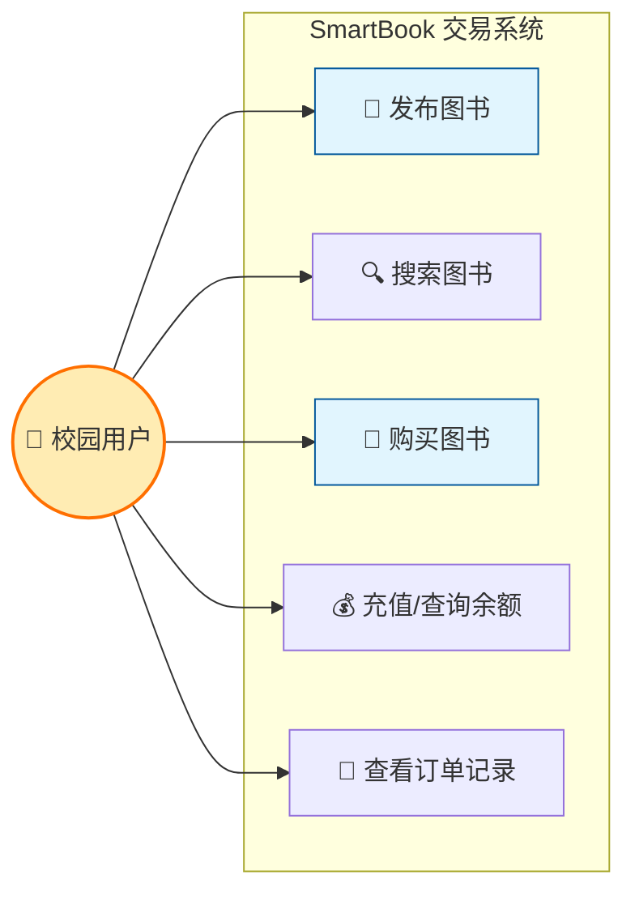
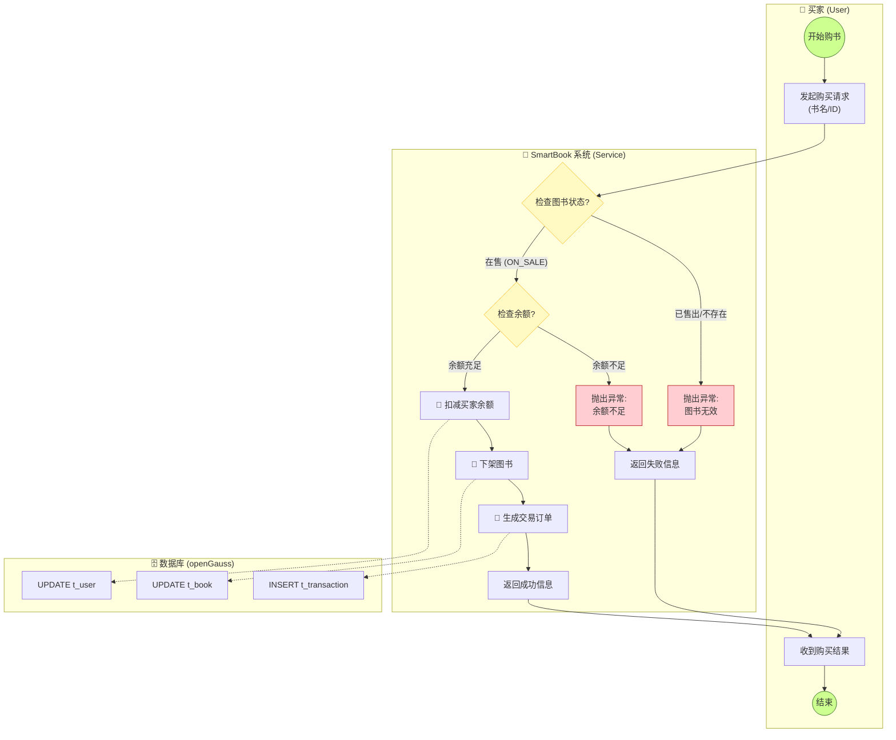
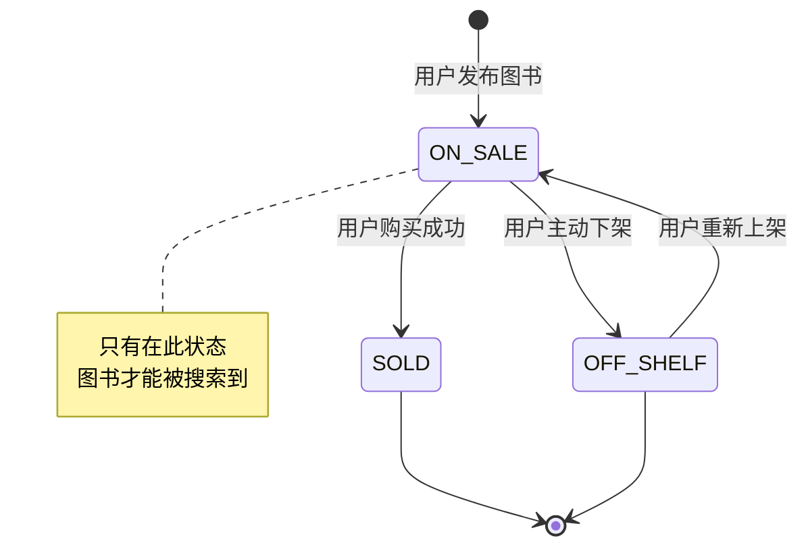
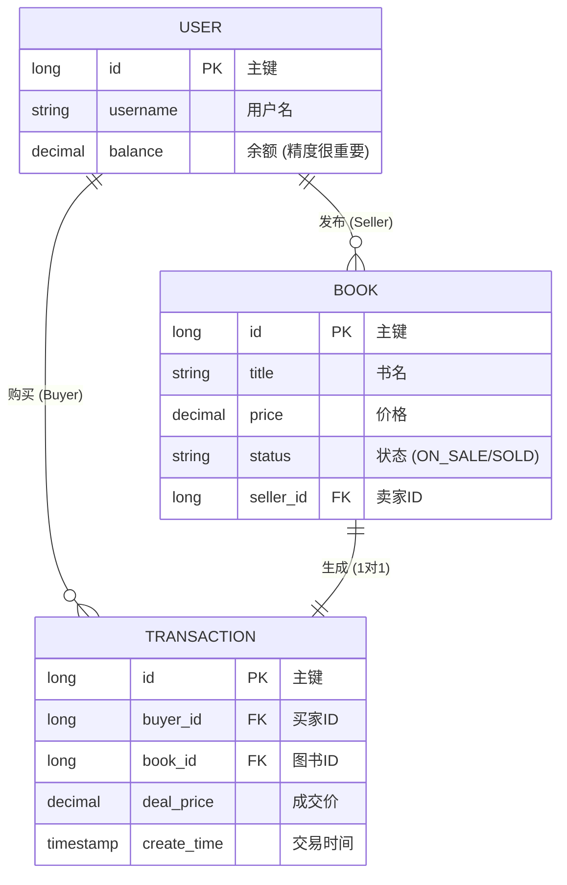

# 01. 需求分析与建模 (Visual Modeling)

!!! quote "架构师视角"
    很多初级程序员拿到需求直接打开 IDEA 写代码，结果写到一半发现逻辑走不通，只能推倒重来。

    **资深架构师**会花 80% 的时间画图、设计，只花 20% 的时间写代码。
    本节我们将利用 AI 辅助，完成 SmartBook 系统的全套设计图纸。

---

## 🧐 第一步：需求分析 (Use Case)

首先，我们要明确系统里有哪些**角色 (Actor)**，以及他们分别能**做什么 (Use Case)**。

### 1. 核心角色

由于是 C2C (个人对个人) 交易，其实只有一个核心角色：**用户 (User)**。
同一个用户，既可以是**卖家**（发布闲置），也可以是**买家**（购买图书）。

### 2. 用例图 (Use Case Diagram)



**功能列表**：

1. **发布**：填写书名、价格，上架图书。
2. **搜索**：根据书名模糊查询，且只能查到“未售出”的书。
3. **购买**：核心业务，涉及余额扣减和商品下架。

---

## 🌊 第二步：业务流程设计 (Activity Diagram)

“购买图书”是本系统最复杂的业务。我们需要用**泳道图**来厘清买家、系统、数据库三者之间的交互逻辑，特别是**异常流程**（比如钱不够怎么办）。

### 购买流程泳道图



---

## 🚦 第三步：状态机设计 (State Diagram)

图书是有**生命周期**的。我们不能把一本已经卖掉的书再卖一次。
使用状态机图来定义图书的状态流转。



* **ON_SALE (在售)**：初始状态，所有人可见。
* **SOLD (已售)**：交易完成后自动流转，不可再被购买。
* **OFF_SHELF (下架)**：卖家不想卖了，或者违规被管理员下架。

---

## 📊 第四步：数据模型设计 (ER Diagram)

基于上述分析，我们确定了数据库的最终结构。

### 1. 实体关系图 (ERD)



### 2. 字段设计细节

| 表名 | 字段 | 类型 | 说明 |
| --- | --- | --- | --- |
| **t_user** | balance | `DECIMAL(10,2)` | **重点**：涉及金钱必须用 Decimal，禁止用 Float/Double (会有精度丢失)。 |
| **t_book** | status | `VARCHAR(20)` | 默认为 `ON_SALE`。利用数据库默认值简化代码。 |
| **t_book** | seller_id | `INT` | 关联 `t_user.id`。 |
| **t_txn** | deal_price | `DECIMAL(10,2)` | 记录当时的成交价（防止以后书涨价了，订单记录变了）。 |

---

## 💾 第五步：数据库实施 (SQL 脚本)

请连接 openGauss 数据库，执行以下脚本完成建表和数据初始化。

```sql
-- ==========================================
-- 1. 清理旧表 (如果存在)
-- ==========================================
DROP TABLE IF EXISTS t_transaction;
DROP TABLE IF EXISTS t_book;
DROP TABLE IF EXISTS t_user;

-- ==========================================
-- 2. 创建用户表
-- ==========================================
CREATE TABLE t_user (
    id SERIAL PRIMARY KEY,
    username VARCHAR(50) NOT NULL UNIQUE,
    balance DECIMAL(10, 2) DEFAULT 0.00,
    create_time TIMESTAMP DEFAULT CURRENT_TIMESTAMP
);
COMMENT ON TABLE t_user IS '用户信息表';
COMMENT ON COLUMN t_user.balance IS '账户余额';

-- ==========================================
-- 3. 创建图书表
-- ==========================================
CREATE TABLE t_book (
    id SERIAL PRIMARY KEY,
    title VARCHAR(100) NOT NULL,
    author VARCHAR(50),
    price DECIMAL(10, 2) NOT NULL,
    status VARCHAR(20) DEFAULT 'ON_SALE', -- 状态：ON_SALE, SOLD
    seller_id INT NOT NULL,
    create_time TIMESTAMP DEFAULT CURRENT_TIMESTAMP
);
COMMENT ON TABLE t_book IS '二手图书表';
COMMENT ON COLUMN t_book.status IS '状态: ON_SALE(在售), SOLD(已售)';

-- ==========================================
-- 4. 创建交易订单表
-- ==========================================
CREATE TABLE t_transaction (
    id SERIAL PRIMARY KEY,
    buyer_id INT NOT NULL,
    book_id INT NOT NULL,
    deal_price DECIMAL(10, 2) NOT NULL,
    create_time TIMESTAMP DEFAULT CURRENT_TIMESTAMP
);
COMMENT ON TABLE t_transaction IS '交易流水表';

-- ==========================================
-- 5. 初始化测试数据
-- ==========================================

-- 用户：张三(卖家，没钱)，李四(买家，有500块)
INSERT INTO t_user (username, balance) VALUES 
('zhangsan', 0.00), 
('lisi', 500.00);

-- 图书：张三发布了3本书
INSERT INTO t_book (title, author, price, seller_id, status) VALUES 
('Java编程思想', 'Bruce Eckel', 50.00, 1, 'ON_SALE'),
('三体全集', '刘慈欣', 30.00, 1, 'ON_SALE'),
('高等数学(上)', '同济大学', 15.00, 1, 'SOLD'); -- 这本已经卖了

-- 验证：查询一下
SELECT * FROM t_user;
SELECT * FROM t_book;

```

---

## ✅ 本节验收

1. **看懂图**：能够对照泳道图，说出“购买”操作的 3 个关键步骤（扣钱、下架、记账）。
2. **跑通 SQL**：在 DataGrip 中能够看到 3 张表，且数据已预置成功。

**下一步**：
设计图已经画好，地基已经打牢。下一节我们将进入 **Java 编码阶段**，实现这些业务逻辑，并重点攻克 **事务管理** 这一难关。

[下一节：核心业务开发](02-implementation.md){ .md-button .md-button--primary }