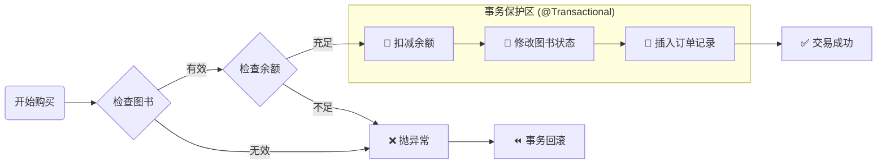

# 02. 核心业务开发 (AI 辅助编码)

!!! quote "工程思维"
    AI 再聪明，也只是个“大脑”。如果后端没有提供执行任务的方法（Service），AI 就只能是个聊天机器人，干不了实事。
    
    本节我们将编写 SmartBook 的核心业务逻辑，为下一节的 AI 智能体提供一双“灵巧的手”。

---

## 🔨 第一步：基础设施搭建 (Entity & Mapper)

在 `01-design.md` 中我们已经建立了数据库表。现在，利用工具一键生成 Java 代码。

### 1. 使用 MyBatisX 生成
如果你安装了 **MyBatisX 插件**：  
1.  在 IDEA 连接 Database。  
2.  右键 `t_user`, `t_book`, `t_transaction` 表。  
3.  选择 **"MyBatisX-Generator"**。  
4.  生成 Entity、Mapper 接口、Mapper XML。  

### 2. 检查关键注解
生成后，请务必检查以下两点：

* **实体类**：是否有 `@Data` (Lombok)。  
* **Mapper 接口**：头上是否有 `@Mapper`，或者在启动类加了 `@MapperScan`。  

---

## 🔧 第二步：编写 TradeService (核心)

我们要创建一个 `TradeService`，它承载了系统最关键的两个动作：**发布** 和 **购买**。

### 1. 方法一：发布图书 (publishBook)

逻辑比较简单：验证卖家是否存在 -> 插入图书数据。

!!! question "让 AI 写简单逻辑"
    **Prompt**:
    > "请基于 Spring Boot + MyBatis，帮我写一个 `TradeService` 的方法 `publishBook`。  
    > 参数：`String sellerName`, `String title`, `BigDecimal price`。  
    > 逻辑：  
    > 1. 调用 `UserMapper` 根据名字查用户，如果你找不到这个方法，请假设它叫 `selectByName`。  
    > 2. 如果用户不存在，抛出异常。  
    > 3. 创建 `Book` 对象，状态设为 'ON_SALE'。  
    > 4. 调用 `BookMapper` 插入数据。  
    > 5. 返回插入后的 Book 对象。"  

**参考代码 (Java):**

```java
@Service
public class TradeService {

    @Autowired private UserMapper userMapper;
    @Autowired private BookMapper bookMapper;
    @Autowired private TransactionMapper transactionMapper;

    public Book publishBook(String sellerName, String title, BigDecimal price) {
        // 1. 身份校验
        User seller = userMapper.selectByName(sellerName);
        if (seller == null) {
            throw new RuntimeException("卖家用户不存在: " + sellerName);
        }

        // 2. 组装数据
        Book book = new Book();
        book.setTitle(title);
        book.setPrice(price);
        book.setSellerId(seller.getId());
        book.setStatus("ON_SALE"); // 默认在售
        book.setCreateTime(LocalDateTime.now());

        // 3. 落库
        bookMapper.insert(book);
        return book;
    }
}

```

### 2. 方法二：购买图书 (buyBook) —— 事务实战

这是本章的**重难点**。买书涉及资金变动，必须保证数据一致性。

**逻辑流转图**：



!!! question "让 AI 写事务代码"
    **Prompt**:
    > "请在 `TradeService` 中补充 `buyBook(String buyerName, Long bookId)` 方法。  
    > **核心要求**：  
    > 1. 检查图书是否存在且状态为 'ON_SALE'。  
    > 2. 检查买家余额是否充足。  
    > 3. **原子操作**：扣减买家余额、将图书状态改为 'SOLD'、向 `t_transaction` 表插入一条记录。  
    > 4. **必须加上 `@Transactional` 注解**，确保余额不足或扣款失败时，图书状态不会被修改。"  

**参考代码 (Java):**

```java
    /**
     * 核心交易方法
     * @param buyerName 买家用户名
     * @param bookId 图书ID
     */
    @Transactional(rollbackFor = Exception.class) // 🔐 事务安全气囊
    public Transaction buyBook(String buyerName, Long bookId) {
        // 1. 校验图书
        Book book = bookMapper.selectById(bookId);
        if (book == null || !"ON_SALE".equals(book.getStatus())) {
            throw new RuntimeException("很抱歉，该书不存在或已被抢走！");
        }

        // 2. 校验买家
        User buyer = userMapper.selectByName(buyerName);
        if (buyer == null) throw new RuntimeException("买家不存在");

        // 3. 校验余额 (注意 BigDecimal 的比较方式)
        if (buyer.getBalance().compareTo(book.getPrice()) < 0) {
            throw new RuntimeException("余额不足，请先充值！");
        }

        // 4. 执行扣款
        buyer.setBalance(buyer.getBalance().subtract(book.getPrice()));
        userMapper.updateById(buyer);

        // 5. 下架图书
        book.setStatus("SOLD");
        bookMapper.updateById(book);

        // 6. 生成订单
        Transaction tx = new Transaction();
        tx.setBuyerId(buyer.getId());
        tx.setBookId(book.getId());
        tx.setDealPrice(book.getPrice());
        tx.setCreateTime(LocalDateTime.now());
        transactionMapper.insert(tx);

        return tx;
    }

```

---

## 🧪 第三步：自动化测试 (JUnit 5)

代码写完了，能不能跑？别急着写 Controller，先用单元测试验证 Service 的逻辑。这是专业开发者的习惯。

在 `src/test/java` 下新建 `TradeServiceTest.java`。

!!! question "让 AI 生成测试用例"
    **Prompt**:  
    > "请为 `TradeService.buyBook` 方法生成 JUnit 5 单元测试。  
    > 假设使用 `@SpringBootTest`。  
    > 请生成两个测试用例：  
    > 1. `testBuySuccess`: 模拟余额充足，断言交易成功，且图书状态变为 SOLD。  
    > 2. `testBuyFail`: 模拟余额不足，断言抛出异常，且图书状态依然是 ON_SALE（事务回滚验证）。  

**关键测试代码示例**：

```java
@SpringBootTest
class TradeServiceTest {

    @Autowired TradeService tradeService;
    @Autowired BookMapper bookMapper;
    @Autowired UserMapper userMapper;

    @Test
    @DisplayName("测试：余额不足导致交易失败")
    void testBuyFail() {
        // 1. 准备数据：张三卖书(id=1, 50元)，李四想买(余额设为10元)
        // (建议直接在数据库预置，或者在这里用代码预置)
        
        // 2. 执行与断言
        Exception exception = assertThrows(RuntimeException.class, () -> {
            tradeService.buyBook("lisi_poor", 1L);
        });
        
        System.out.println("捕获异常信息：" + exception.getMessage());

        // 3. 验证事务回滚：书的状态应该还是 ON_SALE
        Book book = bookMapper.selectById(1L);
        assertEquals("ON_SALE", book.getStatus(), "事务未回滚，书状态被错误修改！");
    }
}

```

---

## ✅ 本节验收

1. **代码无红线**：Entity、Mapper、Service 编译通过。
2. **测试全变绿**：运行 `TradeServiceTest`，进度条显示绿色。
3. **数据库验证**：跑完成功的测试后，去数据库看一眼，`t_transaction` 表里是否多了一条数据？

**下一步**：
现在，你的系统已经具备了强大的交易能力，但还需要程序员写代码来调用。
下一节，我们将给系统装上 **DeepSeek 大脑**，让它学会**自己**调用这些方法，实现“对话即交易”。
[下一节：智能体集成 (Tool Calling 实战)](03-agent-integration.md){ .md-button .md-button--primary }