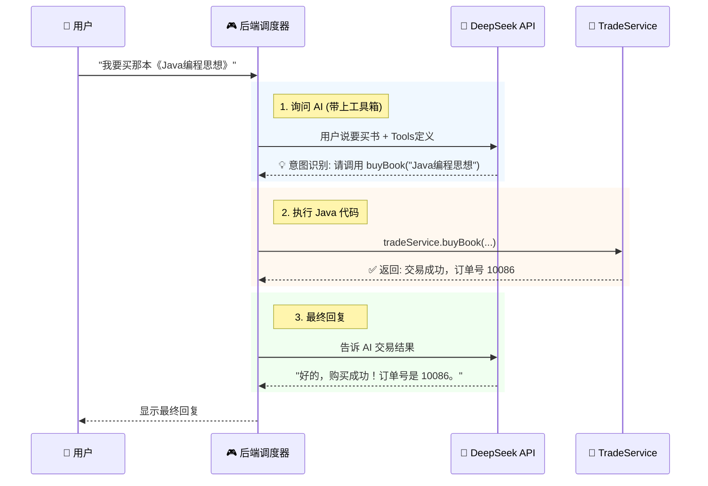

# 03. 智能体集成：Tool Calling 实战

!!! quote "从 Java 到 Agent"
    在上一节，我们已经写好了功能强大的 `TradeService`（大脑的手）。
    现在，我们需要接入 **DeepSeek**（大脑），并编写一个 **Controller**（神经中枢），让大脑能够指挥双手干活。
    
    这就是 **"Chat to Action"** —— 让自然语言直接触发业务代码。

---

## 🤖 原理回顾：AI 是如何“按按钮”的？

AI 并不懂 Java，它只懂 JSON。我们要做的就是建立一个**翻译机制**。



---

## 📝 第一步：定义工具箱 (JSON Schema)

我们需要把 Java 方法 `buyBook` 和 `publishBook` 描述成 JSON 格式，告诉 AI：“我有这些本事，你看着用”。

在 `controller` 包下新建 `ToolsConstant.java`：

```java
package com.example.smartbook.controller;

public class ToolsConstant {

    public static final String TOOLS_JSON = """
    [
        {
            "type": "function",
            "function": {
                "name": "searchBook",
                "description": "搜索二手书。当用户想买书时，必须先调用此工具查询图书ID。",
                "parameters": {
                    "type": "object",
                    "properties": {
                        "keyword": {"type": "string", "description": "书名关键词"}
                    },
                    "required": ["keyword"]
                }
            }
        },
        {
            "type": "function",
            "function": {
                "name": "buyBook",
                "description": "购买图书。注意：调用此工具前，必须通过搜索工具获取具体的 bookId。",
                "parameters": {
                    "type": "object",
                    "properties": {
                        "bookId": {"type": "integer", "description": "图书ID"},
                        "buyerName": {"type": "string", "description": "买家名字（通常是当前用户）"}
                    },
                    "required": ["bookId", "buyerName"]
                }
            }
        }
    ]
    """;
}

```

!!! tip "Prompt 技巧"
    注意看 `buyBook` 的描述：我特意强调了 **“必须先搜索获取 ID”**。这能防止 AI 瞎编一个 ID 去下单。

---

## 🔌 第二步：准备 AI 客户端 (AiUtils)

发送 HTTP 请求和解析 JSON 比较繁琐。为了让你专注于逻辑，老师为你准备好了一个工具类。
请在 `utils` 包下新建 `AiUtils.java`。

*(注：此处使用 Spring 6 的 `RestClient`，如果你用的是旧版本 Spring Boot，需替换为 RestTemplate 或 OkHttp)*

!!! example "复制粘贴 AiUtils 代码"
    由于代码较长，请直接复制课件附件中的 `AiUtils.java`。

    **核心方法说明**：

    * `callDeepSeek(String userMsg, String toolsJson)`: 发送请求给 AI。
    * `parseFunctionName(String aiResponse)`: 从 JSON 中提取 AI 想调用的方法名。
    * `parseFunctionArgs(String aiResponse)`: 从 JSON 中提取方法参数。

---

## 🎮 第三步：编写调度器 (ChatController)

这是本节的核心。我们需要编写一个“中转站”，根据 AI 的指示去调用 Service。

```java
@RestController
@RequestMapping("/chat")
@Slf4j
public class ChatController {

    @Autowired private TradeService tradeService;
    @Autowired private AiUtils aiUtils; // 刚才复制的工具类

    // 模拟当前登录用户 (实际项目中应从 Session/Token 获取)
    private String currentUser = "lisi"; 

    @PostMapping("/send")
    public Result<String> chat(@RequestBody String userMessage) {
        
        // 1. 构建 System Prompt (注入当前用户信息)
        String systemPrompt = "你是一个二手书交易助手。当前用户是：" + currentUser + "。请帮助他买卖图书。";
        
        // 2. 第一次请求 AI (带上工具箱)
        String aiResponse = aiUtils.callDeepSeek(systemPrompt, userMessage, ToolsConstant.TOOLS_JSON);

        // 3. 判断 AI 是否想要调用工具 (Tool Calling)
        if (aiUtils.hasToolCall(aiResponse)) {
            
            String functionName = aiUtils.parseFunctionName(aiResponse);
            JsonNode args = aiUtils.parseFunctionArgs(aiResponse);
            
            log.info("🤖 AI 请求执行工具: {} | 参数: {}", functionName, args);

            String executionResult = "";
            try {
                // === 核心调度逻辑 (Switch-Case) ===
                if ("searchBook".equals(functionName)) {
                    String keyword = args.get("keyword").asText();
                    var books = tradeService.searchBook(keyword); // 假设你在 Service 实现了这个方法
                    executionResult = "搜索结果: " + books.toString();
                } 
                else if ("buyBook".equals(functionName)) {
                    Long bookId = args.get("bookId").asLong();
                    var tx = tradeService.buyBook(currentUser, bookId);
                    executionResult = "交易成功！订单ID: " + tx.getId();
                }
            } catch (Exception e) {
                executionResult = "执行失败: " + e.getMessage();
            }

            // 4. 第二次请求 AI (把执行结果喂给它，让它生成最终回复)
            // "我帮你查过了，结果是XXX，请你回复用户。"
            String finalAnswer = aiUtils.callDeepSeekWithContext(userMessage, executionResult);
            return Result.success(finalAnswer);
        }

        // 5. 如果 AI 只是普通聊天，直接返回
        return Result.success(aiUtils.parseContent(aiResponse));
    }
}

```

---

## 🧪 第四步：交互式测试验证

启动 Spring Boot，使用 Postman 或浏览器插件测试。


=== "🔍 测试用例 1：搜书"
    **请求信息 (Request)**
    ```http
    POST http://localhost:8080/chat/send
    Content-Type: text/plain

    "帮我看看有没有 Java 相关的书？"
    ```

    **预期结果 (Expectation)**
    * **后台日志**：
        ```text
        AI 请求执行工具: searchBook | 参数: {"keyword": "Java"}
        ```
    * **AI 响应**：
        > "为您找到一本《Java编程思想》，售价 50 元。"

=== "🛒 测试用例 2：买书"
    **请求信息 (Request)**
    ```http
    POST http://localhost:8080/chat/send
    Content-Type: text/plain

    "就把那本 Java 编程思想买了吧"
    ```

    **预期结果 (Expectation)**
    * **后台日志**：
        ```text
        AI 请求执行工具: buyBook | 参数: {"bookId": 1, "buyerName": "lisi"}
        ```

    !!! success "💾 数据库验证 (重要)"
        * `t_user`: 李四余额减少，张三余额增加。
        * `t_book`: 状态变为 `SOLD`。
        * `t_transaction`: 新增一条交易记录。

---

## 📝 总结

恭喜你！你已经完成了一个**具备 Agent 能力**的 Java 应用。

* **对于用户**：他不需要知道什么是表单、什么是 ID，只要像和朋友聊天一样说话。
* **对于开发者**：你成功将复杂的 AI 能力“关”进了 Java 的逻辑笼子里，既利用了 AI 的灵活性，又保证了业务（事务）的严谨性。

**下一步**：
拿起你的键盘，开始完成最后的 **[实验 6：结课大作业](lab6.md)** 吧！