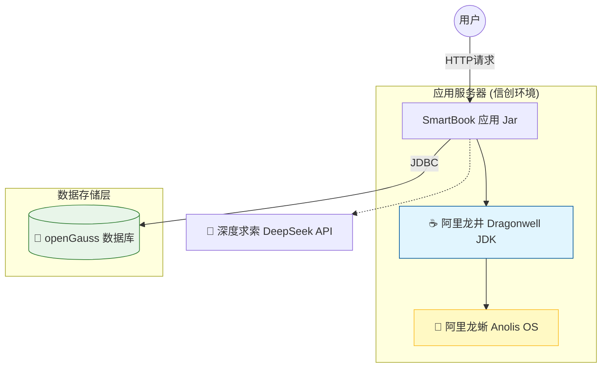

# 04. 信创全栈部署实战：从龙蜥到龙井

!!! quote "国产化最后一公里"
    在前面的章节中，我们已经完成了代码的编写。但一个成熟的软件工程师，必须懂得如何将应用发布到生产服务器。
    
    本节我们将构建一个 **“全信创 (Full Xinchuang)”** 的运行环境，彻底摆脱对国外底层技术的依赖，实现 **“国产操作系统 + 国产 JDK + 国产数据库”** 的全链路闭环。

---

## 🇨🇳 我们的“信创全家桶”架构

我们将搭建如下架构，这正是目前国内金融、政务领域的标配：



---

## 🦎 1. 认识龙蜥操作系统 (Anolis OS)

* **它的前身**：你可能听说过 CentOS。在 CentOS 宣布停服后，国内阿里等大厂发起了 OpenAnolis 社区。
* **它的地位**：龙蜥是目前国内装机量最大的服务器操作系统之一，**100% 兼容 CentOS 生态**，但内核是完全自主可控的。
* **为什么学它**：你毕业后进入国企、银行或大厂，服务器上跑的概率就是龙蜥或其衍生版。

---

## ☕ 2. 环境准备 (Docker 方式)

为了方便大家在个人电脑上体验服务器环境，老师已经为大家准备好了 **Anolis OS 的 Docker 镜像**。

!!! tip "启动龙蜥容器"
请确保你的 Docker Desktop 已启动，然后在终端执行：

```
```bash
# 拉取并启动一个装有 Dragonwell JDK 17 的龙蜥容器
# 映射端口：8080 (应用端口)
docker run -d --name smartbook-server -p 8080:8080 openanolis/anolisos:8.8
```
*(注：如果上述官方镜像未预装 Java，需进入容器执行 `yum install -y java-17-openjdk`，这里使用的是龙蜥源中的 Dragonwell 发行版)*

```

---

## 🚀 3. 部署 SmartBook

### 第一步：打包应用

在 IDEA 中，打开右侧 Maven 面板，双击 `Lifecycle` -> `package`。
等待片刻，在 `target` 目录下会生成一个 `smartbook-0.0.1-SNAPSHOT.jar`。

### 第二步：上传到服务器

使用 `docker cp` 命令模拟上传过程：

```bash
docker cp target/smartbook-0.0.1-SNAPSHOT.jar smartbook-server:/app.jar

```

### 第三步：启动服务

进入容器并启动应用：

```bash
# 1. 进入容器终端
docker exec -it smartbook-server /bin/bash

# 2. 检查 Java 版本 (截图点：证明是 Dragonwell)
java -version 
# 预期输出: Alibaba Dragonwell Standard Edition ...

# 3. 启动应用 (生产模式)
# --spring.profiles.active=prod 可以加载生产环境配置
nohup java -jar /app.jar > app.log 2>&1 &

# 4. 查看日志，确认启动成功
tail -f app.log

```

---

## 🧪 4. 最终验证

现在，你的应用已经运行在国产操作系统之上了。

1. 打开宿主机浏览器，访问 `http://localhost:8080`。
2. 你应该能看到 SmartBook 的聊天界面。
3. 尝试发送一条指令：“**帮我查一下所有的 Java 书**”。
4. 如果 AI 能回复，且后台日志有 SQL 打印，恭喜你！你已经掌握了 **从开发到部署** 的完整全栈技能。

---

## 📝 课后思考

为什么国家大力推行“信创”？
不仅仅是为了“不用外国货”，更重要的是在极端情况下（如被断供），我们的金融、电力、交通系统依然能跑在 **自己的操作系统 (Anolis)** 和 **自己的数据库 (openGauss)** 上，保障国家信息安全。
