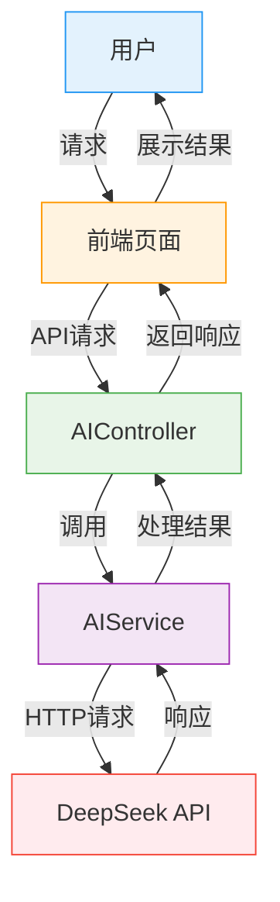

# AI 智能助手模块实现

## 1. 功能需求

AI智能助手模块是系统的特色功能，主要为用户提供智能化的旅行服务，具体功能包括：

- 智能行程规划
- 航班推荐
- 旅行问答
- 天气查询

## 2. 技术架构

### 2.1 技术栈

| 技术 | 用途 |
| --- | --- |
| HttpClient | 调用大模型API |
| Jackson | JSON数据解析 |
| DeepSeek API | 大模型服务 |
| MCP (Model Context Protocol) | 模型上下文协议 |

### 2.2 架构图



## 3. 数据库设计

### 3.1 行程表结构

```sql
-- 行程表
CREATE TABLE "itinerary" (
  "itinerary_id" varchar(36) NOT NULL,
  "user_id" varchar(36) NOT NULL,
  "destination" varchar(100) NOT NULL,
  "content" text NOT NULL,
  "create_time" timestamp NOT NULL DEFAULT CURRENT_TIMESTAMP,
  PRIMARY KEY ("itinerary_id"),
  FOREIGN KEY ("user_id") REFERENCES "user" ("user_id")
);

-- 创建索引
CREATE INDEX "idx_itinerary_user_id" ON "itinerary" ("user_id");
```

### 3.2 实体类设计

```java
@Data
@AllArgsConstructor
@NoArgsConstructor
public class Itinerary {
    private String itineraryId;
    private String userId;
    private String destination;
    private String content;
    private Date createTime;
}
```

## 4. 功能实现

### 4.1 智能行程规划

#### 4.1.1 Controller层

```java
@RestController
@RequestMapping("/api/ai")
public class AIController {
    
    @Autowired
    private AIService aiService;
    
    @PostMapping("/itinerary")
    public Result generateItinerary(@RequestBody ItineraryRequest request, @RequestHeader("Authorization") String token) {
        // 从令牌中获取用户ID
        String userId = JwtUtil.getUserIdFromToken(token.replace("Bearer ", ""));
        
        // 生成行程
        Itinerary itinerary = aiService.generateItinerary(userId, request.getDestination(), request.getDays());
        
        return Result.success("行程生成成功", itinerary);
    }
}
```

#### 4.1.2 Service层

```java
@Service
public class AIService {
    
    @Autowired
    private HttpClient httpClient;
    
    @Autowired
    private ObjectMapper objectMapper;
    
    @Autowired
    private ItineraryMapper itineraryMapper;
    
    @Value("${deepseek.api.url}")
    private String deepseekApiUrl;
    
    @Value("${deepseek.api.key}")
    private String deepseekApiKey;
    
    public Itinerary generateItinerary(String userId, String destination, int days) {
        try {
            // 1. 构建请求参数
            DeepSeekRequest request = buildItineraryRequest(destination, days);
            
            // 2. 发送HTTP请求
            String responseBody = sendDeepSeekRequest(request);
            
            // 3. 解析响应结果
            String itineraryContent = parseItineraryResponse(responseBody);
            
            // 4. 保存行程
            return saveItinerary(userId, destination, itineraryContent);
            
        } catch (Exception e) {
            throw new BusinessException("行程生成失败: " + e.getMessage());
        }
    }
    
    private DeepSeekRequest buildItineraryRequest(String destination, int days) {
        DeepSeekRequest request = new DeepSeekRequest();
        request.setModel("deepseek-chat");
        
        List<Message> messages = new ArrayList<>();
        Message systemMessage = new Message();
        systemMessage.setRole("system");
        systemMessage.setContent("你是一位专业的旅行规划师，请根据用户需求生成详细的旅行行程。");
        messages.add(systemMessage);
        
        Message userMessage = new Message();
        userMessage.setRole("user");
        userMessage.setContent(String.format("请为我规划一个%d天的%s旅行行程，包含每日的景点推荐、交通安排和餐饮建议。", days, destination));
        messages.add(userMessage);
        
        request.setMessages(messages);
        request.setTemperature(0.7);
        request.setMaxTokens(2000);
        
        return request;
    }
    
    private String sendDeepSeekRequest(DeepSeekRequest request) throws IOException, InterruptedException {
        // 创建HTTP请求
        HttpRequest httpRequest = HttpRequest.newBuilder()
                .uri(URI.create(deepseekApiUrl))
                .header("Content-Type", "application/json")
                .header("Authorization", "Bearer " + deepseekApiKey)
                .POST(HttpRequest.BodyPublishers.ofString(objectMapper.writeValueAsString(request)))
                .timeout(Duration.ofSeconds(30))
                .build();
        
        // 发送请求并获取响应
        HttpResponse<String> response = httpClient.send(httpRequest, HttpResponse.BodyHandlers.ofString());
        
        if (response.statusCode() != 200) {
            throw new IOException("API请求失败: " + response.statusCode() + " " + response.body());
        }
        
        return response.body();
    }
    
    private String parseItineraryResponse(String responseBody) throws IOException {
        JsonNode rootNode = objectMapper.readTree(responseBody);
        return rootNode.path("choices").get(0).path("message").path("content").asText();
    }
    
    private Itinerary saveItinerary(String userId, String destination, String content) {
        Itinerary itinerary = new Itinerary();
        itinerary.setItineraryId(UUID.randomUUID().toString());
        itinerary.setUserId(userId);
        itinerary.setDestination(destination);
        itinerary.setContent(content);
        itinerary.setCreateTime(new Date());
        
        itineraryMapper.insert(itinerary);
        return itinerary;
    }
}
```

### 4.2 航班推荐

```java
@PostMapping("/flight-recommendation")
public Result recommendFlights(@RequestBody FlightRecommendationRequest request, @RequestHeader("Authorization") String token) {
    // 从令牌中获取用户ID
    String userId = JwtUtil.getUserIdFromToken(token.replace("Bearer ", ""));
    
    // 调用AI服务获取推荐
    String recommendations = aiService.recommendFlights(request.getDeparture(), request.getDestination(), request.getTravelDate());
    
    return Result.success("航班推荐成功", recommendations);
}
```

## 5. MCP (Model Context Protocol) 实现

MCP是模型上下文协议，用于管理模型的上下文信息。以下是一个简单的实现：

```java
@Service
public class MCPContextManager {
    
    // 使用本地缓存存储上下文
    private final Map<String, List<Message>> contextMap = new ConcurrentHashMap<>();
    
    // 添加消息到上下文
    public void addMessage(String userId, Message message) {
        List<Message> context = contextMap.computeIfAbsent(userId, k -> new ArrayList<>());
        context.add(message);
        
        // 限制上下文大小
        if (context.size() > 10) {
            context.remove(0);
        }
    }
    
    // 获取用户上下文
    public List<Message> getContext(String userId) {
        return contextMap.getOrDefault(userId, new ArrayList<>());
    }
    
    // 清理上下文
    public void clearContext(String userId) {
        contextMap.remove(userId);
    }
}
```

## 6. 工具调用 (Tool Calling) 实现

工具调用允许大模型调用外部工具，扩展其能力：

```java
public class WeatherTool {
    
    public String getWeather(String city) {
        // 调用天气API获取天气信息
        // 这里简化处理，返回模拟数据
        return String.format("%s的天气：晴，温度25℃", city);
    }
}

// 在AI服务中使用工具
public String getTravelWeather(String city) {
    // 构建工具调用请求
    DeepSeekRequest request = buildToolCallRequest(city);
    
    // 发送请求
    String responseBody = sendDeepSeekRequest(request);
    
    // 解析响应
    JsonNode rootNode = objectMapper.readTree(responseBody);
    String toolCall = rootNode.path("choices").get(0).path("message").path("tool_calls").get(0).toString();
    
    // 执行工具调用
    WeatherTool weatherTool = new WeatherTool();
    String weather = weatherTool.getWeather(city);
    
    // 将工具结果返回给模型
    return sendToolResult(request, weather);
}
```

## 7. 错误处理与重试机制

为了提高系统的稳定性，需要实现完善的错误处理和重试机制：

```java
@Service
public class RetryService {
    
    // 重试策略
    private final RetryTemplate retryTemplate = RetryTemplate.builder()
            .maxAttempts(3)
            .fixedBackoff(1000)
            .retryOn(Exception.class)
            .build();
    
    public <T> T executeWithRetry(RetryCallback<T, Exception> callback) {
        try {
            return retryTemplate.execute(callback);
        } catch (Exception e) {
            throw new BusinessException("操作失败，请稍后重试", e);
        }
    }
}

// 在AIService中使用重试机制
public String sendDeepSeekRequestWithRetry(DeepSeekRequest request) {
    return retryService.executeWithRetry(context -> {
        return sendDeepSeekRequest(request);
    });
}
```

## 8. 接口测试

主要测试以下接口：

- POST /api/ai/itinerary - 生成行程
- POST /api/ai/flight-recommendation - 航班推荐
- POST /api/ai/qa - 旅行问答

## 9. 安全考虑

1. **API Key保护**：将API Key存储在配置文件中，避免硬编码
2. **请求频率限制**：限制API调用频率，避免过度消耗资源
3. **输入验证**：对用户输入进行验证，防止恶意请求
4. **数据加密**：使用HTTPS协议传输数据

## 10. 性能优化

1. **连接池**：使用HttpClient连接池，提高请求效率
2. **异步调用**：使用CompletableFuture进行异步调用，提高系统吞吐量
3. **缓存**：对频繁请求的结果进行缓存，减少API调用次数
4. **批量处理**：对批量请求进行合并处理，减少网络开销

## 11. 常见问题及解决方案

### 11.1 API调用超时

**问题**：调用大模型API时出现超时。

**解决方案**：
- 增加超时时间配置
- 实现重试机制
- 使用异步调用避免阻塞主线程

### 11.2 响应结果格式不一致

**问题**：大模型返回的结果格式不一致，导致解析失败。

**解决方案**：
- 优化Prompt，明确指定输出格式
- 增加结果验证和兜底处理
- 使用JSON Schema验证输出格式

### 11.3 API Key泄露

**问题**：API Key被泄露，导致不必要的费用。

**解决方案**：
- 使用环境变量存储API Key
- 定期更换API Key
- 限制API Key的使用权限和调用频率