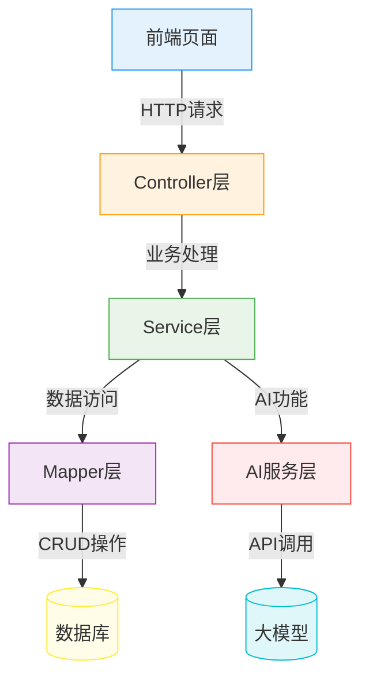

# 系统架构设计

## 1. 架构概述

智能航班管理系统采用前后端分离的架构设计，将用户界面与业务逻辑分离，提高系统的可维护性和可扩展性。

## 2. 分层架构

### 2.1 前端层
- 负责页面展示和用户交互
- 使用 HTML + Vue.js + Axios 构建
- 与后端通过 RESTful API 通信

### 2.2 Controller层
- 接收前端请求
- 处理请求参数
- 调用相应的Service层方法
- 返回响应结果

### 2.3 Service层
- 实现核心业务逻辑
- 协调多个Mapper层操作
- 处理事务和异常

### 2.4 Mapper层
- 与数据库交互
- 执行SQL语句
- 实现数据的增删改查

### 2.5 AI服务层
- 调用大模型API
- 处理AI响应结果
- 集成到业务流程中

## 3. 核心模块

### 3.1 用户模块
- 用户注册、登录、信息管理
- 基于JWT的身份认证
- 权限控制

### 3.2 航班模块
- 航班信息管理
- 航班查询和搜索
- 机票预订和取消

### 3.3 订单模块
- 订单创建和管理
- 订单状态跟踪
- 订单查询和统计

### 3.4 AI助手模块
- 智能行程规划
- 航班推荐
- 旅行问答

## 4. 技术选型

| 技术 | 版本 | 用途 |
| --- | --- | --- |
| Spring Boot | 3.2.x | 后端开发框架 |
| MyBatis | 3.5.x | 持久层框架 |
| openGauss | 3.1.x | 国产数据库 |
| Vue.js | 3.x | 前端框架 |
| Axios | 1.6.x | HTTP客户端 |
| JWT | 0.12.x | 身份认证 |
| Dragonwell JDK | 17.x | 国产JDK |
| 龙蜥OS | 8.x | 国产操作系统 |